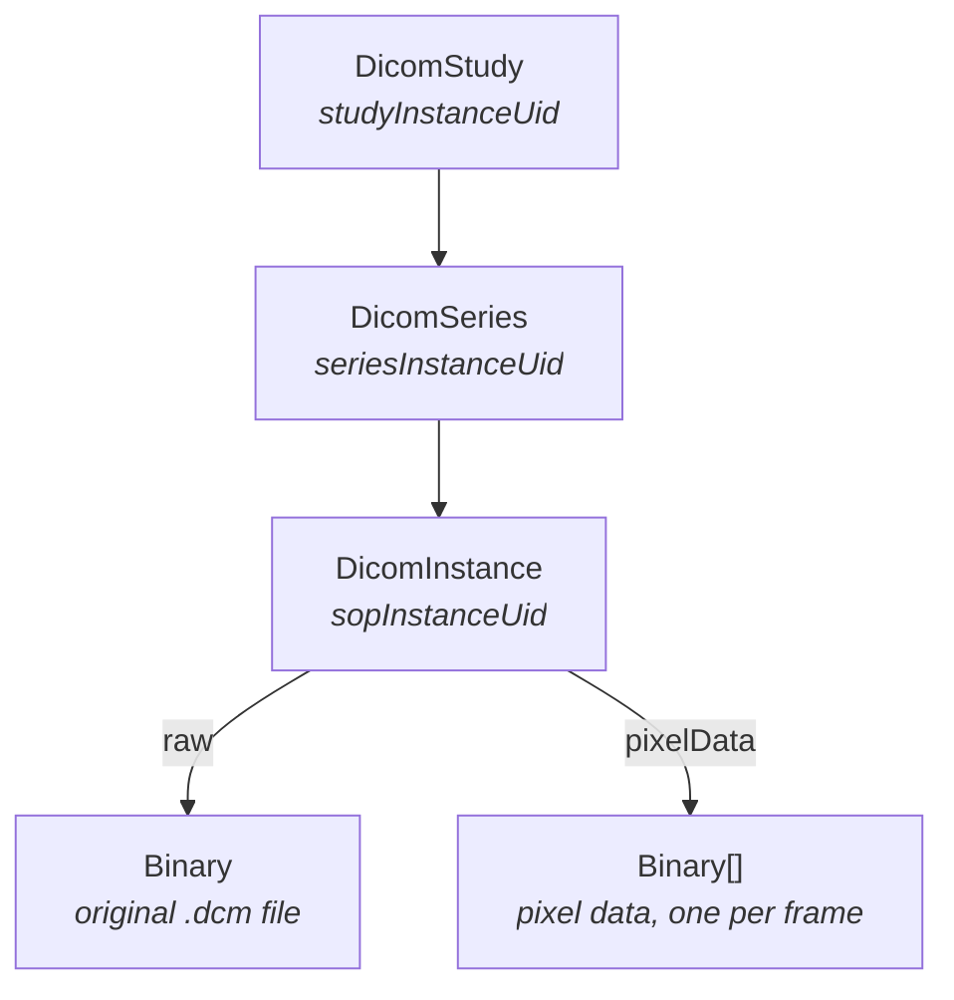

# DICOM Data Model

DICOM organizes imaging into a three-level hierarchy — **study**, **series**, **instance** — and
Medplum models that hierarchy directly with three resource types rather than flattening it into FHIR
`ImagingStudy`. The DICOM information model and the FHIR one disagree in enough places that a lossy
translation at ingest time would throw away exactly the attributes a viewer needs to render the
study. Storing the DICOM shape natively means a DICOMweb response can be reconstructed faithfully,
while the resources remain searchable and access-controlled like anything else in the project.



## Resource types

### DicomStudy

One [`DicomStudy`](/docs/api/fhir/medplum/dicomstudy) per DICOM Study Instance UID. Created
conditionally on `studyInstanceUid`, so instances arriving over separate uploads collect under one
study.

| Field                           | DICOM tag     | Notes                                                   |
| ------------------------------- | ------------- | ------------------------------------------------------- |
| `studyInstanceUid`              | `(0020,000D)` | Required. The conditional-create key.                   |
| `studyId`                       | `(0020,0010)` |                                                         |
| `studyDate`                     | `(0008,0020)` | Converted `YYYYMMDD` → `YYYY-MM-DD`                     |
| `studyTime`                     | `(0008,0030)` | Converted `HHMMSS` → `HH:MM:SS`                         |
| `accessionNumber`               | `(0008,0050)` |                                                         |
| `instanceAvailability`          | `(0008,0056)` |                                                         |
| `modalitiesInStudy`             | `(0008,0061)` |                                                         |
| `referringPhysiciansName`       | `(0008,0090)` |                                                         |
| `timezoneOffsetFromUtc`         | `(0008,0201)` |                                                         |
| `patientName`                   | `(0010,0010)` | The `Alphabetic` component of the DICOM person name     |
| `patientId`                     | `(0010,0020)` | A DICOM string, **not** a reference to a FHIR `Patient` |
| `patientBirthDate`              | `(0010,0030)` | Converted `YYYYMMDD` → `YYYY-MM-DD`                     |
| `patientSex`                    | `(0010,0040)` |                                                         |
| `numberOfStudyRelatedSeries`    | `(0020,1206)` |                                                         |
| `numberOfStudyRelatedInstances` | `(0020,1208)` |                                                         |

### DicomSeries

One [`DicomSeries`](/docs/api/fhir/medplum/dicomseries) per Series Instance UID, created conditionally on `seriesInstanceUid`.

| Field                             | DICOM tag                            |
| --------------------------------- | ------------------------------------ |
| `study`                           | Reference to the parent `DicomStudy` |
| `seriesInstanceUid`               | `(0020,000E)`                        |
| `seriesNumber`                    | `(0020,0011)`                        |
| `modality`                        | `(0008,0060)`                        |
| `seriesDescription`               | `(0008,103E)`                        |
| `timezoneOffsetFromUtc`           | `(0008,0201)`                        |
| `numberOfSeriesRelatedInstances`  | `(0020,1209)`                        |
| `performedProcedureStepStartDate` | `(0040,0244)`                        |
| `performedProcedureStepStartTime` | `(0040,0245)`                        |

### DicomInstance

One [`DicomInstance`](/docs/api/fhir/medplum/dicominstance) per stored SOP instance. Unlike study and series, instances are **not** created conditionally.

| Field                   | DICOM tag                    | Notes                                                                      |
| ----------------------- | ---------------------------- | -------------------------------------------------------------------------- |
| `study`, `series`       |                              | References to the parent resources                                         |
| `sopClassUid`           | `(0008,0016)`                |                                                                            |
| `sopInstanceUid`        | `(0008,0018)`                |                                                                            |
| `instanceAvailability`  | `(0008,0056)`                |                                                                            |
| `timezoneOffsetFromUtc` | `(0008,0201)`                |                                                                            |
| `instanceNumber`        | `(0020,0013)`                | Defaults to `"1"` when the source file omits it                            |
| `rows`, `columns`       | `(0028,0010)`, `(0028,0011)` |                                                                            |
| `bitsAllocated`         | `(0028,0100)`                |                                                                            |
| `numberOfFrames`        | `(0028,0008)`                |                                                                            |
| `metadata`              |                              | The instance's full DICOM JSON dataset, serialized as a JSON string        |
| `raw`                   |                              | Reference to the `Binary` holding the original `.dcm` file                 |
| `pixelData`             |                              | References to per-frame pixel `Binary` resources, filled in asynchronously |

## What lands in `metadata`

`DicomInstance.metadata` is the instance's DICOM JSON dataset — the same representation a WADO-RS
metadata request returns — stored as a string. It is cleaned on the way in:

- **File meta group `(0002,xxxx)`**, **`PixelData` `(7FE0,0010)`**, and **overlay data `(60xx,3000)`**
  are removed. Pixel data lives in `Binary` resources, not in the JSON.
- **Binary-valued attributes** (value representations `OB`, `OD`, `OF`, `OL`, `OV`, `OW`, `UN`) up to
  **10 KB** are inlined as base64 under `InlineBinary`. Anything larger is dropped rather than
  bloating the resource.
- **Sequences** are cleaned recursively, so the same rules apply at every nesting level.

Only the **first 100 KB** of each uploaded file is parsed for metadata during the STOW-RS request.
That is far more than a DICOM header needs and it keeps ingest streaming rather than buffering whole
studies in memory. The complete file is always preserved in the `raw` `Binary` regardless.

## Pixel data extraction

Storing an instance does not extract its pixels inline — that would make every `C-STORE` wait on
decoding. Instead, the create is dispatched to a background worker:

1. A `DicomInstance` is created, or its `raw` reference changes.
2. The `dicom` worker enqueues a job on the `DicomQueue` BullMQ queue (three attempts, exponential
   backoff starting at one second).
3. The worker reads the raw `Binary`, parses the full file, and splits `PixelData` into frames.
4. Each frame is written as its own `Binary`, with `securityContext` set to the `DicomInstance` so it
   inherits the instance's access control.
5. `DicomInstance.pixelData` is patched with references to those binaries, in frame order.

The `Binary.contentType` of each frame is derived from the file's Transfer Syntax UID:

| Transfer Syntax UID                    | Content type               |
| -------------------------------------- | -------------------------- |
| `1.2.840.10008.1.2.4.50`, `.57`, `.70` | `image/jpeg`               |
| `1.2.840.10008.1.2.4.90`, `.91`        | `image/jp2`                |
| `1.2.840.10008.1.2.4.201`, `.202`      | `image/jxl`                |
| Anything else, including uncompressed  | `application/octet-stream` |

Until the worker finishes, [frame retrieval](./dicomweb-api.md#wado-rs-retrieve-frames) returns
`404` for that instance. Study and series queries work immediately.

The worker is named `dicom` and can be enabled or disabled per server instance through the
`workers.enabled` configuration setting, like any other Medplum worker. A deployment that runs
workers on dedicated hosts needs `dicom` enabled on at least one of them, or pixel data is never
extracted.

## Search parameters

The DICOM resources are searchable through the normal [FHIR search API](/docs/search).

| Resource        | Search parameters                                                                                                                                                                      |
| --------------- | -------------------------------------------------------------------------------------------------------------------------------------------------------------------------------------- |
| `DicomStudy`    | `study-instance-uid`, `study-id`, `study-date`, `study-time`, `accession-number`, `modalities`, `referring-physicians-name`, `patient-name`, `patient-id`                              |
| `DicomSeries`   | `study`, `series-instance-uid`, `series-number`, `performed-procedure-step-start-date`, `performed-procedure-step-start-time`, `scheduled-procedure-step-id`, `requested-procedure-id` |
| `DicomInstance` | `study`, `series`, `sop-class-uid`, `sop-instance-uid`, `instance-number`                                                                                                              |

```ts
// Every CT and MR study for an accession number
const studies = await medplum.searchResources('DicomStudy', {
  'accession-number': 'A12345',
});

// Every series in a study
const series = await medplum.searchResources('DicomSeries', {
  study: `DicomStudy/${studies[0].id}`,
});
```

Note that `modalities` is the only `token` parameter in the set; the rest of the study-level
parameters are `string` searches, and `study-date` is a `date` search.

## Relationship to FHIR ImagingStudy

Medplum does not currently create an [`ImagingStudy`](/docs/api/fhir/resources/imagingstudy)
alongside a `DicomStudy`, and `DicomStudy.patientId` holds the DICOM Patient ID string rather than a
reference to a Medplum [`Patient`](/docs/api/fhir/resources/patient). Linking imaging into the chart
is on the roadmap.

In the meantime, a [Bot](/docs/bots) subscribed to `DicomStudy` creation can do the reconciliation
your workflow needs — matching `patientId` against your MRN identifier system, creating an
`ImagingStudy` that references both the `Patient` and the study's UIDs, and flagging studies whose
patient could not be resolved for manual review. Doing it in a Bot rather than at ingest keeps the
matching logic — which is highly site-specific — under your control.
