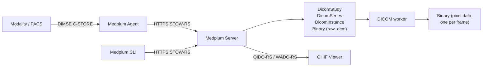

# DICOM & DICOMweb

Medplum stores medical imaging alongside the rest of the patient record. A modality or PACS sends
studies in over the DICOM network protocol or over DICOMweb, Medplum files them into
[`DicomStudy`](/docs/api/fhir/medplum/dicomstudy), [`DicomSeries`](/docs/api/fhir/medplum/dicomseries),
and [`DicomInstance`](/docs/api/fhir/medplum/dicominstance) resources, and a DICOMweb viewer such as
[OHIF](https://ohif.org/) reads them back out — all under the same authentication, access policies,
and audit trail as every other resource in the project.

:::info[Beta]

DICOM support is a [Beta](/docs/compliance/alpha-beta) feature — ready for testing, with a stable
core contract. Tell us what you need at [hello@medplum.com](mailto:hello@medplum.com) or in a
[GitHub issue](https://github.com/medplum/medplum/issues).

:::

## How it fits together

There are two ways in and one way out.

**In, over the network protocol.** Imaging equipment overwhelmingly speaks DIMSE — the DICOM upper
layer protocol over raw TCP — not HTTPS, and it speaks it on a hospital network that has no route to
the public internet. The [Medplum Agent](./agent-dimse.md) runs inside that network, presents itself
as a DICOM Storage SCP, accepts `C-STORE` from the modality, and forwards each instance to Medplum
over an outbound HTTPS connection. This is the same Agent that handles HL7 v2 and ASTM traffic, so a
site that already runs one gets imaging by adding a channel.

**In, over HTTPS.** Anything that can speak DICOMweb — a cloud PACS, a research pipeline, an
integration engine, or the [Medplum CLI](./cli.md) — can `POST` directly to the
[STOW-RS endpoint](./dicomweb-api.md#stow-rs-store-instances). No Agent required.

**Out, over HTTPS.** [QIDO-RS and WADO-RS](./dicomweb-api.md) serve the study list, series metadata,
and pixel frames that a DICOMweb viewer needs. Medplum's implementation targets the request sequence
the [OHIF Viewer](./ohif-viewer.md) makes.

## What gets stored

A single DICOM instance arriving at Medplum produces five things:

| Resource                                                | Holds                                                                                   |
| ------------------------------------------------------- | --------------------------------------------------------------------------------------- |
| [`DicomStudy`](/docs/api/fhir/medplum/dicomstudy)       | Study-level attributes — study UID, accession number, patient name and ID, study date   |
| [`DicomSeries`](/docs/api/fhir/medplum/dicomseries)     | Series-level attributes — series UID, modality, series description                      |
| [`DicomInstance`](/docs/api/fhir/medplum/dicominstance) | Instance-level attributes, plus the full DICOM JSON metadata and references to binaries |
| [`Binary`](/docs/api/fhir/resources/binary)             | The original, unmodified `.dcm` file                                                    |
| [`ImagingStudy`](/docs/api/fhir/resources/imagingstudy) | A derived, chart-facing view of the study, with a WADO-RS endpoint to retrieve it from  |

Studies and series are created conditionally on their DICOM UIDs, so the second instance of a series
attaches to the study and series the first one created rather than duplicating them.

Background workers then read the raw file and extract pixel data into one additional `Binary` per
frame, which is what [WADO-RS frame retrieval](./dicomweb-api.md#wado-rs-retrieve-frames) serves, and
recompute the study's instance counts and its `ImagingStudy`.
See the [Data Model](./data-model.md) for the full mapping from DICOM attributes to resource fields.

Because these are ordinary Medplum resources, they are searchable with the standard FHIR search API,
readable through the [TypeScript SDK](/docs/sdk/), subject to
[access policies](/docs/access/access-policies), and able to trigger [Bots](/docs/bots) on create or
update.

## Getting started

1. **Store a file from your laptop.** `medplum dicomweb stow MRBRAIN.DCM` uploads a DICOM file — or
   a whole directory of them — through STOW-RS with no infrastructure to set up. See the
   [CLI](./cli.md).
2. **Look at it.** Medplum's hosted cloud is preconfigured with an
   [OHIF Viewer](./ohif-viewer.md) at [viewer.medplum.com](https://viewer.medplum.com) — sign in and
   the study is there.
3. **Connect a modality.** Add a DICOM channel to a [Medplum Agent](./agent-dimse.md) and send a
   `C-ECHO`, then a `C-STORE`, from the device.

## Reference

- [Data Model](./data-model.md) — resource types, search parameters, and DICOM attribute mapping
- [DICOMweb API](./dicomweb-api.md) — the implemented HTTP endpoints
- [Medplum Agent](./agent-dimse.md) — DIMSE `C-STORE` and `C-ECHO` from inside the firewall
- [Medplum CLI](./cli.md) — `medplum dicomweb stow`
- [OHIF Viewer](./ohif-viewer.md) — viewer configuration
- [DICOM Standard Part 18: Web Services](https://dicom.nema.org/medical/dicom/current/output/html/part18.html)
