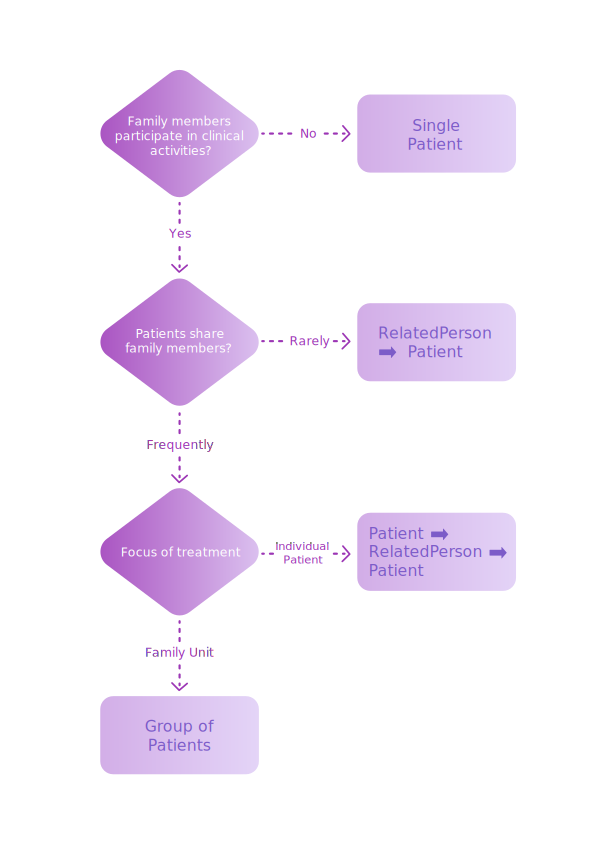

import BrowserOnlyTabs from '@site/src/components/BrowserOnlyTabs';
import TabItem from '@theme/TabItem';
import CodeBlock from '@theme/CodeBlock';
import { HomerSimpson, LisaSimpson, SimpsonsFamily, HomerLisaRelatedPerson } from '@medplum/mock';

# Family Relationships

## Introduction

Delivering healthcare often involves more than a single patient. Spouses, parents, guardians, children, siblings, and even friends can be involved in delivering care and providing financial support.

The FHIR specification provides a number of Resources for modeling interpersonal relationships between patients and other people, and having your data well modeled helps you remain compliant and report compliance metrics such as [CMS queries](https://www.medplum.com/docs/compliance/onc#materials-and-usage). But how you use these tools will depend on your specific clinical setting and workflow.

This guide provides a framework to help you decide how to model your patients' family relationships, and recommends a few approaches that our users have found useful.

:::info Note

In this guide we will use the term "family member" throughout, as modeling families is a very common use case. However, the same data models can be used to model legal guardians, non-family caregivers, and any other individuals related to the patient.
:::

## Use Cases

- Pediatric Health
- Neonatal Health
- Family Medicine
- Group Therapy
- Clinical Trials and Population Health

## This guide will show you

1. The key FHIR Resources used to model relationships
2. A decision guide for how to choose the right data model for your use case
3. Recommended approaches for modeling family relationships in FHIR
4. Example use cases and queries for each approach

## Key Resources

|                                                             |                                                                                                                                                                                                                                 |
| ----------------------------------------------------------- | ------------------------------------------------------------------------------------------------------------------------------------------------------------------------------------------------------------------------------- |
| [**Patient**](/docs/api/fhir/resources/patient)             | This resource represents a human who receives clinical services such as physician visits, medications, diagnostic labs, and/or imaging.                                                                                         |
| [**RelatedPerson**](/docs/api/fhir/resources/relatedperson) | This models the _relationship_ between two people. For simple use cases, you can store demographic and contact information directly in the [RelatedPerson](/docs/api/fhir/resources/relatedperson) resource itself (see below). |
| [**Group**](/docs/api/fhir/resources/group)                 | The [Group](/docs/api/fhir/resources/group) resource provides a single resource to reference a collection of individuals. It can be used to model the family unit as a whole instead of a collection of individual resources.   |

## Decision Guide

How you decide to model family relationships will depend on your clinical setting, your workflow, and your patient population. Below, we provide a few best-practice modeling approaches, as well as questions you can answer to figure out which approach best fits your use case.

These models are just starting points - you can mix and match these strategies to model your data according to your use case.

### Do family members participate in clinical or financial activities? {#family-member-participation}

The first question you should ask yourself is whether or not you need track family members' participation in "clinical or financial activities."

Some examples of such participation include:

- Family members attend physician visits with the patient
- A family member is the primary policyholder on the patient's insurance
- A family member is responsible for administering care or medication to the patient
- Family members undergo diagnostic testing or medical imaging to help diagnose and treat the patient

Often times, family members only serve as points of contact but _do not_ participate in clinical and financial activities. In those situations, [Approach #1](#approach-1) provides the simplest modeling approach that avoids using many different resource types.

### How often will multiple Patients (e.g. siblings) share family members? {#are-family-members-shared}

If your patients' family members _do_ participate in clinical/billing activities, the next question is how often patients share family members. This tends to happen more frequently in pediatric and family medicine settings. For example, two siblings might be enrolled as separate patients in a pediatric clinic, but they share the same mother and father.

In these situations, it is desireable to "factor out" demographic and contact information for each family member into a single resource to make it easier to maintain, as outlined in [Approach #3](#approach-3). However, this approach has some additional complexity since they another resource type to the model.

### Is the subject of the treatment an individual patient, or a family unit? {#family-unit-vs-individual-patient}

In most cases, the focus of each clinical activity will be a single patient, even if multiple patients participate in the care plan. However, in some cases, the beneficiary of the treatment is the family unit as a whole, not the individual members. This is most common in family behavioral therapy scenarios, where the clinical objective is to help treat behavior of the family as a whole, rather than any specific individual.

Determining whether whether the subject of treatment is an individual or a group can be subtle. One way to do this is to think about your most common query patterns. If you are frequently querying for all activities related to an _individual_, it makes more sense to model the subject as a [Patient](/docs/api/fhir/resources/patient), with other [Patients](/docs/api/fhir/resources/patient) as participants.

In contrast, if you're frequently querying the activities of the entire family, you can create a [Group](/docs/api/fhir/resources/group) resource to treat the family as a single clinical  unit, as detailed in [Approach #4](#approach-4).

## Data Models

After you've answered these questions about your use case, you're ready to make some decisions on how to model your family relationships. Below, we've recommended a few data modeling schemes, but these are not mutually exclusive. You may choose to mix and match the approaches, depending on your use case.

### Approach #1: [Patient](/docs/api/fhir/resources/patient) with Contact Information {#approach-1}

import Approach1Diagram from './approach-1.png';

<BrowserOnlyTabs>
<TabItem value="diagram" label="Diagram" default>

</TabItem>

<TabItem value="data" label="JSON" >

<CodeBlock language="js" showLineNumbers metastring="{12-71}">
  {`${JSON.stringify(
    (({ resourceType, id, name, contact }) => {
      return { resourceType, id, name, contact };
    })(LisaSimpson),
    null,
    2
  )}
  `}
</CodeBlock>

</TabItem>
</BrowserOnlyTabs>

If your family members do not participate in clinical/billing activities and patients rarely share family members, the simplest approach is just to store information about family members directly on the [Patient](/docs/api/fhir/resources/patient) resource.

The `Patient.contact` property can store a list the following information about each family member:

| Information       | Property                          |
| ----------------- | --------------------------------- |
| Name              | `Patient.contact[i].name`         |
| Gender            | `Patient.contact[i].gender`       |
| Address           | `Patient.contact[i].address`      |
| Phone Number      | `Patient.contact[i].telecom`      |
| Email             | `Patient.contact[i].telecom`      |
| Relationship Type | `Patient.contact[i].relationship` |

The benefits of this approach is that you only need to manage one resource type, the [Patient](/docs/api/fhir/resources/patient), which makes your API calls very simple.

The tradeoff is that if patients share family members (e.g. siblings share the same parents), you'll have to duplicate that family's contact information on each [Patient](/docs/api/fhir/resources/patient).

| Pros                                                                         | Cons                                                            | Use If                                                                                                                                       | Example Use Cases                                                         |
| ---------------------------------------------------------------------------- | --------------------------------------------------------------- | -------------------------------------------------------------------------------------------------------------------------------------------- | ------------------------------------------------------------------------- |
| <ul><li>Simplest data model</li><li>Single resource type to manage</li></ul> | <ul><li>Duplication of data for shared family members</li></ul> | <ul><li>Family members **do not** participate in clinical or billing activities</li><li>Patients share family members infrequently</li></ul> | <ul><li>At-home lab testing</li><li>Adult mental health therapy</li></ul> |

### Approach #2: [RelatedPerson](/docs/api/fhir/resources/relatedperson) ➡ [Patient](/docs/api/fhir/resources/patient) {#approach-2}

import Approach2Diagram from './approach-2.png';

<BrowserOnlyTabs>
<TabItem value="diagram" label="Diagram" default>

</TabItem>
<TabItem value="data" label="JSON" >

<CodeBlock language="js" showLineNumbers metastring="{6-15,17-20}">
  {'// RelatedPerson modeling Father -> Daughter relationship\n' +
    JSON.stringify(
      (({ resourceType, id, relationship, patient, address, telecom }) => {
        return { resourceType, id, relationship, patient, address, telecom };
      })(HomerLisaRelatedPerson),
      null,
      2
    ) +
    '\n\n//Patient\n' +
    JSON.stringify(
      (({ resourceType, id }) => {
        return { resourceType, id };
      })(LisaSimpson),
      null,
      2
    )}
  }
</CodeBlock>

</TabItem>
</BrowserOnlyTabs>

If family members _do_ participate in clinical/billing activities, then it might make sense to model them explicitly as a separate resource.

You can model a family member explicitly as a [RelatedPerson](/docs/api/fhir/resources/relatedperson) resource. The [RelatedPerson](/docs/api/fhir/resources/relatedperson) has one required field, `RelatedPerson.patient`, which is a reference to the target patient. The `RelatedPerson.relationship` property is a [CodeableConcept](/docs/fhir-basics#standardizing-data-codeable-concepts) that can be used to specify the relationship type. In simple use cases where patients rarely share family members, then you can store basic demographic information and contact information directly in the [RelatedPerson](/docs/api/fhir/resources/relatedperson) resource.

This pattern, along with [Approach #3](#approach-3), is especially useful for situations where parents are logging in on behalf of minors. In these settings, the patient, a minor, can be modeled as a [Patient](/docs/api/fhir/resources/patient), and their parent/legal guardian would be a [RelatedPerson](/docs/api/fhir/resources/relatedperson). Medplum allows users to be registered either as a [Patient](/docs/api/fhir/resources/patient) or a [RelatedPerson](/docs/api/fhir/resources/relatedperson) (see the [user invitation tutorial](/docs/app/invite)), and you can create an [Access Policy](/docs/access/access-policies) to allow the parent access to minor's clinical information.

This approach is also useful to model different insurance coverage for dependents. You can model the coverage using the [Coverage](/docs/api/fhir/resources/coverage) resource, with the [Patient](/docs/api/fhir/resources/patient) as the `Coverage.beneficiary` and the [RelatedPerson](/docs/api/fhir/resources/relatedperson) as the `Coverage.subscriber`.

The benefit of this approach is that you can track the family member's role in clinical and billing activities independently of the patient.

The tradeoff is that is that you need to maintain the [RelatedPerson](/docs/api/fhir/resources/relatedperson) resource in addition the [Patient](/docs/api/fhir/resources/patient) Resource.

:::info Note

Each [RelatedPerson](/docs/api/fhir/resources/relatedperson) can only have **one** patient associated with them it. This is because [RelatedPerson](/docs/api/fhir/resources/relatedperson) is meant to model the _relationship_ between a family member and a patient. Even if two patients the same family member, you'll have to create a new [RelatedPerson](/docs/api/fhir/resources/relatedperson) for each (patient, family member) pair to model each relationship.

:::

| Pros                                                                                                                                                   | Cons                                                                                                                                                                                                                 | Use If                                                                                                                                                                        | Example Use Cases                                                                                                                                                                                                                                 |
| ------------------------------------------------------------------------------------------------------------------------------------------------------ | -------------------------------------------------------------------------------------------------------------------------------------------------------------------------------------------------------------------- | ----------------------------------------------------------------------------------------------------------------------------------------------------------------------------- | ------------------------------------------------------------------------------------------------------------------------------------------------------------------------------------------------------------------------------------------------- |
| <ul><li>Simplest data model _that explicitly models family members_</li><li>Track the participation of family members in clinical activities</li></ul> | <ul><li>Requires maintaining links between [RelatedPersons](/docs/api/fhir/resources/relatedperson) and [Patients](/docs/api/fhir/resources/patient)</li><li>Duplication of data for shared family members</li></ul> | <ul><li>Family members **do** participate in clinical or billing activities</li><li> [Patients](/docs/api/fhir/resources/patient) share family members infrequently</li></ul> | <ul><li>Insurance coverage where the _beneficiary_ ([Patient](/docs/api/fhir/resources/patient)) is not the insurance _subscriber_ ([RelatedPerson](/docs/api/fhir/resources/relatedperson))</li><li>Parents acting on behalf of minors</li></ul> |

### Approach #3: [Patient](/docs/api/fhir/resources/patient) ➡ [RelatedPerson](/docs/api/fhir/resources/relatedperson) ➡ [Patient](/docs/api/fhir/resources/patient) {#approach-3}

import Approach3Diagram from './approach-3.png';

<BrowserOnlyTabs>
<TabItem value="diagram" label="Diagram" default>

</TabItem>
<TabItem value="data" label="JSON" >

<CodeBlock language="js" showLineNumbers metastring="{6-17}">
  {'// Patient representing the parent\n' +
    JSON.stringify(
      (({ resourceType, id, link }) => {
        return { resourceType, id, link };
      })(HomerSimpson),
      null,
      2
    ) +
    '\n// RelatedPerson modeling Father -> Daughter relationship\n' +
    JSON.stringify(
      (({ resourceType, id, relationship }) => {
        return { resourceType, id, relationship };
      })(HomerLisaRelatedPerson),
      null,
      2
    ) +
    '\n\n//Patient\n' +
    JSON.stringify(
      (({ resourceType, id }) => {
        return { resourceType, id };
      })(LisaSimpson),
      null,
      2
    )}
</CodeBlock>

</TabItem>
</BrowserOnlyTabs>

If your practice begins to have patients who share family members, duplicating their contact information across multiple [RelatedPerson](/docs/api/fhir/resources/relatedperson) resources can quickly become error prone.

For example, consider two Patients who are siblings and share the same father. Because a [RelatedPerson](/docs/api/fhir/resources/relatedperson) resource models the relationship between a person and a [Patient](/docs/api/fhir/resources/patient), each sibling would need it's own [RelatedPerson](/docs/api/fhir/resources/relatedperson) resource linking them to the father (as shown the the diagram). However, [Approach #2](#approach-2) duplicates the father's contact information on each [RelatedPerson](/docs/api/fhir/resources/relatedperson). If the family moves, you will have to ensure that this address information is updated in both places.

To avoid this duplication, we can "factor out" the father's demographic and contact information into a separate [Patient](/docs/api/fhir/resources/patient) resource. The [Patient](/docs/api/fhir/resources/patient) is then connected to the [RelatedPerson](/docs/api/fhir/resources/relatedperson) using the `Patient.link.other` property (with `Patient.link.type` set to `"seealso"`). This avoids the data duplication, at the expense of adding one more layer of indirection.

In this model, the [RelatedPerson](/docs/api/fhir/resources/relatedperson) does not store specific information about the father. It only stores the _relationship_ between the father and child.

A common use case for this approach is in neonatal care. Many common neonatal workflows, such as newborn hearing tests, postpartum-depression screening, and breastfeeding metrics all require modeling both the mother and child as patients to track their individual encounters, medications, labs, and imaging.

:::info Note

The FHIR spec also allows the use of the [Person](/docs/api/fhir/resources/person) resource to factor out demographic information. While this is a valid approach in cases where an individual can be both a [Patient](/docs/api/fhir/resources/patient) and a [Practitioner](/docs/api/fhir/resources/practitioner), Medplum generally doesn't recommend the additional complexity of mixing [Patient](/docs/api/fhir/resources/patient) and [Person](/docs/api/fhir/resources/person) resources.

:::

| Pros                                                                                                                                        | Cons                                                                                       | Use If                                                                                                                                                                  | Example Use Cases                                                                                                         |
| ------------------------------------------------------------------------------------------------------------------------------------------- | ------------------------------------------------------------------------------------------ | ----------------------------------------------------------------------------------------------------------------------------------------------------------------------- | ------------------------------------------------------------------------------------------------------------------------- |
| <ul><li>Avoid data duplication for shared family members</li><li>Track the participation of family members in clinical activities</li></ul> | <ul><li>Adds another layer of indirection compared to [Approach #2](#approach-2)</li></ul> | <ul><li>Family members **do** participate in clinical or billing activities</li><li> [Patients](/docs/api/fhir/resources/patient) often share family members </li></ul> | <ul><li>Pediatric Care</li><li>Neonatal Care</li><li>Family Medicine</li><li>Parents acting on behalf of minors</li></ul> |

### Approach #4: [Group](/docs/api/fhir/resources/group) of Patients {#approach-4}

import Approach4Diagram from './approach-4.png';

<BrowserOnlyTabs>
<TabItem value="diagram" label="Diagram" default>

</TabItem>
<TabItem value="data" label="JSON" >

<CodeBlock language="js">
  {JSON.stringify(
    SimpsonsFamily,
    ['resourceType', 'id', 'type', 'actual', 'entity', 'member', 'reference', 'display'],
    2
  )}
</CodeBlock>

</TabItem>
</BrowserOnlyTabs>

For some use cases, it is useful to keep track of the family unit as a whole, rather than as a web of connected [Patients](/docs/api/fhir/resources/patient), [RelatedPersons](/docs/api/fhir/resources/relatedperson), and [Persons](/docs/api/fhir/resources/person).

The [Group](/docs/api/fhir/resources/group) resources allows you to specify a single resource that represents the group of people as a single unit, and in some places can be used instead of the [Patient](/docs/api/fhir/resources/patient) resource. Some common examples are:

| Use Case                                                                                                             | [Group](/docs/api/fhir/resources/group) referenced by                            |
| -------------------------------------------------------------------------------------------------------------------- | -------------------------------------------------------------------------------- |
| Family therapy office visit in which the subject of the visit is the entire family, not just the individual members. | `Encounter.subject`                                                              |
| Measuring the effects of a drug administered to a patient population during a clinical trial.                        | `Condition.subject` `MedicationDispense.subject` `Observation.subject` |

For a group of specific individuals, each group member is referenced in the `Group.member.entity` property.

You can also use the [Group](/docs/api/fhir/resources/group) resource to model abstract groups, where the specific members are not clinically or financially relevant. To indicate that the group us abstract, set `Group.actual` to `false`.

Some examples of abstract groups are:

- A support group like Alcoholics Anonymous.
- A generalized population of patients for a clinical trial.
- A herd of animals for veterinary use cases.

Adding a [Group](/docs/api/fhir/resources/group) resource for your families an orthogonal choice to Approaches #1-3. You may choose to model the individual relationships via [RelatedPersons](/docs/api/fhir/resources/relatedperson) _and_ also consolidate the entire family into a group. If modeling family groups is important, Medplum recommends modeling all the individuals as [`Patients`](/docs/api/fhir/resources/patient), and then referencing them in the `Group.member.entity` array. If required, [`Patients`](/docs/api/fhir/resources/patient) can also belong to more than one [`Group`](/docs/api/fhir/resources/group)

In the case of abstract groups, you can use the `Group.quantity` field to record the size of the group, which may be important for analytics or billing workflows.

| Pros                                                                                                                  | Cons                                                                                                                                                  | Use If                                                                                           | Example Use Cases                                                                                                                        |
| --------------------------------------------------------------------------------------------------------------------- | ----------------------------------------------------------------------------------------------------------------------------------------------------- | ------------------------------------------------------------------------------------------------ | ---------------------------------------------------------------------------------------------------------------------------------------- |
| <ul><li>Single resource to reference the complete family group</li><li>Can be used to model abstract groups</li></ul> | <ul><li>Doesn't model specific relationships between individuals. Need to supplement with Approaches [#2](#approach-2) or [#3](#approach-3)</li></ul> | <ul><li>Focus of clinical, billing, or analytic activities is the family unit / group.</li></ul> | <ul><li>Family Counseling</li><li>Training & Education</li><li>Group Therapy</li><li>Population Health</li><li>Veterinary Care</li></ul> |

## Conclusion

The FHIR spec allows for many different configurations to model family relationships, with different levels of power and complexity. We hope this guide provides some clarity on how to choose the best model for your use case. When in doubt, the Medplum team recommends starting simple, and migrating to a more complicated model over time. If you have any questions about your specific use case, feel free to reach out on [Discord](https://discord.gg/medplum) or at [support@medplum.com](mailto:support@medplum.com).
