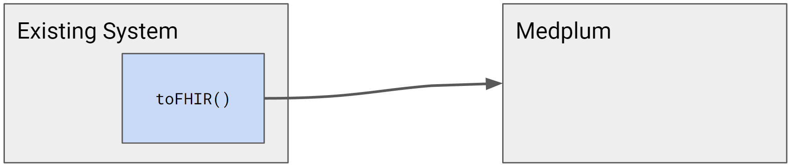
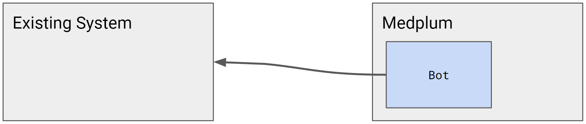

# Migration Logic

Virtually all system migrations require some degree of migration logic: the "transformers" that convert one representation of a patient to a new one. Smaller and more simple systems might have 10-20 data types to convert. Larger and more complex systems can easily have 100+ data types.

The code that performs this migration logic must live somewhere. The decision of where to perform the transformations is important, and requires careful consideration.

:::info

System migrations are challenging concepts. Please contact us at hello@medplum.com to learn how Medplum can help with your migration.

:::

## Considerations

When considering which option is best for you, we must consider some system characteristics:

- How easy or difficult is it to modify the existing system?
  - Are engineers actively updating the existing system?
  - How frequently does the existing system deploy new releases?
  - Is the existing system stable, or are changes avoided?
- How easy or difficult is it to programmatically access the existing system?
  - Is there an API?
  - Is the API accessible on the open internet?
  - How much of the object model is available by API?
- How does the migration logic support the [Adoption Strategy](./adoption-strategy)?
  - At any given time, which system is the source of truth?
  - What time delay / data freshness is acceptable?

## Existing system sends FHIR

A common pattern is to build transformers directly into the existing system. This is often the easiest solution, as long as the existing system is actively maintained and updated.

For example, many web frameworks use a `.toJSON()` / `.fromJSON()` pattern for serializing and deserializing to JSON. When migrating to FHIR, you can follow this pattern with `.toFHIR()` / `.fromFHIR()` methods.

Once these type transformations exist, then global event listeners can send the output FHIR data. This can be done in the Data Access Object (DAO) layer, service layer, or API layer.

Pros:

- Fewer requirements for the existing system API
- Access to all of the utility code to manipulate the existing data model

Cons:

- Requires continued investment and maintenance of the existing system
- May or may not have access to FHIR libraries to generate FHIR resources

## Existing system sends non-FHIR

If it is too difficult to create `.toJSON()` / `.fromJSON()` methods in the existing system, the next best option is to send events in the native format of the existing system.

Medplum [Bots](/docs/bots/bot-basics) can be used to receive the original data, and transform it into FHIR resources.

Pros:

- Investment in the new system and new developer environment
- In Medplum, this is a natural fit for Medplum Bots
- Access to the utility code to generate the new data model
- In Medplum Bots, developers get full access to the Medplum SDK and helper utilities

Cons:

- Usually requires some degree of API access into the existing system

## Medplum Bot pulls data

Medplum [Bots](/docs/bots/bot-basics) is a built-in automation framework. Medplum Bots can make outbound HTTPS requests on a fixed timer to pull data from the existing system.

Pros:

- Investment in the new system and new developer environment
- In Medplum, this is a natural fit for Medplum Bots
- Access to the utility code to generate the new data model
- In Medplum Bots, developers get full access to the Medplum SDK and helper utilities

Cons:

- Usually requires some degree of API access into the existing system
- Time-based polling increases the time delay and hurts data freshness

## Separate integration software

There is an ecosystem of 3rd party tools and companies for system integration.

Example tools: [NextGen Mirth Connect](https://www.nextgen.com/products-and-services/integration-engine), [Apache Camel](https://camel.apache.org/)

Example platforms + services: [Redox](https://www.redoxengine.com/), [Health Gorilla](https://www.healthgorilla.com/), [Mulesoft](https://www.mulesoft.com/)
