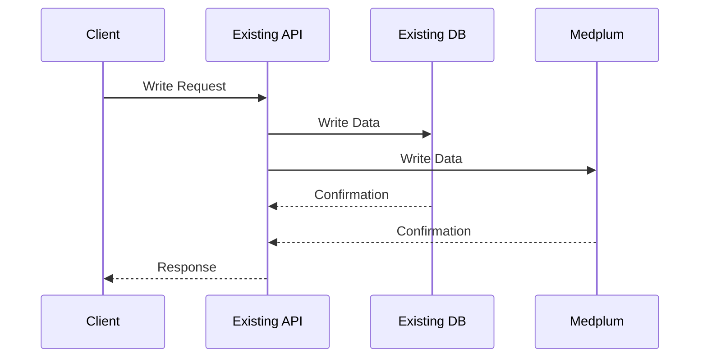
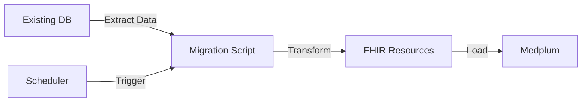
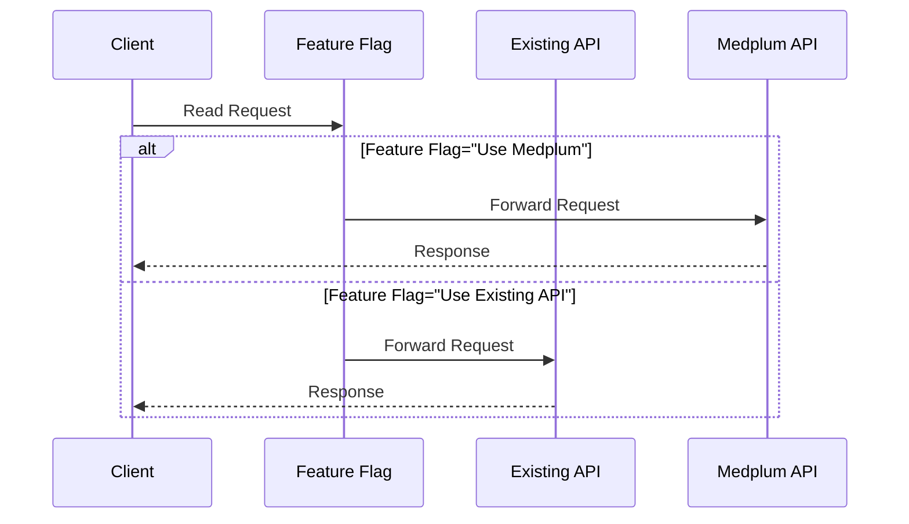
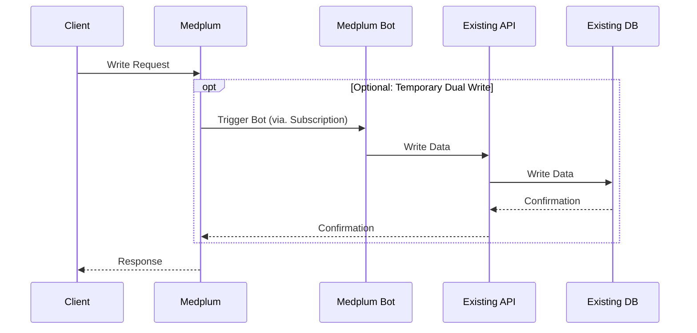

# Adoption Strategy

When migrating existing provider/patient apps to Medplum, a phased approach allows for a smoother transition, minimizes risk, and provides opportunities for validation at each step. This section outlines the recommended phases for migration, along with their rationales and best practices.

It's important to note that these phases don't necessarily need to be completed in strict sequence for your entire dataset. Instead, consider applying this phased approach to each data element type described individually as described in our [migration sequence guide](./migration-sequence). This approach allows for faster user feedback and more manageable chunks of work.

The recommended phases are:

1. [Write-only / Dual write](#write-only)
2. [Backfill data](#backfill)
3. [Read from Medplum](#read-from-medplum)
4. [Front-End write to Medplum](#front-end-write)
5. [Deprecate old store](#deprecate)

Let's explore each phase in detail.

## Write-only / Dual Write {#write-only}

When write/update operations come into your existing services, have your existing services write to both Medplum and your existing store.

### Rationale
- This is purely a backend change and doesn't affect users, minimizing disruption.
- Generally requires less infrastructure work, as you can modify existing API gateways rather than standing up new pipeline infrastructure.
- Allows you to start populating Medplum with new data immediately.

### Best Practices
- Implement error handling and logging to catch any discrepancies between writes to the old system and Medplum.
- Start with less critical data types to minimize risk.

## Backfill Data {#backfill}

Migrate older data from the existing data store to Medplum.

### Rationale
- Ensures historical data is available in Medplum.
- Allows for data validation and reconciliation before switching reads to Medplum.

### Best Practices
- Set up regular sync infrastructure. This could be as simple as running a script on your local machine or in a serverless function. Many Medplum users also use tools like Apache Airflow to orchestrate their ETL
- Implement idempotent operations to allow for safe re-runs of the backfill process.
- Start with a small subset of data to validate your migration scripts before running on the entire dataset.
- Implement data validation checks to ensure the integrity of migrated data.

## Read from Medplum in the Client {#read-from-medplum}

Update your UX to read from Medplum's API rather than your existing API.

### Rationale
- This is the first user-facing change and can be used for data verification and user acceptance testing.
- Allows you to start benefiting from Medplum's capabilities while still maintaining write operations through your existing system.

### Best Practices
- Implement feature flags to easily switch between old and new data sources.
- Start with read-only views or reports before moving to more critical user interactions.
- Monitor performance and user feedback closely during this phase.

## Front-End Write to Medplum {#front-end-write}

Update your UX to write directly to Medplum rather than through your existing services.

### Rationale
- Completes the transition to Medplum for both read and write operations.
- Allows you to take full advantage of Medplum's features and performance benefits.

### Best Practices
- Implement this change gradually, starting with less critical write operations.
- Ensure your error handling and user feedback mechanisms are robust.
- Consider maintaining dual writes (to both old system and Medplum) for a period to allow for easy rollback if needed.
- Provide additional user support during this transition.

## Deprecate Old System {#deprecate}

Phase out the old data store once you're confident in the Medplum implementation.

### Rationale
- Reduces maintenance overhead and potential for data inconsistencies.
- Completes the migration process.

### Best Practices
- Ensure all historical data has been successfully migrated and validated.
- Maintain read-only access to the old store for a period to allow for data verification if needed.
- Update all documentation and operational procedures to reflect the new system.
- Provide training to all relevant staff on the new procedures and systems.

## Conclusion

It's crucial to understand that these phases don't need to be implemented in strict sequence for your entire system. Instead, consider applying this phased approach in parallel to each data element type individually.

For example:
1. Go through all phases for Patient Demographics
2. Then proceed through the phases for the Problem List
3. Next, apply the phases to the Medication List
4. Continue this process for each subsequent data element type

This flexible approach offers several advantages:
- Faster user feedback loop
- Faster time to clinical value
- More manageable chunks of work
- Ability to prioritize critical data elements
- Opportunity to learn and refine the process as you go

By proceeding through these phases for each data element type, you can ensure a smoother transition, minimize risk, and get user feedback earlier in the process.

The key to a successful migration is flexibility, thorough planning, and constant communication with all stakeholders throughout the process.