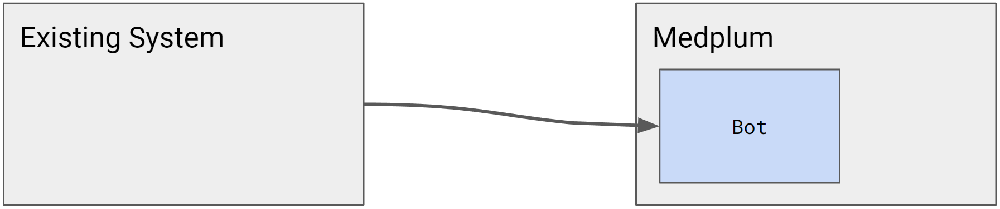
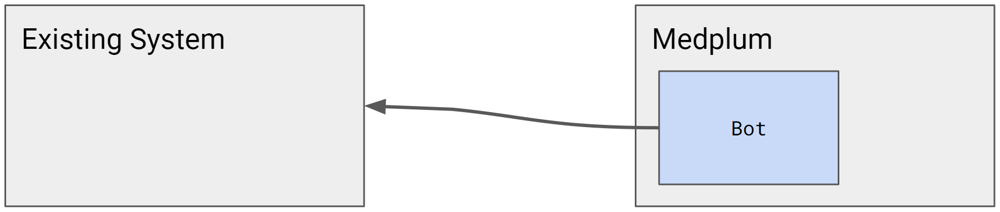

# Migrating Data to Medplum

Consider the following common scenario:

- You have an existing digital healthcare platform running active operations
- You decided to adopt a standards based architecture, such as Medplum
- You want to migrate operations without service interruption or degradation

While there is some engineering work required to migrate non-FHIR data into Medplum, there are well-known best-practices to manage this process. This series of guides outlines the process of migrating data from an existing platform into Medplum.

It covers:
- Planning your migration
- [The recommended order of data elements to migrate](#migration-order)
- [Strategies for ensuring robust pipelines](#pipelines)
- Best practices for phased adoption of Medplum


## 2. Using Conditional Update (Upsert) and Conditional References

To ensure that your migration process is idempotent (can be run multiple times without creating duplicate data), use Conditional Update and Conditional References. A key strategy is to use identifiers from your existing system as primary keys in Medplum.

### Conditional Update (Upsert)

#### Key Points:
- Add an identifier that serves as the primary key from your existing system.
- Use this identifier as the search string to make the addition idempotent.
- This approach ensures that each resource is uniquely identifiable and can be updated without creating duplicates.

Here's an example using the `If-None-Exist` header in your FHIR API requests to perform a conditional update:

```
PUT /Patient
If-None-Exist: identifier=http://old-system.com/patient|12345

{
  "resourceType": "Patient",
  "identifier": [
    {
      "system": "http://old-system.com/patient",
      "value": "12345"
    }
  ],
  // ... other patient data
}
```

In this example, `http://old-system.com/patient` is the identifier system for your old system, and `12345` is the patient's ID in that system.

### Conditional References

When creating resources that reference other resources, use the same identifier for conditional references:

```json
{
  "resourceType": "Condition",
  "subject": {
    "reference": "Patient?identifier=http://old-system.com/patient|12345"
  },
  // ... other condition data
}
```

This ensures that the reference will be resolved correctly, even if the Patient's internal Medplum ID changes.

### Example Using Medplum SDK

Here's an example of how to perform an upsert operation using the Medplum SDK in TypeScript:

```typescript
import { MedplumClient } from '@medplum/core';
import { Patient } from '@medplum/fhirtypes';

const medplum = new MedplumClient();

async function upsertPatient(oldSystemId: string, patientData: Partial<Patient>): Promise<Patient> {
  const identifier = {
    system: 'http://old-system.com/patient',
    value: oldSystemId
  };

  // Prepare the patient resource
  const patient: Patient = {
    resourceType: 'Patient',
    identifier: [identifier],
    ...patientData
  };

  try {
    // Attempt to create the patient, or update if it already exists
    const result = await medplum.createResource(patient, {
      ifNoneExist: `identifier=${identifier.system}|${identifier.value}`
    });

    console.log(`Patient upserted successfully. ID: ${result.id}`);
    return result;
  } catch (error) {
    console.error('Error upserting patient:', error);
    throw error;
  }
}

// Usage
const oldSystemPatientId = '12345';
const patientData = {
  name: [{ given: ['John'], family: 'Doe' }],
  birthDate: '1970-01-01'
};

upsertPatient(oldSystemPatientId, patientData)
  .then((patient) => console.log('Upserted patient:', patient))
  .catch((error) => console.error('Upsert failed:', error));
```

In this example:

1. We define an `upsertPatient` function that takes the old system's patient ID and the patient data.
2. We create an identifier using the old system's ID.
3. We use the Medplum SDK's `createResource` method with the `ifNoneExist` option to perform the upsert operation.
4. If a patient with the given identifier already exists, it will be updated; otherwise, a new patient will be created.

This approach ensures that your migration process is idempotent and can be safely run multiple times without creating duplicate records. The same principle can be applied to other resource types, adjusting the resource type and identifier system as needed.

[Remaining sections of the guide continue unchanged]

## 3. Using Batches vs. Transactions in Your Migration Pipeline

FHIR supports both batch and transaction operations for processing multiple resources at once:

### Batches

- Use batches when you want to process multiple independent operations.
- Batches allow partial success: if one operation fails, others can still succeed.
- Suitable for bulk data imports where operations don't depend on each other.

Example batch request:

```json
{
  "resourceType": "Bundle",
  "type": "batch",
  "entry": [
    {
      "request": {
        "method": "POST",
        "url": "Patient"
      },
      "resource": {
        // Patient resource
      }
    },
    {
      "request": {
        "method": "POST",
        "url": "Observation"
      },
      "resource": {
        // Observation resource
      }
    }
  ]
}
```

### Transactions

- Use transactions when you need atomic operations (all-or-nothing).
- If any operation in a transaction fails, the entire transaction is rolled back.
- Suitable for migrating interdependent data where consistency is crucial.

Example transaction request:

```json
{
  "resourceType": "Bundle",
  "type": "transaction",
  "entry": [
    {
      "request": {
        "method": "POST",
        "url": "Patient"
      },
      "resource": {
        // Patient resource
      }
    },
    {
      "request": {
        "method": "POST",
        "url": "Condition"
      },
      "resource": {
        // Condition resource referencing the Patient
      }
    }
  ]
}
```

Choose between batches and transactions based on your data consistency requirements and the interdependence of your resources.

## 4. Recommended Migration Operation Sequence

To ensure a smooth transition from your legacy system to Medplum, follow this recommended sequence:

1. **Write-only / Dual write**

   - Modify your existing services to write data to both Medplum and your legacy store.
   - This ensures that new data is captured in Medplum without disrupting existing operations.

2. **Read from Medplum**

   - Update your user interface to read data from Medplum.
   - This allows you to verify data consistency and start benefiting from Medplum's capabilities.

3. **Front-End write to Medplum**

   - Update your user interface to write directly to Medplum.
   - At this point, your application should be primarily interacting with Medplum for both reads and writes.

4. **Backfill**

   - Migrate existing data from your legacy system to Medplum.
   - Use the strategies outlined in sections 1-3 to ensure data integrity during this process.

5. **Deprecate old store**
   - Once you've verified that all data has been successfully migrated and your application is fully operational with Medplum, you can deprecate the old data store.

## 5. Using Bots, Queues, or Other Pipeline Tools

Depending on the volume and complexity of your data migration, you may want to consider using additional tools:

### Bots

Medplum supports the use of Bots, which are serverless functions that can automate various tasks. Bots can be useful for:

- Transforming data from your legacy format to FHIR resources.
- Implementing complex business logic during the migration process.
- Handling data validation and error correction.

### Queues

For large-scale migrations, implementing a queue system can help manage the flow of data and prevent overwhelming the API:

- Use a message queue (e.g., RabbitMQ, Apache Kafka) to buffer migration tasks.
- Implement worker processes that consume from the queue and perform the actual data migration.

### Other Pipeline Tools

Consider using ETL (Extract, Transform, Load) tools or data pipeline frameworks if your migration involves complex data transformations or integrations with multiple systems.

## 6. Handling Change vs. Creation Events

When migrating data, it's important to distinguish between creating new resources and updating existing ones:

### Creation Events

- Use POST requests for creating new resources.
- Implement logic to check if a resource already exists before creating it (using conditional create operations).

### Change Events

- Use PUT or PATCH requests for updating existing resources.
- Implement versioning to track changes over time.
- Consider using FHIR's history functionality to maintain a record of changes.

Example of handling both types of events:

```python
def migrate_patient(patient_data):
    # Check if patient exists
    existing_patient = fhir_client.search(
        'Patient',
        identifier=patient_data['identifier']
    ).first()

    if existing_patient:
        # Update existing patient
        updated_patient = fhir_client.update(
            'Patient',
            existing_patient['id'],
            patient_data
        )
        print(f"Updated Patient: {updated_patient['id']}")
    else:
        # Create new patient
        new_patient = fhir_client.create('Patient', patient_data)
        print(f"Created Patient: {new_patient['id']}")
```

By implementing these strategies, you can ensure a smooth and reliable migration of your data from a 3rd party system to Medplum.

## Conclusion

Migrating to a FHIR-compliant system like Medplum offers numerous benefits in terms of interoperability and standardization. By following this guide, you can ensure a systematic and efficient migration process that maintains data integrity and minimizes disruption to your existing operations. Remember to thoroughly test each step of the migration process and have a rollback plan in place before making any irreversible changes to your data infrastructure.

# Migration Logic

Virtually all system migrations require some degree of migration logic: the "transformers" that convert one representation of a patient to a new one. Smaller and more simple systems might have 10-20 data types to convert. Larger and more complex systems can easily have 100+ data types.

The code that performs this migration logic must live somewhere. The decision of where to perform the transformations is important, and requires careful consideration.

:::info

System migrations are challenging concepts. Please contact us at hello@medplum.com to learn how Medplum can help with your migration.

:::

## Considerations

When considering which option is best for you, we must consider some system characteristics:

- How easy or difficult is it to modify the existing system?
  - Are engineers actively updating the existing system?
  - How frequently does the existing system deploy new releases?
  - Is the existing system stable, or is change frequent?
- How easy or difficult is it to programmatically access the existing system?
  - Is there an API?
  - Is the API accessible on the open internet?
  - How much of the object model is available by API?
- How does the migration logic support the [Adoption Strategy](./adoption-strategy)?
  - At any given time, which system is the source of truth?
  - What time delay / data freshness is acceptable?

## Migration Patterns

### Existing system sends FHIR


A common pattern is to build transformers directly into the existing system. This is often the easiest solution, as long as the existing system is actively maintained and updated.

For example, many web frameworks use a `.toJSON()` / `.fromJSON()` pattern for serializing and deserializing to JSON. When migrating to FHIR, you can follow this pattern with `.toFHIR()` / `.fromFHIR()` methods.

Once these type transformations exist, then global event listeners can send the output FHIR data. This can be done in the Data Access Object (DAO) layer, service layer, or API layer.

Pros:

- Fewer requirements for the existing system API
- Access to all of the utility code to manipulate the existing data model

Cons:

- Requires continued investment and maintenance of the existing system
- May or may not have access to FHIR libraries to generate FHIR resources

### Existing system sends non-FHIR



If it is too difficult to create `.toJSON()` / `.fromJSON()` methods in the existing system, the next best option is to send events in the native format of the existing system.

Medplum [Bots](/docs/bots/bot-basics) can be used to receive the original data, and transform it into FHIR resources.

Pros:

- Investment in the new system and new developer environment
- In Medplum, this is a natural fit for Medplum Bots
- Access to the utility code to generate the new data model
- In Medplum Bots, developers get full access to the Medplum SDK and helper utilities

Cons:

- Usually requires some degree of API access into the existing system

### Medplum Bot pulls data



Medplum [Bots](/docs/bots/bot-basics) is a built-in automation framework. Medplum Bots can make outbound HTTPS requests on a fixed timer to pull data from the existing system.

Pros:

- Investment in the new system and new developer environment
- In Medplum, this is a natural fit for Medplum Bots
- Access to the utility code to generate the new data model
- In Medplum Bots, developers get full access to the Medplum SDK and helper utilities

Cons:

- Usually requires some degree of API access into the existing system
- Time-based polling increases the time delay and hurts data freshness

### Separate integration software


There is an ecosystem of 3rd party tools and companies for system integration.

Example tools: [NextGen Mirth Connect](https://www.nextgen.com/products-and-services/integration-engine), [Apache Camel](https://camel.apache.org/)

Example platforms + services: [Redox](https://www.redoxengine.com/), [Health Gorilla](https://www.healthgorilla.com/), [Mulesoft](https://www.mulesoft.com/)

## Tools

### Idempotency

A common requirement when building Medplum migration pipelines idempotency. You should be able to run your pipeline multiple times without creating duplicate resources.

To achieve idempotency, you can use FHIR [upsert requests](/docs/fhir-datastore/create-fhir-data#upsert) (aka "Conditional Updates") to perform create-or-update operations with a single FHIR request.
