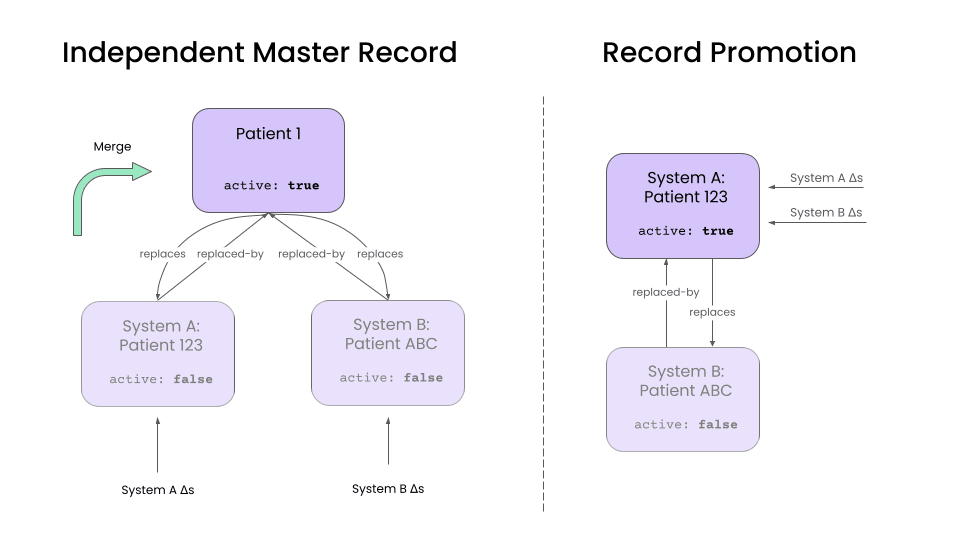
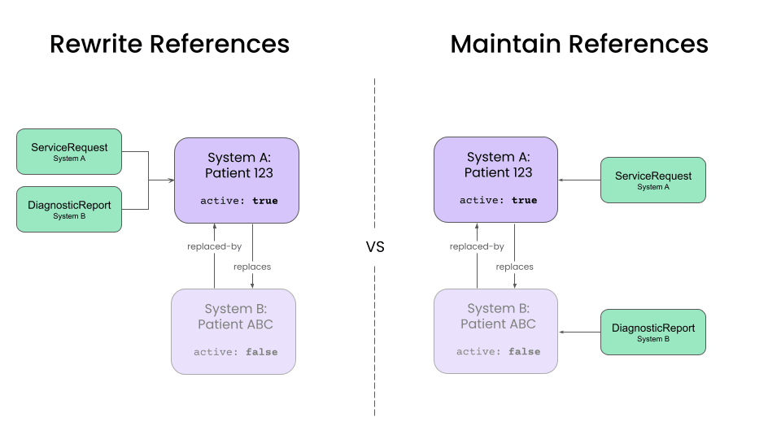

import ExampleCode from '!!raw-loader!@site/../../examples/medplum-demo-bots/src/deduplication/merge-matching-patients.ts';
import MedplumCodeBlock from '@site/src/components/MedplumCodeBlock';

# Merging {#merge-rules}

The merge step of the deduplication pipeline typically contains the most complexity. The merge operation will depend on your clinical and business context, your downstream application, and how frequently you will _unmerge_ records.

This section will discuss the major decisions you will need to make when designing your patient merge operation. The authors of FHIR are also drafting a [FHIR standard merge operation](https://build.fhir.org/patient-operation-merge.html), however the specification has not been finalized.

## Linking Patient Records in FHIR

The FHIR [Patient](/docs/api/fhir/resources) has features to represent the link between source and master records.

The `Patient.active` element is used to indicate the master record for the patient. When there are multiple `Patient` resources per-patient in the target system, all but the master record should be marked as "inactive."

The `Patient.link` element is used to connect duplicate patient records via reference.

- For each [**source record**](/docs/fhir-datastore/patient-deduplication/architecture-overview#glossary)

  - `Patient.link.other` references the master record
  - `Patient.link.type` takes the value `"replaced-by"`

- For the [**master record**](/docs/fhir-datastore/patient-deduplication/architecture-overview#glossary)
  - `Patient.link.other` references each source record
  - `Patient.link.type` takes the value `"replaces"`

  
Example: Linking patient records

  <MedplumCodeBlock language="ts" selectBlocks="linkPatientRecords">
    {ExampleCode}
  </MedplumCodeBlock>

## Master Record Structure

For use cases where patient records are merged, you will need to decide which record is considered the master record. The two most common choices are:

1. Create a new `Patient` resource in the target system to serve as the master record.
2. Promote one of the source `Patient` records to be the the master record, using some predetermined rule.

This decision will affect how data updates will be handled, as well as how the unmerge operation will be implemented.

### Independent Master Records

This approach creates a new `Patient` in the target system that represents the merged patient.

Any patient updates in the source system update the corresponding source `Patient` resource. A separate "merge" operation is then used to combine data from the source records into the master record, and handle any data conflicts.

The advantage of this approach is that it decouples record update and merge operations. It also simplifies the unmerge operation. Because we maintain an up-to-date version of each source record, unmerging simply involves unlinking a source `Patient` from the master and rerunning the merge operation.

Use this approach if:

- Source systems are long lived.
- Unmerge is an important and frequent operation.
- Duplicates are common.

  
Example: Merge identifiers of two patient records

  <MedplumCodeBlock language="ts" selectBlocks="mergeIdentifiers">
    {ExampleCode}
  </MedplumCodeBlock>

### Record Promotion

An alternative approach is to promote one of the existing source `Patients` to being the master record. All updates to the source records are applied directly to the promoted master record.

This is a good approach if your source systems are short lived and if you don't have a high duplication rate, as it reduces the maintenance overhead of an independent master record. The inactive `Patient` records can be eventually be eliminated as they lose relevance. This is a great pattern in data augmentation use cases, where there is a "primary" source system, and a handful of "supplemental" systems that provide additional data.

However, unmerging is more difficult in this approach, as it requires using the [history API](https://www.hl7.org/fhir/http.html#history) to undo updates. Additionally, dealing with data conflicts is more complicated.

With this approach, you'll have to make a few additional design decisions:

1. How do you select the promoted record?
2. When do you eliminate inactive source records?

### Combining and Splitting Master Records

Over time, you may find that two master records actually correspond to the same patient, or that a group of matched records actually correspond to separate patients. This can happen as:

- You accumulate more precise data from your source systems.
- Your matching rules become more advanced.

A key design question will be whether your automated pipelines are allowed to combine or split master records after they have been created.

The benefit of automated splitting/merging is that your target system always maintains the most accurate master records.

The drawback is that frequently combining and splitting master records can cause instability in downstream systems. This can happen in the early days of pipeline development, when matching and merge rules are still being finalized.

A good middle ground is to have your pipelines flag these cases for human review, rather than combine/split automatically. It is best practice to build a human review process for _any_ patient deduplication pipeline, as no pipeline is free from errors. Integrating combining/splitting decisions into this review process will mitigate downstream instability. The only design question that then remains is when (if ever), the automated pipelines are allowed to _override_ a human reviewer's decision.

## Rewriting References from clinical data

After designing a pipeline to handle `Patient` records, we will have to decide how to deal with clinical data resources, such as `Encounters` , `DiagnosticReports`, `ClinicalImpressions`, etc. The major issue for these records will be how they refer to `Patient` records.

The two options are:

1. Rewrite references to point to the master `Patient` record.
2. Maintain references between clinical data and the source `Patient` records.

The downstream applications and the frequency of unmerge operations will primarily dictate the tradeoffs.

### Rewriting references to master record

Rewriting all references to point to the master record simplifies queries for client applications, and most mature implementations for patient care should target this approach. Web and mobile apps can ignore the existence of source records and simply query for clinical resources associated with the master record. For temporary source systems, this configuration also simplifies the elimination of source records over time.

  
Example: Update References on Clinical Data

  <MedplumCodeBlock language="ts" selectBlocks="updateReferences">
    {ExampleCode}
  </MedplumCodeBlock>

However, this approach complicates the unmerge operation. Unmerging a single `Patient` might require rewriting references for a large number of clinical resources. Additionally, we will need to maintain information about the source patient for each clinical resource, which we can do by setting the `Resource.meta.source` element to a value corresponding to the source system.

### Maintaining references to source records

Maintaining references to source records is preferable when absolute clarity about the provenance of each clinical resource is needed. This is preferable in applications such as health information exchanges (HIEs), where data provenance is a higher priority than query performance.

## Disabling Merges

In some cases, you may want to completely disable merging for two records. This could be because they are similar, but have been determined not to be duplicates by a human review. In this case you can add them to a Do Not Match List. For more details, see the docs on [Do Not Match Lists](/docs/fhir-datastore/patient-deduplication/matching#do-not-match-lists).

  
Example: Add record to a Do Not Match List

  <MedplumCodeBlock language="ts" selectBlocks="doNotMatch">
    {ExampleCode}
  </MedplumCodeBlock>

