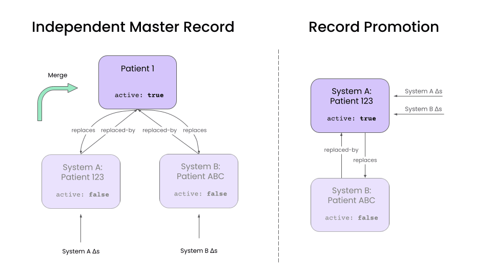

# Patient Deduplication Architectures

Deduplicating patient records from multiple sources is a nuanced workflow. We've put together this this guide to go over the basics of merging patient records, and review some of the most important technical design considerations when building a patient deduplication pipeline. The pipeline described here is the basis of an [Enterprise Master Patient Index](https://en.wikipedia.org/wiki/Enterprise_master_patient_index) (EMPI).

We've organized the guide as follows:

- First, we review the high-level architecture of a patient deduplication pipeline
- Then we talk about how to represent duplicate patients in FHIR
- Next, we discuss the tradeoffs for building batch vs. incremental pipelines.
- Finally, we go into some detail on the specific rules that you can use to perform deduplication

## Architecture Overview

### Terminology

Before we get started, let's define some terminology.

In this guide, we will call each input system that contributes patient data a **source system.** The output of your deduplication pipeline will be called the **target system**.

Most pipelines make a copy of each patient record from the source system into the target system. We will call these copies **source records.** The final, combined patient record will be called the **master record**.

### Pipeline

While deduplication pipelines can take many forms, there three primary operations in every pipeline:

1. **Ingestion:** Copying data from source systems into the target system to create source records.
2. **Matching:** For each patient record, find all other records that could are potential matches.
3. **Merging:** Merge all the information into a single record to serve as the source of truth.

There are many different ways to implement this pipeline, but there are a few key decisions that you will need to make when choosing an architecture:

- Whether you are building a batch vs. incremental deduplication pipeline
- Which matching rules to use
- How to merge matching patients into a single record

### Decision Factors

We'll discuss each of these in depth. The most important factors to consider when making these decisions are:

- **Prevalence of duplicates:** Making estimate of your duplication rate, both _within_ and _between_ source systems, will help you determine the complexity needed in your deduplication pipeline. Some applications have rare duplication rates (e.g. < 1%) while others have frequent duplicates (10-50%). Still others have very bi-modal duplication patterns (e.g 99% of records have 0 duplicates, 1% of records have 5+ duplicates).

- **Lifetime of source systems:** Some pipelines are built to ingest patient data from short-lived source systems, and target system quickly replace them as the source of truth. For example, when migrating from legacy systems into medplum. In contrast, some source systems are long lived or permanent, as when deduplicating patients from multiple healthcare providers or from Health Information Exchanges (HIEs).

- **Cost of false positives:** No deduplication system will be 100% perfect, and some patients records will be merged incorrectly. Certain architectural choices make it easier or harder to unmerge patient records once merged. The right choice for you will depend on your confidence threshold for performing a merge and on cost of an incorrect merge.

- **Downstream application:** The right deduplication architecture will ultimately depend on how the deduplicated data will be used. Target systems that serve web and mobile applications will have different priorities than that systems that serve as data aggregators. For example, some systems support patient login and a merge will show a whole new set of data to a user, merging for this use case should be distinct from merging for population health or insurance billing purposes.

## Linking Patient Records in FHIR

**The FHIR [Patient](/docs/api/fhir/resources) has features to represent the link between source and master records.**

The `Patient.active` element is used to indicate the master record for the patient. When there are multiple `Patient` resources per-patient in the target system, all but the master record should be marked as "inactive."

The `Patient.link` element is used to connect duplicate patient records via reference.

- For each source record

  - `Patient.link.other` references the master record
  - `Patient.link.type` takes the value `"replaced-by"`

- For the master record
  - `Patient.link.other` references each source record
  - `Patient.link.type` takes the value `"replaces"`

## Batch vs. Incremental Pipelines

Your deduplication pipeline can be implemented in either _batch_ or _incremental_ versions. These are not mutually exclusive options, and many organizations will end up building both.

The Medplum team recommends starting with a batch pipeline. If your source systems are short-lived or changing infrequently, a batch pipeline may be sufficient. Regardless, even if you end up building incremental pipelines, batch pipelines are typically easier to get started with as you iterate on your [matching](#matching-rules) and [merge](#merge-rules) rules.

### Batch Pipelines

Batch pipelines run as offline jobs that consider all records at once to produce sets of patient matches. Most implementations schedule these pipelines to run on a regularly scheduled interval. As this is an N2 problem, they are primarily constrained by memory rather than latency.

Typically, these pipelines compute matches in a data warehouse or a compute engine, but can also can also be computed in a [Medplum Bot](/docs/bots) with sufficient memory. A typical workflow is:

1. Export patient data from Medplum into the appropriate data warehouse or compute engine (e.g. [Spark](https://spark.apache.org/)). Note that even large patient datasets should be able to fit into local memory (1M patients < 10GB), so distributed computation is not strictly required. See our [analytics guide](/docs/analytics) for more info.
2. Use [matching rules](#matching-rules) to detect matched pairs of records. Because this is an N2 operation, we recommend using some form of exact matching rules to reduce the cardinality of the problem, before applying "fuzzy matching."
3. Use [merging rules](#merge-rules) to combine matched pairs into sets and _create_ the master record.
4. Use the Medplum API to update the `Patient.active` and `Patient.link` elements for all records.

### Incremental Pipelines

Each invocation of an incremental pipeline considers a single record and finds all matches. Typically, these pipelines are run per-source-record at the time of creation or update. As these pipelines are typically used to manage high-frequency, event-driven updates, latency is more of a concern than memory.

Incremental pipelines can often be implemented using [Medplum Bots](/docs/bots), and a typical workflow is:

1. Set up a Bot to listen for updates to patient records.
2. Use [matching rules](#matching-rules) to detect matching records. Because incremental pipelines only consider matches for a single record, we are less memory constrained and can apply more "fuzzy matching" rules.

- Use [merging rules](#merge-rules) to _update_ the master patient record.

- Update the `Patient.active` and `Patient.link` elements for all relevant records.

  Check out [this blog post](/blog/patient-deduplication) for more details on event-driven pipelines. The medplum-demo-bots repo also contains an [example](https://github.com/medplum/medplum-demo-bots/blob/main/src/examples/patient-deduplication.ts) of an incremental deduplication bot.

## Matching Rules {#matching-rules}

The best deduplication systems use a library of matching rules with different strengths and weaknesses. While the effectiveness of different patient matching rules will vary depending on the clinical context, here we suggest some rules to get you started.

These have been trialed in previous deduplication projects, and are rated by their false positive rates (i.e. incorrect matches) and false negative rates (i.e. missed matches). Note that three matching identifiers is the standard.

1. **Exact match on email address / phone number, name, gender, and date of birth:** We recommend starting here. Email and phone act as pseudo-unique identifiers, and have a very low false positive rate. Using name, gender, and date of birth help eliminate false positives caused by family members sharing the same contact info. Note that phone numbers should be normalized before use.
2. **Exact match on first name, last name, date of birth, and postal code:** These matches have a high probability of being true positives, and can be used without email or phone number. Note that false positives can still occur, and we recommend human review of these matches.
3. **Phonetic match first match on first and last name, date of birth, and postal code:** Phonetic matching algorithms such as [Soundex](https://en.wikipedia.org/wiki/Soundex) or [Metaphone](https://en.wikipedia.org/wiki/Metaphone) can be used to increase the match rate on names and accounts for transcription error. Additionally, setting a threshold on the [edit distance](https://en.wikipedia.org/wiki/Levenshtein_distance) between the names can help accommodate misspellings.
4. **Phonetic match first name, date of birth:** This rule excludes last names, to account for patients who have changed their surnames (e.g. after getting married). It also excludes address information to account for patients who move. While this rule will catch more matches, it has a significantly higher false positive rate, and should definitely be coupled with human review.
5. **Machine Learning:** After you have built up a dataset of matching patient pairs that have been reviewed by a human, you are in a good position to train a machine learning model. The most common setup is to treat this as a [binary classification problem](https://www.learndatasci.com/glossary/binary-classification) that outputs a match/no-match decision for a candidate (patient, patient) pair, and then use your [merge rules](#merge-rules) to convert these pairs into a single master record.

## Merge Rules {#merge-rules}

Surprisingly, the merge step of the deduplication pipeline typically contains the most complexity. The merge operation will depend on your clinical and business context, your downstream application, and how frequently you will _unmerge_ records.

This section will discuss the major decisions you will need to make when designing your patient merge operation. The authors of FHIR are also drafting a [FHIR standard merge operation](https://build.fhir.org/patient-operation-merge.html), however the specification has not been finalized.

### Master Record Structure

For use cases where patient records are merged, you will need to decide which record is considered the master record. The two most common choices are:

1. Create a new `Patient` resource in the target system to serve as the master record.
2. Promote one of the source `Patient` records to be the the master record, using some predetermined rule.

This decision will affect how data updates will be handled, as well as how the unmerge operation will be implemented.

#### Independent Master Records

This is approach creates a new `Patient` in the target system that represents the merged patient.

Any patient updates in the source system update the corresponding source `Patient` resource. A separate "merge" operation is then used to combine data from the source records into the master record, and handle any data conflicts.

The advantage of this approach is that it decouples record update and merge operations. It also simplifies the unmerge operation. Because we maintain an update-to date version of each source record, unmerging simply involves unlinking a source `Patient` from the master and rerunning the merge operation.

Use this approach if:

- Source systems are long lived.
- Unmerge is an important and frequent operation.
- Duplicates are common.

#### Record Promotion

An alternative approach is to promote one of the existing source `Patients` to being the master record. All updates to the source records are applied directly to the promoted master record.

This is a good approach if your source systems are short lived and if you don't have a high duplication rate, as it reduces the maintenance overhead of an independent master record. The inactive `Patient` records can be eventually be eliminated as they lose relevance. This is a great pattern in data augmentation use cases, where there is a "primary" source system, and a handful of "supplemental" systems that provide additional data.

However, unmerging is more difficult in this approach, as it requires using the [history API](https://www.hl7.org/fhir/http.html#history) to undo updates. Additionally, dealing with data conflicts is more complicated.

With this approach, you'll have to make a few additional design decisions:

1. How do you select the promoted record?
2. When do you eliminate inactive source records?

### Combining and Splitting Master Records

Over time, you may find that two master records actually correspond to the same patient, or that a group of matched records actually correspond to separate patients. This can happen as:

- You accumulate more precise data from your source systems.
- Your matching rules become more advanced.

A key design question will whether your automated pipelines are allowed to combine or split master records after they have been created.

The benefit of automated splitting/merging that your target system always maintains the most accurate master records.

The drawback is that frequently combining and splitting master records can cause instability in downstream systems. This can happen in the early days of pipeline development, when matching and merge rules are still being finalized.

A good middle ground is to have your pipelines flag these cases for human review, rather than combine/split automatically. It is best practice to build a human review process for _any_ patient deduplication pipeline, as no pipeline is free from errors. Integrating combining/splitting decisions into this review process will mitigate downstream instability. The only design question that then remains is when (if ever), the automated pipelines are allowed to _override_ a human reviewer's decision.

### Rewriting References from clinical data

After a designing a pipeline to handle `Patient` records, we will have to decide how to deal with clinical data resources, such as `Encounters` , `DiagnosticReports`, `ClinicalImpressions`, etc. The major for these records will be how they refer to `Patient` records.

The two options are:

1. Rewrite references to point to the master `Patient` record.
2. Maintain references between clinical data and the source `Patient` records.

The tradeoff primary will be dictated by the downstream applications and the frequency of unmerge operations.

#### Rewriting references to master record

Rewriting all references to point to the master record simplifies queries for client applications, and most mature implementations for patient care should target this approach. Web and mobile apps can ignore the existence of source records and simply query for clinical resources associated with the master record. For temporary source systems, this configuration also simplifies the elimination of source records over time.

However, this approach complicates the unmerge operation. Unmerging a single `Patient` might require rewriting references for a large number of clinical resources. Additionally, we will need to maintain information about the source patient for each clinical resource, which we can do by setting the `Resource.meta.source` element to a value corresponding to the source system.

#### Maintaining references to source records

Maintaining references to source records is preferable when absolute clarity about the provenance of each clinical resource is needed. This is preferable in applications such as health information exchanges (HIEs), where data provenance is a higher priority than query performance.

## Conclusion

While this guide might not be exhaustive, this guide serves as a starting point for building a production-ready deduplication workflow. While it requires some planning up front, reconciling patient data from multiple sources can create a powerful data asset to power your clinical workflows.

The merge techniques described here are general purpose, but can exist in two contexts (a) automatic merge, (b) manual merge or "human-in-the-loop." In both cases, audit reports are produced allowing visibility into why records were matched, why they were merged and who merged them.

You can also check out our [blog post](/blog/patient-deduplication) on the topic for more information.

## See Also

- Patient deduplication [reference implementation](https://github.com/medplum/medplum-demo-bots/tree/main/src/deduplication)
