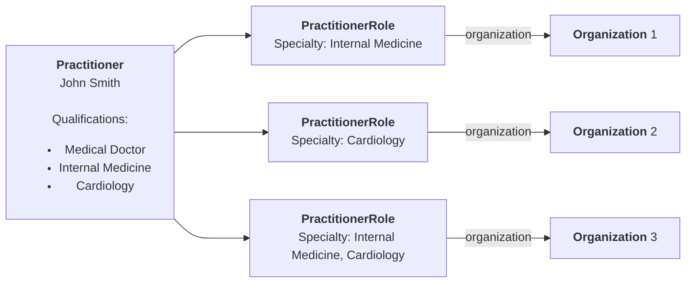

import ExampleCode from '!!raw-loader!@site/../examples/src/fhir-datastore/provider-credentials.ts';
import MedplumCodeBlock from '@site/src/components/MedplumCodeBlock';

# Modeling Provider Qualifications

## Introduction

For providers that operate across multiple regions and specialties, properly representing provider credentials is critical for regulatory compliance, insurance billing, and referral management. In the U.S., virtual providers must ensure that physicians are licensed in the same state as their patients. Another important operational consideration is making sure that care coordinators, nurses, and doctors are practicing at the top of their license.

## Key Elements

The key FHIR element for storing all licenses and degrees is the `Practitioner.qualifications` element. This is an array of all degrees, licenses, and certifications achieved achieved by the provider.

The two most important sub-elements are:

| Element                                 | Description                                                                                                                                         |
| --------------------------------------- | --------------------------------------------------------------------------------------------------------------------------------------------------- |
| `Practitioner.qualifications[i].code`   | This [`CodeableConcept`](https://www.medplum.com/docs/fhir-basics#standardizing-data-codeable-concepts) is used to identify the type of certification |
| `Practitioner.qualifications[i].issuer` | The organization responsible for issuing the certification                                                                                          |

The next sections discuss how to populate these elements for state medical licenses and specialty board certifications.

## Medical Licensure

In the U.S., medical licenses are issued by each state's medical board, and are only valid for patients in that state.

Use the HL7 `degreeLicenseCertificate` code system (http://terminology.hl7.org/CodeSystem/v2-0360) to model the license level achieved by the provider (MD, DO, RN, NP, etc.).

The `issuer` is typically the state (e.g., "State of New York"). Although this element is typically a reference to an `Organization`, in for the sake of simplicity we recommend simply use the `display` element, rather than creating an `Organization` resource for each state.

To augment the `issuer`, the Davinci PDEX implementation guide [defines an extension](https://build.fhir.org/ig/HL7/davinci-pdex-plan-net/StructureDefinition-qualification.html) for `Practitioner.qualification`, named `practitioner-qualification`. This extension contains an element, `whereValid` , which allows you to represent medical license jurisdictions using USPS postal codes for convenience.

  
Example

  <MedplumCodeBlock
    language="ts"
    selectBlocks="practitioner-head,qualifications-head,license,qualifications-tail,practitioner-tail"
  >
    {ExampleCode}
  </MedplumCodeBlock>

## Medical Specialty

A provider's specialty certifications can also be represented Unlike licensure, medical specialties are determined by professional boards of physicians, not governments. Here are the key points to consider:

- **Specialty Code**: The PDEX implementation guide requires selecting a provider's specialty code from the [NUCC provider taxonomy](https://taxonomy.nucc.org/) (system: `http://nucc.org/provider-taxonomy`).
- **Issuer: **The issuer for specialist certifications are typically professional certification boards (e.g. American Board of Internal Medicine or American College of Obstetricians and Gynecologists )

  
Example

  <MedplumCodeBlock
    language="ts"
    selectBlocks="practitioner-head,qualifications-head,specialty,qualifications-tail,practitioner-tail"
  >
    {ExampleCode}
  </MedplumCodeBlock>

:::tip `Practitioner.qualification` vs. `PractitionerRole.specialty`

Both the `Practitioner.qualification` and `PractitionerRole.specialty` elements can be used to represent a provider's specialization, but there are important differences between how they are used.

- `Practitioner.qualification` indicates the specific qualifications that a provider has obtained, and are associated with the provider's _person_. This is useful for illustrating a provider's overall skill set, education, and training, regardless of their current role or where they're practicing.

- `PractitionerRole.specialty` indicates the particular specialty a provider is currently practicing in a specific context or organization. This is more flexible as a provider can have different roles in different organizations or at different times. For example, a practitioner who is qualified as both a cardiologist and an internist might serve as a cardiologist at one hospital and an internist at another. See our guide on [Modeling Practitioner Organizations](./provider-organizations) for more information about modeling providers who work across multiple organizations.

:::

## Conclusion

The `Practitioner.qualification` element is the place to store all Practitioner licenses and credentials. The key is to use standard code systems to support data exchange with other systems. In this guide we've summarized the main points of the [Davinci PDEX Payer Network](https://build.fhir.org/ig/HL7/davinci-pdex-plan-net/index.html) IG to serve a starting point for your implementation.
