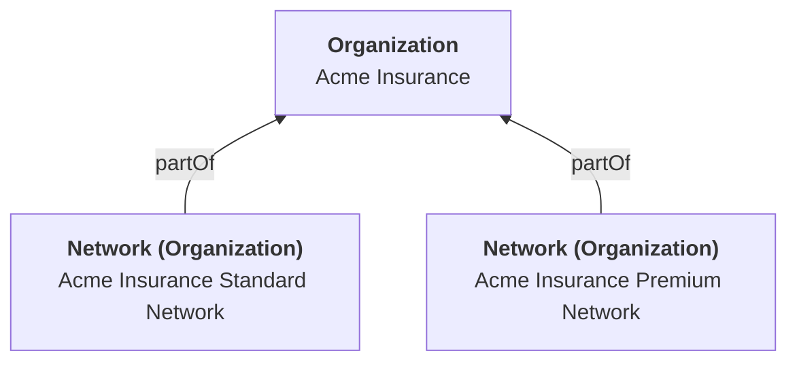
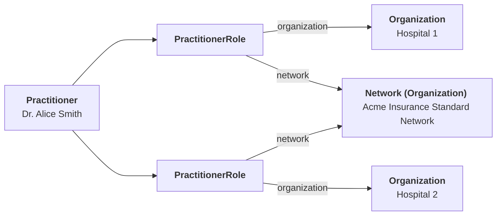
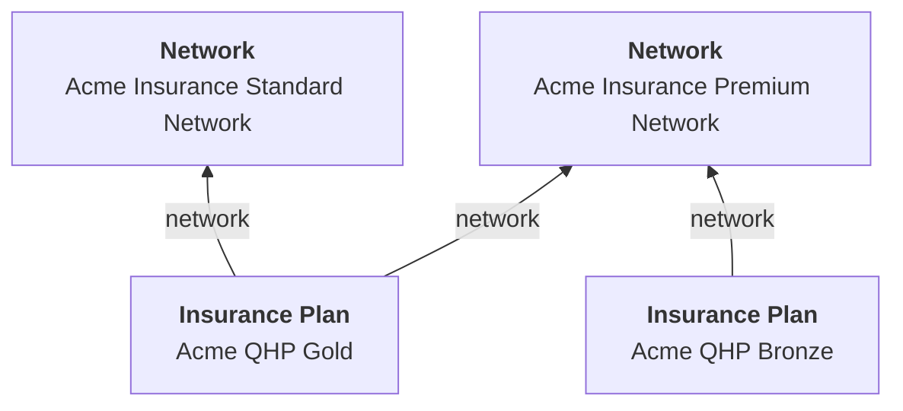

# Modeling Provider Networks

## Introduction

Understanding how to effectively track and manage physician networks is crucial for digital health companies aiming to offer affordable and convenient care. This guide will provide an in-depth explanation on:

- Modeling an insurance provider network offered by a payer.
- Associating an individual or organizational provider with an insurance network.
- Modeling an insurance product or plan offered by a payer.

## Defining the Network

A critical first step is to define the insurance network. A network is a group of doctors, hospitals and care providers that the health insurance company contracts with to provide medical services.

In FHIR, an insurance network is modeled using the `Organization` resource. This resource represents the many-to-many relationship between insurance plans and provider networks.

The Da Vinci PDEX Plan Net (PDEX) specifies a [unique profile](http://hl7.org/fhir/us/davinci-pdex-plan-net/StructureDefinition-plannet-Network.html) of `Organization` to represent a provider network. In this profile, the `partOf` attribute is mandatory, necessitating the creation of an `Organization` resource for each payer.

## Connecting Providers to Networks

To link individual `Practitioners` to the network, the `PractitionerRole` resource is used. For every network affiliation, there should be a corresponding `PractitionerRole`. The PDEX extends the `PractitionerRole` resource with a `network` attribute to reference the network. For instance, a single practitioner operating in two different organizations can each point to the same Acme Bronze network.

Organizational providers (e.g. "Cancer Specialists of Springfield"), are modeled as `Organization` resources. The `OrganizationAffiliation` resource is used to link the provider to the network through the `OrganizationAffiliation.network` attribute.

## Connecting Insurance Plans to Networks

The `InsurancePlan` resource represents a health insurance offering by a payer. It consists of a list of covered benefits (`InsurancePlan.coverage`), costs associated with those benefits (`InsurancePlan.plan`), and additional details about the offering. The `InsurancePlan.plan` attribute describes the cost-sharing agreement between the payer and the patient.

There can be multiple `InsurancePlan.plan` entries. This is because the same insurance product may have different costs for beneficiaries, depending on whether the provider is in-network or out-of-network.

A plan can be associated with multiple networks, and a network can be associated with many plans. You can specify the `InsurancePlan.network` attribute and/or the `InsurancePlan.network` attribute that applies to all cost-sharing plans. If the `InsurancePlan.network` attribute is not provided, each cost-sharing plan must provide at least one network in the `InsurancePlan.plan.network` attribute.

## References

As a private sector collaboration [Da Vinci PDEX Payer Network guide](https://build.fhir.org/ig/HL7/davinci-pdex-plan-net/) is being implemented by Payers. See the following reference APIs for examples

1. [Humana Insurance Plan API](https://developers.humana.com/apis/insuranceplan-api/doc)
2. [Alliance Health Developer Resources](https://thealliance.health/developer-resources/provider-directory/)

For information about how to represent provider directories, see our guides on [Provider Organizations](./provider-organizations) and [Provider Credentials](./provider-credentials).
