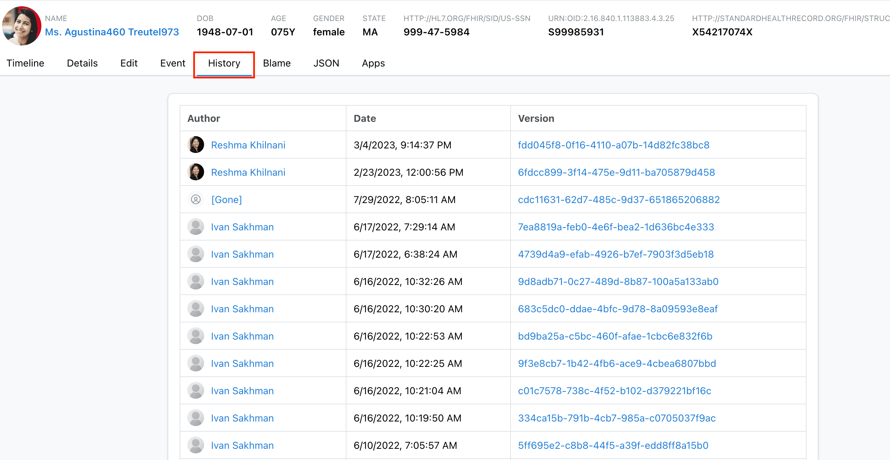
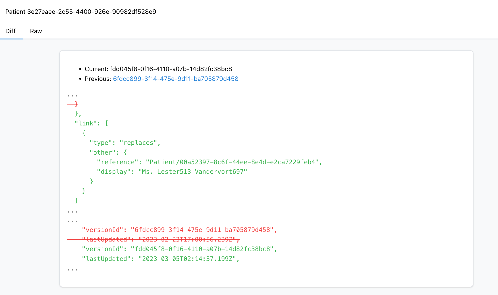
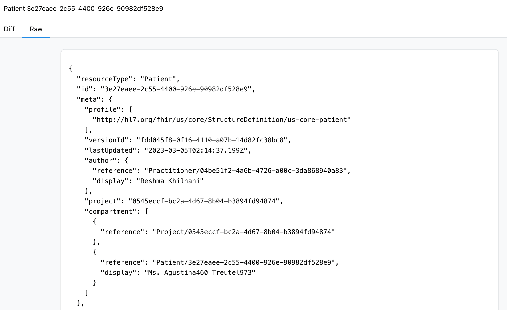

import MedplumCodeBlock from '@site/src/components/MedplumCodeBlock';
import Tabs from '@theme/Tabs';
import TabItem from '@theme/TabItem';

import ExampleCode from '!!raw-loader!@site/..//examples/src/fhir-datastore/resource-history.ts';

# Resource History

The Medplum backend stores every version of a resource, allowing you to easily track changes over time. Resource history can be viewed in the Medplum App or by accessing the `/_history` endpoint.

## Accessing History in the Medplum App

To access a resource's history in the [Medplum App](https://app.medplum.com), follow these steps:

- Navigate to the resources page at http://app.medplum.com/:resourceType.
- Select your desired resource. This will bring you to that resource's page.
- Select the `History` tab from the array of tabs at the top of the page.

Alternatively, you can navigate directly to this page at https://app.medplum.com/:resourceType/:id/history.

The `History` tab shows every version of the selected resource, representing each time the resoruce was changed. Along with this, it will show when the change was made, as well as the user who made the update.

Selecting a version will bring you to the `Diff` page, which displays the differences between that version and the version directly previous to it.

You can also view the raw JSON of the selected version by clickin on the `Raw` tab.

## Accessing the /\_history Endpoint

The history of a resouce can also be viewed by accessing the `/_history` endpoint in the FHIR API. This endpoint allows you to retrieve the history of an individual resource, a resource type, or all resources in your system.

To access the `/_history` endpoint, make a GET request to the url of the desired resource or resource type.

The Medplum SDK also provides the `readHistory` helper function to access the `/_history` endpoint.

<Tabs groupId="language">
  <TabItem value="ts" label="Typescript">
    <MedplumCodeBlock language="ts" selectBlocks="accessHistoryTs">
      {ExampleCode}
    </MedplumCodeBlock>
  </TabItem>
  <TabItem value="cli" label="CLI">
    <MedplumCodeBlock language="bash" selectBlocks="accessHistoryCli">
      {ExampleCode}
    </MedplumCodeBlock>
  </TabItem>
  <TabItem value="curl" label="cURL">
    <MedplumCodeBlock language="bash" selectBlocks="accessHistoryCurl">
      {ExampleCode}
    </MedplumCodeBlock>
  </TabItem>
</Tabs>

These requests return a `Bundle` resource with the different versions stored as an array of resources in the `entry` field.

:::note Resource Creation Time
There is currently no support for directly accessing the time and date that a resource was initially created. To do this use the `/_history` endpoint to retrieve all versions and view the `lastUpdated` field of the original version. Note that the GraphQL endpoint does not currently have a spec for the history API.
:::

## Reverting Changes to a Resource

While there is no direct method to revert changes made to a resource, it can be easily done using the `readHistory` and `readVersion` helper functions provided by Medplum.

The `readHistory` function is used to get the entire history of the resource. You can then choose the version and use `readVersion` to return the complete details of that version of the resource. The current resource can then be updated to the historic details.

  
Example: Revert resource to a previous version

  <MedplumCodeBlock language="ts" selectBlocks="revertChanges">
    {ExampleCode}
  </MedplumCodeBlock>

This method does not actually revert the resources to the previous version, but it creates a new entry in the resource's history with all of the same details as the historic version.
