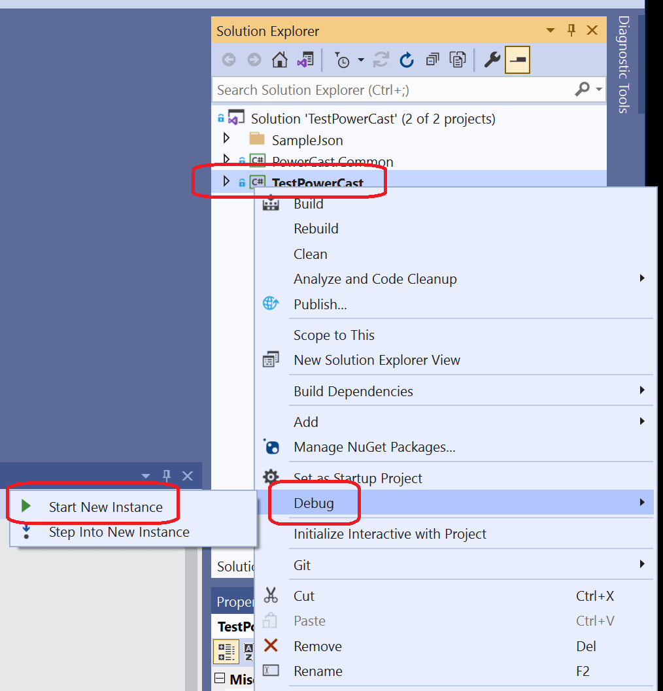
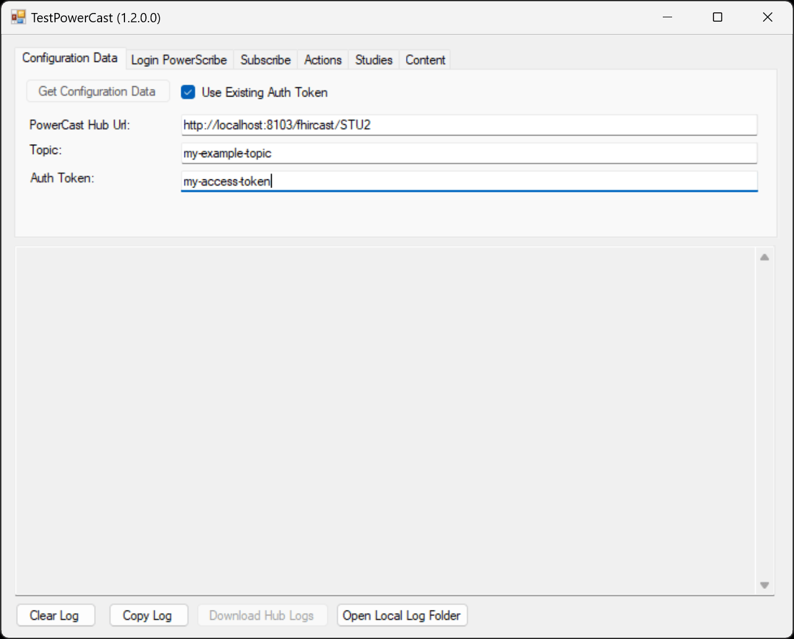
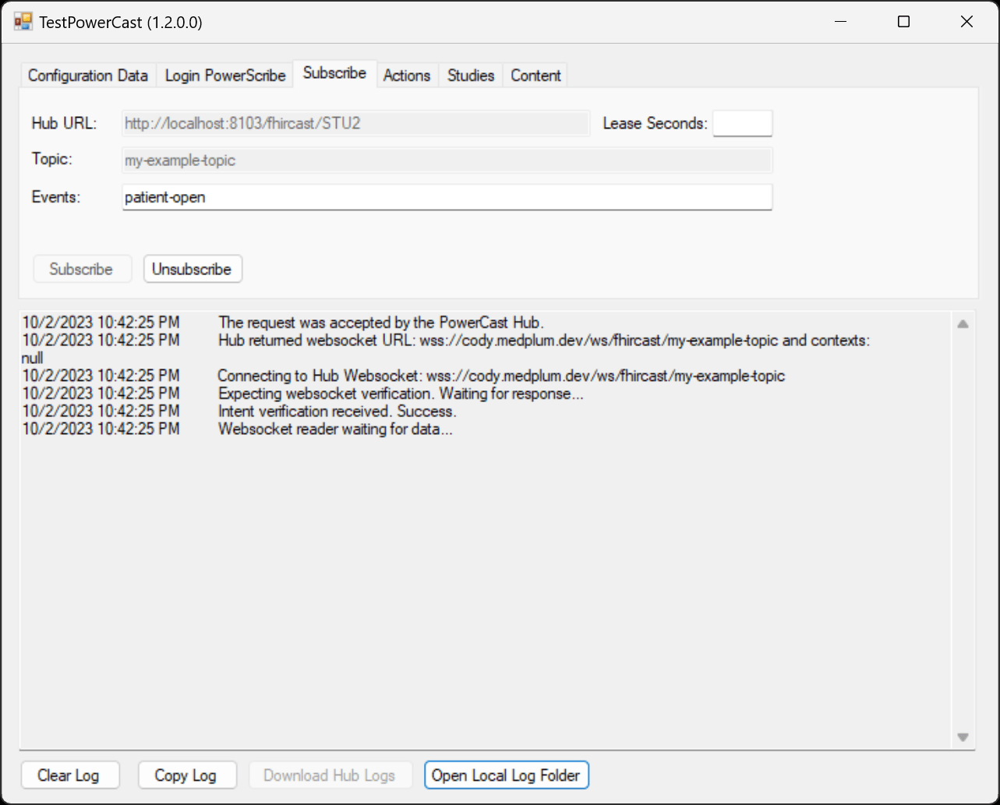

# FHIRcast with .NET client

This is a guide for using the official [FHIRcast .NET client](https://github.com/fhircast/.net) with the Medplum server.

## Prerequisites

This guide assumes basic familiarity with git, Visual Studio, and C#.

## Getting Started

First, clone the repository using git:

```bash
git clone git@github.com:fhircast/.net.git
```

Next, open the `TestPowerCast.sln` file in Visual Studio.

Once the solution opens successfully, you can run the test application:

1. Right click on "TestPowerCast" in Solution Explorer
2. Click on "Debug"
3. Click on "Start New Instance"



If all goes well, you should now have a running instance of the test app.

## Connecting to Medplum Server

On the "Configuration Data" tab:

1. Check "Use Existing Auth Token" (the built-in authentication only works with Auth0)
2. Enter the Hub URL for your Medplum server
   a. Add "/fhircast/STU3" to your Medplum server base URL
   b. For Medplum cloud hosted: https://api.medplum.com/fhircast/STU3
   c. By default for running from source: http://localhost:8103/fhircast/STU3
3. Enter your FHIRcast topic
4. Enter your Medplum server auth token (see [Auth and Identity](http://localhost:3000/docs/auth) to get started)



Next, on the "Subscribe" tab:

1. Enter which events you would like to subscribe to (i.e., "Patient-open")
2. Click "Subscribe"

If all goes well, you should see "Success" messages in the event log:



You can now start publishing events to the topic.
