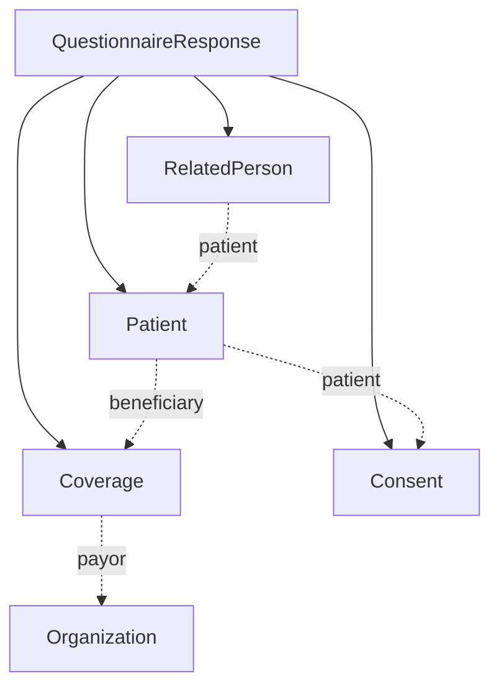
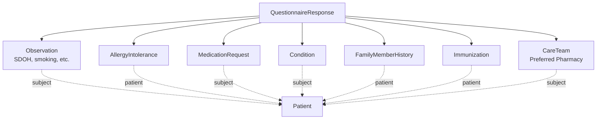

# Intake Data Model

A patient intake form captures a wide range of information in a single interaction — demographics, insurance, medical history, medications, allergies, family history, and consent. In FHIR, this information fans out into many discrete resource types. This page maps out that resource graph, explains how the resources relate to each other, and identifies the US Core profiles that apply.

This page covers:

- The resource graph produced by intake processing
- Each resource's role and whether it is typically created or updated
- US Core profiles applied during intake
- How intake resources connect to Encounters
- The RelatedPerson pattern for dependent insurance coverage

## Resource Graph

Intake processing transforms a single [`QuestionnaireResponse`](/docs/api/fhir/resources/questionnaireresponse) into multiple FHIR resources. The graph splits naturally into two groups: **core identity** resources that establish who the patient is and how they're covered, and **clinical history** resources that capture the patient's medical background.

### Core Identity Resources

### Clinical History Resources

## Resource Role Reference

| Resource | Role in Intake | Created or Updated | Key References |
| --- | --- | --- | --- |
| [`Patient`](/docs/api/fhir/resources/patient) | Demographics, contact info, emergency contacts, language preferences, extensions for race/ethnicity/veteran status | Usually **created** (new patient) or **updated** (returning patient) | — |
| [`Coverage`](/docs/api/fhir/resources/coverage) | Insurance information — payor, subscriber ID, relationship to subscriber | Created; upserted by `beneficiary` + `payor` | `beneficiary` → Patient, `payor` → Organization |
| [`RelatedPerson`](/docs/api/fhir/resources/relatedperson) | Insurance subscriber when subscriber is not the patient (e.g., a child on a parent's plan) | Created when `Coverage.relationship` is not `self` | `patient` → Patient |
| [`Consent`](/docs/api/fhir/resources/consent) | Treatment consent, privacy practices, payment agreements, advance directives, communication preferences | Created (one per consent type) | `patient` → Patient |
| [`Observation`](/docs/api/fhir/resources/observation) | Social determinants of health (housing, education), smoking status, sexual orientation, pregnancy status | Created or upserted by `patient` + `code` | `subject` → Patient |
| [`AllergyIntolerance`](/docs/api/fhir/resources/allergyintolerance) | Patient-reported allergies with reaction and onset | Upserted by `patient` + `code` | `patient` → Patient |
| [`MedicationRequest`](/docs/api/fhir/resources/medicationrequest) | Current medications | Upserted by `subject` + `code` | `subject` → Patient |
| [`Condition`](/docs/api/fhir/resources/condition) | Medical history / problem list | Upserted by `subject` + `code` | `subject` → Patient |
| [`FamilyMemberHistory`](/docs/api/fhir/resources/familymemberhistory) | Family medical history — condition, relationship, deceased status | Upserted by `patient` + `code` + `relationship` | `patient` → Patient |
| [`Immunization`](/docs/api/fhir/resources/immunization) | Vaccination history | Upserted by `patient` + `vaccine-code` + `date` | `patient` → Patient |
| [`CareTeam`](/docs/api/fhir/resources/careteam) | Preferred pharmacy | Upserted by `name` + `subject` | `subject` → Patient, `participant.member` → Organization |

:::tip Created vs. Updated

In many real-world flows, the [`Patient`](/docs/api/fhir/resources/patient) resource already exists by the time the intake form is submitted — because the patient was registered or scheduled first. The intake bot in the [Patient Intake Demo](https://github.com/medplum/medplum/tree/main/examples/medplum-patient-intake-demo) creates a new Patient, but your implementation may instead search for and update an existing one. Most clinical history resources (allergies, medications, conditions) use [`upsertResource`](/docs/fhir-datastore/working-with-fhir#upsert) to avoid duplicates on resubmission.

:::

## US Core Profiles

The intake demo applies [US Core](https://www.hl7.org/fhir/us/core/) profiles to resources where applicable. Adding a profile to `meta.profile` signals that the resource conforms to the profile's constraints and enables profile-aware validation.

| Resource | US Core Profile |
| --- | --- |
| Patient | `us-core-patient` |
| Coverage | `us-core-coverage` |
| AllergyIntolerance | `us-core-allergyintolerance` |
| MedicationRequest | `us-core-medicationrequest` |
| Immunization | `us-core-immunization` |
| CareTeam | `us-core-careteam` |
| Observation (smoking) | `us-core-smokingstatus` |
| Observation (sexual orientation) | `us-core-observation-sexual-orientation` |

The Patient resource also uses US Core extensions for race (`us-core-race`), ethnicity (`us-core-ethnicity`), and veteran status (`military-service-veteran-status`).

## Encounter Linkage

In many implementations, intake is tied to an [`Encounter`](/docs/api/fhir/resources/encounter) — either a scheduled visit or a walk-in registration. When an Encounter exists:

- Downstream clinical resources ([`Observation`](/docs/api/fhir/resources/observation), [`Condition`](/docs/api/fhir/resources/condition)) can reference the Encounter, connecting them to a specific visit
- [`Task`](/docs/api/fhir/resources/task) resources for intake questionnaires link to the Encounter via `Task.encounter`, which ties them into the encounter chart view
- A [`ClinicalImpression`](/docs/api/fhir/resources/clinicalimpression) linked to the Encounter provides chart notes

For visit-based intake orchestrated via [PlanDefinition](/docs/intake/post-intake-automation#plandefinition-orchestration), the `$apply` operation accepts an `encounter` parameter that automatically links generated Tasks to that Encounter.

## RelatedPerson and Insurance Coverage

When the insurance subscriber is someone other than the patient — such as a child covered by a parent's plan — the intake process creates a [`RelatedPerson`](/docs/api/fhir/resources/relatedperson) resource alongside the [`Coverage`](/docs/api/fhir/resources/coverage).

For full details on Coverage modeling, insurance card image capture, and payor setup, see [Patient Insurance](/docs/billing/patient-insurance).

:::caution Relationship Code Inversion

The relationship code **inverts** between Coverage and RelatedPerson, and this is one of the most common sources of bugs in intake implementations:

- `Coverage.relationship` describes the **patient's** relationship **to the subscriber** (e.g., `child` means "the patient is a child of the subscriber")
- `RelatedPerson.relationship` describes the **RelatedPerson's** relationship **to the patient** (e.g., `PRN` / parent means "this person is a parent of the patient")

So if `Coverage.relationship` is `child`, the corresponding `RelatedPerson.relationship` should be `PRN` (parent) — because the RelatedPerson *is* the parent.

| Coverage.relationship | RelatedPerson.relationship | Why |
| --- | --- | --- |
| `child` | `PRN` (parent) | Patient is the child; subscriber is the parent |
| `parent` | `CHILD` (child) | Patient is the parent; subscriber is the child |
| `spouse` / `common` | `SPS` (spouse) | Symmetric relationship |

:::

## See Also

- [Patient Insurance](/docs/billing/patient-insurance) — Coverage resource modeling, insurance card capture, payor setup
- [Questionnaires & Assessments](/docs/questionnaires) — General Questionnaire mechanics
- [Intake Questionnaires: Design and Extraction](/docs/intake/intake-questionnaires) — Questionnaire structure patterns for intake
- [Patient Intake Demo](https://github.com/medplum/medplum/tree/main/examples/medplum-patient-intake-demo) — Working reference implementation
