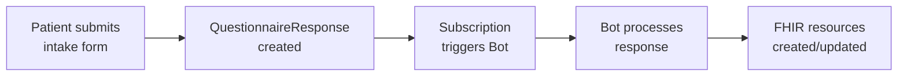
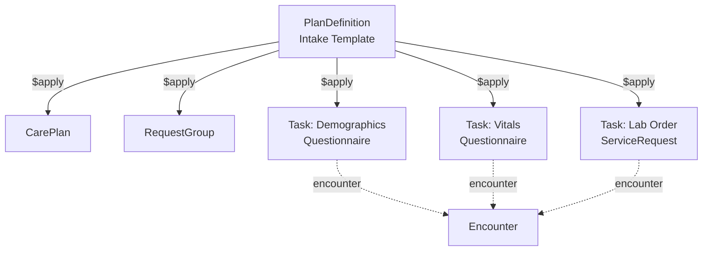

# Post Intake Automation

The patient submitted their intake form — now what? This page covers the patterns for triggering intake processing and the workflows that follow once intake data has been ingested into FHIR resources.

This page covers:

- Triggering intake processing with Subscriptions
- Post-processing workflows (routing, notifications, follow-ups)
- Optional PlanDefinition-based orchestration for structured intake workflows

## Triggering Intake Processing

The most common pattern is a [Subscription](/docs/subscriptions) on [`QuestionnaireResponse`](/docs/api/fhir/resources/questionnaireresponse) creation that triggers a [Bot](/docs/bots/bot-basics). When a patient submits their intake form, the Subscription fires and the Bot transforms the response into FHIR resources.



### Setting Up the Subscription

Create a Subscription that matches your intake questionnaire. Use the `questionnaire` search parameter to scope the Subscription to a specific form, so it doesn't fire for every QuestionnaireResponse in your system. Use a **create-only** subscription (Medplum extension below) so the Bot is not invoked again when the same response is updated — for example after linking `subject` to a newly created Patient.

```json
{
  "resourceType": "Subscription",
  "status": "active",
  "reason": "Process intake form submissions",
  "criteria": "QuestionnaireResponse?questionnaire=https://example.com/intake-form",
  "channel": {
    "type": "rest-hook",
    "endpoint": "Bot/your-intake-bot-id"
  },
  "extension": [
    {
      "url": "https://medplum.com/fhir/StructureDefinition/subscription-supported-interaction",
      "valueCode": "create"
    }
  ]
}
```

:::tip Avoid Infinite Loops

If your Bot updates the QuestionnaireResponse (e.g., to set `subject` after creating the Patient), use a **create-only** Subscription to avoid re-triggering. The intake demo Bot does exactly this — it creates the Patient, then updates the QuestionnaireResponse to link `subject` to the new Patient. Because the Subscription only fires on creation, the update doesn't re-trigger the Bot.

For more interaction options, see [Subscription extensions](/docs/subscriptions/subscription-extensions#subscriptions-for-create-only-or-update-only-events).

:::

For details on what the Bot does with the response, see [Intake Questionnaires: Processing Responses](/docs/intake/intake-questionnaires#processing-responses).

## Post-Processing Workflows

After the intake Bot creates FHIR resources, you often need downstream workflows. These can be additional Bots triggered by their own Subscriptions, or logic within the intake Bot itself.

### Common Post-Intake Actions

| Action | Trigger | Implementation |
| --- | --- | --- |
| **Notify provider** | Intake resources created | Bot sends a notification (email, SMS, or in-app Communication) to the assigned provider |
| **Flag incomplete data** | Missing required fields | Bot creates a [Task](/docs/api/fhir/resources/task) assigned to front-desk staff for follow-up |
| **Insurance verification** | Coverage created | Subscription on Coverage triggers a Bot that calls an eligibility API (e.g., [Stedi](/docs/integration/stedi)) |
| **Schedule follow-up** | Specific conditions detected | Bot creates an Appointment or Task based on intake answers (e.g., screening referral) |
| **Route to care team** | Patient assigned to a care program | Bot creates Tasks for care team members based on patient characteristics |

### Task-Based Follow-Up

When intake data requires human follow-up, create a [`Task`](/docs/api/fhir/resources/task) to track it:

```json
{
  "resourceType": "Task",
  "status": "requested",
  "intent": "order",
  "description": "Verify insurance information — subscriber ID missing",
  "for": { "reference": "Patient/example" },
  "requester": { "reference": "Bot/intake-bot" },
  "owner": { "reference": "Practitioner/front-desk" }
}
```

## PlanDefinition Orchestration

:::note Optional / Advanced

Many teams process intake with a single Bot triggered on QuestionnaireResponse creation, and that's a perfectly valid approach. PlanDefinition-based orchestration is useful when you need structured, multi-step intake workflows — for example, when intake involves multiple questionnaires completed by different people (patient fills demographics, nurse fills vitals, provider reviews chart).

:::

A [`PlanDefinition`](/docs/api/fhir/resources/plandefinition) defines a reusable template for a multi-step workflow. When applied with the [`$apply` operation](/docs/careplans/clinical-decision-support), it automatically creates a [`CarePlan`](/docs/api/fhir/resources/careplan), [`RequestGroup`](/docs/api/fhir/resources/requestgroup), and a set of [`Task`](/docs/api/fhir/resources/task) resources — one per action in the plan.

### How It Works

1. Define a PlanDefinition with actions that reference Questionnaires (via `definitionCanonical`) and optionally ActivityDefinitions for non-questionnaire work (e.g., lab orders)
2. Call `$apply` with the patient (and optionally an encounter) as parameters
3. The server creates Tasks for each action, linked to the patient and encounter



### Task Linking

Each Task generated by `$apply` links to its source Questionnaire in two places — both are required for the provider UI to render correctly:

- **`Task.focus`** — Used to determine the task type. The encounter chart checks whether `focus.reference` starts with `Questionnaire/` or `ServiceRequest/` to decide how to render the task.
- **`Task.input[0].valueReference`** — Used to load the actual Questionnaire form for display.

```json
{
  "resourceType": "Task",
  "status": "requested",
  "intent": "order",
  "focus": { "reference": "Questionnaire/intake-demographics" },
  "encounter": { "reference": "Encounter/visit-001" },
  "for": { "reference": "Patient/example" },
  "input": [{
    "type": { "text": "Questionnaire" },
    "valueReference": { "reference": "Questionnaire/intake-demographics" }
  }]
}
```

### Task Lifecycle

Tasks progress through a standard lifecycle during intake:

| Status | Meaning |
| --- | --- |
| `requested` | Task created, not yet started |
| `in-progress` | Someone is actively working on the task (e.g., filling out the form) |
| `completed` | Task finished — for Questionnaire tasks, `Task.output[0].valueReference` holds the QuestionnaireResponse |

When a Questionnaire task is completed, the output references the response:

```json
{
  "output": [{
    "type": { "text": "QuestionnaireResponse" },
    "valueReference": { "reference": "QuestionnaireResponse/response-001" }
  }]
}
```

### PlanDefinition Setup

For PlanDefinitions to work correctly:

- Set both `name` and `title` — the UI's resource search uses `name`, not `title`
- Reference Questionnaires and ActivityDefinitions via `definitionCanonical` using their `url` field
- Ensure all referenced resources have a `url` field set, since `$apply` resolves canonical URLs

For more on PlanDefinitions, see [Clinical Decision Support](/docs/careplans/clinical-decision-support).

## See Also

- [Bot Basics](/docs/bots/bot-basics) — Creating and deploying Bots
- [Subscriptions](/docs/subscriptions) — Event-driven triggers
- [Clinical Decision Support](/docs/careplans/clinical-decision-support) — PlanDefinition and `$apply`
- [Tasks](/docs/careplans/tasks) — Task resource patterns
- [Intake Questionnaires](/docs/intake/intake-questionnaires) — Questionnaire design and extraction details
- [Patient Intake Demo](https://github.com/medplum/medplum/tree/main/examples/medplum-patient-intake-demo) — Working reference implementation
