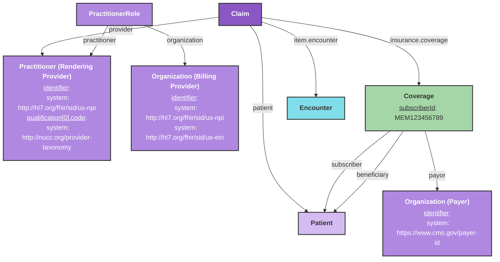

# Claim Submission

This guide explains how to model your FHIR resources for the Candid Health integration to submit professional medical claims.

## Overview

The Candid Health integration allows you to submit professional medical claims via the `$candid-submit-claim` [custom operation](/docs/api/fhir/operations/custom-operations) on the [Claim](/docs/api/fhir/resources/claim) resource. On success, the operation returns a [ClaimResponse](/docs/api/fhir/resources/claimresponse) saved to Medplum with Candid's encounter and claim identifiers written back for recordkeeping. Please [contact the Medplum team](mailto:support@medplum.com) to get access to this integration.

## Creating the Claim

The following diagram shows the resources involved in submitting a claim to Candid Health.



### Claim

| Field | Description | Required |
|-------|-------------|----------|
| `patient` | Reference to the Patient | Yes |
| `provider` | Reference to the rendering Practitioner | Yes |
| `created` | Date the claim was created (used as fallback service date) | Yes |
| `insurance[0].coverage` | Reference to the Coverage resource | Yes |
| `diagnosis` | Array of ICD-10-CM diagnoses with `sequence` (1-based) and `diagnosisCodeableConcept` | Yes |
| `item` | Array of service lines (see below) | Yes |

Each `Claim.item` (service line) requires:

| Field | Description | Required |
|-------|-------------|----------|
| `productOrService` | CPT code (system: `http://www.ama-assn.org/go/cpt`) | Yes |
| `servicedDate` | Date of service | Yes |
| `unitPrice` | Charge amount in USD | Yes |
| `quantity` | Number of units | Yes |
| `locationCodeableConcept` | Place of service code (system: `https://www.cms.gov/Medicare/Coding/place-of-service-codes`) | Yes |
| `encounter` | Reference to the Encounter resource | Yes |
| `diagnosisSequence` | Array of 1-based indices into `Claim.diagnosis` (up to 4) | Yes |
| `modifier` | CPT modifier codes | No |

### Patient

| Field | Description | Required |
|-------|-------------|----------|
| `name.family` | Last name | Yes |
| `name.given` | First name | Yes |
| `birthDate` | Date of birth | Yes |
| `gender` | `male`, `female`, `other`, or `unknown` | Yes |
| `address` | Home address with line, city, state, postalCode | Yes |

### Practitioner (Rendering Provider)

| Field | Description | Required |
|-------|-------------|----------|
| `identifier` | System must be `http://hl7.org/fhir/sid/us-npi` | Yes |
| `name` | Provider name | Yes |
| `qualification[0].code` | NUCC taxonomy code (system: `http://nucc.org/provider-taxonomy`, e.g. `207Q00000X` for Family Medicine) | Yes |

### Organization (Billing Provider)

The billing provider Organization is linked to the Practitioner via a `PractitionerRole` resource.

| Field | Description | Required |
|-------|-------------|----------|
| `identifier` | NPI identifier (system: `http://hl7.org/fhir/sid/us-npi`) | Yes |
| `identifier` | EIN/Tax ID (system: `http://hl7.org/fhir/sid/us-ein`) | Yes |
| `name` | Organization name | Yes |
| `address` | Organization address | Yes |

### Organization (Payer)

| Field | Description | Required |
|-------|-------------|----------|
| `identifier` | CMS payer ID (system: `https://www.cms.gov/payer-id`) | Yes |
| `name` | Payer name (used to look up the payer in Candid's network) | Yes |

### Coverage

| Field | Description | Required |
|-------|-------------|----------|
| `status` | Should be `active` | Yes |
| `subscriber` | Reference to the subscriber Patient | Yes |
| `beneficiary` | Reference to the beneficiary Patient | Yes |
| `subscriberId` | Insurance member ID | Yes |
| `payor` | Reference to the payer Organization | Yes |
| `relationship` | Patient's relationship to the subscriber (system: `http://terminology.hl7.org/CodeSystem/subscriber-relationship`, e.g. `self`, `spouse`, `child`) | Yes |
| `class` | Group number (type: `group`) and plan info | No |
| `period` | Coverage effective dates | No |

### Encounter

| Field | Description | Required |
|-------|-------------|----------|
| `identifier` | Unique encounter identifier (used as Candid's `externalId`) | Yes |
| `status` | Encounter status (e.g. `finished`) | Yes |
| `subject` | Reference to the Patient | Yes |
| `participant[0].individual` | Reference to the rendering Practitioner | Yes |
| `period.start` | Encounter start date/time | Yes |
| `period.end` | Encounter end date/time | No |

## Submitting the Claim

The `$candid-submit-claim` [custom operation](/docs/api/fhir/operations/custom-operations) on `Claim` submits the claim to Candid Health's API and returns a `ClaimResponse`. Invoke it in either of these ways:

- **Instance level** — on a stored Claim: `POST {base}/fhir/R4/Claim/{id}/$candid-submit-claim`
- **Type level** — with a `Claim` in the request body: `POST {base}/fhir/R4/Claim/$candid-submit-claim`

**Instance level** (after the `Claim` has been created and stored):

```ts
const claimResponse = await medplum.post(
  medplum.fhirUrl('Claim', claim.id, '$candid-submit-claim')
);
```

Or via the FHIR REST API:

```http
POST {base}/fhir/R4/Claim/{id}/$candid-submit-claim
```

On success, the operation returns a `ClaimResponse` resource saved to Medplum. The Candid encounter and claim IDs are written back onto both the `ClaimResponse` and the original `Claim` as identifiers:

```json
{
  "resourceType": "ClaimResponse",
  "status": "active",
  "outcome": "complete",
  "request": { "reference": "Claim/{id}" },
  "insurer": { "reference": "Organization/{payer-id}" },
  "identifier": [
    { "system": "https://candidhealth.com/claim-id", "value": "..." },
    { "system": "https://candidhealth.com/encounter-id", "value": "..." }
  ],
  "total": [
    {
      "category": { "coding": [{ "system": "http://terminology.hl7.org/CodeSystem/adjudication", "code": "submitted" }] },
      "amount": { "value": 175.00, "currency": "USD" }
    }
  ]
}
```

:::note[]
The operation is idempotent. If an active `ClaimResponse` already exists for the `Claim`, the bot returns it immediately without re-submitting to Candid.
:::

<details>
<summary>Example transaction Bundle (for creating all required resources)</summary>

```json
{
  "resourceType": "Bundle",
  "type": "transaction",
  "entry": [
    {
      "fullUrl": "urn:uuid:patient-1",
      "resource": {
        "resourceType": "Patient",
        "identifier": [{ "system": "http://hospital.example.org/patients", "value": "PAT-12345" }],
        "name": [{ "use": "official", "family": "Smith", "given": ["John", "Michael"] }],
        "gender": "male",
        "birthDate": "1985-03-15",
        "address": [{ "use": "home", "line": ["123 Main Street"], "city": "New York", "state": "NY", "postalCode": "10001" }]
      },
      "request": { "method": "POST", "url": "Patient" }
    },
    {
      "fullUrl": "urn:uuid:practitioner-1",
      "resource": {
        "resourceType": "Practitioner",
        "identifier": [{ "system": "http://hl7.org/fhir/sid/us-npi", "value": "1234567890" }],
        "name": [{ "use": "official", "family": "Johnson", "given": ["Sarah"], "prefix": ["Dr."] }],
        "qualification": [
          {
            "code": {
              "coding": [{ "system": "http://nucc.org/provider-taxonomy", "code": "207Q00000X", "display": "Family Medicine" }]
            }
          }
        ]
      },
      "request": { "method": "POST", "url": "Practitioner" }
    },
    {
      "fullUrl": "urn:uuid:organization-billing",
      "resource": {
        "resourceType": "Organization",
        "name": "Example Medical Group",
        "identifier": [
          { "system": "http://hl7.org/fhir/sid/us-npi", "value": "9876543210" },
          { "system": "http://hl7.org/fhir/sid/us-ein", "value": "12-3456789" }
        ],
        "address": [{ "line": ["456 Medical Center Drive"], "city": "New York", "state": "NY", "postalCode": "10002" }]
      },
      "request": { "method": "POST", "url": "Organization" }
    },
    {
      "fullUrl": "urn:uuid:practitioner-role-1",
      "resource": {
        "resourceType": "PractitionerRole",
        "practitioner": { "reference": "urn:uuid:practitioner-1" },
        "organization": { "reference": "urn:uuid:organization-billing" }
      },
      "request": { "method": "POST", "url": "PractitionerRole" }
    },
    {
      "fullUrl": "urn:uuid:organization-payer",
      "resource": {
        "resourceType": "Organization",
        "name": "Blue Cross Blue Shield",
        "identifier": [{ "system": "https://www.cms.gov/payer-id", "value": "13162" }],
        "type": [{ "coding": [{ "system": "http://terminology.hl7.org/CodeSystem/organization-type", "code": "ins", "display": "Insurance Company" }] }]
      },
      "request": { "method": "POST", "url": "Organization" }
    },
    {
      "fullUrl": "urn:uuid:coverage-1",
      "resource": {
        "resourceType": "Coverage",
        "status": "active",
        "subscriber": { "reference": "urn:uuid:patient-1" },
        "subscriberId": "MEM123456789",
        "beneficiary": { "reference": "urn:uuid:patient-1" },
        "relationship": { "coding": [{ "system": "http://terminology.hl7.org/CodeSystem/subscriber-relationship", "code": "self", "display": "Self" }] },
        "period": { "start": "2024-01-01", "end": "2024-12-31" },
        "payor": [{ "reference": "urn:uuid:organization-payer" }],
        "class": [{ "type": { "coding": [{ "system": "http://terminology.hl7.org/CodeSystem/coverage-class", "code": "group" }] }, "value": "GRP-ABC123" }]
      },
      "request": { "method": "POST", "url": "Coverage" }
    },
    {
      "fullUrl": "urn:uuid:encounter-1",
      "resource": {
        "resourceType": "Encounter",
        "identifier": [{ "system": "http://hospital.example.org/encounters", "value": "ENC-2024-06-15-001" }],
        "status": "finished",
        "class": { "system": "http://terminology.hl7.org/CodeSystem/v3-ActCode", "code": "AMB", "display": "ambulatory" },
        "subject": { "reference": "urn:uuid:patient-1" },
        "participant": [{ "individual": { "reference": "urn:uuid:practitioner-1" } }],
        "period": { "start": "2024-06-15T09:00:00Z", "end": "2024-06-15T09:30:00Z" }
      },
      "request": { "method": "POST", "url": "Encounter" }
    },
    {
      "fullUrl": "urn:uuid:claim-1",
      "resource": {
        "resourceType": "Claim",
        "status": "active",
        "use": "claim",
        "type": { "coding": [{ "system": "http://terminology.hl7.org/CodeSystem/claim-type", "code": "professional" }] },
        "patient": { "reference": "urn:uuid:patient-1" },
        "created": "2024-06-15T10:00:00Z",
        "provider": { "reference": "urn:uuid:practitioner-1" },
        "priority": { "coding": [{ "system": "http://terminology.hl7.org/CodeSystem/processpriority", "code": "normal" }] },
        "insurance": [{ "sequence": 1, "focal": true, "coverage": { "reference": "urn:uuid:coverage-1" } }],
        "diagnosis": [
          {
            "sequence": 1,
            "diagnosisCodeableConcept": { "coding": [{ "system": "http://hl7.org/fhir/sid/icd-10-cm", "code": "I10", "display": "Essential (primary) hypertension" }] }
          },
          {
            "sequence": 2,
            "diagnosisCodeableConcept": { "coding": [{ "system": "http://hl7.org/fhir/sid/icd-10-cm", "code": "E11.9", "display": "Type 2 diabetes mellitus without complications" }] }
          }
        ],
        "item": [
          {
            "sequence": 1,
            "productOrService": { "coding": [{ "system": "http://www.ama-assn.org/go/cpt", "code": "99213", "display": "Office or other outpatient visit, established patient, low complexity" }] },
            "servicedDate": "2024-06-15",
            "locationCodeableConcept": { "coding": [{ "system": "https://www.cms.gov/Medicare/Coding/place-of-service-codes", "code": "11", "display": "Office" }] },
            "quantity": { "value": 1 },
            "unitPrice": { "value": 150.00, "currency": "USD" },
            "encounter": [{ "reference": "urn:uuid:encounter-1" }],
            "diagnosisSequence": [1, 2]
          },
          {
            "sequence": 2,
            "productOrService": { "coding": [{ "system": "http://www.ama-assn.org/go/cpt", "code": "36415", "display": "Collection of venous blood by venipuncture" }] },
            "servicedDate": "2024-06-15",
            "locationCodeableConcept": { "coding": [{ "system": "https://www.cms.gov/Medicare/Coding/place-of-service-codes", "code": "11", "display": "Office" }] },
            "quantity": { "value": 1 },
            "unitPrice": { "value": 25.00, "currency": "USD" },
            "encounter": [{ "reference": "urn:uuid:encounter-1" }],
            "diagnosisSequence": [2]
          }
        ],
        "total": { "value": 175.00, "currency": "USD" }
      },
      "request": { "method": "POST", "url": "Claim" }
    }
  ]
}
```

</details>

## Candid Health Workflow

Once the operation is invoked, the bot runs the following steps:

1. **Encounter Creation** — The bot creates a Candid encounter with patient demographics, provider info, and all diagnoses. Candid returns an `encounterId` and `claimId`. On transient failures the bot retries up to 3 times; if the encounter already exists in Candid (identified by the FHIR `Encounter.id` as the external ID) it is fetched instead of re-created.
2. **Service Line Creation** — For each `Claim.item`, the bot creates a Candid service line with the CPT code, charge amount, and diagnosis pointers. This step is skipped if the encounter was recovered rather than freshly created to avoid duplicating service lines.
3. **ClaimResponse Creation** — The bot saves a `ClaimResponse` to Medplum with `outcome: complete` and writes the Candid `claim-id` and `encounter-id` back onto both the `ClaimResponse` and the original `Claim` as identifiers.

### Common Claim Status Values

| Status | Description |
|--------|-------------|
| `coded` | Claim has been coded and is ready for biller review |
| `biller_received` | Claim received by the biller |
| `waiting_for_provider` | Claim has blocking tasks requiring provider action (usually a contracting issue) |

## Related Resources

- [Candid Health API Documentation](https://docs.joincandidhealth.com/introduction/overview)
- [Billing Documentation](/docs/billing)
