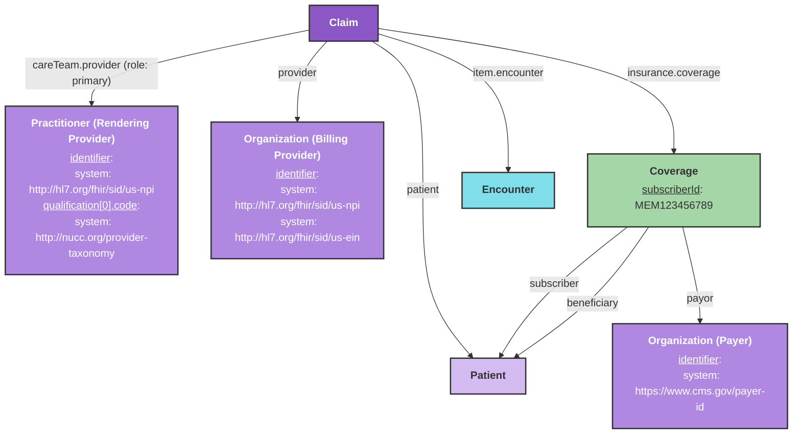

# Claim Submission

To submit a professional claim, your application needs to connect the patient, coverage, providers, and services in FHIR. This guide shows you how to prepare those resources, save the Claim, and submit it to Candid Health.

## Overview

The Candid Health integration allows you to submit professional medical claims via the `$candid-submit-claim` [custom operation](/docs/api/fhir/operations/custom-operations) on the [Claim](/docs/api/fhir/resources/claim) resource. The underlying bot is `send-to-candid`. On success, the operation returns a [ClaimResponse](/docs/api/fhir/resources/claimresponse) saved to Medplum with Candid's encounter and claim identifiers written back for recordkeeping. Please [contact the Medplum team](mailto:support@medplum.com) to get access to this integration.

## Creating the Claim

The following diagram shows the resources involved in submitting a claim to Candid Health.


```mermaid
flowchart TD
    Claim["<div style='text-align: center;'><strong>Claim</strong></div>"]

    Patient["<div style='text-align: center;'><strong>Patient</strong></div>"]

    Practitioner["<div style='text-align: center;'><strong>Practitioner (Rendering Provider)</strong></div><div style='border: 1px solid #333; padding: 4px; margin: 4px;'><u>identifier</u>:<br>  system: http://hl7.org/fhir/sid/us-npi<br><u>qualification[0].code</u>:<br>  system: http://nucc.org/provider-taxonomy</div>"]

    BillingOrg["<div style='text-align: center;'><strong>Organization (Billing Provider)</strong></div><div style='border: 1px solid #333; padding: 4px; margin: 4px;'><u>identifier</u>:<br>  system: http://hl7.org/fhir/sid/us-npi<br>  system: http://hl7.org/fhir/sid/us-ein</div>"]

    PayerOrg["<div style='text-align: center;'><strong>Organization (Payer)</strong></div><div style='border: 1px solid #333; padding: 4px; margin: 4px;'><u>identifier</u>:<br>  system: https://www.cms.gov/payer-id</div>"]

    Coverage["<div style='text-align: center;'><strong>Coverage</strong></div><div style='border: 1px solid #333; padding: 4px; margin: 4px;'><u>subscriberId</u>: MEM123456789</div>"]

    Encounter["<div style='text-align: center;'><strong>Encounter</strong></div>"]

    Claim -->|patient| Patient
    Claim -->|provider| BillingOrg
    Claim -->|"careTeam.provider (role: primary)"| Practitioner
    Claim -->|insurance.coverage| Coverage
    Claim -->|item.encounter| Encounter

    Coverage -->|subscriber| Patient
    Coverage -->|beneficiary| Patient
    Coverage -->|payor| PayerOrg

    classDef claim fill:#8B57C4,stroke:#333,stroke-width:2px,color:#fff
    classDef organization fill:#B088E1,stroke:#333,stroke-width:2px,color:#fff
    classDef patient fill:#D4BCF2,stroke:#333,stroke-width:2px
    classDef coverage fill:#A5D6A7,stroke:#333,stroke-width:2px
    classDef encounter fill:#80DEEA,stroke:#333,stroke-width:2px

    class Claim claim
    class BillingOrg,PayerOrg organization
    class Patient patient
    class Coverage coverage
    class Encounter encounter
    class Practitioner organization
```

### Claim

| Field | Description | Required |
|-------|-------------|----------|
| `patient` | Reference to the Patient | Yes |
| `provider` | Reference to the billing provider: an Organization for organization billing (the common case), or a Practitioner for individual billing | Yes |
| `careTeam` | Care team member with role `primary` (system: `http://terminology.hl7.org/CodeSystem/claimcareteamrole`) referencing the rendering Practitioner | Yes* |
| `careTeam` | Optional: care team member with role `referral` referencing the referring Practitioner. Required by some payers (e.g. Medicare MNT). The Practitioner can be a contained resource with just a name and NPI — no stored resource needed for external referrers. | No |
| `billablePeriod.start` | Preferred date of service when service lines carry no individual `servicedDate` | No |
| `created` | Fallback date of service when `billablePeriod.start` is also absent | No |
| `insurance[0].coverage` | Reference to the Coverage resource | Yes |
| `diagnosis` | Array of ICD-10-CM diagnoses with `sequence` (1-based) and `diagnosisCodeableConcept` | Yes |
| `item` | Array of service lines (see below) | Yes |

\* The rendering Practitioner is resolved in this order: the `careTeam` member with role `primary`, then the first `careTeam` member referencing a Practitioner, then `Claim.provider` itself when it is a Practitioner (individual billing). Contained resources (e.g. `"reference": "#rendering-practitioner"`) are supported for both `provider` and `careTeam.provider`.

Each `Claim.item` (service line) requires:

| Field | Description | Required |
|-------|-------------|----------|
| `productOrService` | CPT code (system: `http://www.ama-assn.org/go/cpt`) | Yes |
| `servicedDate` | Date of service for this line. Falls back to `Claim.billablePeriod.start`, then `Claim.created` | No |
| `unitPrice` | Charge amount in USD. Optional if a chargemaster entry exists in Candid for the CPT code — Candid will use the chargemaster amount and ignore this value if present. | No |
| `quantity` | Number of units | Yes |
| `locationCodeableConcept` | Place of service code (system: `https://www.cms.gov/Medicare/Coding/place-of-service-codes`). If omitted, the encounter defaults to `11` (Office). | No |
| `encounter` | Reference to the Encounter resource | Yes |
| `diagnosisSequence` | Array of 1-based indices into `Claim.diagnosis` (up to 4) | Yes |
| `modifier` | CPT modifier codes | No |

### Patient

| Field | Description | Required |
|-------|-------------|----------|
| `name.family` | Last name | Yes |
| `name.given` | First name | Yes |
| `birthDate` | Date of birth | Yes |
| `gender` | `male`, `female`, `other`, or `unknown` | Yes |
| `address` | Home address with line, city, state, postalCode | Yes |

### Practitioner (Rendering Provider)

The rendering provider is referenced from `Claim.careTeam` (role `primary`).

| Field | Description | Required |
|-------|-------------|----------|
| `identifier` | System must be `http://hl7.org/fhir/sid/us-npi` | Yes |
| `name` | Provider name | Yes |
| `qualification[0].code` | NUCC taxonomy code (system: `http://nucc.org/provider-taxonomy`; use the rendering provider's verified taxonomy) | Yes |

### Organization (Billing Provider)

The billing provider Organization is referenced directly from `Claim.provider`. For individual billing, `Claim.provider` may instead reference a Practitioner, in which case no billing Organization is needed.

| Field | Description | Required |
|-------|-------------|----------|
| `identifier` | NPI identifier (system: `http://hl7.org/fhir/sid/us-npi`) | Yes |
| `identifier` | EIN/Tax ID (system: `http://hl7.org/fhir/sid/us-ein`) | Yes |
| `name` | Organization name | Yes |
| `address` | Organization address | Yes |

### Organization (Payer)

The bot resolves the payer in Candid's directory using these identifiers in priority order:

| Priority | Identifier | System | Behavior |
|----------|-----------|--------|----------|
| 1 | Candid payer UUID | `https://www.joincandidhealth.com/payer-uuid` | Direct lookup — skips name search entirely |
| 2 | CMS payer ID | `https://www.cms.gov/payer-id` | Name search filtered by ID |
| 3 | CHC payer ID | `https://www.joincandidhealth.com/chc-payerid` | Name search filtered by ID |

At least one identifier is required. `name` is also required (used in the name search for options 2 and 3). The bot hard-fails if no match is found in Candid's directory.

### Coverage (Insured)

For insured claims, use the `CandidCoverage` profile. `Coverage.payor` must reference a payer Organization.

| Field | Description | Required |
|-------|-------------|----------|
| `status` | Should be `active` | Yes |
| `subscriber` | Reference to the subscriber Patient | Yes |
| `beneficiary` | Reference to the beneficiary Patient | Yes |
| `subscriberId` | Insurance member ID | Yes |
| `payor` | Reference to the payer Organization | Yes |
| `relationship` | Patient's relationship to the subscriber (system: `http://terminology.hl7.org/CodeSystem/subscriber-relationship`, e.g. `self`, `spouse`, `child`) | Yes |
| `class` | Group number (type: `group`) and plan info | No |
| `period` | Coverage effective dates | No |

### Coverage (Self-Pay)

For self-pay claims, set `Coverage.payor` to reference the `Patient` directly. Do **not** apply the `CandidCoverage` profile to self-pay Coverage resources. No `subscriberId` is required.

```json
{
  "resourceType": "Coverage",
  "status": "active",
  "beneficiary": { "reference": "Patient/{id}" },
  "payor": [{ "reference": "Patient/{id}" }]
}
```

The bot detects self-pay when `payor` references a `Patient` or `RelatedPerson`, skips payer lookup, and submits the claim to Candid with `responsibleParty: SELF_PAY`.

### Encounter

| Field | Description | Required |
|-------|-------------|----------|
| `id` | ID of the persisted Encounter, used as Candid's `externalId` | Yes |
| `status` | Encounter status (e.g. `finished`) | Yes |
| `subject` | Reference to the Patient | Yes |
| `participant[0].individual` | Reference to the rendering Practitioner | Yes |
| `period.start` | Encounter start date/time | Yes |
| `period.end` | Encounter end date/time | No |

## send-to-candid

### Purpose

Submit a persisted professional Claim to Candid and save its submission response.

### Trigger and input

The `$candid-submit-claim` [custom operation](/docs/api/fhir/operations/custom-operations) on `Claim` submits the claim to Candid Health's API and returns a `ClaimResponse`. Invoke it in either of these ways:

- **Instance level** — on a stored Claim: `POST {base}/fhir/R4/Claim/{id}/$candid-submit-claim`
- **Type level** — with a previously persisted `Claim`, including its `id`, in the request body: `POST {base}/fhir/R4/Claim/$candid-submit-claim`

Both forms require a persisted Claim. The bot reads the current stored contents using its ID; edits supplied only in the request body are not submitted. Save changes to the Claim before invoking the operation.

**Instance level** (after the `Claim` has been created and stored):

This TypeScript fragment assumes `medplum` is an authenticated `MedplumClient` from `@medplum/core`, authorized to run the operation, and `claim` is the saved Claim with an ID. Replace `{base}` and IDs in the HTTP and JSON examples with your server URL and stored resource IDs.

```ts
const claimResponse = await medplum.post(
  medplum.fhirUrl('Claim', claim.id, '$candid-submit-claim')
);
```

Or via the FHIR REST API:

```http
POST {base}/fhir/R4/Claim/{id}/$candid-submit-claim
```

### Result and resource changes

On success, the operation returns a `ClaimResponse` resource saved to Medplum. The Candid encounter and claim IDs are written back onto both the `ClaimResponse` and the original `Claim` as identifiers. This abbreviated response highlights those fields; it is not a complete resource to submit:

```json
{
  "resourceType": "ClaimResponse",
  "status": "active",
  "outcome": "complete",
  "request": { "reference": "Claim/{id}" },
  "insurer": { "reference": "Organization/{payer-id}" },
  "identifier": [
    { "system": "https://candidhealth.com/claim-id", "value": "..." },
    { "system": "https://candidhealth.com/encounter-id", "value": "..." }
  ],
  "total": [
    {
      "category": { "coding": [{ "system": "http://terminology.hl7.org/CodeSystem/adjudication", "code": "submitted" }] },
      "amount": { "value": 175.00, "currency": "USD" }
    }
  ]
}
```

### Failure and retry behavior

The bot reuses a successful, correlated submission response: an active `ClaimResponse` with `outcome: complete`, a `request` referencing this Claim, and a Candid claim identifier matching the Claim's identifier when present (otherwise a response carrying a Candid claim identifier). An arbitrary active ClaimResponse does not prevent submission. Submission completion means Candid accepted the submission, not that the payer paid it.

Correct validation errors in the stored resources before retrying. If Candid reports a duplicate encounter external ID, the bot attempts to recover the existing encounter and claim before saving their correlation in Medplum. Failed submissions also attempt to mark the Claim's processor status as `submission-failed` and return an error. Follow [remittance polling](/docs/integration/candid/remittance-polling) for subsequent claim status and [patient billing](/docs/integration/candid/patient-billing) for collectible patient responsibility.

<details>
<summary>Transaction Bundle template: replace identifiers and verify terminology before use</summary>

This incomplete template shows how the resources reference each other in one transaction. Replace synthetic patient details, provider and payer identifiers, and dates with your test data. Replace every `REPLACE_WITH_VERIFIED_*` value with a code and display checked against your approved terminology source. Clinical codes are deliberately left unspecified. Do not submit this template unchanged.

The `urn:uuid` values link entries within this Bundle. Confirm that your project supports [transaction Bundles](/docs/fhir-datastore/fhir-batch-requests#batches-vs-transactions). Submit the transaction first, then use the persisted Claim ID from its response to invoke the submission operation.

```json
{
  "resourceType": "Bundle",
  "type": "transaction",
  "entry": [
    {
      "fullUrl": "urn:uuid:00000000-0000-4000-8000-000000000001",
      "resource": {
        "resourceType": "Organization",
        "meta": {
          "profile": ["https://medplum.com/profiles/integrations/candid-health/StructureDefinition/candid-billing-organization"]
        },
        "identifier": [
          { "system": "http://hl7.org/fhir/sid/us-npi", "value": "1234567890" },
          { "system": "http://hl7.org/fhir/sid/us-ein", "value": "12-3456789" }
        ],
        "name": "Test Medical Practice LLC",
        "type": [{ "coding": [{ "system": "http://terminology.hl7.org/CodeSystem/organization-type", "code": "prov", "display": "Healthcare Provider" }] }],
        "address": [{ "use": "work", "line": ["456 Medical Center Drive", "Suite 100"], "city": "Boston", "state": "MA", "postalCode": "02101" }]
      },
      "request": { "method": "POST", "url": "Organization", "ifNoneExist": "identifier=http://hl7.org/fhir/sid/us-npi|1234567890" }
    },
    {
      "fullUrl": "urn:uuid:00000000-0000-4000-8000-000000000002",
      "resource": {
        "resourceType": "Patient",
        "meta": {
          "profile": ["https://medplum.com/profiles/integrations/candid-health/StructureDefinition/candid-patient"]
        },
        "identifier": [{ "system": "http://hospital.example.org/patients", "value": "PAT-TEST-001" }],
        "name": [{ "use": "official", "family": "TestPatient", "given": ["Jane", "Marie"] }],
        "gender": "female",
        "birthDate": "1990-07-22",
        "address": [{ "use": "home", "line": ["789 Oak Avenue", "Apt 2A"], "city": "Cambridge", "state": "MA", "postalCode": "02139" }]
      },
      "request": { "method": "POST", "url": "Patient" }
    },
    {
      "fullUrl": "urn:uuid:00000000-0000-4000-8000-000000000003",
      "resource": {
        "resourceType": "Practitioner",
        "meta": {
          "profile": ["https://medplum.com/profiles/integrations/candid-health/StructureDefinition/candid-practitioner"]
        },
        "identifier": [{ "system": "http://hl7.org/fhir/sid/us-npi", "value": "1234567890" }],
        "name": [{ "use": "official", "family": "Johnson", "given": ["Sarah", "M"], "prefix": ["Dr."] }],
        "qualification": [
          {
            "code": {
              "coding": [{ "system": "http://nucc.org/provider-taxonomy", "code": "REPLACE_WITH_VERIFIED_TAXONOMY", "display": "REPLACE_WITH_VERIFIED_DISPLAY" }]
            }
          }
        ]
      },
      "request": { "method": "POST", "url": "Practitioner", "ifNoneExist": "identifier=http://hl7.org/fhir/sid/us-npi|1234567890" }
    },
    {
      "fullUrl": "urn:uuid:00000000-0000-4000-8000-000000000004",
      "resource": {
        "resourceType": "Organization",
        "meta": {
          "profile": ["https://medplum.com/profiles/integrations/candid-health/StructureDefinition/candid-payer-organization"]
        },
        "identifier": [{ "system": "https://www.cms.gov/payer-id", "value": "13162" }],
        "name": "1199SEIU Family of Funds",
        "type": [{ "coding": [{ "system": "http://terminology.hl7.org/CodeSystem/organization-type", "code": "ins", "display": "Insurance Company" }] }]
      },
      "request": { "method": "POST", "url": "Organization", "ifNoneExist": "identifier=https://www.cms.gov/payer-id|13162" }
    },
    {
      "fullUrl": "urn:uuid:00000000-0000-4000-8000-000000000005",
      "resource": {
        "resourceType": "Coverage",
        "meta": {
          "profile": ["https://medplum.com/profiles/integrations/candid-health/StructureDefinition/candid-coverage"]
        },
        "status": "active",
        "type": { "coding": [{ "system": "http://terminology.hl7.org/CodeSystem/v3-ActCode", "code": "HIP", "display": "Health Insurance Plan Policy" }] },
        "subscriber": { "reference": "urn:uuid:00000000-0000-4000-8000-000000000002" },
        "subscriberId": "MEM-TEST-001",
        "beneficiary": { "reference": "urn:uuid:00000000-0000-4000-8000-000000000002" },
        "relationship": { "coding": [{ "system": "http://terminology.hl7.org/CodeSystem/subscriber-relationship", "code": "self", "display": "Self" }] },
        "payor": [{ "reference": "urn:uuid:00000000-0000-4000-8000-000000000004" }],
        "class": [{ "type": { "coding": [{ "system": "http://terminology.hl7.org/CodeSystem/coverage-class", "code": "group" }] }, "value": "GRP-TEST-123", "name": "Test Employer Group" }]
      },
      "request": { "method": "POST", "url": "Coverage" }
    },
    {
      "fullUrl": "urn:uuid:00000000-0000-4000-8000-000000000006",
      "resource": {
        "resourceType": "Encounter",
        "meta": {
          "profile": ["https://medplum.com/profiles/integrations/candid-health/StructureDefinition/candid-encounter"]
        },
        "identifier": [{ "system": "http://hospital.example.org/encounters", "value": "ENC-TEST-001" }],
        "status": "finished",
        "class": { "system": "http://terminology.hl7.org/CodeSystem/v3-ActCode", "code": "AMB", "display": "ambulatory" },
        "subject": { "reference": "urn:uuid:00000000-0000-4000-8000-000000000002" },
        "participant": [{ "individual": { "reference": "urn:uuid:00000000-0000-4000-8000-000000000003" } }],
        "period": { "start": "2025-01-15", "end": "2025-01-15" }
      },
      "request": { "method": "POST", "url": "Encounter" }
    },
    {
      "fullUrl": "urn:uuid:00000000-0000-4000-8000-000000000007",
      "resource": {
        "resourceType": "Claim",
        "meta": {
          "profile": ["https://medplum.com/profiles/integrations/candid-health/StructureDefinition/candid-claim"]
        },
        "status": "active",
        "use": "claim",
        "type": { "coding": [{ "system": "http://terminology.hl7.org/CodeSystem/claim-type", "code": "professional", "display": "Professional" }] },
        "patient": { "reference": "urn:uuid:00000000-0000-4000-8000-000000000002" },
        "created": "2025-01-15T10:00:00Z",
        "provider": { "reference": "urn:uuid:00000000-0000-4000-8000-000000000001" },
        "careTeam": [
          {
            "sequence": 1,
            "provider": { "reference": "urn:uuid:00000000-0000-4000-8000-000000000003" },
            "role": { "coding": [{ "system": "http://terminology.hl7.org/CodeSystem/claimcareteamrole", "code": "primary" }] }
          }
        ],
        "priority": { "coding": [{ "system": "http://terminology.hl7.org/CodeSystem/processpriority", "code": "normal" }] },
        "insurance": [{ "sequence": 1, "focal": true, "coverage": { "reference": "urn:uuid:00000000-0000-4000-8000-000000000005" } }],
        "diagnosis": [
          {
            "sequence": 1,
            "diagnosisCodeableConcept": { "coding": [{ "system": "http://hl7.org/fhir/sid/icd-10-cm", "code": "REPLACE_WITH_VERIFIED_CODE", "display": "REPLACE_WITH_VERIFIED_DISPLAY" }] },
            "type": [{ "coding": [{ "system": "http://terminology.hl7.org/CodeSystem/ex-diagnosistype", "code": "principal" }] }]
          },
          {
            "sequence": 2,
            "diagnosisCodeableConcept": { "coding": [{ "system": "http://hl7.org/fhir/sid/icd-10-cm", "code": "REPLACE_WITH_VERIFIED_CODE", "display": "REPLACE_WITH_VERIFIED_DISPLAY" }] }
          }
        ],
        "item": [
          {
            "sequence": 1,
            "diagnosisSequence": [1, 2],
            "productOrService": { "coding": [{ "system": "http://www.ama-assn.org/go/cpt", "code": "REPLACE_WITH_VERIFIED_CODE", "display": "REPLACE_WITH_VERIFIED_DISPLAY" }] },
            "servicedDate": "2025-01-15",
            "locationCodeableConcept": { "coding": [{ "system": "https://www.cms.gov/Medicare/Coding/place-of-service-codes", "code": "11", "display": "Office" }] },
            "quantity": { "value": 1 },
            "unitPrice": { "value": 125.00, "currency": "USD" },
            "net": { "value": 125.00, "currency": "USD" },
            "encounter": [{ "reference": "urn:uuid:00000000-0000-4000-8000-000000000006" }]
          }
        ],
        "total": { "value": 125.00, "currency": "USD" }
      },
      "request": { "method": "POST", "url": "Claim" }
    }
  ]
}
```

</details>

## Candid Health Workflow

Once the operation is invoked, the bot runs the following steps:

1. **Encounter Creation** — The bot creates a Candid encounter with patient demographics, provider info, and all diagnoses. Candid returns an `encounterId` and `claimId`. On transient failures the bot retries up to 3 times; if the encounter already exists in Candid (identified by the FHIR `Encounter.id` as the external ID) it is fetched instead of re-created.
2. **Service Lines** — Each `Claim.item` is mapped to a service line with its CPT code, charge amount, and diagnosis pointers in the encounter creation request. Recovery reuses the existing encounter rather than adding duplicate service lines.
3. **ClaimResponse Creation** — The bot saves a `ClaimResponse` to Medplum with `outcome: complete` and writes the Candid `claim-id` and `encounter-id` back onto both the `ClaimResponse` and the original `Claim` as identifiers.
4. **Debug Documents** — The bot stores the outgoing Candid encounter request and the raw Candid response as `DocumentReference` resources for troubleshooting. Each document is linked to the originating Claim (via `context.related`) and Patient (via `subject`). Query them with:
   ```
   GET {base}/fhir/R4/DocumentReference?type=https://candidhealth.com/document-type|encounter-request
   GET {base}/fhir/R4/DocumentReference?type=https://candidhealth.com/document-type|encounter-response
   ```

### Common Claim Status Values

| Status | Description |
|--------|-------------|
| `coded` | Claim has been coded and is ready for biller review |
| `biller_received` | Claim received by the biller |
| `waiting_for_provider` | Claim has blocking tasks requiring provider action (usually a contracting issue) |

## Related Resources

- [Candid Health API Documentation](https://docs.joincandidhealth.com/introduction/overview)
- [Billing Documentation](/docs/billing)
