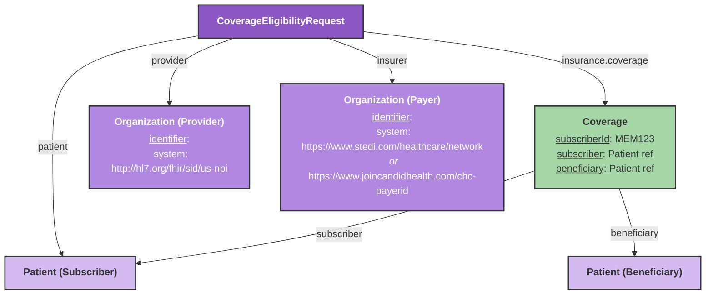

# Eligibility Check

Before a visit, your team needs to know whether the patient's coverage is active and which benefits the payer reports. This guide shows you how to request an eligibility check through Candid Health and read the response in Medplum.

[Contact Medplum](mailto:support@medplum.com) for integration access. You need customer Candid credentials, the pre-encounter API base URL, and the Patient, Coverage, and Organization resources described below.

## Overview

The eligibility check integration exposes a `$candid-check-eligibility` [custom operation](/docs/api/fhir/operations/custom-operations) on the [CoverageEligibilityRequest](/docs/api/fhir/resources/coverageeligibilityrequest) resource. It performs a **real-time, pre-encounter** eligibility check routed through Stedi, and returns a [CoverageEligibilityResponse](/docs/api/fhir/resources/coverageeligibilityresponse) with the patient's benefit details mapped to FHIR.

:::note[Pre-encounter timing]
Run the check before the visit so your team has time to review inactive coverage or correct plan information with the patient. Use the returned benefits as payer-reported information; this check does not determine the final patient balance collected by the billing bots.
:::

## Required Resources



### CoverageEligibilityRequest

| Field | Description | Required |
|-------|-------------|----------|
| `patient` | Reference to the beneficiary Patient | Yes |
| `provider` | Reference to the provider Organization (must have NPI) | Yes |
| `insurer` | Reference to the payer Organization (must have Stedi or CHC payer ID) | Yes |
| `insurance[0].coverage` | Reference to the Coverage resource | Yes |
| `servicedDate` | Date of service for the eligibility check | No |
| `servicedPeriod.start` | Alternative to `servicedDate` | No |
| `item[].category` | X12 service type code to check (system: `https://x12.org/codes/service-type-codes`). Defaults to `30` (Health Benefit Plan Coverage) when omitted. | No |

### Coverage

| Field | Description | Required |
|-------|-------------|----------|
| `subscriber` | Reference to the subscriber Patient | Yes |
| `beneficiary` | Reference to the beneficiary Patient | Yes |
| `subscriberId` | Insurance member ID | Yes |
| `payor` | Reference to the payer Organization | Yes |

If subscriber and beneficiary are different people (e.g. a child on a parent's plan), both must be populated and the bot will include a `dependent` field in the eligibility request.

### Organization (Provider)

| Field | Description | Required |
|-------|-------------|----------|
| `identifier` | NPI (system: `http://hl7.org/fhir/sid/us-npi`) | Yes |
| `name` | Organization name | Yes |

### Organization (Payer)

The payer identifier system for eligibility checks differs from claim submission — this API routes through Stedi, so use the Stedi payer network ID when available:

| Priority | Identifier | System |
|----------|-----------|--------|
| 1 | Stedi payer network ID | `https://www.stedi.com/healthcare/network` |
| 2 | Candid CHC payer ID | `https://www.joincandidhealth.com/chc-payerid` |

## Running a Check

The following TypeScript fragment assumes an authenticated `MedplumClient` from `@medplum/core` named `medplum`, authorized to invoke the operation. `request` is your stored `CoverageEligibilityRequest` with an ID. Invoke the operation against that resource:

```ts
const response = await medplum.post(
  medplum.fhirUrl('CoverageEligibilityRequest', request.id, '$candid-check-eligibility')
);
```

Or call the type-level operation with a `CoverageEligibilityRequest` in the request body. Replace `{base}` with your Medplum server URL:

```http
POST {base}/fhir/R4/CoverageEligibilityRequest/$candid-check-eligibility
```

## Response

On success the operation returns a `CoverageEligibilityResponse` saved to Medplum with coverage status, benefit details, and plan information mapped from the Stedi 271 response. A raw snapshot of the full Candid response is also stored as a `DocumentReference` (identifier system: `https://candidhealth.com/eligibility-check`) for debugging.

The abbreviated response below illustrates benefit fields; it is not a complete FHIR resource to submit. Replace brace-delimited IDs with the IDs of your stored resources.

```json
{
  "resourceType": "CoverageEligibilityResponse",
  "status": "active",
  "purpose": ["benefits"],
  "patient": { "reference": "Patient/{id}" },
  "created": "2025-01-15",
  "insurer": { "reference": "Organization/{payer-id}" },
  "insurance": [
    {
      "coverage": { "reference": "Coverage/{id}" },
      "inforce": true,
      "item": [
        {
          "category": { "coding": [{ "code": "30", "display": "Health Benefit Plan Coverage" }] },
          "benefit": [
            { "type": { "text": "CoinsurancePercent" }, "allowedUnsignedInt": 20 }
          ]
        }
      ]
    }
  ]
}
```

The top-level `status` reflects the eligibility outcome:

| Value | Meaning |
|-------|---------|
| `active` | Coverage confirmed active |
| `cancelled` | Coverage not active or inactive |
| `entered-in-error` | Payer returned errors (check the raw DocumentReference snapshot) |

## Staging Mock Scenarios

Candid staging supports mock eligibility checks using specific magic values — no real payer is contacted. Mocks require provider NPI `1999999984`.

| Scenario | Payer ID | Subscriber | Member ID | Result |
|----------|----------|------------|-----------|--------|
| Active coverage | `60054` (Aetna) | Jane Doe, DOB `2004-04-04` | `AETNA12345` | Active |
| Payer unreachable | `87726` (UHC) | DOB `1970-01-01` | `UHCAAA42` | AAA 42 error |
| Missing subscriber ID | `87726` (UHC) | DOB `1990-01-01` | `UHCAAA72` | AAA 72 error |
| Missing subscriber name | `87726` (UHC) | DOB `1990-01-01` | `UHCAAA73` | AAA 73 error |
| Subscriber not found | `87726` (UHC) | DOB `1990-01-01` | `UHCAAA75` | AAA 75 error |

## Related Resources

- [Candid Health Eligibility API Reference](https://docs.joincandidhealth.com/api-reference/pre-encounter/eligibility-checks)
- [Claim Submission](/docs/integration/candid/claim-submission)
- [Billing Documentation](/docs/billing)
