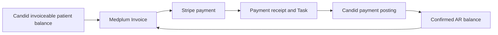

# Patient billing

After Candid determines what a patient owes, you need an Invoice your portal can collect and a way to record the payment back in Candid. This guide explains the two background bots that keep those records in sync.

Candid's patient accounts receivable (AR) data reports the remaining patient balance and whether it is ready to invoice. A balance is **invoiceable** when Candid makes it eligible for patient billing; submitting a Claim alone does not establish that eligibility.

## Before you start

[Contact Medplum](mailto:support@medplum.com) for access and availability. Confirm these prerequisites with your integration team:

- Candid API credentials and base URL, with access to patient AR inventory and itemization.
- Claims and Patients linked to the correct Candid records through [claim submission](/docs/integration/candid/claim-submission).
- Customer-owned Cron resources, which schedule the bots under the appropriate customer identity.
- For payment posting, access to Candid's patient payment API and a **customer-approved payment source** configured as `CANDID_PATIENT_PAYMENT_SOURCE`. Confirm this source before enabling posting.

## Billing flow

[Stripe Checkout](/docs/integration/stripe/checkout-and-payment-status) collects the full eligible patient responsibility reported by Candid. Stripe does not calculate insurance percentages.

- **Full self-pay:** For a $100 service that Candid reports as an invoiceable $100 patient balance, the bot issues a $100 Invoice and Stripe collects $100. After confirmation, the payment is posted to Candid; a later AR refresh confirms the remaining balance, normally $0.
- **$95 insurance / $5 patient:** For a $100 service where Candid reports $95 covered by insurance and an invoiceable $5 patient responsibility, the bot issues a $5 patient Invoice and Stripe collects $5. It does not charge $100 or infer a 5% share. After posting, AR confirms the remaining patient balance.

### Read the Invoice and current balance separately

When you display a bill, distinguish three values:

- **Issued totals:** `Invoice.totalNet` and `totalGross` preserve the amount originally invoiced.
- **Current source balance:** `balanceCents` reports the remaining amount from Candid, which can change after payment or a correction.
- **Reconciliation state:** `current`, `pending`, or `review` indicates whether payment processing still needs work.

The integration stores the latter two as JSON in the `valueString` of the `https://medplum.com/fhir/StructureDefinition/billing-state` extension. Its `balanceCents`, `invoiceable`, `sourceUpdatedAt`, `reconciliation`, `holdReason`, `pendingReceiptIds`, and `activeCheckout` properties are **integration conventions, not standard Invoice fields**.

### Follow the payment receipt

A confirmed processor payment is recorded as a patient-linked Basic receipt using the `https://medplum.com/fhir/StructureDefinition/payment-receipt-data` extension. The receipt contains Invoice and Patient references, processor transaction identity, amount, and posting state. A reconciliation Task uses `focus` to reference that Basic and `for` to reference the Patient; `pendingReceiptIds` contains receipt references such as `Basic/{receipt-id}`. These relationships form the shared billing contract used by [Stripe](/docs/integration/stripe).

Stripe confirmation updates Medplum promptly through [webhook processing](/docs/integration/stripe/webhooks-and-reconciliation): an issued Invoice becomes `balanced`, and reconciliation becomes `pending` unless already under review. The source balance can still show the previous amount. Candid posting and AR confirmation remain asynchronous; neither returning from Checkout nor a completed posting Task alone proves that Candid AR is current.

## candid-sync-patient-balances

### Purpose

Read Candid patient AR inventory and itemization, determine invoiceability, and maintain the current patient Invoice for each correlated claim.

### Trigger and input

A customer-owned Cron invokes the bot with its Cron resource as input. Its project must match the executing customer project. There is no application-supplied amount or Invoice input. The bot resumes its saved inventory cursor and also refreshes existing collectible balances and pending receipts during maintenance.

### Result and resource changes

For an eligible obligation, the bot conditionally creates an issued Invoice with patient references, Candid claim correlation, itemized patient responsibility, and billing state. It saves source snapshots and the current Invoice reference in integration records. Unchanged obligations refresh their current billing state without rewriting issued totals.

The return value is `{ "processed": 12 }`, optionally with `"stopped": "busy"`, `"deadline"`, or `"upstream"`. `processed` counts successful inventory or maintenance synchronizations, not newly created Invoices.

After a receipt is posted, this bot checks whether Candid AR itemization reflects its payment identity. Only confirmed receipts are removed from the pending list. Once outstanding work and holds are resolved, reconciliation returns to `current`; a nonpositive balance marks the Invoice `balanced`.

### Failure and retry behavior

Saved pages, checkpoints, conditional writes, and leases make retries resumable. An inventory failure retains the exact row for retry and creates a review Task. Maintenance failures create review Tasks and allow other claims to proceed, with another attempt on a later sweep.

#### Corrected balances and review holds

A corrected patient balance can require a replacement Invoice: once in-flight work is resolved, an issued or draft predecessor is cancelled, while a previously balanced Invoice keeps its history and is marked superseded in billing state. A new eligible balance gets a new Invoice with a predecessor reference. Issued totals are not silently rewritten.

An active Checkout, unresolved receipt, or review hold prevents replacement or renewed collection until reconciled. Source changes during in-flight work can set `holdReason: source-obligation-changed`. Explicit review holds remain for operator resolution; repeatedly refreshing AR does not automatically clear them. Applications should resolve the current Invoice rather than assume an old Invoice reference remains payable.

## candid-reconcile-patient-payments

### Purpose

Consume the shared payment receipts and Tasks and post confirmed payments to the corresponding Candid claim.

### Trigger and input

A customer-owned Cron supplies its Cron resource in the executing customer project. Each run considers up to 50 requested or in-progress payment reconciliation Tasks within a bounded run time. Tasks must reference a receipt whose Patient and currency match its Invoice. Only receipts for the `candid-health` billing source are posted, after the Invoice records the pending receipt handoff.

### Result and resource changes

The bot creates a Candid patient payment allocated to the source claim, using the receipt amount and a stable source transaction identifier. It stores Candid's payment ID on the receipt, changes the receipt state to `posted`, and completes the Task with the Candid transaction ID in its output. It leaves AR confirmation to `candid-sync-patient-balances`.

The return value is `{ "processed": 4, "failed": 0 }`. `processed` counts Task attempts that return without error, including skipped or deferred work; it is not a count of newly posted payments.

### Failure and retry behavior

Retries first look up the stable source ID in Candid and verify amount, patient, and claim allocation before reusing a payment. If a previous POST has an unknown outcome and lookup cannot recover it, the receipt goes to review rather than issuing another payment. Failed Tasks remain available for retry from saved receipt state.

Refund receipts require manual Candid reconciliation. Review cases mark the receipt `review`, put the Task `on-hold`, and hold collection on the Invoice. Resolve the financial discrepancy before reopening collection; a processor refund alone does not confirm Candid's new AR balance.
