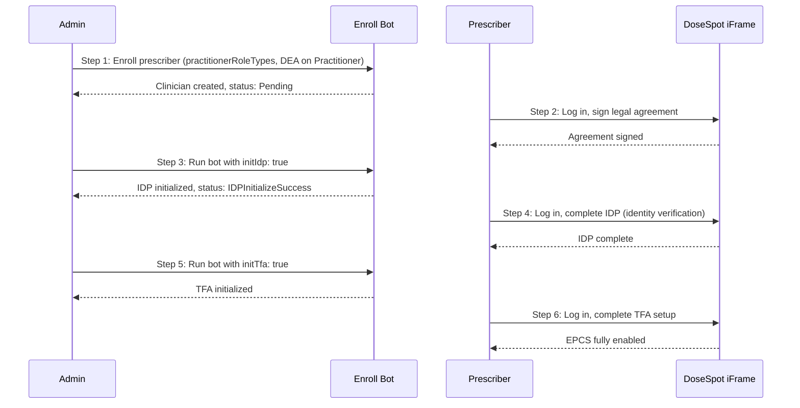

import Tabs from '@theme/Tabs';
import TabItem from '@theme/TabItem';

# Prescriber Enrollment

This guide explains how to enroll a new prescriber in DoseSpot via the Medplum **Enroll Prescriber Bot**, including the full workflow for enabling Electronic Prescriptions for Controlled Substances (EPCS).

:::note Prerequisites
The user executing the bot must:

1. Be an admin in your project (`ProjectMembership.admin`)
2. Already have access to DoseSpot (DoseSpot identifier on their ProjectMembership)
3. Have a Clinician Admin role type in DoseSpot (as specified in the `practitionerRoleTypes` parameter)

:::

## Enrollment Workflow Overview

Prescriber enrollment is a multi-step process. The exact steps depend on whether EPCS (controlled substance prescribing) is needed.

### Basic Enrollment (non-EPCS)

1. **Admin** runs the enroll bot with the prescriber's `practitionerId` and `practitionerRoleTypes`
2. The bot creates or updates the clinician record in DoseSpot
3. The prescriber can now log in to the DoseSpot iFrame and prescribe non-controlled medications

### EPCS Enrollment

EPCS requires identity proofing (IDP) and two-factor authentication (TFA). This is a multi-step process involving both the admin and the prescriber:




**Step by step:**

1. **Admin** runs the enroll bot. The Practitioner resource must have DEA number(s) in its `identifier` array (see [DEA Number Format](#dea-number-identifier) below).
2. **Prescriber** logs in to the DoseSpot iFrame via the provider app and signs the required legal agreement.
3. **Admin** runs the bot again with `initIdp: true` to initialize identity proofing.
4. **Prescriber** logs in to the DoseSpot iFrame and completes the IDP process (Experian identity verification, which may include a credit card check).
5. **Admin** runs the bot again with `initTfa: true` (and optionally `tfaType`) to initialize TFA activation.
6. **Prescriber** logs in to the DoseSpot iFrame and completes the TFA setup (e.g., mobile authenticator or hardware token). After this, EPCS is fully enabled.

## Practitioner Resource Requirements

The Practitioner resource must contain the following fields (extracted automatically by the bot):


| Field        | Required | Description                                  | Requirements                                                                                                                                                                 |
| ------------ | -------- | -------------------------------------------- | ---------------------------------------------------------------------------------------------------------------------------------------------------------------------------- |
| `name`       | Yes      | At least one name entry                      | - `family`: Last name (required) - `given`: Array of given names (at least one required)                                                                                     |
| `birthDate`  | Yes      | Date of birth                                | Date format (e.g., "1980-05-15")                                                                                                                                             |
| `identifier` | Yes      | Must include an NPI identifier               | - `system`: `"http://hl7.org/fhir/sid/us-npi"` - `value`: Valid 10-digit NPI that passes check digit validation (can generate [HERE](https://jsfiddle.net/alexdresko/cLNB6)) |
| `address`    | Yes      | Address information                          | Must include: line, city, state (2-letter code), postalCode                                                                                                                  |
| `telecom`    | Yes      | Contact information                          | - Email: `system: "email"` - Phone: `system: "phone"`, `use: "work"` - Fax: `system: "fax", use: "work"`                                                                     |
| `active`     | Yes      | Boolean indicating if practitioner is active | Defaults to `true`                                                                                                                                                           |


### DEA Number Identifier

If EPCS is needed, the Practitioner must have one or more DEA number identifiers. DEA numbers are read directly from the Practitioner's `identifier` array using the standard [HL7 DEA NamingSystem](https://terminology.hl7.org/NamingSystem-USDEANumber.html).

**The `assigner.display` field (state) is required by DoseSpot and must be a 2-letter US state abbreviation** (e.g., `"NY"`, `"CA"`, `"WV"`).

```json
{
  "type": {
    "coding": [{
      "system": "http://terminology.hl7.org/CodeSystem/v2-0203",
      "code": "DEA"
    }]
  },
  "system": "http://terminology.hl7.org/NamingSystem/USDEANumber",
  "value": "AB1234563",
  "assigner": {
    "display": "IL"
  }
}
```

If a prescriber has DEA numbers for multiple states, add multiple identifier entries:

```json
"identifier": [
  {
    "system": "http://hl7.org/fhir/sid/us-npi",
    "value": "1234567893"
  },
  {
    "type": {
      "coding": [{ "system": "http://terminology.hl7.org/CodeSystem/v2-0203", "code": "DEA" }]
    },
    "system": "http://terminology.hl7.org/NamingSystem/USDEANumber",
    "value": "AB1234563",
    "assigner": { "display": "IL" }
  },
  {
    "type": {
      "coding": [{ "system": "http://terminology.hl7.org/CodeSystem/v2-0203", "code": "DEA" }]
    },
    "system": "http://terminology.hl7.org/NamingSystem/USDEANumber",
    "value": "CD9876543",
    "assigner": { "display": "NY" }
  }
]
```

:::caution
If you request IDP or TFA initialization but the Practitioner has no DEA number identifiers, the bot will return an error asking you to add them first.
:::

Full Practitioner resource example (with DEA)

```json
{
  "resourceType": "Practitioner",
  "id": "ced6426b-ad93-4abe-8e75-1695d956e471",
  "name": [
    {
      "family": "Smith",
      "given": ["Jane", "Marie"],
      "prefix": ["Dr."] // Optional
    }
  ],
  "birthDate": "1980-05-15",
  "identifier": [
    {
      "system": "http://hl7.org/fhir/sid/us-npi",
      "value": "1234567893" // Required: Valid 10-digit NPI that passes check digit validation
    },
    {
      "type": {
        "coding": [{ "system": "http://terminology.hl7.org/CodeSystem/v2-0203", "code": "DEA" }]
      },
      "system": "http://terminology.hl7.org/NamingSystem/USDEANumber",
      "value": "AB1234563",
      "assigner": { "display": "IL" }
    }
  ],
  "telecom": [
    { "system": "email", "value": "jane.smith@example.com" },
    { "system": "phone", "use": "work", "value": "345-123-4567" }, 
    { "system": "fax", "use": "work", "value": "567-123-4568" }
  ],
  "address": [ // Required: Address information
    {
      "line": ["123 Main St", "Suite 100"], // Address line(s)
      "city": "Springfield", // Required: City
      "state": "IL", // Required: State
      "postalCode": "62701" // Required: Postal code
    }
  ],
  "active": true // Required: Boolean indicating if practitioner is active
}
```

## Bot Input Parameters


| Parameter               | Required | Type       | Description                                                           |
| ----------------------- | -------- | ---------- | --------------------------------------------------------------------- |
| `practitionerId`        | Yes      | `string`   | The ID of the FHIR Practitioner resource to enroll                    |
| `practitionerRoleTypes` | Yes      | `number[]` | Array of DoseSpot clinician role types (see below)                    |
| `medicalLicenseNumbers` | No       | `object[]` | Array of medical license numbers with state info (optional)           |
| `initIdp`               | No       | `boolean`  | When `true`, initializes identity proofing after enrollment           |
| `initTfa`               | No       | `boolean`  | When `true`, initializes TFA activation (requires IDP to be complete) |
| `tfaType`               | No       | `string`   | TFA type: `"Mobile"` (default) or `"Token"`                           |


**Clinician Role Types:**


| Value | Role                        |
| ----- | --------------------------- |
| `1`   | Prescribing Clinician       |
| `2`   | Reporting Clinician         |
| `3`   | EPCS Coordinator            |
| `4`   | Clinician Admin             |
| `5`   | Prescribing Agent Clinician |
| `6`   | Proxy Clinician             |


:::note
Users that need to invite others should be added with the Clinician Admin role type (`4`).
:::

## Usage Examples

### Step 1: Basic Enrollment

```typescript
const result = await medplum.executeBot(
  { system: "https://www.medplum.com/bots", value: "dosespot-enroll-prescriber-bot" },
  {
    practitionerId: "ced6426b-ad93-4abe-8e75-1695d956e471",
    practitionerRoleTypes: [1],
  }
);
// result.doseSpotClinicianId - the DoseSpot clinician ID
// result.registrationStatus  - e.g., "Pending"
```

```bash
curl 'https://api.medplum.com/fhir/R4/Bot/YOUR_BOT_ID/$execute' \
  -X POST \
  -H "Content-Type: application/json" \
  -H "Authorization: Bearer $MY_ACCESS_TOKEN" \
  -d '{
    "practitionerId": "ced6426b-ad93-4abe-8e75-1695d956e471",
    "practitionerRoleTypes": [1]
  }'
```

After this step, the prescriber must log in to the DoseSpot iFrame and sign the legal agreement before proceeding.

### Step 3: Initialize IDP

Run the bot again with `initIdp: true` after the prescriber has signed the legal agreement:

```typescript
const result = await medplum.executeBot(
  { system: "https://www.medplum.com/bots", value: "dosespot-enroll-prescriber-bot" },
  {
    practitionerId: "ced6426b-ad93-4abe-8e75-1695d956e471",
    practitionerRoleTypes: [1],
    initIdp: true,
  }
);
// result.idpInitialized      - true if IDP was newly initialized
// result.registrationStatus  - e.g., "IDPInitializeSuccess"
```

```bash
curl 'https://api.medplum.com/fhir/R4/Bot/YOUR_BOT_ID/$execute' \
  -X POST \
  -H "Content-Type: application/json" \
  -H "Authorization: Bearer $MY_ACCESS_TOKEN" \
  -d '{
    "practitionerId": "ced6426b-ad93-4abe-8e75-1695d956e471",
    "practitionerRoleTypes": [1],
    "initIdp": true
  }'
```

After this, the prescriber must log in to the DoseSpot iFrame and complete the identity verification process.

### Step 5: Initialize TFA

Run the bot again with `initTfa: true` after the prescriber has completed IDP:

```typescript
const result = await medplum.executeBot(
  { system: "https://www.medplum.com/bots", value: "dosespot-enroll-prescriber-bot" },
  {
    practitionerId: "ced6426b-ad93-4abe-8e75-1695d956e471",
    practitionerRoleTypes: [1],
    initTfa: true,
    tfaType: "Mobile", // or "Token" for hardware token
  }
);
// result.tfaInitialized      - true if TFA was newly initialized
// result.registrationStatus  - e.g., "IDPSuccess"
```

```bash
curl 'https://api.medplum.com/fhir/R4/Bot/YOUR_BOT_ID/$execute' \
  -X POST \
  -H "Content-Type: application/json" \
  -H "Authorization: Bearer $MY_ACCESS_TOKEN" \
  -d '{
    "practitionerId": "ced6426b-ad93-4abe-8e75-1695d956e471",
    "practitionerRoleTypes": [1],
    "initTfa": true,
    "tfaType": "Mobile"
  }'
```

After this, the prescriber must log in to the DoseSpot iFrame one final time to complete the TFA setup. Once complete, EPCS is fully enabled.

## Bot Response

The bot returns the following fields:


| Field                 | Type                | Description                                                                                        |
| --------------------- | ------------------- | -------------------------------------------------------------------------------------------------- |
| `doseSpotClinicianId` | `number`            | The DoseSpot clinician ID                                                                          |
| `projectMembership`   | `ProjectMembership` | The updated ProjectMembership with DoseSpot identifier                                             |
| `practitioner`        | `Practitioner`      | The updated Practitioner with registration status extension and EPCS qualification (if applicable) |
| `registrationStatus`  | `string`            | Current DoseSpot registration status (e.g., `"Pending"`, `"IDPSuccess"`, `"TFAActivatedSuccess"`)  |
| `idpInitialized`      | `boolean`           | Whether IDP was initialized in this run                                                            |
| `tfaInitialized`      | `boolean`           | Whether TFA was initialized in this run                                                            |


### Stored Data on Practitioner

After each run, the bot updates the Practitioner resource with:

- **Registration status** -- stored as an extension (`https://dosespot.com/registration-status`) with the current DoseSpot status
- **EPCS qualification** -- when TFA is successfully activated, an EPCS qualification entry is added to `Practitioner.qualification`, searchable via `Practitioner?qualification-code=https://dosespot.com/qualification|epcs`

## Validation Notes

### NPI Validation

- **The NPI must be exactly 10 digits**
- For testing purposes, you can use an online NPI generator such as [this one](https://jsfiddle.net/alexdresko/cLNB6)

### DEA Number

- DEA numbers are read from the Practitioner's `identifier` array (system: `http://terminology.hl7.org/NamingSystem/USDEANumber`)
- The state (`assigner.display`) is **required by DoseSpot** and must be a 2-letter US state abbreviation
- If IDP or TFA is requested but no DEA numbers are found, the bot returns an error

### Phone and Fax Numbers

- Phone and fax numbers are extracted from the Practitioner `telecom` field
- They must be valid 10-digit US phone numbers
- Don't use a phone number that starts with '555-'

### ProjectMembership

- The Practitioner being enrolled must have an associated ProjectMembership
- The DoseSpot clinician ID will be stored on the ProjectMembership after successful enrollment
- On subsequent runs, the bot updates the existing clinician rather than creating a new one

## Common Errors


| Error                                    | Cause                                                        | Resolution                                                                                                                 |
| ---------------------------------------- | ------------------------------------------------------------ | -------------------------------------------------------------------------------------------------------------------------- |
| No DEA number found on the Practitioner  | IDP or TFA requested but Practitioner has no DEA identifiers | Add DEA number identifier(s) to the Practitioner with the correct system and state                                         |
| Prescriber has a pending legal agreement | IDP init attempted before prescriber signed agreement        | Prescriber must log in to DoseSpot iFrame and sign the agreement first, if IDP available in iFrame - must complete as well |
| TFA activation is already in progress    | TFA init requested while a previous activation is pending    | Prescriber must complete the pending TFA activation in the DoseSpot iFrame                                                 |
| TFA is already activated                 | TFA init requested but TFA is already active                 | To change TFA type, deactivate TFA first, then re-initiate                                                                 |
| IDP has not been completed yet           | TFA init requested before IDP is done                        | Complete the IDP process first (run bot with `initIdp: true`, then prescriber completes IDP in iFrame)                     |


