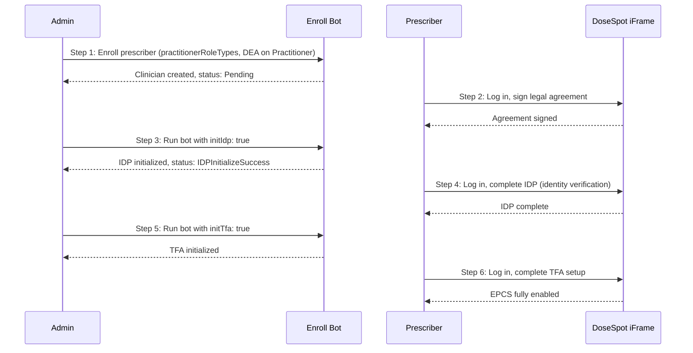

-----

-----

## sidebar\_position: 4

import Tabs from '@theme/Tabs';
import TabItem from '@theme/TabItem';

# Prescriber Enrollment

This guide explains how to enroll a new prescriber in DoseSpot via the Medplum **Enroll Prescriber Bot**, including the full workflow for enabling Electronic Prescriptions for Controlled Substances (EPCS).

:::note[Prerequisites]
The user executing the bot must:

1.  Be an admin in your project (`ProjectMembership.admin`)
2.  Already have access to DoseSpot (DoseSpot identifier on their ProjectMembership)
3.  Have a Clinician Admin role type in DoseSpot (as specified in the `practitionerRoleTypes` parameter)

:::

## Enrollment Workflow Overview

Prescriber enrollment is a multi-step process. The exact steps depend on whether EPCS (controlled substance prescribing) is needed.

### Basic Enrollment (non-EPCS)

1.  **Admin** runs the enroll bot with the prescriber's `practitionerId` and `practitionerRoleTypes`
2.  The bot creates or updates the clinician record in DoseSpot
3.  The prescriber can now log in to the DoseSpot iFrame and prescribe non-controlled medications

### EPCS Enrollment

EPCS requires identity proofing (IDP) and two-factor authentication (TFA). This is a multi-step process involving both the admin and the prescriber:



**Step by step:**

1.  **Admin** runs the enroll bot. The Practitioner resource must have DEA number(s) in its `identifier` array (see [DEA Number Format](https://www.google.com/search?q=%23dea-number-identifier) below).
2.  **Prescriber** logs in to the DoseSpot iFrame via the provider app and signs the required legal agreement.
3.  **Admin** runs the bot again with `initIdp: true` to initialize identity proofing.
4.  **Prescriber** logs in to the DoseSpot iFrame and completes the IDP process (Experian identity verification, which may include a credit card check).
5.  **Admin** runs the bot again with `initTfa: true` (and optionally `tfaType`) to initialize TFA activation.
6.  **Prescriber** logs in to the DoseSpot iFrame and completes the TFA setup (e.g., mobile authenticator or hardware token). After this, EPCS is fully enabled.

## Practitioner Resource Requirements

The Practitioner resource must contain the following fields (extracted automatically by the bot):

| Field | Required | Description | Requirements |
| :--- | :--- | :--- | :--- |
| `name` | Yes | At least one name entry | - `family`: Last name (required)\<br /\>- `given`: Array of given names (at least one required) |
| `birthDate` | Yes | Date of birth | Date format (e.g., "1980-05-15") |
| `identifier` | Yes | Must include an NPI identifier | - `system`: `"http://hl7.org/fhir/sid/us-npi"`\<br /\>- `value`: Valid 10-digit NPI |
| `address` | Yes | Address information | Must include: line, city, state (2-letter code), postalCode |
| `telecom` | Yes | Contact information | - Email: `system: "email"`\<br /\>- Phone: `system: "phone"`, `use: "work"`\<br /\>- Fax: `system: "fax", use: "work"` |
| `active` | Yes | Boolean indicating status | Defaults to `true` |

### DEA Number Identifier

If EPCS is needed, the Practitioner must have one or more DEA number identifiers. DEA numbers are read directly from the Practitioner's `identifier` array using the standard [HL7 DEA NamingSystem](https://terminology.hl7.org/NamingSystem-USDEANumber.html).

**The `assigner.display` field (state) is required by DoseSpot and must be a 2-letter US state abbreviation** (e.g., `"NY"`, `"CA"`, `"WV"`).

```json
{
  "type": {
    "coding": [{
      "system": "http://terminology.hl7.org/CodeSystem/v2-0203",
      "code": "DEA"
    }]
  },
  "system": "http://terminology.hl7.org/NamingSystem/USDEANumber",
  "value": "AB1234563",
  "assigner": {
    "display": "IL"
  }
}
```

:::caution
If you request IDP or TFA initialization but the Practitioner has no DEA number identifiers, the bot will return an error asking you to add them first.
:::

## Bot Input Parameters

| Parameter | Required | Type | Description |
| :--- | :--- | :--- | :--- |
| `practitionerId` | Yes | `string` | The ID of the FHIR Practitioner resource to enroll |
| `practitionerRoleTypes` | Yes | `number[]` | Array of DoseSpot clinician role types |
| `medicalLicenseNumbers` | No | `object[]` | Array of medical license numbers with state info |
| `initIdp` | No | `boolean` | When `true`, initializes identity proofing |
| `initTfa` | No | `boolean` | When `true`, initializes TFA activation |
| `tfaType` | No | `string` | TFA type: `"Mobile"` (default) or `"Token"` |

## Usage Examples

### Step 1: Basic Enrollment

```typescript
const result = await medplum.executeBot(
  { system: "https://www.medplum.com/bots", value: "dosespot-enroll-prescriber-bot" },
  {
    practitionerId: "ced6426b-ad93-4abe-8e75-1695d956e471",
    practitionerRoleTypes: [1],
  }
);
```

## Bot Response

The bot returns the following fields:

| Field | Type | Description |
| :--- | :--- | :--- |
| `doseSpotClinicianId` | `number` | The DoseSpot clinician ID |
| `projectMembership` | `ProjectMembership` | The updated ProjectMembership with DoseSpot identifier |
| `practitioner` | `Practitioner` | The updated Practitioner with registration status extension |
| `registrationStatus` | `string` | Current DoseSpot registration status. See table below. |
| `idpInitialized` | `boolean` | Whether IDP was initialized in this run |
| `tfaInitialized` | `boolean` | Whether TFA was initialized in this run |

### Registration Statuses

The `registrationStatus` string tracks a practitioner's progress through the DoseSpot lifecycle.

| Status | Description |
| :--- | :--- |
| **`Pending`** | Practitioner created in DoseSpot; awaiting legal agreement signature. |
| **`AgreementSigned`** | Legal agreement signed; clinician is ready for Identity Proofing (IDP). |
| **`IDPStarting`** | Identity Proofing (IDP) has been initialized via the bot. |
| **`IDPSuccess`** | Identity Proofing successfully completed. Ready for TFA setup. |
| **`IDPError`** | Identity Proofing failed (e.g., incorrect quiz answers). |
| **`TFAStarting`** | TFA activation has been initialized via the bot. |
| **`TFAActivatedSuccess`**| Two-Factor Authentication successfully bound. EPCS is enabled. |
| **`TFAActivatedError`** | Error during TFA activation or binding process. |
| **`Ready`** | Clinician registration is complete and account is active. |
| **`Deactivated`** | The practitioner account has been deactivated. |
| **`RegistrationError`** | A generic error occurred during the enrollment process. |

### Stored Data on Practitioner

After each run, the bot updates the Practitioner resource with:

  - **Registration status** -- stored as an extension (`https://dosespot.com/registration-status`)
  - **EPCS qualification** -- added to `Practitioner.qualification` when TFA is successfully activated.

## Common Errors

| Error | Cause | Resolution |
| :--- | :--- | :--- |
| No DEA number found | IDP/TFA requested but no DEA identifiers found | Add DEA number identifier(s) to the Practitioner |
| Pending legal agreement | IDP init attempted before signature | Prescriber must sign the agreement in the iFrame first |
| IDP not completed yet | TFA init requested before IDP is done | Complete the IDP process in the iFrame first |
