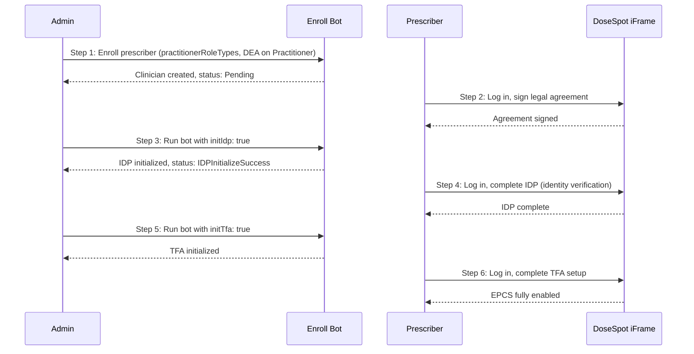
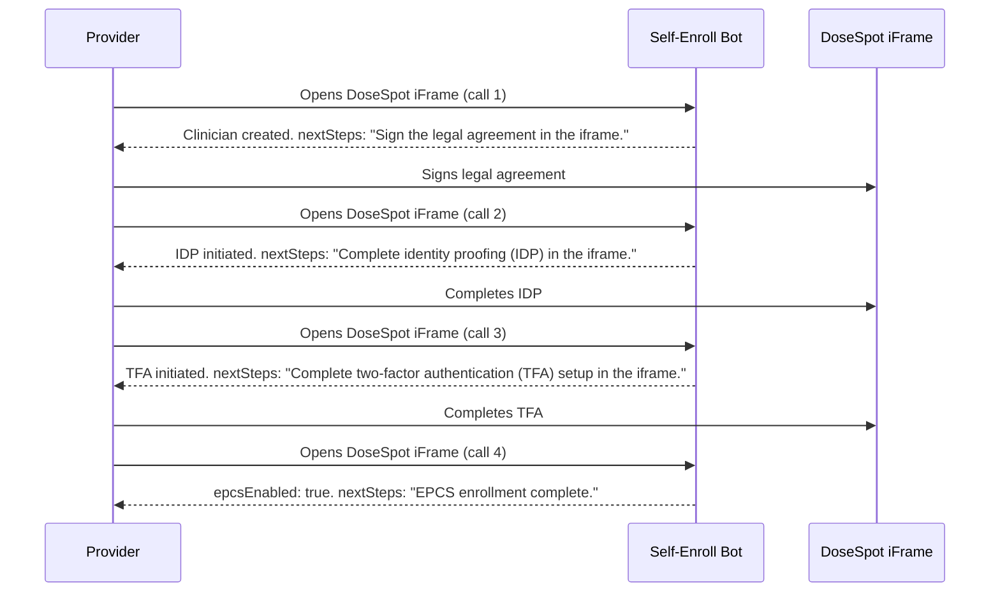

import Tabs from '@theme/Tabs';
import TabItem from '@theme/TabItem';

# Prescriber Enrollment

This guide explains how to enroll a new prescriber in DoseSpot. Medplum provides two enrollment bots:

| Approach | Bot | Best for |
|---|---|---|
| **Admin-driven** | `dosespot-enroll-prescriber-bot` | IT admin enrolls each provider manually; full control over each step |
| **Self-service** | `dosespot-self-enroll-prescriber-bot` | Provider enrolls themselves the first time they open the DoseSpot iFrame; no back-and-forth with admin |

Both bots support full EPCS enrollment (IDP + TFA). The self-service bot auto-advances through each registration stage on each call, while the admin bot requires explicit `initIdp`/`initTfa` flags.

## Admin-Driven Enrollment (dosespot-enroll-prescriber-bot)

:::note[Prerequisites]
The user executing the bot must:

1. Be an admin in your project (`ProjectMembership.admin`)
2. Already have access to DoseSpot (DoseSpot identifier on their ProjectMembership)
3. Have a Clinician Admin role type in DoseSpot (as specified in the `practitionerRoleTypes` parameter)
:::

## Enrollment Workflow Overview

Prescriber enrollment is a multi-step process. The exact steps depend on whether EPCS (controlled substance prescribing) is needed.

### Basic Enrollment (non-EPCS)

1. **Admin** runs the enroll bot with the prescriber's `practitionerId` and `practitionerRoleTypes`
2. The bot creates or updates the clinician record in DoseSpot
3. The prescriber can now log in to the DoseSpot iFrame and prescribe non-controlled medications

### EPCS Enrollment

EPCS requires identity proofing (IDP) and two-factor authentication (TFA). This is a multi-step process involving both the admin and the prescriber:




**Step by step:**

1. **Admin** runs the enroll bot. The Practitioner resource must have DEA number(s) in its `identifier` array (see [DEA Number Format](#dea-number-identifier) below).
2. **Prescriber** logs in to the DoseSpot iFrame via the provider app and signs the required legal agreement.
3. **Admin** runs the bot again with `initIdp: true` to initialize identity proofing.
4. **Prescriber** logs in to the DoseSpot iFrame and completes the IDP process (Experian identity verification, which may include a credit card check).
5. **Admin** runs the bot again with `initTfa: true` (and optionally `tfaType`) to initialize TFA activation.
6. **Prescriber** logs in to the DoseSpot iFrame and completes the TFA setup (e.g., mobile authenticator or hardware token). After this, EPCS is fully enabled.

## Practitioner Resource Requirements

The Practitioner resource must contain the following fields (extracted automatically by the bot):


| Field        | Required | Description                                  | Requirements                                                                                                                                                                 |
| ------------ | -------- | -------------------------------------------- | ---------------------------------------------------------------------------------------------------------------------------------------------------------------------------- |
| `name`       | Yes      | At least one name entry                      | - `family`: Last name (required) - `given`: Array of given names (at least one required)                                                                                     |
| `birthDate`  | Yes      | Date of birth                                | Date format (e.g., "1980-05-15")                                                                                                                                             |
| `identifier` | Yes      | Must include an NPI identifier               | - `system`: `"http://hl7.org/fhir/sid/us-npi"` - `value`: Valid 10-digit NPI that passes check digit validation (can generate [HERE](https://jsfiddle.net/alexdresko/cLNB6)) |
| `address`    | Yes      | Address information                          | Must include: line, city, state (2-letter code), postalCode                                                                                                                  |
| `telecom`    | Yes      | Contact information                          | - Email: `system: "email"` - Phone: `system: "phone"`, `use: "work"` - Fax: `system: "fax", use: "work"`                                                                     |
| `active`     | Yes      | Boolean indicating if practitioner is active | Defaults to `true`                                                                                                                                                           |


### DEA Number Identifier

If EPCS is needed, the Practitioner must have one or more DEA number identifiers. DEA numbers are read directly from the Practitioner's `identifier` array using the standard [HL7 DEA NamingSystem](https://terminology.hl7.org/NamingSystem-USDEANumber.html).

**The `assigner.display` field (state) is required by DoseSpot and must be a 2-letter US state abbreviation** (e.g., `"NY"`, `"CA"`, `"WV"`).

```json
{
  "type": {
    "coding": [{
      "system": "http://terminology.hl7.org/CodeSystem/v2-0203",
      "code": "DEA"
    }]
  },
  "system": "http://terminology.hl7.org/NamingSystem/USDEANumber",
  "value": "AB1234563",
  "assigner": {
    "display": "IL"
  }
}
```

If a prescriber has DEA numbers for multiple states, add multiple identifier entries:

```json
"identifier": [
  {
    "system": "http://hl7.org/fhir/sid/us-npi",
    "value": "1234567893"
  },
  {
    "type": {
      "coding": [{ "system": "http://terminology.hl7.org/CodeSystem/v2-0203", "code": "DEA" }]
    },
    "system": "http://terminology.hl7.org/NamingSystem/USDEANumber",
    "value": "AB1234563",
    "assigner": { "display": "IL" }
  },
  {
    "type": {
      "coding": [{ "system": "http://terminology.hl7.org/CodeSystem/v2-0203", "code": "DEA" }]
    },
    "system": "http://terminology.hl7.org/NamingSystem/USDEANumber",
    "value": "CD9876543",
    "assigner": { "display": "NY" }
  }
]
```

:::caution[]
If you request IDP or TFA initialization but the Practitioner has no DEA number identifiers, the bot will return an error asking you to add them first.
:::

Full Practitioner resource example (with DEA)

```json
{
  "resourceType": "Practitioner",
  "id": "ced6426b-ad93-4abe-8e75-1695d956e471",
  "name": [
    {
      "family": "Smith",
      "given": ["Jane", "Marie"],
      "prefix": ["Dr."] // Optional
    }
  ],
  "birthDate": "1980-05-15",
  "identifier": [
    {
      "system": "http://hl7.org/fhir/sid/us-npi",
      "value": "1234567893" // Required: Valid 10-digit NPI that passes check digit validation
    },
    {
      "type": {
        "coding": [{ "system": "http://terminology.hl7.org/CodeSystem/v2-0203", "code": "DEA" }]
      },
      "system": "http://terminology.hl7.org/NamingSystem/USDEANumber",
      "value": "AB1234563",
      "assigner": { "display": "IL" }
    }
  ],
  "telecom": [
    { "system": "email", "value": "jane.smith@example.com" },
    { "system": "phone", "use": "work", "value": "345-123-4567" }, 
    { "system": "fax", "use": "work", "value": "567-123-4568" }
  ],
  "address": [ // Required: Address information
    {
      "line": ["123 Main St", "Suite 100"], // Address line(s)
      "city": "Springfield", // Required: City
      "state": "IL", // Required: State
      "postalCode": "62701" // Required: Postal code
    }
  ],
  "active": true // Required: Boolean indicating if practitioner is active
}
```

## Bot Input Parameters


| Parameter               | Required | Type       | Description                                                           |
| ----------------------- | -------- | ---------- | --------------------------------------------------------------------- |
| `practitionerId`        | Yes      | `string`   | The ID of the FHIR Practitioner resource to enroll                    |
| `practitionerRoleTypes` | Yes      | `number[]` | Array of DoseSpot clinician role types (see below)                    |
| `medicalLicenseNumbers` | No       | `object[]` | Array of medical license numbers with state info (optional)           |
| `initIdp`               | No       | `boolean`  | When `true`, initializes identity proofing after enrollment           |
| `initTfa`               | No       | `boolean`  | When `true`, initializes TFA activation (requires IDP to be complete) |
| `tfaType`               | No       | `string`   | TFA type: `"Mobile"` (default) or `"Token"`                           |


**Clinician Role Types:**


| Value | Role                        | Description                                              |
| ----- | --------------------------- | -------------------------------------------------------- |
| `1`   | Prescribing Clinician       | Can prescribe non-controlled and controlled medications  |
| `2`   | Reporting Clinician         | Can view and report on prescriptions; cannot prescribe   |
| `3`   | EPCS Coordinator            | Coordinates EPCS enrollment for other clinicians         |
| `4`   | Clinician Admin             | Clinic administrator; can invite and manage other users  |
| `5`   | Prescribing Agent Clinician | Prescribes on behalf of a supervising prescriber         |
| `6`   | Proxy Clinician             | Proxy access to act on behalf of another clinician       |


:::note[]
Users that need to invite others should be added with the Clinician Admin role type (`4`).
:::

## Usage Examples

### Step 1: Basic Enrollment

```typescript
const result = await medplum.executeBot(
  { system: "https://www.medplum.com/bots", value: "dosespot-enroll-prescriber-bot" },
  {
    practitionerId: "ced6426b-ad93-4abe-8e75-1695d956e471",
    practitionerRoleTypes: [1],
  }
);
// result.doseSpotClinicianId - the DoseSpot clinician ID
// result.registrationStatus  - e.g., "Pending"
```

```bash
curl 'https://api.medplum.com/fhir/R4/Bot/YOUR_BOT_ID/$execute' \
  -X POST \
  -H "Content-Type: application/json" \
  -H "Authorization: Bearer $MY_ACCESS_TOKEN" \
  -d '{
    "practitionerId": "ced6426b-ad93-4abe-8e75-1695d956e471",
    "practitionerRoleTypes": [1]
  }'
```

### Step 2: Prescriber Signs Legal Agreement

The prescriber must log in to the DoseSpot iFrame via the provider app and sign the required legal agreement. No bot action is needed for this step.

1. The prescriber opens the DoseSpot iFrame in the provider app.
2. DoseSpot presents a legal agreement on the prescriber's first login.
3. The prescriber reviews and signs the agreement.

Expected `registrationStatus` after this step: `RegistrationSuccess`

Once signed, the admin can proceed to Step 3.

### Step 3: Initialize IDP

Run the bot again with `initIdp: true` after the prescriber has signed the legal agreement:

```typescript
const result = await medplum.executeBot(
  { system: "https://www.medplum.com/bots", value: "dosespot-enroll-prescriber-bot" },
  {
    practitionerId: "ced6426b-ad93-4abe-8e75-1695d956e471",
    practitionerRoleTypes: [1],
    initIdp: true,
  }
);
// result.idpInitialized      - true if IDP was newly initialized
// result.registrationStatus  - e.g., "IDPInitializeSuccess"
```

```bash
curl 'https://api.medplum.com/fhir/R4/Bot/YOUR_BOT_ID/$execute' \
  -X POST \
  -H "Content-Type: application/json" \
  -H "Authorization: Bearer $MY_ACCESS_TOKEN" \
  -d '{
    "practitionerId": "ced6426b-ad93-4abe-8e75-1695d956e471",
    "practitionerRoleTypes": [1],
    "initIdp": true
  }'
```

### Step 4: Prescriber Completes Identity Verification (IDP)

The prescriber must log in to the DoseSpot iFrame and complete the Experian identity proofing process.

1. The prescriber opens the DoseSpot iFrame in the provider app.
2. DoseSpot presents the identity verification (Experian) flow.
3. The prescriber provides the required information, which may include Social Security Number, date of birth, and a credit card number.

Expected `registrationStatus` after this step: `IDPSuccess`

Once IDP is complete, the admin can proceed to Step 5.

### Step 5: Initialize TFA

Run the bot again with `initTfa: true` after the prescriber has completed IDP:

```typescript
const result = await medplum.executeBot(
  { system: "https://www.medplum.com/bots", value: "dosespot-enroll-prescriber-bot" },
  {
    practitionerId: "ced6426b-ad93-4abe-8e75-1695d956e471",
    practitionerRoleTypes: [1],
    initTfa: true,
    tfaType: "Mobile", // or "Token" for hardware token
  }
);
// result.tfaInitialized      - true if TFA was newly initialized
// result.registrationStatus  - e.g., "IDPSuccess"
```

```bash
curl 'https://api.medplum.com/fhir/R4/Bot/YOUR_BOT_ID/$execute' \
  -X POST \
  -H "Content-Type: application/json" \
  -H "Authorization: Bearer $MY_ACCESS_TOKEN" \
  -d '{
    "practitionerId": "ced6426b-ad93-4abe-8e75-1695d956e471",
    "practitionerRoleTypes": [1],
    "initTfa": true,
    "tfaType": "Mobile"
  }'
```

### Step 6: Complete TFA Setup

The prescriber must log in to the DoseSpot iFrame one final time to complete the TFA setup. Once complete, EPCS is fully enabled.

## Bot Response

The bot returns the following fields:


| Field                 | Type                | Description                                                                                        |
| --------------------- | ------------------- | -------------------------------------------------------------------------------------------------- |
| `doseSpotClinicianId` | `number`            | The DoseSpot clinician ID                                                                          |
| `projectMembership`   | `ProjectMembership` | The updated ProjectMembership with DoseSpot identifier                                             |
| `practitioner`        | `Practitioner`      | The updated Practitioner with registration status extension and EPCS qualification (if applicable) |
| `registrationStatus`  | `string`            | Current DoseSpot registration status — see [Registration Statuses](#registration-statuses) below |
| `idpInitialized`      | `boolean`           | Whether IDP was initialized in this run                                                            |
| `tfaInitialized`      | `boolean`           | Whether TFA was initialized in this run                                                            |


### Registration Statuses

| Status | Meaning | Next Action |
|--------|---------|-------------|
| `Pending` | Clinician created; legal agreement not yet signed | Prescriber logs in to iFrame and signs agreement (Step 2) |
| `RegistrationSuccess` | Legal agreement signed; IDP not yet initiated | Admin runs bot with `initIdp: true` (Step 3) |
| `RegistrationError` | Registration failed | Check enrollment data and re-run the bot |
| `IDPInitializeSuccess` | IDP initiated by admin; prescriber has not yet completed it | Prescriber logs in to iFrame and completes identity verification (Step 4) |
| `IDPSuccess` | Identity proofing complete; TFA not yet initiated | Admin runs bot with `initTfa: true` (Step 5) |
| `IDPError` | Identity proofing failed | Prescriber must retry IDP in the iFrame |
| `TFAActivateInit` | TFA activation initiated; prescriber has not yet completed setup | Prescriber logs in to iFrame and completes TFA setup (Step 6) |
| `TFAActivatedSuccess` | TFA setup complete; EPCS fully enabled | No action needed — EPCS is active |
| `TFAActivatedError` | TFA activation failed | Re-initiate TFA (run bot with `initTfa: true` again) |
| `TFADeactivateInit` | TFA deactivation in progress | Wait for deactivation to complete before re-initiating |
| `TFADeactivatedSuccess` | TFA successfully deactivated | Re-initiate TFA if needed (run bot with `initTfa: true`) |
| `TFADeactivatedError` | TFA deactivation failed | Contact DoseSpot support |

### Stored Data on Practitioner

After each run, the bot updates the Practitioner resource with:

- **Registration status** -- stored as an extension (`https://dosespot.com/registration-status`) with the current DoseSpot status
- **EPCS qualification** -- when TFA is successfully activated, an EPCS qualification entry is added to `Practitioner.qualification`, searchable via `Practitioner?qualification-code=https://dosespot.com/qualification|epcs`

## Validation Notes

### NPI Validation

- **The NPI must be exactly 10 digits**
- For testing purposes, you can use an online NPI generator such as [this one](https://jsfiddle.net/alexdresko/cLNB6)

### DEA Number

- DEA numbers are read from the Practitioner's `identifier` array (system: `http://terminology.hl7.org/NamingSystem/USDEANumber`)
- The state (`assigner.display`) is **required by DoseSpot** and must be a 2-letter US state abbreviation
- If IDP or TFA is requested but no DEA numbers are found, the bot returns an error

### Phone and Fax Numbers

- Phone and fax numbers are extracted from the Practitioner `telecom` field
- They must be valid 10-digit US phone numbers
- Don't use a phone number that starts with '555-'

### ProjectMembership

- The Practitioner being enrolled must have an associated ProjectMembership
- The DoseSpot clinician ID will be stored on the ProjectMembership after successful enrollment
- On subsequent runs, the bot updates the existing clinician rather than creating a new one

## Common Errors


| Error                                    | Cause                                                        | Resolution                                                                                                                 |
| ---------------------------------------- | ------------------------------------------------------------ | -------------------------------------------------------------------------------------------------------------------------- |
| No DEA number found on the Practitioner  | IDP or TFA requested but Practitioner has no DEA identifiers | Add DEA number identifier(s) to the Practitioner with the correct system and state                                         |
| Prescriber has a pending legal agreement | IDP init attempted before prescriber signed agreement        | Prescriber must log in to DoseSpot iFrame and sign the agreement first, if IDP available in iFrame - must complete as well |
| TFA activation is already in progress    | TFA init requested while a previous activation is pending    | Prescriber must complete the pending TFA activation in the DoseSpot iFrame                                                 |
| TFA is already activated                 | TFA init requested but TFA is already active                 | To change TFA type, deactivate TFA first, then re-initiate                                                                 |
| IDP has not been completed yet           | TFA init requested before IDP is done                        | Complete the IDP process first (run bot with `initIdp: true`, then prescriber completes IDP in iFrame)                     |


---

## Self-Service Enrollment (dosespot-self-enroll-prescriber-bot)

Self-service enrollment lets a provider enroll themselves in DoseSpot without any admin involvement. The first time a provider opens the DoseSpot iFrame, the bot runs automatically, creates the clinician record, and auto-advances through each registration stage on every subsequent call. Providers complete remaining steps (legal agreement, IDP, TFA) directly in the DoseSpot iFrame.

This eliminates the multi-turn admin/provider coordination required by the admin-driven bot.

### Prerequisites

- The `DOSESPOT_USER_ID` project secret must be configured with an admin-level DoseSpot clinician ID (typically a Proxy/Clinic Admin user). For Medplum-hosted deployments, contact Medplum support to have this configured.
- An active `PractitionerRole` resource must exist for the provider with at least one code from system `https://dosespot.com/practitionerrole-type`

### Step 1: Create a PractitionerRole for the Provider

An administrator creates a `PractitionerRole` resource that authorizes the provider for one or more DoseSpot role types:

```json
{
  "resourceType": "PractitionerRole",
  "practitioner": { "reference": "Practitioner/<practitioner-id>" },
  "organization": { "reference": "Organization/<clinic-id>" },
  "active": true,
  "code": [
    {
      "coding": [
        {
          "system": "https://dosespot.com/practitionerrole-type",
          "code": "PrescribingClinician",
          "display": "Prescribing Clinician"
        }
      ]
    }
  ]
}
```

**Available role type codes:**

| Code | Description |
|------|-------------|
| `PrescribingClinician` | Can prescribe medications |
| `ReportingClinician` | Can view/report but not prescribe |
| `EpcsCoordinator` | Coordinates EPCS enrollment |
| `ClinicianAdmin` | Clinic administrator |
| `PrescribingAgentClinician` | Prescribes on behalf of another |
| `ProxyClinician` | Proxy access |

### Step 2: Enable Self-Enrollment in the Provider App

**If you are using the Medplum Provider App:** Self-enrollment is already enabled. Each time a provider opens the DoseSpot iFrame, the app automatically advances them through the enrollment process — no code changes needed.

**If you are building your own app with `useDoseSpotIFrame`:** Set `selfEnroll: true` on the hook and ensure you are on `@medplum/dosespot-react` version 5.x.x or later. When a provider opens DoseSpot and has no DoseSpot identifier yet, the hook automatically runs `dosespot-self-enroll-prescriber-bot` before loading the iFrame, and each subsequent open advances enrollment to the next stage.

### Auto-Advancing Enrollment Flow

The bot is idempotent and advances the provider through each stage automatically:



### Practitioner Resource Requirements

The Practitioner resource must include all of the following before self-enrollment will succeed. If any field is missing, the bot returns a clear error so the provider can update their profile and retry.

| Field | Required | Notes |
|-------|----------|-------|
| `address` | Yes | Complete address: line, city, state, postal code |
| `telecom` (phone) | Yes | `system: "phone"`, `use: "work"` |
| `telecom` (fax) | Yes | `system: "fax"` |
| `identifier` (NPI) | Yes | `system: "http://hl7.org/fhir/sid/us-npi"` |
| `identifier` (DEA) | For EPCS | `system: "http://terminology.hl7.org/NamingSystem/USDEANumber"` — triggers EPCS enrollment automatically |

EPCS is requested implicitly: if the Practitioner has DEA number identifiers, the bot requests EPCS enrollment and auto-initiates IDP and TFA when eligible.

### Bot Input

The bot runs as the authenticated provider (`runAsUser: true`) and resolves the practitioner identity from `auth/me` — no `practitionerId` input is needed.

```typescript
{
  medicalLicenseNumbers?: DoseSpotMedicalLicenseNumber[];  // Optional state medical license numbers
  tfaType?: 'Mobile' | 'Token';                           // TFA type (default: Mobile)
}
```

### Bot Output

```typescript
{
  status: 'created' | 'already_enrolled' | 'advanced';  // What happened this invocation
  doseSpotClinicianId: number;                           // DoseSpot clinician ID
  registrationStatus: string;                            // Current DoseSpot registration status
  epcsEnabled: boolean;                                  // Whether EPCS is fully activated
  nextSteps: string[];                                   // Human-readable guidance shown to the provider
}
```

The `nextSteps` array contains user-facing instructions that your app should display to guide the provider through any remaining steps in the iFrame.


