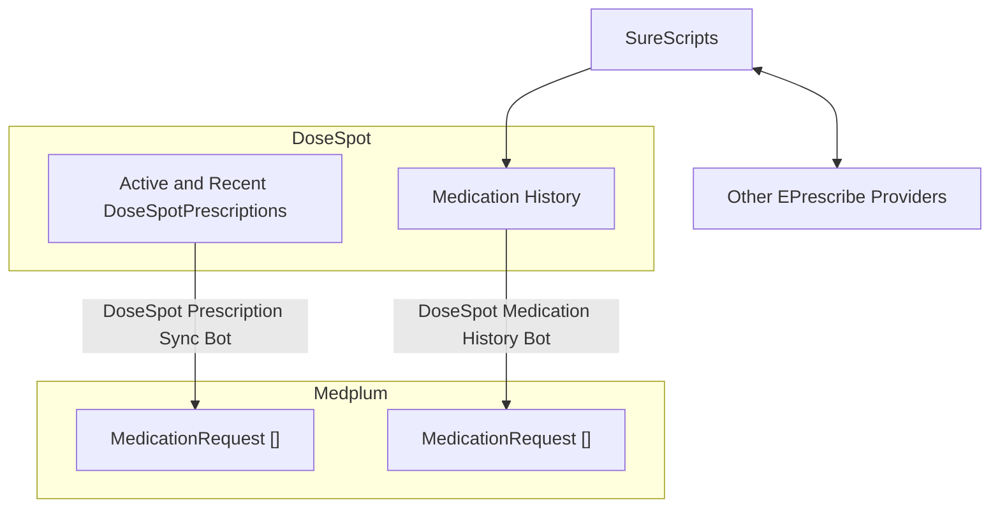

# Getting Started with DoseSpot

This guide explains how to get the **DoseSpot eRx interface iframed into Medplum** and **sync the relevant resources between Medplum and DoseSpot**. It is all integrated into the [Provider App](https://provider.medplum.com) already, but these instructions will show you how to use the hooks and bots in your own application.

:::info
This is a [premium](/pricing) tier 3rd party integration feature. Please contact us at [support@medplum.com](mailto:support@medplum.com) to get access.
:::

## Authentication

To use any of the hooks or Bots, you will first need to add your DoseSpot clinician id as an [identifier](/docs/fhir-basics#naming-data-identifiers) to each User's [ProjectMembership](/docs/api/fhir/medplum/projectmembership). Please contact Medplum support to get your DoseSpot clinician id.

```typescript
{
  "resourceType": "ProjectMembership",
  "id": "123",
  "project": {
    "reference": "Project/123"
  },
  "user": {
    "reference": "User/123"
  },
  "identifier": [
    {
      "system": "https://my.staging.dosespot.com/webapi/v2/",//https://my.dosespot.com/webapi/v2/ for production
      "value": "123456"
    }
  ],
}
```
## Syncing Patient and Showing Iframe

To embed the DoseSpot eRx interface into Medplum and sync a patient's data to DoseSpot, you should use the [useDoseSpotIFrame](https://github.com/medplum/medplum/blob/113821deb5058bc1c6bc95f5d294d05e7fc4cd5e/packages/dosespot-react/src/useDoseSpotIFrame.ts#L12) hook, called with *a specific patient*. It will handle the SSO into DoseSpot, returning a URL that can be embedded in an iframe and sync the patient by doing the following:

1. **Syncs Patient -> DoseSpot**: If the patient has not yet been synced with DoseSpot, it will add an identifier with the system `http://dosespot.com/patient-id` to the [Patient](/docs/api/fhir/resources/patient) resource (if not already present). The patient must include a valid:
- email address
- 9 digit phone number with no +1 prefix
- address
- date of birth
- name (first and last)

<details>
  <summary>See this example of a valid Patient that will be synced to DoseSpot</summary>

```typescript
{
  {
  "resourceType": "Patient",
  "name": [ //Required
    {
      "given": [
        "Frodo"
      ],
      "family": "Baggins"
    }
  ],
  "telecom": [
    {
      "system": "email",
      "use": "home",
      "value": "frodo@example.com" //Required
    },
    {
      "system": "phone",
      "use": "home",
      "value": "6175672093"//Required: cannot have a +1 prefix and must be 9 digits
    }
  ],
  "address": [//Required
    {
      "line": [
        "98 Battery St"
      ],
      "city": "San Francisco",
      "state": "CA",
      "postalCode": "94118"
    }
  ],
  "birthDate": "1978-06-15",//Required
  "identifier": [ 
    { //This is added if the sync is successful
      "system": "https://dosespot.com/patient-id",
      "value": "78089260"
    }
  ]
}
```
</details>


2. **Syncs [AllergyIntolerance](/docs/api/fhir/resources/allergyintolerance) -> DoseSpot for DAI (Drug-Allergy-Interaction) checks**: You must have an [AllergyIntolerance](/docs/api/fhir/resources/allergyintolerance) resource with the patient reference set.

<details>
  <summary>Example of a valid AllergyIntolerance that will be synced to DoseSpot to be used for **DAI checks in DoseSpot**</summary>

```typescript
{
  "resourceType": "AllergyIntolerance",
  "id": "123",
  "patient": {
    "reference": "Patient/123"
  },
  "code": {
    "coding": [
      {// Recommended: Use RxNorm for best results with DoseSpot
        "system": "http://www.nlm.nih.gov/research/umls/rxnorm",
        "code": "205604"
      }
    ],
    "text": "Vibramycin 100 mg capsule"
  },
  "identifier": [//This is added if the sync is successful
    {
      "system": "https://dosespot.com/self-reported-allergy-id",
      "value": "123"
    }
  ]
  //...
}
```
</details>

3. **Syncs any self-reported [MedicationRequest](/docs/api/fhir/resources/medicationrequest) -> DoseSpot for DDI (Drug-Drug-Interaction) checks**: For the MedicationRequest to be synced, you must create a MedicationRequest resource with `MedicationRequest.intent` set to `plan`.

<details>
  <summary>Example of a MedicationRequest that will be synced to DoseSpot to be used for **DDI checks in DoseSpot**</summary>

```typescript
{
  "resourceType": "MedicationRequest",
  "id": "123",
  "intent": "plan", // REQUIRED to be picked up in sync
  "medicationCodeableConcept": { // medicationReference is not supported
    "coding": [
      {// Recommended: Use RxNorm for best results with DoseSpot
        "system": "http://www.nlm.nih.gov/research/umls/rxnorm",
        "code": "205604"
      }
    ],
    "text": "Vibramycin 100 mg capsule"
  },
  "identifier": [//This is added if the sync is successful
    {
      "system": "https://dosespot.com/self-reported-medication-id",
      "value": "123"
    }
  ]
  //...
}
```
</details>

### useDoseSpotIFrame

```tsx
import { Box } from '@mantine/core';
import { useDoseSpotIFrame } from '@medplum/dosespot-react';
import { JSX } from 'react';
import { useParams } from 'react-router';

export function DoseSpotTab(): JSX.Element {
  const { patientId } = useParams();
  const iframeUrl = useDoseSpotIFrame({
    patientId, // if not provided, the iframe will be the generic DoseSpot notifications iframe
    //onPatientSyncSuccess: () => //do something
    //onIframeSuccess: () => //do something
    //onError: (err) => //do something
  });

  return (
    <Box pos="relative">
      <div>
        {iframeUrl && (
          <iframe
            id="dosespot-iframe"
            name="dosespot-iframe"
            frameBorder={0}
            src={iframeUrl}
            style={{ width: '100%', height: '100%', minHeight: 'calc(100vh)', border: 'none' }}
          />
        )}
      </div>
    </Box>
  );
}
```

See a more thorough implementation example from the Provider App's [DoseSpotTab.tsx](https://github.com/medplum/medplum/blob/main/examples/medplum-provider/src/pages/patient/DoseSpotTab.tsx).

| `useDoseSpotIFrame({ patientId })` | `useDoseSpotIFrame({})` |
| ------------------------------- | ---------------------------------------- |
|    |     |

## Syncing Prescriptions

### Syncing Active Prescriptions - DoseSpot Prescription Sync Bot

Prescriptions that were prescribed in DoseSpot can be synced back to Medplum by using the **DoseSpot Prescription Sync Bot**.

The Bot will create or update MedicationRequest resources in Medplum for the specified date range and patient.

Example of executing the bot:

```typescript
  const DOSESPOT_PRESCRIPTIONS_SYNC_BOT: Identifier = {
    system: 'https://www.medplum.com/bots',
    value: 'dosespot-prescriptions-sync-bot',
  };

  const medicationRequests = await medplum.execute(DOSESPOT_PRESCRIPTIONS_SYNC_BOT, {
    patientId,
    start: "2023-01-01",
    end: "2025-01-01",
    //raw: true //returns raw DoseSpot prescription data instead of creating and returning MedicationRequest resources
  }) as MedicationRequest[];
```
For a more thorough example implementing this bot, see the Provider App's [DoseSpotAdvancedOptions](https://github.com/medplum/medplum/blob/113821deb5058bc1c6bc95f5d294d05e7fc4cd5e/examples/medplum-provider/src/pages/patient/DoseSpotAdvancedOptions.tsx#L13-L61).

Here is an example of the MedicationRequest resource that could be created or updated by the bot:

<details>
  <summary>Example of the MedicationRequest resource that could be created or updated by the bot</summary>

```typescript
{
  "resourceType": "MedicationRequest",
  "identifier": [
    {
      "system": "https://dosespot.com/prescription-id",
      "value": "459848468"
    }
  ],
  "status": "completed",
  "statusReason": {
    "coding": [
      {
        "system": "https://dosespot.com/medication-status",
        "code": "Completed",
        "display": "Completed"
      }
    ]
  },
  "intent": "order",
  "medicationCodeableConcept": {
    "coding": [
      {
        "system": "http://hl7.org/fhir/sid/ndc",
        "code": "57896059815"
      }
    ],
    "text": "Lip-Care External Stick"
  },
  "subject": {
    "reference": "Patient/123",
    "display": "John Doe"
  },
  "authoredOn": "2025-05-06T23:43:01.483",
  "recorder": {
    "identifier": {
      "value": "dosespot"
    }
  },
  "dispenseRequest": {
    "validityPeriod": {
      "start": "2025-05-06T23:43:01.483"
    },
    "quantity": {
      "value": 2,
      "unit": "Stick",
      "system": "http://unitsofmeasure.org"
    },
    "expectedSupplyDuration": {
      "value": 1,
      "unit": "days",
      "system": "http://unitsofmeasure.org",
      "code": "d"
    }
  }
  //...
}
```
</details>


### Syncing Med History - DoseSpot Medication History Bot

This bot gives you the ability to sync prescription history from SureScripts back to Medplum. This includes medication history from other providers that SureScripts has access to.

The Bot will create or update MedicationRequest resources in Medplum for the specified date range and patient.

Example of executing the bot:

```typescript
const DOSESPOT_MEDICATION_HISTORY_BOT: Identifier = {
  system: 'https://www.medplum.com/bots',
  value: 'dosespot-medication-history-bot',
};

const medicationRequests = await medplum.execute(DOSESPOT_MEDICATION_HISTORY_BOT, {
  patientId,
  start: "2023-01-01",
  end: "2025-01-01",
  //raw: true //returns raw DoseSpot prescription data instead of creating and returning MedicationRequest resources
}) as MedicationRequest[];
```
For a more thorough example implementing this bot, see the Provider App's [DoseSpotAdvancedOptions](https://github.com/medplum/medplum/blob/113821deb5058bc1c6bc95f5d294d05e7fc4cd5e/examples/medplum-provider/src/pages/patient/DoseSpotAdvancedOptions.tsx#L13-L61).

<details>
  <summary>Please note that when testing with the DoseSpot sandbox, you must use this patient:</summary>

```typescript
{
  "resourceType": "Patient",
  "name": [
    {
      "given": [
        "Rowena",
        "Baylie"
      ],
      "family": "Acacianna"
    }
  ],
  "telecom": [
    {
      "system": "email",
      "use": "home",
      "value": "example+dosespot@example.com"
    },
    {
      "system": "phone",
      "value": "+15052936547",
      "use": "mobile"
    }
  ],
  "gender": "male",
  "birthDate": "1968-03-29",
  "address": [
    {
      "use": "home",
      "type": "both",
      "line": [
        "2798 Parsifal St NE"
      ],
      "city": "Albuquerque",
      "state": "NM",
      "postalCode": "87112"
    }
  ],
  "active": true
}
```
</details>


### Understanding the Prescription and Medication History Data Flow



## Processing DoseSpot Notifications

You can use the [useDoseSpotNotifications](https://github.com/medplum/medplum/blob/main/packages/dosespot-react/src/useDoseSpotNotifications.ts) hook to poll for DoseSpot notifications.

See an example implementation in the Provider App's [DoseSpotIcon](https://github.com/medplum/medplum/blob/main/examples/medplum-provider/src/components/DoseSpotIcon.tsx). When clicked, it routes the user to the DoseSpot notifications page, which uses [useDoseSpotIFrame](#usedosespotiframe) with no specified `patientId`. 