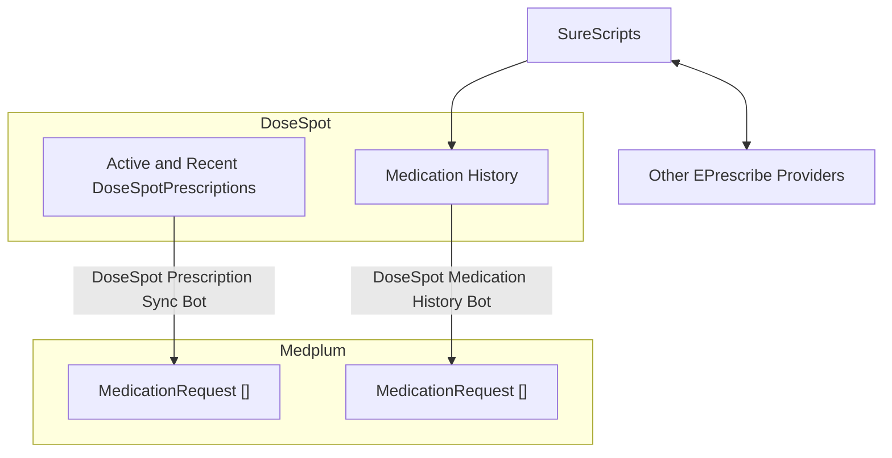

# Getting Started with DoseSpot

This guide explains how to **sync the relevant resources between Medplum and DoseSpot**. It is all integrated into the [Provider App](https://provider.medplum.com) already, but these instructions will show you how to use the hooks and bots in your own application.

:::info[]
This is a [premium](/pricing) tier 3rd party integration feature. Please contact us at [support@medplum.com](mailto:support@medplum.com) to get access.
:::

## Authentication

To use any of the hooks or Bots, you will first need to add your DoseSpot clinician id as an [identifier](/docs/fhir-basics#naming-data-identifiers) to each User's [ProjectMembership](/docs/api/fhir/medplum/projectmembership). Please contact Medplum support to get your DoseSpot clinician id.

```typescript
{
  "resourceType": "ProjectMembership",
  "id": "123",
  "project": {
    "reference": "Project/123"
  },
  "user": {
    "reference": "User/123"
  },
  "identifier": [
    {
      "system": "https://my.staging.dosespot.com/webapi/v2/",//https://my.dosespot.com/webapi/v2/ for production
      "value": "123456"
    }
  ],
}
```
## Syncing Prescriptions

### Syncing Active Prescriptions - `DoseSpot Prescription Sync Bot`

Prescriptions that were prescribed in DoseSpot can be synced back to Medplum by using the **DoseSpot Prescription Sync Bot**.

The Bot will create or update MedicationRequest resources in Medplum for the specified date range and patient.

Example of executing the bot:

```typescript
  const DOSESPOT_PRESCRIPTIONS_SYNC_BOT: Identifier = {
    system: 'https://www.medplum.com/bots',
    value: 'dosespot-prescriptions-sync-bot',
  };

  const medicationRequests = await medplum.execute(DOSESPOT_PRESCRIPTIONS_SYNC_BOT, {
    patientId,
    start: "2023-01-01",
    end: "2025-01-01",
    //raw: true //returns raw DoseSpot prescription data instead of creating and returning MedicationRequest resources
  }) as MedicationRequest[];
```
For a more thorough example implementing this bot, see the Provider App's [DoseSpotAdvancedOptions](https://github.com/medplum/medplum/blob/113821deb5058bc1c6bc95f5d294d05e7fc4cd5e/examples/medplum-provider/src/pages/patient/DoseSpotAdvancedOptions.tsx#L13-L61).

<details>
  <summary>Example of the MedicationRequest resource that could be created or updated by the bot</summary>

```typescript
{
  "resourceType": "MedicationRequest",
  "id": "123",
  "identifier": [
    {
      "system": "https://dosespot.com/prescription-id",
      "value": "459848468"
    }
  ],
  "status": "completed",
  "statusReason": {
    "coding": [
      {
        "system": "https://dosespot.com/medication-status",
        "code": "Completed",
        "display": "Completed"
      }
    ]
  },
  "extension": [
    {
      "url": "https://dosespot.com/prescription-status",
      "valueCode": "PharmacyVerified"
    }
  ],
  "intent": "order", // designates this as an active prescription ordered in DoseSpot
  "medicationCodeableConcept": {
    "coding": [
      {
        "system": "http://hl7.org/fhir/sid/ndc",
        "code": "57896059815"
      }
    ],
    "text": "Lip-Care External Stick"
  },
  "subject": {
    "reference": "Patient/123",
    "display": "John Doe"
  },
  "authoredOn": "2025-05-06T23:43:01.483",
  "recorder": {
    "identifier": {
      "value": "dosespot"
    }
  },
  "dispenseRequest": {
    "validityPeriod": {
      "start": "2025-05-06T23:43:01.483"
    },
    "quantity": {
      "value": 2,
      "unit": "Stick",
      "system": "http://unitsofmeasure.org"
    },
    "expectedSupplyDuration": {
      "value": 1,
      "unit": "days",
      "system": "http://unitsofmeasure.org",
      "code": "d"
    }
  }
  //...
}
```
</details>

### Understanding the Prescription Status

MedicationRequests that represent active prescriptions from DoseSpot capture status information in three different fields:

#### 1. `MedicationRequest.status` 
Medplum's interpretation of the prescription status, mapped to [MedicationRequest.status](https://www.hl7.org/fhir/medicationrequest-definitions.html#MedicationRequest.status) codes.

<details>
  <summary>See the full list of status codes</summary>

| status | Description |
|------|-------------|
| active | The prescription is active. |
| on-hold | The prescription is on hold. |
| cancelled | The prescription has been cancelled. |
| completed | The prescription has been completed. |
| entered-in-error | The prescription has been entered in error. |
| stopped | The prescription has been stopped. |
| draft | The prescription is a draft. |
| unknown | The status of the prescription is unknown. |
</details>


#### 2. `MedicationRequest.statusReason` _(system: https://dosespot.com/medication-status)_ 
DoseSpot's status for the prescription. This is what determines `MedicationRequest.status`.

<details>
  <summary>See the full list of statusReason codes</summary>

| code | Description |
|------|-------------|
| Active | The prescription is active. |
| Discontinued | The prescription has been discontinued. |
| Deleted | The prescription has been deleted. |
| Completed | The prescription has been completed. |
| CancelRequested | The prescription has been requested to be cancelled. |
| CancelPending | The prescription has been cancelled. |
| Cancelled | The prescription has been cancelled. |
| CancelDenied | The prescription has been cancelled. |
| Changed | The prescription has been changed. |
| FullFill | The prescription has been fully filled. |
| PartialFill | The prescription has been partially filled. |
| NoFill | The prescription has not been filled. |
</details>

#### 3. `MedicationRequest.extension` _(url: https://dosespot.com/prescription-status)_ 
DoseSpot's more granular transmission status for this specific Rx Order.

<details>
  <summary>See the full list of MedicationRequest.extension codes</summary>

| valueCode | Description |
|------|-------------|
|Entered | The prescription has been entered. |
|Printed | The prescription has been printed. |
|Sending | The prescription is currently being sent. |
|eRxSent | The prescription has been sent via eRx. |
|Error | The prescription has an error. |
|Deleted | The prescription has been deleted. |
|Requested | The prescription has been requested. |
|Edited | The prescription has been edited. |
|EpcsError | The prescription has an Epcs error. |
|EpcsSigned | The prescription has been signed by Epcs. |
|ReadyToSign | The prescription is ready to be signed. |
|PharmacyVerified | The prescription has been verified by the pharmacy. |
</details>

### Syncing Med History - `DoseSpot Medication History Bot`

This bot gives you the ability to sync prescription history from SureScripts back to Medplum. This includes medication history from other providers that SureScripts has access to.

The Bot will create or update MedicationRequest resources in Medplum for the specified date range and patient.

<details>
  <summary>Please note that when testing with the DoseSpot sandbox, you must use this patient:</summary>

```typescript
{
  "resourceType": "Patient",
  "name": [
    {
      "given": [
        "Rowena",
        "Baylie"
      ],
      "family": "Acacianna"
    }
  ],
  "telecom": [
    {
      "system": "email",
      "use": "home",
      "value": "example+dosespot@example.com"
    },
    {
      "system": "phone",
      "value": "+15052936547",
      "use": "mobile"
    }
  ],
  "gender": "male",
  "birthDate": "1968-03-29",
  "address": [
    {
      "use": "home",
      "type": "both",
      "line": [
        "2798 Parsifal St NE"
      ],
      "city": "Albuquerque",
      "state": "NM",
      "postalCode": "87112"
    }
  ],
  "active": true
}
```
</details>

Example executing the bot:

```typescript
const DOSESPOT_MEDICATION_HISTORY_BOT: Identifier = {
  system: 'https://www.medplum.com/bots',
  value: 'dosespot-medication-history-bot',
};

const medicationRequests = await medplum.execute(DOSESPOT_MEDICATION_HISTORY_BOT, {
  patientId,
  start: "2023-01-01",
  end: "2025-01-01",
  //raw: true //returns raw DoseSpot prescription data instead of creating and returning MedicationRequest resources
}) as MedicationRequest[];
```
For a more thorough example implementing this bot, see the Provider App's [DoseSpotAdvancedOptions](https://github.com/medplum/medplum/blob/113821deb5058bc1c6bc95f5d294d05e7fc4cd5e/examples/medplum-provider/src/pages/patient/DoseSpotAdvancedOptions.tsx#L13-L61).

<details>
  <summary>Example of a MedicationRequest resource that could be created the bot</summary>

```typescript
{
"resourceType": "MedicationRequest",
  "id": "456",
  "identifier": [
    {
      "system": "https://dosespot.com/medication-history-id",
      "value": "361242"
    }
  ],
  "status": "completed",
  "intent": "original-order", //designates this as a medication history, not an prescription intended to be fulfilled
  "medicationCodeableConcept": {
    "coding": [
      {
        "system": "http://www.nlm.nih.gov/research/umls/rxnorm",
        "code": "1190572"
      },
      {
        "system": "http://hl7.org/fhir/sid/ndc",
        "code": "00378041501"
      }
    ],
    "text": "Diphenoxylate-Atropine 2.5 mg-0.025 mg Tablet"
  },
  "subject": {
    "reference": "Patient/456",
    "display": "Rowena Baylie Acacianna"
  },
  "authoredOn": "2025-03-26T00:00:00",
  "recorder": {
    "identifier": {
      "value": "surescripts"
    }
  },
  "dispenseRequest": {
    "validityPeriod": {
      "start": "2025-03-26T00:00:00",
      "end": "2025-03-26T00:00:00"
    },
    "quantity": {
      "value": 15,
      "unit": "Tablet",
      "system": "http://unitsofmeasure.org"
    },
    "expectedSupplyDuration": {
      "value": 5,
      "unit": "days",
      "system": "http://unitsofmeasure.org",
      "code": "d"
    }
  },
  "dosageInstruction": [
    {
      "route": {
        "coding": [
          {
            "system": "https://dosespot.com",
            "code": "Oral",
            "display": "Oral"
          }
        ]
      }
    }
  ],
  "reasonCode": [
    {
      "coding": [
        {
          "system": "http://hl7.org/fhir/sid/icd-10",
          "code": "K591"
        }
      ]
    }
  ],
  //...
}
```
</details>


### Understanding the Prescription and Medication History Data Flow


```mermaid
flowchart TD
  SureScripts["SureScripts"]
  OtherEprescribe["Other EPrescribe Providers"]
  SureScripts <--> OtherEprescribe

  subgraph DoseSpot [DoseSpot]
    Prescriptions["Active and Recent DoseSpotPrescriptions"]
    MedHistory[" Medication History"]
  end

  SureScripts --> MedHistory

  Prescriptions -- "DoseSpot Prescription Sync Bot" --> MR1["MedicationRequest []"]
  MedHistory -- "DoseSpot Medication History Bot" --> MR2["MedicationRequest []"]

  subgraph Medplum [Medplum]
    MR1
    MR2
  end
```

### Distinguishing Between Different MedicationRequests

When working with DoseSpot integration, it's important to understand the different types of [MedicationRequests](/docs/api/fhir/resources/medicationrequest) that will be in your Medplum project.

- **`MedicationRequest?intent=plan`** - Self-reported medications. These are used for drug-drug interaction (DDI) checks in DoseSpot. You create these.

- **`MedicationRequest?intent=order`** - Active medication orders that have been prescribed and are currently being filled or taken by the patient. These represent the current active prescriptions. The DoseSpot Prescription Sync Bot creates these.

- **`MedicationRequest?intent=original-order`** - Medication histories from SureScripts and other providers. These represent historical medication data that has been retrieved from external sources. The DoseSpot Medication History Bot creates these.

## Enrolling Prescribers

### Summary

To enroll a prescriber in DoseSpot, you can use the **DoseSpot Enroll Prescriber Bot**. This bot creates a clinician record in DoseSpot for a Practitioner and automatically adds the DoseSpot clinician ID as an identifier to their ProjectMembership.

### Prerequisites

Before enrolling a prescriber, ensure:
- The Practitioner resource exists in Medplum
- The Practitioner has a corresponding ProjectMembership
- The Practitioner has required information (name, NPI, contact information, etc.)
- The ProjectMembership does not already have a DoseSpot identifier (the bot will prevent duplicate enrollment)

### Required Practitioner Fields

For successful enrollment, the Practitioner resource must include the following fields:

#### Required Fields

- **`name`** (at least one name entry)
  - **`name.family`** - Last name (required)
  - **`name.given`** - First name (at least one given name required)
- **`birthDate`** - Date of birth
- **`address`** (at least one address)
  - **`address.line`** - Street address (at least one line required)
  - **`address.city`** - City (required)
  - **`address.state`** - State (required)
  - **`address.postalCode`** - ZIP/postal code (required)
- **`identifier`** with NPI
  - **`identifier.system`** = `"http://hl7.org/fhir/sid/us-npi"` (required)
  - **`identifier.value`** - NPI number (required, must be exactly 10 digits and pass validation)
- **`telecom`** with email (`system: "email"`)
- **`telecom`** with work phone (`system: "phone"`, `use: "work"`)
- **`telecom`** with fax (`system: "fax"`)

:::warning[NPI Validation]
If an NPI identifier is present on the Practitioner resource, it **must** be valid (exactly 10 digits). The bot will throw an error if an invalid NPI is provided.
:::

<details>
  <summary>Example of a Practitioner resource with all required fields</summary>

```typescript
{
  "resourceType": "Practitioner",
  "id": "practitioner-123",
  "name": [
    {
      "prefix": ["Dr."],
      "given": ["John"],
      "family": "Doe" 
    }
  ],
  "birthDate": "1975-05-15", 
  "identifier": [
    {
      "system": "http://hl7.org/fhir/sid/us-npi", 
      "value": "1234567893" // Required: exactly 10 digits
    }
  ],
  "telecom": [
    {
      "system": "email",
      "value": "john.doe@example.com" 
    },
    {
      "system": "phone",
      "use": "work",
      "value": "555-123-4567" 
    }
  ],
  "address": [ 
    {
      "line": ["123 Main St", "Suite 100"], // At least one line required
      "city": "San Francisco", 
      "state": "CA", 
      "postalCode": "94102" 
    }
  ],
  "active": true
}
```
</details>

### Usage

#### Basic Example

```typescript
const DOSESPOT_ENROLL_PRESCRIBER_BOT: Identifier = {
  system: 'https://www.medplum.com/bots',
  value: 'dosespot-enroll-prescriber-bot',
};

const result = await medplum.execute(DOSESPOT_ENROLL_PRESCRIBER_BOT, {
  practitionerId: 'practitioner-123',
  practitionerRoleTypes: [1], // PrescribingClinician
}) as {
  doseSpotClinicianId: number;
  projectMembership: ProjectMembership;
};
```

### Response Interface

```typescript
interface DoseSpotEnrollPrescriberResponse {
  doseSpotClinicianId: number;        // The DoseSpot clinician ID assigned to the prescriber
  projectMembership: ProjectMembership; // Updated ProjectMembership with DoseSpot identifier
}
```

### Available Clinician Role Types

The `DoseSpotClinicianRoleType` enum includes the following values:

| Value | Enum Name | Description |
|-------|-----------|-------------|
| 1 | PrescribingClinician | Prescriber who can write prescriptions |
| 2 | ReportingClinician | Clinician who can report |
| 3 | EpcsCoordinator | EPCS coordinator |
| 4 | ClinicianAdmin | Clinic administrator |
| 5 | PrescribingAgentClinician | Prescribing agent |
| 6 | ProxyClinician | Proxy clinician |

### Important Notes

- The bot will throw an error if the Practitioner does not have a ProjectMembership
- The bot will throw an error if the ProjectMembership already has a DoseSpot identifier
- The Practitioner's NPI must be valid (10 digits) and will be validated
- DEA numbers must match the format: `^[A-Za-z]{2}[0-9]{7}$` or similar patterns
- Medical license numbers can be 0-35 characters
- After successful enrollment, the DoseSpot clinician ID will be added to the ProjectMembership's `identifier` array with the system `https://dosespot.com/clinician-identifier`

## Processing DoseSpot Notifications

You can use the [useDoseSpotNotifications](https://github.com/medplum/medplum/blob/main/packages/dosespot-react/src/useDoseSpotNotifications.ts) hook to poll for DoseSpot notifications.

See an example implementation in the Provider App's [DoseSpotIcon](https://github.com/medplum/medplum/blob/main/examples/medplum-provider/src/components/DoseSpotIcon.tsx).

## Practitioner AccessPolicy 

The following AccessPolicy can be used to ensure that practitioners have the correct permissions to view and interact with DoseSpot resources in Medplum.

```
{
  "resourceType": "AccessPolicy",
  "name": "Dosespot Practitioner Example Access Policy",
  "resource": [
    {
      "resourceType": "Patient",
    },
    {
      "resourceType": "MedicationRequest"
    },
    {
      "resourceType": "AllergyIntolerance"
    },
    {
      "resourceType": "Consent"
    },
    {
      "resourceType": "ProjectMembership",
      "readonly": true
    },
    {
      "resourceType": "MedicationKnowledge",
      "readonly": true
    }
    //...
  ]
}
```
