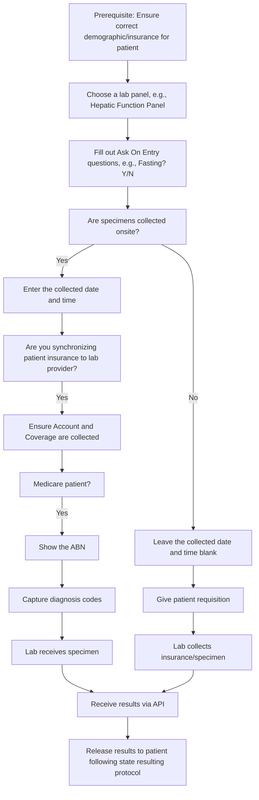

# Health Gorilla Lab Orders

Health Gorilla is an interoperability services used to order labs and diagnostics, and do records requests via API. Medplum offers a first party integration with Health Gorilla.

:::tip
This is advanced integration. [Email us](mailto:info+healthgorilla@medplum.com?subject=Health%20Gorilla%20Integration%20for%20Medplum) for more information.
:::

The Medplum toolkit provides tooling to optimize the physician ordering experience (CPOE), to minimize errors and enhance patient experience. A well defined workflow with diagnostic menu will help set you up for success. The workflows shown here are intended to reduce the amount of repeated data entry required by clinicians and staff.

This guide is not comprehensive, but is meant to be used as a tool in planning and scoping your lab orders workflow.

## Workflow considerations

The following flowchart shows the most common workflows associated with Lab orders for illustration.

As indicated by the flowchart, designing your workflow will require making decisions about which of the nodes in the above flowchart apply to your workflow. Refer to the following table for major considerations and implementation implications.

| Choice              | Implication                                  | Samples (Medplum Team)                                                                                                |
| ------------------- | -------------------------------------------- | --------------------------------------------------------------------------------------------------------------------- |
| Lab Menu            | Determines AOE questions                     | Coming soon                                                                                                           |
| Specimens onsite    | Enter specimen date time                     | [Sample Req w/ collected date](https://drive.google.com/file/d/1gVvhw-2OnW9IlwZU2ly13jZGbGMAyW0O/view?usp=drive_link) |
| Specimens offsite   | Share requisition with patient               | [Sample PSC Hold](https://drive.google.com/file/d/1EIwAmFxrgdvRNBbL3p9pm4RarKXUS-ET/view?usp=drive_link)              |
| Medicare insurance  | Diagnosis codes                              | [Diagnosis samples](https://drive.google.com/file/d/1cFHGBud9IlGH86yilxe-KkDxGUbGr2Mn/view?usp=drive_link)            |
| Medicare insurance  | Show patient ABN, and collect copay          | [Sample ABN](https://drive.google.com/file/d/1l6VbtqdlkDbCJr_DPQwfKOpoaRo2giTM/view?usp=drive_link)                   |
| Multiple insurances | Send insurances in priority order            | [Sample requisition](https://drive.google.com/file/d/1QMrLkP71ysQEMIi3EOKx0BWeJOATUeCw/view?usp=drive_link)           |
| Release results     | Show patient PDF follow in state regulations | Coming soon                                                                                                           |

## Requisitions

Requisitions from Health Gorilla are PDFs, and have multiple use cases based off of the desired workflow. The below describes the sample use cases for requisitions.

| Scenario                               | Action                                                                  | Sample                                                                                                      |
| -------------------------------------- | ----------------------------------------------------------------------- | ----------------------------------------------------------------------------------------------------------- |
| Specimens collected on site            | Attach requisition to sample when dropped off at lab                    | [Sample requisition](https://drive.google.com/file/d/1EIwAmFxrgdvRNBbL3p9pm4RarKXUS-ET/view?usp=drive_link) |
| Specimens collected at third party lab | Send patient with requisition to lab                                    | [Sample requisition](https://drive.google.com/file/d/1EIwAmFxrgdvRNBbL3p9pm4RarKXUS-ET/view?usp=drive_link) |
| Bill provider account                  | Send patient with requisition but they will not need to provide payment | Coming soon                                                                                                 |
| Bill multiple insurances               | Send specimen to lab and lab will bill both insurances in order         | [Sample requisition](https://drive.google.com/file/d/1QMrLkP71ysQEMIi3EOKx0BWeJOATUeCw/view?usp=drive_link) |

## Specimens

If collecting specimens on site, you'll need to provide the collection details and attach a printed specimen with barcode to the specimen to ensure correct chain of custody and turnaround times. This [sample requisition](https://drive.google.com/file/d/1EIwAmFxrgdvRNBbL3p9pm4RarKXUS-ET/view?usp=drive_link) shows an example of a PDF that should be printed and attached.

## Medicare

Medicare has two important integration features that need to be implemented in order to implement the workflow. These are (1) Advanced Beneficiary Notice (ABN) and (2) Diagnosis codes.

In an integration, and Advanced Beneficiary Notice (ABN) is a PDF that is generated by the Health Gorilla system for orders that are placed for patients with Medicare coverage. They give the patient an indication of their out of pocket cost for the lab test. The patient should be informed of their expected cost before testing. This is a [Sample ABN](https://drive.google.com/file/d/1l6VbtqdlkDbCJr_DPQwfKOpoaRo2giTM/view?usp=drive_link).

In the majority of Medicare orders, patients need diagnosis codes added to their order to receive overage for the tests, so it's important to include those. These are ICD-10 codes, and a sample `ValueSet` with common ICD-10 codes can be [downloaded](https://drive.google.com/file/d/1cFHGBud9IlGH86yilxe-KkDxGUbGr2Mn/view?usp=drive_link)

## Diagnosis Codes

For all lab orders, entering diagnosis codes is a best practice, as interpretations of lab results can be a function of diagnosis.

## Glossary

In a lab implementation, you'll see the following abbreviations.

| Term             | Meaning                          | Details                                                                                                                                                                                       |
| ---------------- | -------------------------------- | --------------------------------------------------------------------------------------------------------------------------------------------------------------------------------------------- |
| PSC              | Patient Service Center           | In a Quest workflow - if you place an order without a specimen and not to a specific center, it is a PSC workflow and the patient can walk into many Quest locations to have the order filled |
| AOE              | Ask on Entry                     | For a given lab test, there may be special questions only needed for that test - these are called Ask on Entry or AOE questions                                                               |
| ABN              | Advanced Beneficiary Notice      | This is a document produced for Medicare patients indicating how much they are likely to pay out of pocket                                                                                    |
| ICD-10           | Diagnosis Code                   | These are codes submitted with orders that indicate what medical conditions patients have                                                                                                     |
| QNS              | Quantity Not Sufficient          | When a report comes back with QNS, there was not enough specimen to do the test                                                                                                               |
| TNP              | Test Not Performed               | This is seen on diagnostic reports where tests were not performed                                                                                                                             |
| NTI              | No test indicated                | This is another error case in the workflow usually related to missing or unclear labeling of specimens                                                                                        |
| NSPR             | No specimen received             | Another error workflow where specimens are not available                                                                                                                                      |
| Patient Bill     | Patient responsible for paying   | This encompasses two cases: one where the patient pays out of pocket and the other where a patient shows their coverage card to the lab                                                       |
| Third Party Bill | Insurance responsible            | In this case, a patient's insurance is billed                                                                                                                                                 |
| Account Bill     | Owner of lab account responsible | This is common in clinical research and concierge care                                                                                                                                        |

## Related Reading

- [Sample Implementation](https://github.com/medplum/medplum/tree/main/examples/medplum-demo-bots/src/health-gorilla) via Medplum Bot - this is reference material that can be used to plan your integration
- [React Component](https://storybook.medplum.com/?path=/story/medplum-questionnaireform--lab-ordering) - this is a sample questionnaire that shows an ordering workflow
