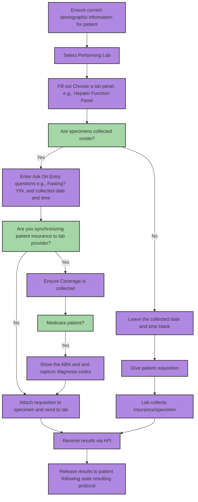

# Health Gorilla Lab Orders

Health Gorilla is an interoperability service that enables healthcare providers to order lab tests and diagnostics through a unified API. Medplum provides a first-party integration with Health Gorilla in order to optimize this experience, minimizing errors and enhancing the patient experience. 

:::tip
Need help? This is an advanced integration. [Contact our team](mailto:info+healthgorilla@medplum.com?subject=Health%20Gorilla%20Integration%20for%20Medplum) for implementation support.
:::

This guide provides an overview of Medplum's Health Gorilla labs integration and a list of recommendations for systemizing lab ordering. 

For more information about the FHIR resources involved in the integration, see [Sending Orders](./sending-orders.md) and [Receiving Results](./receiving-results.md). See our [Changelog](./hg-changelog.md) for information about integration upgrades. 

## Prerequisites 

In order to integrate with Health Gorilla for labs, your organization must: 

- Be a provider organization, i.e. with a clinician licensed to review lab orders, 
- Have an account number with a [connected lab](https://developer.healthgorilla.com/docs/list-of-connected-labs), such as Quest or LabCorp. 

## Requisite information for successful lab order 

Below is a decision tree that helps determine what information must be collected for a successful lab order with this integration. 

Information on how to systemize the collection of this information is included below. 

### Ensure correct demographic information for patient 

[FHIR profiles](/docs/fhir-datastore/profiles) are used to ensure that the correct patient demographic information is collected for every patient. 

### Select performing lab 

In order to use Health Gorilla's integration, you must retain an account number with the lab directly. This can be done programmatically (see [Sending Orders](./sending-orders.md) for more details). 

### Choose a lab panel 

To standardize the labs or the sets of labs (i.e. blood glucose level, standard STD test set, etc) that can be selected by clinicians, care managers can set up [PlanDefinitions](/docs/api/fhir/resources/plandefinition), that are then instantiated into [ServiceRequests](/docs/api/fhir/resources/servicerequest) when they are ordered for a specific patient. For more information, see our [order structure FHIR data model](/docs/integration/health-gorilla/sending-orders#fhir-data-model). 

### Ensuring Coverage are collected 

When attaching insurance information to the lab order, ensure that the correct Coverage resource is attached. See [Sending Orders](./sending-orders.md) for more details. 

### Show ABN and capture diagnosis codes for Medicare patients

When billing lab orders to Medicare, two features are needed: (1) Advanced Beneficiary Notice (ABN) and (2) Diagnosis codes. 

The Advanced Beneficiary Notice (ABN) is a PDF that is generated by the Health Gorilla system for orders that are placed for patients with Medicare coverage. Patients should be informed for their expected cost before testing, and these documents give an indication of their out-of-pocket costs for the lab test. For a sample ABN document, see [sample PDF's](#sample-health-gorilla-pdfs). 

In the majority of Medicare orders, patients need diagnosis codes added to their order to receive overage for the tests. These are ICD-10 codes, and a sample `ValueSet` with common ICD-10 codes can be [downloaded](https://drive.google.com/file/d/1cFHGBud9IlGH86yilxe-KkDxGUbGr2Mn/view?usp=drive_link).

### Attach requisition to sample and send to lab 

If collecting specimens on site, you'll need to provide the collection details and attach a printed specimen with barcode to the specimen to ensure correct chain of custody and turnaround times. See [sample PDF's](#sample-health-gorilla-pdfs) for an example of a PDF that should be printed and attached.

## Sample Health Gorilla PDF's 

The below table includes a list of sample documents for PDF's provided by Health Gorilla during the lab order requisition process. Please [contact our team](mailto:info+healthgorilla@medplum.com?subject=Health%20Gorilla%20Integration%20for%20Medplum) for access. 

| Sample PDF             | Purpose                                 | 
| ---------------------- | --------------------------------------- | 
| [Sample Req w/ collected date](https://drive.google.com/file/d/1gVvhw-2OnW9IlwZU2ly13jZGbGMAyW0O/view?usp=drive_link) | Requisition for speciments collected onsite, with collection date and time. To be attached to the speciment when sending to lab. | 
| [Sample PSC Hold](https://drive.google.com/file/d/1EIwAmFxrgdvRNBbL3p9pm4RarKXUS-ET/view?usp=drive_link) | Requisition for speciments collected offsite, to be shared with patient. | 
| [Diagnosis samples](https://drive.google.com/file/d/1cFHGBud9IlGH86yilxe-KkDxGUbGr2Mn/view?usp=drive_link) | Sample diagnosis codes, for Medicare patients. | 
| [Sample ABN](https://drive.google.com/file/d/1l6VbtqdlkDbCJr_DPQwfKOpoaRo2giTM/view?usp=drive_link) | Sample ABN document, for Medicare patients. | 
| [Sample Req with multiple insurance](https://drive.google.com/file/d/1QMrLkP71ysQEMIi3EOKx0BWeJOATUeCw/view?usp=drive_link) | Requisition for patients with multiple insurance. | 

## Glossary

In a lab implementation, you'll see the following abbreviations.

| Term             | Meaning                          | Details                                                                                                                                                                                       |
| ---------------- | -------------------------------- | --------------------------------------------------------------------------------------------------------------------------------------------------------------------------------------------- |
| PSC              | Patient Service Center           | In a Quest workflow - if you place an order without a specimen and not to a specific center, it is a PSC workflow and the patient can walk into many Quest locations to have the order filled |
| AOE              | Ask on Entry                     | For a given lab test, there may be special questions only needed for that test - these are called Ask on Entry or AOE questions                                                               |
| ABN              | Advanced Beneficiary Notice      | This is a document produced for Medicare patients indicating how much they are likely to pay out of pocket                                                                                    |
| ICD-10           | Diagnosis Code                   | These are codes submitted with orders that indicate what medical conditions patients have                                                                                                     |
| QNS              | Quantity Not Sufficient          | When a report comes back with QNS, there was not enough specimen to do the test                                                                                                               |
| TNP              | Test Not Performed               | This is seen on diagnostic reports where tests were not performed                                                                                                                             |
| NTI              | No test indicated                | This is another error case in the workflow usually related to missing or unclear labeling of specimens                                                                                        |
| NSPR             | No specimen received             | Another error workflow where specimens are not available                                                                                                                                      |
| Patient Bill     | Patient responsible for paying   | This encompasses two cases: one where the patient pays out of pocket and the other where a patient shows their coverage card to the lab                                                       |
| Third Party Bill | Insurance responsible            | In this case, a patient's insurance is billed                                                                                                                                                 |
| Account Bill     | Owner of lab account responsible | This is common in clinical research and concierge care                                                                                                                                        |

## Related Reading

- [Sample Implementation](https://github.com/medplum/medplum/tree/main/examples/medplum-health-gorilla-demo) via Medplum Bot - this is reference material that can be used to plan your integration
- [React Component](https://storybook.medplum.com/?path=/story/medplum-questionnaireform--lab-ordering) - this is a sample questionnaire that shows an ordering workflow
