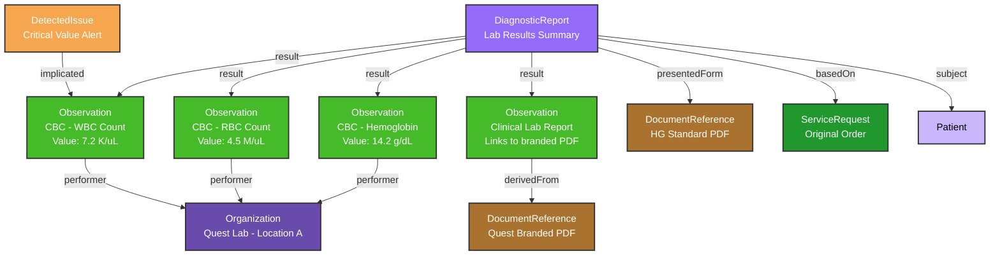

# Receiving Results

This guide explains how laboratory results are handled in the Medplum-Health Gorilla labs integration.

When Health Gorilla receives results from performing laboratories (Quest, Labcorp, regional labs, etc.), they will be synchronized into your project as structured FHIR resources via the `receive-from-health-gorilla` Bot.

## Key Concepts

Understanding how results are structured and connected is essential for building clinical workflows and displaying results to providers.

| Concept                   | Description                                                                                                        |
| ------------------------- | ------------------------------------------------------------------------------------------------------------------ |
| Unsolicited Results       | Lab values delivered as machine-readable FHIR `Observations`                                                       |
| Performing Lab Details    | `Organization` information for the specific lab that processed specimens                                           |
| Health Gorilla PDF Report | `DocumentReference` containing CLIA-certified lab report in a format that is consistent across all performing labs |
| Clinical Lab PDF Report   | `DocumentReference` containing the original lab report delivered by the performing lab                             |
| Structured Lab Results    | Lab values delivered as machine-readable FHIR `Observations`                                                       |

## FHIR Data Model

Laboratory results are represented as a suite of resource that preserves both structured and unstructured data for clinical workflows and original documentation for regulatory compliance.

In this section, we describe the primary resources used in Health Gorilla lab results.



## Result Resource Types

### DiagnosticReport

The `DiagnosticReport` serves as the primary container for all results related to a specific order, providing summary information and organizing individual observations.

**Key Fields:**

| Field                                | Description                                                                                                                                                                                                                                                                                                                                                  |
| ------------------------------------ | ------------------------------------------------------------------------------------------------------------------------------------------------------------------------------------------------------------------------------------------------------------------------------------------------------------------------------------------------------------ |
| `DiagnosticReport.basedOn`           | References the original [order `ServiceRequest`](./sending-orders#order-structure) that generated this result                                                                                                                                                                                                                                                |
| `DiagnosticReport.identifier`        | Contains multiple identifiers: <ul><li>Health Gorilla's unique identifier for the report</li><li>**Placer ID**: This is the _performing lab's_ order identifier. Also known as the "Lab reference id."</li><li>**Lab's accession number**: A unique identifier assigned by the performing laboratory to the specific _specimen_ when it is opened.</li></ul> |
| `DiagnosticReport.result`            | Array of references to individual `Observation` resources containing lab values                                                                                                                                                                                                                                                                              |
| `DiagnosticReport.presentedForm`     | References to PDF reports from Health Gorilla                                                                                                                                                                                                                                                                                                                |
| `DiagnosticReport.status`            | Result status (`preliminary`, `final`, `amended`, `corrected`)                                                                                                                                                                                                                                                                                               |
| `DiagnosticReport.effectiveDateTime` | When specimens were collected                                                                                                                                                                                                                                                                                                                                |
| `DiagnosticReport.issued`            | When results were released by the lab                                                                                                                                                                                                                                                                                                                        |

**Example Structure:**

```js
{
  "resourceType": "DiagnosticReport",
  "identifier": [
    // Health Gorilla Unique ID
    {
      "system": "https://www.healthgorilla.com",
      "value": "7890"
    },
    // Accession Id
    {
      "type": {
        "coding": [
          {
            "system": "http://terminology.hl7.org/CodeSystem/v2-0203",
            "code": "ACSN",
            "display": "Accession ID"
          }
        ],
        "text": "Accession Number"
      },
      "value": "CF020052R"
    },
    // Placer Id
    {
      "type": {
        "coding": [
          {
            "system": "http://terminology.hl7.org/CodeSystem/v2-0203",
            "code": "PLAC",
            "display": "Placer"
          }
        ],
        "text": "Placer"
      },
      "value": "1452503"
    }
  ]
  // Result status
  "status": "final",

  // Report type
  "code": {
    "coding": [
      {
        "system": "http://loinc.org",
        "code": "58410-2",
        "display": "Complete blood count (CBC) panel"
      }
    ]
  },
  // Reference to original Order
  "basedOn": [
    {
      "reference": "ServiceRequest/original-order-123"
    }
  ],

  // Reference to Patient
  "subject": {
    "reference": "Patient/4556",
    "display": "Homer Simpson"
  },

  // Reference to top-level performing lab
  "performer": [
    {
      "reference": "Organization/abcdef",
      "display": "Quest"
    }
  ],

  // Time of specimen receipt
  "effectiveDateTime": "2025-06-27T00:41:00Z",
  // Time of result release
  "issued": "2025-06-30T15:34:54Z",

  // Structured Lab results
  "result": [
    { "reference": "Observation/wbc-count-456" },
    { "reference": "Observation/rbc-count-789" },
    { "reference": "Observation/clinical-lab-report-999" }
  ],

  // Link to Health Gorilla PDF Report
  "presentedForm": [
    {
      "contentType": "application/pdf",
      "url": "https://storage.medplum.com/binary/123",
      "title": "DiagnosticReport-7890.pdf"
    }
  ]
}
```

### Observations

Individual lab values are represented as `Observation` resources, with each test result getting its own observation. Health Gorilla provides rich metadata including reference ranges, abnormal flags, and performing lab details.

**Standard Lab Value Observations:**

| Field                        | Description                                                                   |
| ---------------------------- | ----------------------------------------------------------------------------- |
| `Observation.code`           | LOINC code for the specific test                                              |
| `Observation.value[x]`       | The measured value (Quantity, CodeableConcept, or string)                     |
| `Observation.referenceRange` | Normal ranges provided by the performing lab                                  |
| `Observation.interpretation` | Abnormal flags (High, Low, Critical, etc.)                                    |
| `Observation.note`           | Additional clinical notes or comments about the test result                   |
| `Observation.performer`      | `Organization` reference to the specific lab location that performed the test |

```js
{
  "resourceType": "Observation",

  // Result status
  "status": "final",

  // Health Gorilla Unique ID
  // Consists of the Report ID + the code value
  "identifier": [
    {
      "system": "https://www.healthgorilla.com",
      "value": "7890-6690-2"
    }
  ],

  // Reference to Patient
  "subject": {
    "reference": "Patient/4556",
    "display": "Homer Simpson"
  },

  // LOINC code
  "code": {
    "coding": [
      {
        "system": "http://loinc.org",
        "code": "6690-2",
        "display": "Leukocytes [#/volume] in Blood by Automated count"
      }
    ]
  },

  // Result value
  "valueQuantity": {
    "value": 7.2,
    "unit": "10*3/uL",
    "system": "http://unitsofmeasure.org"
  },

  // Abnormal Flags
  "interpretation": [
    {
      "coding": [
        {
          "system": "http://terminology.hl7.org/CodeSystem/v2-0078",
          "code": "H",
          "display": "Above high normal"
        },
        {
          "system": "http://terminology.hl7.org/CodeSystem/v3-ObservationInterpretation",
          "code": "H",
          "display": "Above high normal"
        },
        {
          "system": "https://www.healthgorilla.com/observation-interpretation",
          "code": "H",
          "display": "Above high normal"
        }
      ],
      "text": "Above high normal"
    }
  ],

  // Additional Free-text notes
  "note": [
    {
      "text": "Fasting reference interval. "
    }
  ],

  // Normal range for this patients age/sex/weight
  "referenceRange": [
    {
      "low": { "value": 4.5 },
      "high": { "value": 11.0 }
    }
  ],

  // Performing Lab Location
  "performer": [
    {
      "reference": "Organization/quest-lab-location-123"
    }
  ]
}
```

**Clinical Lab Report Observation:**
Health Gorilla creates a special observation called "clinical lab report" that serves as a bridge between structured data and the lab's branded PDF documentation.

| Field                     | Description                                                                        |
| ------------------------- | ---------------------------------------------------------------------------------- |
| `Observation.derivedFrom` | References a `DocumentReference` with the lab's branded PDF (Quest, Labcorp, etc.) |

### DocumentReference

Unstructured PDF reports are stored as `DocumentReference` resources, with different types serving different purposes in the clinical workflow.

**Health Gorilla Standard PDF:**

- Referenced by `DiagnosticReport.presentedForm`
- Standardized format across all labs
- Optimized for electronic health record display
- `DocumentReference.category` set to:
  - **system:** https://www.medplum.com/integrations/health-gorilla/document-type`
  - **value**: `DiagnosticReport`

**Lab-Branded PDFs:**

- Referenced by the "clinical lab report" observation via `derivedFrom`
- Original lab formatting (Quest, Labcorp, regional lab branding)
- May include additional lab-specific information and marketing
- Preferred for patient communication and external sharing

**Example:**

```json
{
  "resourceType": "DocumentReference",
  "status": "current",
  "docStatus": "final",
  "category": [
    {
      "coding": [
        {
          "system": "https://www.medplum.com/integrations/health-gorilla/document-type",
          "code": "DiagnosticReport"
        }
      ]
    }
  ],

  // Reference to Patient
  "subject": {
    "reference": "Patient/4556",
    "display": "Homer Simpson"
  },

  // Health Gorilla unique ID
  "identifier": [
    {
      "system": "https://www.healthgorilla.com",
      "value": "123456"
    }
  ],

  "content": [
    {
      "attachment": {
        "contentType": "application/pdf",
        "url": "https://storage.medplum.com/binary/87654",
        "title": "DiagnosticReport-123456.pdf"
      }
    }
  ]
}
```

### Detected Issues

The Medplum Health Gorilla integration creates `DetectedIssue` resources to flag clinical workflow concerns.

Currently, the main source of `DetectedIssues` are unsolicited reports (see below)

**Common Issue Types:**

| Issue Type             | Description                                                                 |
| ---------------------- | --------------------------------------------------------------------------- |
| **Unsolicited Report** | Results received for a patient without a corresponding order in your system |
| **Unknown Patient**    | Results received for a patient not found in your patient database           |

**Example Unsolicited Report:**

```js
{
  "resourceType": "DetectedIssue",
  // Code is `unsolicited-diagnostic-report` or  `unknown-patient`
  "code": {
    "coding": [
      {
        "system": "https://www.medplum.com/integrations/health-gorilla/issue-type",
        "code": "unsolicited-diagnostic-report"
      }
    ]
  },
  // Reference to the  offending report
  "implicated": [
    {
      "reference": "DiagnosticReport/123abc"
    }
  ]
}
```

### Organizations

Health Gorilla returns detailed information about the performing laboratory for each observation. If the corresponding lab does not exist inside your Medplum project, `receive-from-health-gorilla` will create the corresponding `Organization` resource and link it to each observation.

**Key Information Captured:**

- Lab name and location details
- Physical address
- Lab director contact information

**Example:**

```js
{
  "resourceType": "Organization",
  "name": "Quest Diagnostics - Regional Lab 123",
  "address": [
    {
      "line": ["1234 Lab Drive"],
      "city": "San Francisco",
      "state": "CA",
      "postalCode": "94102"
    }
  ],
  "partOf": {
    "reference": "Organization/quest-lab-location-123",
    "display": "Quest"
  },
  "contact": [
    {
      "purpose": {
        "coding": [
          {
            "system": "http://hl7.org/fhir/contactentity-type",
            "code": "ADMIN"
          }
        ]
      },
      "name": {
        "text": "Ronald McDonald CLS"
      }
    }
  ],
}
```

## Lab-specific Behavior

### Quest

- **Preliminary Results**: Quest sends preliminary results on a rolling basis, and will send the same report multiple times, updating Medplum's `DiagnosticReport` resource _in-place_. Monitor the value of `DiagnosticReport.status` to see when the report has been finalized.

## Special Workflows

### Unsolicited Reports

Occasionally, laboratories send results without a corresponding order in the system. This typically occurs when:

- Providers order tests directly through lab websites or phone calls
- Reflex testing triggers additional tests beyond the original order

**Processing Logic:**

1. `receive-from-health-gorilla` attempts to match the result to a patient using the patient's Health Gorilla identifier
2. If a matching patient exists, the result is imported normally, but without a `DiagnosticReport.basedOn` reference
3. A `DetectedIssue` with code `unsolicited-diagnostic-report` is created
4. If no patient match is found, a new `Patient` resource is created using the demographic information provided by the lab
5. A `DetectedIssue` with code `unknown-patient` is created
