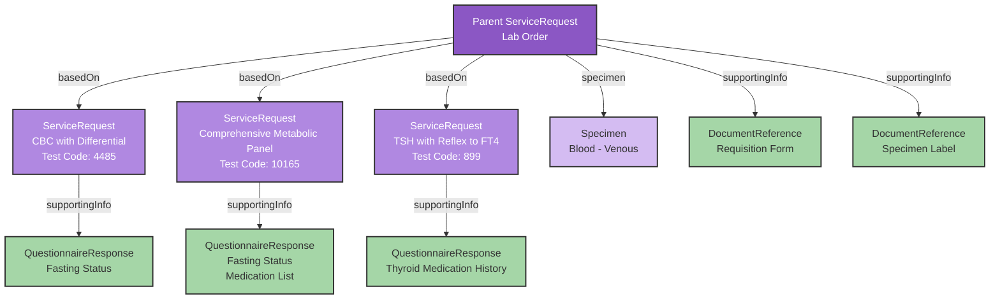

# Sending Orders

This guide explains how laboratory orders work in the Medplum-Health Gorilla labs integration.

The high-level workflow for sending laboratory & imaging orders is:

1. Present the provider with the appropriate lab order form (CPOE)
2. Create the appropriate FHIR resources based on that information
3. Execute the appropriate Medplum Bot to send the order to the performing lab.

## Key Concepts

Laboratory ordering involves unique complexities: coordinating between providers, labs, and collection facilities; handling physical specimens; and gathering clinical data. Understanding these core concepts is essential before implementing the technical details.

The following concepts form the foundation of laboratory ordering:

| Concept                  | Description                                                                                                      | Importance                                                                                                                                                                                                                                             |
| ------------------------ | ---------------------------------------------------------------------------------------------------------------- | ------------------------------------------------------------------------------------------------------------------------------------------------------------------------------------------------------------------------------------------------------ |
| Order                    | Request for one or more lab tests, uniquely identified and tracked.                                              | Organizes tests, specimens and results. Maintains chain of custody and enables status tracking.                                                                                                                                                        |
| Test                     | Specific diagnostic procedure with defined requirements for specimen and data collection.                        | Determines specimen needs, required clinical data, and handling protocols. Impacts turnaround times and costs.                                                                                                                                         |
| Specimen                 | Physical sample (blood, urine, etc.) for analysis.                                                               | Samples are only valid for a certain amount of time after collection. Accurately measuring sample collection time is critical for accurate processing <br/><br/> Samples can either be collected by the performing lab, or by the requesting provider. |
| Ask on Order Entry (AOE) | **Required** questions for some labs to gather additional clinical context for test processing.                  | Affects lab processing, result interpretation, and billing. Missing data can cause rejections or delays.                                                                                                                                               |
| Order Splitting          | Breaking a single order into multiple independent orders, typically when tests require different specimen types. | Allows labs to process specimens independently and maintain separate workflows for different test types. Prevents delays when specimens are collected at different times.                                                                              |

## Creating an Order Form in React

Medplum provides a "headless UX" approach through specialized React components for building laboratory order forms.

### Core Components

The integration centers around two main components:

1. `HealthGorillaLabOrderProvider`: Context provider for state management
2. `useHealthGorillaLabOrder`: Hook for accessing state and operations

### State Management

The hook manages a comprehensive state object:

```typescript
type HealthGorillaLabOrderState = {
  performingLab: LabOrganization | undefined;
  selectedTests: TestCoding[];
  testMetadata: Record<string, TestMetadata>;
  diagnoses: DiagnosisCodeableConcept[];
  billingInformation: BillingInformation;
  specimenCollectedDateTime: Date | undefined;
  orderNotes: string | undefined;
};
```

### Building an Order Form

You can find an open-source example order form [here](https://github.com/medplum/medplum-health-gorilla-demo/blob/main/src/HomePage.tsx). Feel free to use this as a starting point.

1. Wrap your application:

```tsx
function OrderPage() {
  return (
    <HealthGorillaLabOrderProvider>
      <OrderForm />
    </HealthGorillaLabOrderProvider>
  );
}
```

2. Initialize with context:

```tsx
function OrderForm() {
  const [patient, setPatient] = useState<Patient>();
  const [requester, setRequester] = useState<Practitioner>();

  const labOrderReturn = useHealthGorillaLabOrder({
    patient,
    requester,
  });
}
```

3. Access operations:

```tsx
const {
  state,
  searchAvailableTests,
  setTests,
  setDiagnoses,
  updateBillingInformation,
  setSpecimenCollectedDateTime,
  setOrderNotes,
  createOrderBundle,
} = labOrderReturn;
```

| Command                         | Purpose                                                                                                         |
| ------------------------------- | --------------------------------------------------------------------------------------------------------------- |
| `searchAvailableTests`          | Uses the `autocomplete` bot to fetch available lab tests from Health Gorilla's API based on search string       |
| `searchAvailableLabs`           | Uses the `autocomplete` bot to fetch available diagnostic labs from Health Gorilla's API based on search string |
| `setTests`                      | Updates selected tests in order state                                                                           |
| `setDiagnoses`                  | Updates ICD-10 diagnosis codes in order state                                                                   |
| `updateBillingInformation`      | Updates payment details (patient, insurance, customer account)                                                  |
| `setSpecimenCollectedDateTime`  | Sets when specimens were/will be collected                                                                      |
| `setOrderNotes`                 | Adds notes/instructions for the lab                                                                             |
| `createOrderBundle`             | Creates FHIR resources for the complete order                                                                   |
| `setPerformingLab`              | Sets which lab will process the tests                                                                           |
| `setPerformingLabAccountNumber` | Sets the clients lab account number to be used for selected lab (e.g. Quest account number)                     |
| `validateOrder`                 | Checks order for required fields and valid data                                                                 |

#### Example

Lab Selection:

```tsx
<MyAutoComplete
  label="Performing Lab"
  loadOptions={searchAvailableLabs}
  onChange={(e) => {
    setPerformingLab(e.value as Organization);
    // Account number can be hardcoded or dynamic
    setPerformingLabAccountNumber(accountNumber);
  }}
/>
```

Test Selection:

```tsx
<MyAutoComplete label="Selected tests" loadOptions={searchAvailableTests} onChange={setTests} />
```

Diagnosis Code Selection

```tsx
<ValueSetAutocomplete
  label="Diagnoses"
  binding="http://hl7.org/fhir/sid/icd-10-cm"
  name="diagnoses"
  maxValues={10}
  onChange={(items) => {
    const codeableConcepts = items.map((item) => ({
      coding: [item],
    })) as DiagnosisCodeableConcept[];
    setDiagnoses(codeableConcepts);
  }}
/>
```

Billing Type:

```tsx
<input
   type="radio"
   id="billToPatient"
   name="billTo"
   value="patient"
   onChange={(e) => {
     updateBillingInformation({ billTo: e.target.value });
   }}
 />
 <label htmlFor="billToPatient">Patient</label>

 <input
   type="radio"
   id="billToInsurance"
   name="billTo"
   value="insurance"
   onChange={(e) => {
     updateBillingInformation({ billTo: e.target.value });
   }}
 />
 <label htmlFor="billToInsurance">Insurance</label>
```

[Optional] Insurance Coverage Selection (if `billTo` is `insurance`):

```tsx
{
  patient && state.billingInformation.billTo === 'insurance' && (
    <select
      name="coverage"
      onChange={(e) => {
        updateBillingInformation({
          patientCoverage: { reference: `Coverage/${e.target.value}` },
        });
      }}
    >
      <option value="">Select Insurance Coverage</option>
      {coverages.map((coverage) => (
        <option key={coverage.id} value={coverage.id}>
          {coverage.payor?.[0]?.display || 'Unknown Insurance'}
        </option>
      ))}
    </select>
  );
}
```

[Optional] Specimen Collection Time (if drawing in-house):

```tsx
<input
  type="datetime-local"
  onChange={(e) => {
    setSpecimenCollectedDateTime(e.target.value ? new Date(e.target.value) : undefined);
  }}
/>
```

Order Creation:

```tsx
async function handleOrderCreation() {
  try {
    const { serviceRequest } = await createOrderBundle();
    await sendLabOrderToHealthGorilla(medplum, serviceRequest);
  } catch (err) {
    if (err instanceof LabOrderValidationError) {
      // Handle validation errors
    }
  }
}
```

## FHIR Data Model

Laboratory orders use a two-level hierarchy of FHIR resources, with a parent order containing multiple individual tests.



### Order Structure

The parent order is represented by a `ServiceRequest` resource with the profile `https://medplum.com/profiles/integrations/health-gorilla/StructureDefinition/MedplumHealthGorillaOrder`. This order contains high-level information like:

- The ordering provider (`ServiceRequest.requester`)
- The performing laboratory (`ServiceRequest.performer`)
- Overall order status (`ServiceRequest.status`)
- Shared documentation (`ServiceRequest.supportingInfo`)

Each individual test within the order is represented by its own `ServiceRequest` resource that:

- Links back to the parent order using `ServiceRequest.basedOn`
- Contains the specific test code from the performing lab's compendium
- Holds test-specific details, including Ask on Order Entry (AoE) questions.

### Supporting Resources

Several additional FHIR resources provide important order details:

1. **Ask on Entry (AoE) Responses**
   - Stored as `QuestionnaireResponse` resources
   - Referenced by each test's `ServiceRequest.supportingInfo`
   - Contains answers to test-specific questions

2. **Specimens**
   - The `Specimen` resource tracks specimen details
   - Particularly important for recording `collectionDate` with in-house collections
   - Links specimen type and collection method information

3. **Documents**
   Two types of `DocumentReference` resources are linked through `ServiceRequest.supportingInfo`:
   - **Requisition Form**: The official order documentation with the lab's requisition number
   - **Specimen Label**: PDF with specimen labeling information that can be affixed to sample collection tubes (used for in-house specimen collection)

## Order Lifecycle

Orders progress through several states:

1. `draft`
   - Initial state from the order form
   - Order has not yet been sent to the Health Gorilla
   - All updates and changes are allowed in Medplum

2. `active`
   - Order has been transmitted to Health Gorilla and the performing lab
   - The downstream lab (e.g Quest, Labcorp) consider this order immutable
   - No modifications allowed in lab's system
   - Set by the `send-to-health-gorilla` bot

3. `completed`
   - Results have been received
   - Order processing is finished
   - Set by the `receive-from-health-gorilla` bot

4. `on-hold`
   - An error occurred during processing
   - Set
   - Error details can be found
   - Requires intervention to resolve
   - Set by the `send-to-health-gorilla` bot

5. `revoked`
   - Order has been canceled
   - Cannot be reactivated
   - Set by the client application

::: caution

Important: Once an order becomes `active`, it cannot be modified in the lab's system, even if updated in Medplum.

:::

## Automation Bots

### send-to-health-gorilla Bot

Input: Order `ServiceRequest`

Actions:

1. Syncs patient and practitioner data with Health Gorilla
2. Assigns Health Gorilla identifiers
3. Transmits order with billing information
4. Updates order status
5. Downloads and stores:
   - Requisition forms
   - Specimen labels

### split-order Bot

In some cases, the `send-to-health-gorilla`, but will return an error as follows, asking for the order to be split and resubmitted.

```ts
{
  "resourceType": "OperationOutcome",
  "extension": [
    {
      "url": "https://api.healthgorilla.com/fhir/R4/fhir/StructureDefinition/operationoutcome-order-splitting",
      "valueString": "436|1877;9230;900323"
    }
  ],
  "issue": [
    {
      "severity": "fatal",
      "code": "processing",
      "details": {
        "coding": [
          {
            "code": "order-splitting-required"
          }
        ],
        "text": "Splitting required"
      }
    }
  ]
}

```

In this case, you can use the split order but to create new orders based off of the original. Each of these orders can then be submitted to `send-to-health-gorilla`

Example payload:

```typescript
const params = {
  resourceType: 'Parameters',
  parameter: [
    { name: 'order', valueReference: { reference: 'ServiceRequest/example' } },
    { name: 'groups', valueString: '436|1877;9230;900323' },
  ],
};
```

Actions:

1. Creates new parent orders for each group
2. Reassigns child test `ServiceRequest` resources
3. Updates original order to `entered-in-error`
4. Uses `ServiceRequest.replaces` for order history

Each new order references the original using `replaces` for audit purposes.
