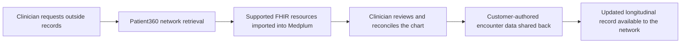

# Health Information Exchange (HIE)

A patient's story rarely lives in one place. When a clinician is making a care decision, the most
useful history may have been recorded by another practice, hospital, or health system.

Medplum's Health Information Exchange integration brings that outside history into the Medplum chart
through Health Gorilla Patient360. It also supports sharing new, customer-authored care data back to
the exchange network, so the workflow is useful to both your team and the broader care community.

:::caution[Medplum setup and network approval required]
HIE is a managed integration currently available to approved customers. Health Gorilla and the
applicable networks review each participating organization before access is enabled.
[Contact the Medplum team](mailto:info+healthgorilla@medplum.com?subject=Health%20Information%20Exchange%20for%20Medplum)
to talk through eligibility, scope, and implementation support.
:::

## What the integration gives your team

:::info[At a glance]

- **Retrieve outside records:** request a patient's longitudinal record and bring supported FHIR R4
  resources into the Medplum chart.
- **Review data in context:** keep imported problems, medications, allergies, results, procedures, and
  notes connected to the existing Medplum patient.
- **Share new care data:** send customer-authored encounter data back through Health Gorilla.
- **Track every step:** use FHIR `Task` resources, provenance tags, audit events, and share-back
  archives to understand what happened.

:::

## How the integration works

A Patient360 retrieval is asynchronous and can take minutes or longer while connected networks prepare
the record. Medplum tracks the request with a FHIR [`Task`](/docs/api/fhir/resources/task), prevents a
second retrieval while one is open, and retries processing if a completion webhook is early or missed.

When results are ready, Medplum imports supported resources with their references and source identity
preserved. Reprocessing the same result updates previously imported resources instead of creating a
second copy. Patient360-sourced resources are marked and excluded from later share-back, so outside data
is never returned to the network as though your organization authored it.

## Choose your next step

- **New to the integration?** Start with
  [Getting Started](/docs/integration/health-information-exchange/getting-started) for onboarding, data
  preparation, sandbox validation, and go-live planning.
- **Building the retrieval experience?** See
  [Retrieve Patient Records](/docs/integration/health-information-exchange/retrieving-patient-records)
  for patient matching, operation details, `Task` states, and the inbound data model.
- **Preparing data reciprocity?** See
  [Share Clinical Data](/docs/integration/health-information-exchange/sharing-clinical-data) for
  encounter requirements, share-back scope, validation, and audit records.

## Common use cases

- Give a treating clinician access to records from outside organizations before or during a visit.
- Incorporate external problems, medications, allergies, results, procedures, and notes into a
  longitudinal FHIR chart.
- Pre-populate clinical review and reconciliation workflows with exchange data.
- Share new encounter documentation back to participating organizations.
- Track retrieval state, imported data provenance, and share-back outcomes using FHIR resources and
  Medplum audit logs.

## Before you begin

Health Gorilla and the applicable exchange networks vet each participating organization. Onboarding
commonly includes organizational and practice details, NPIs, evidence of the organization's healthcare
role, treatment-purpose agreement, and a defined share-back workflow. Requirements vary by network,
and Medplum will help your team understand what applies to your implementation.

:::note[HIE and lab ordering are separate workflows]
This guide covers longitudinal record exchange. For lab orders and results through Health Gorilla,
see [Health Gorilla Lab Orders](/docs/integration/health-gorilla).
:::

## Security and data governance

- Allow only authorized users to start a retrieval or run share-back.
- Use this workflow only for the supported treatment purpose recorded by the integration.
- Clinically review retrieved data before incorporating it into treatment decisions or releasing it
  to a patient-facing workflow.
- Test [AccessPolicies](/docs/access/access-policies) against every imported resource type. Standalone
  resources such as `Practitioner`, `Organization`, and `Location` do not gain patient-compartment
  access merely because another resource references them.
- Remember that Patient360 imports attachment metadata, not attachment bodies.
- Review share-back outcomes and request/response archives as part of normal integration operations.

## Related reading

- [Getting Started](/docs/integration/health-information-exchange/getting-started)
- [A Technical Guide to TEFCA](/blog/technical-guide-to-tefca)
- [AccessPolicies](/docs/access/access-policies)
- [Patient deduplication](/docs/fhir-datastore/patient-deduplication)
- [FHIR transaction bundles](/docs/fhir-datastore/fhir-batch-requests)
