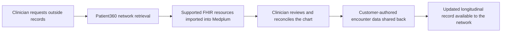

# Health Information Exchange (HIE)

Medplum's Health Information Exchange integration connects a Medplum project to external clinical
records through Health Gorilla Patient360. It supports two complementary workflows:

- **Retrieve records:** request a patient's longitudinal record and import supported FHIR R4
  resources into the patient's Medplum chart.
- **Share records:** send customer-authored clinical data from Medplum back to the exchange network.

Together, these workflows give clinicians relevant outside records at the point of care and support
the data reciprocity expected by exchange networks.

:::tip[Planning an HIE implementation?]
HIE access is a managed integration that requires organizational onboarding and network approval.
[Contact the Medplum team](mailto:info+healthgorilla@medplum.com?subject=Health%20Information%20Exchange%20for%20Medplum)
to confirm eligibility, scope, and implementation support.
:::

:::note[Limited availability]
The Patient360 retrieval and share-back workflows are currently available to approved HIE customers.
Medplum will confirm environment availability and rollout requirements during onboarding.
:::

## How the integration works

A record retrieval is asynchronous and can take minutes or longer while Patient360 queries connected
networks. Medplum records each request as a FHIR [`Task`](/docs/api/fhir/resources/task), prevents a
second request while one is open, and retries processing if a completion webhook is early or missed.

When results are ready, Medplum imports supported resources with their references and source identity
preserved. Reprocessing the same result updates previously imported resources instead of creating a
second copy. Resources imported from Patient360 are marked as exchange-sourced and are excluded from
later share-back, preventing the integration from returning the network's own data as though it were
new customer-authored data.

For implementation details, see:

- [Retrieve patient records](/docs/integration/health-information-exchange/retrieving-patient-records)
- [Share clinical data](/docs/integration/health-information-exchange/sharing-clinical-data)

## Common use cases

- Give a treating clinician access to records from outside organizations before or during a visit.
- Incorporate external problems, medications, allergies, results, procedures, and notes into a
  longitudinal FHIR chart.
- Pre-populate clinical review and reconciliation workflows with exchange data.
- Share new encounter documentation back to participating organizations.
- Track retrieval state, imported data provenance, and share-back outcomes using FHIR resources and
  Medplum audit logs.

## Onboarding requirements

Health Gorilla and the applicable exchange networks vet each participating organization. The exact
requirements depend on the networks in scope, but onboarding commonly includes:

- The organization's legal name, practice details, website, addresses, and NPIs.
- Evidence of the organization's healthcare role, covered-entity status, and insurance billing when
  required by the network.
- Agreement that queries are made for permitted treatment purposes.
- A defined share-back workflow for new clinical data created by the organization.
- Named technical and clinical owners for sandbox validation and production operations.

Medplum coordinates vendor provisioning, project configuration, callback setup, and connectivity
testing. Your team is responsible for confirming which users may request and review exchange data,
preparing the patient and encounter data described in these guides, and approving the production
workflow.

## Implementation sequence

1. **Define scope:** identify participating organizations, clinical users, expected query volume, and
   the application workflow that starts a retrieval.
2. **Complete network onboarding:** provide organizational evidence and execute the applicable
   participation terms.
3. **Prepare FHIR data and access controls:** validate patient matching demographics, encounter
   documentation, clinical coding, and [AccessPolicies](/docs/access/access-policies).
4. **Enable the sandbox integration:** Medplum provisions Patient360 access and the shared retrieval,
   callback, recovery, and share-back components.
5. **Run end-to-end validation:** retrieve data for an approved test patient, review the imported chart,
   share customer-authored encounter data, and confirm the result with Medplum and Health Gorilla.
6. **Go live and monitor:** review retrieval `Task` resources, Bot execution audit events, and share-back
   outcomes as part of normal integration operations.

:::note[HIE and lab ordering are separate workflows]
This guide covers longitudinal record exchange. For lab orders and results through Health Gorilla,
see [Health Gorilla Lab Orders](/docs/integration/health-gorilla).
:::

## Security and data governance

- Only authorized users should be allowed to start a retrieval or run share-back.
- The integration records treatment as the purpose of use for Patient360 requests. Do not use this
  workflow for an unsupported purpose.
- Clinically review retrieved data before incorporating it into treatment decisions or releasing it
  to a patient-facing workflow.
- Imported standalone resources, such as `Practitioner`, `Organization`, and `Location`, do not gain
  patient-compartment access merely because another resource references them. Configure and test your
  project's AccessPolicies for every role that needs to review imported data.
- Patient360 does not import attachment bodies. It retains safe metadata but removes external and
  inline attachment content before writing the containing resource to Medplum.
- Share-back excludes Patient360-sourced resources and records the request and response in Medplum for
  audit and troubleshooting.

## Related reading

- [A Technical Guide to TEFCA](/blog/technical-guide-to-tefca)
- [AccessPolicies](/docs/access/access-policies)
- [Patient deduplication](/docs/fhir-datastore/patient-deduplication)
- [FHIR transaction bundles](/docs/fhir-datastore/fhir-batch-requests)
