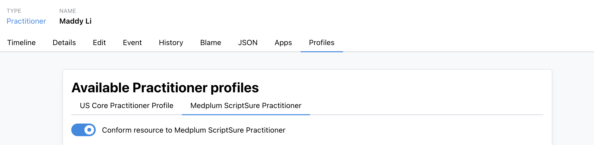

# Sync a Provider

:::caution[Beta]
The ScriptSure integration is in beta. Features and APIs may change.
:::

Before a prescriber can use ScriptSure, they must have a ScriptSure user account linked to their Medplum `ProjectMembership`. There are two ways to accomplish this:

| Approach        | Bot                              | Best for                                               |
| --------------- | -------------------------------- | ------------------------------------------------------ |
| **Invite flow** | `scriptsure-provider-invite-bot` | Provider self-enrolls via a pre-populated sign-up link |
| **Admin sync**  | `scriptsure-provider-sync-bot`   | Bulk onboarding or re-syncing existing providers       |

Both bots will look up the `Practitioner` resource by id, and require the `Practitioner` to have at minimum: `name` (given + family), an `email` telecom, and an NPI identifier (`system: "http://hl7.org/fhir/sid/us-npi"`). DEA and state license are also read when present.

## Practitioner resource

Use the [`MedplumScriptSurePractitioner`](https://medplum.com/profiles/integrations/scriptsure/StructureDefinition/MedplumScriptSurePractitioner) profile when creating or editing prescriber `Practitioner` resources. The profile can be [applied via API](/docs/fhir-datastore/profiles#profile-adoption), or added using the [Practitioner's Profiles Tab](https://app.medplum.com/Practitioner) in the UI.



| Field         | Where to enter                                                                                                                                                                                     | Example                                              |
| ------------- | -------------------------------------------------------------------------------------------------------------------------------------------------------------------------------------------------- | ---------------------------------------------------- |
| Email         | `telecom[system=email]`                                                                                                                                                                            | `jane.doe@clinic.example`                            |
| NPI           | `identifier` with `system: http://hl7.org/fhir/sid/us-npi`                                                                                                                                         | `1234567890`                                         |
| DEA           | `identifier` with `system: http://terminology.hl7.org/NamingSystem/usDEA`                                                                                                                          | `AF1234567`                                          |
| State license | `qualification[].identifier[]` — set `system` to the state OID (`urn:oid:2.16.840.1.113883.4.3.{stateFips}`), `value` to the license number, and `type.coding` to v2-0203 (`MD`, `SL`, `RN`, etc.) | California (`06`): `urn:oid:2.16.840.1.113883.4.3.6` |

DEA and state license are optional, but when present they pre-fill the ScriptSure invite enrollment form via `scriptsure-provider-invite-bot`.

**Example Practitioner**

```json
{
  "resourceType": "Practitioner",
  "meta": {
    "profile": [
      "https://medplum.com/profiles/integrations/scriptsure/StructureDefinition/MedplumScriptSurePractitioner"
    ]
  },
  "name": [{ "given": ["Jane", "Marie"], "family": "Doe", "suffix": ["MD"] }],
  "telecom": [{ "system": "email", "value": "jane.doe@clinic.example" }],
  "identifier": [
    { "system": "http://hl7.org/fhir/sid/us-npi", "value": "1234567890" },
    { "system": "http://terminology.hl7.org/NamingSystem/usDEA", "value": "AF1234567" }
  ],
  "qualification": [
    {
      "code": { "text": "California Medical License" },
      "identifier": [
        {
          "system": "urn:oid:2.16.840.1.113883.4.3.6",
          "value": "A12345",
          "type": {
            "coding": [
              {
                "system": "http://terminology.hl7.org/CodeSystem/v2-0203",
                "code": "MD",
                "display": "Doctor of Medicine"
              }
            ]
          }
        }
      ]
    }
  ],
  "extension": [{ "url": "http://hl7.org/fhir/StructureDefinition/timezone", "valueCode": "US/Eastern" }]
}
```

:::tip[State FIPS codes]
The final segment of the state-license OID is the state FIPS code—for example, California is `6` (`urn:oid:2.16.840.1.113883.4.3.6`) and Washington is `53` (`urn:oid:2.16.840.1.113883.4.3.53`). Set this on `qualification[].identifier.system`.
:::

---

## Invite flow: `scriptsure-provider-invite-bot`

Generates a pre-populated ScriptSure sign-up URL. Send it to the provider–they complete registration in ScriptSure, and a webhook automatically stores their ScriptSure user ID on their `ProjectMembership` when done.

```typescript
const result = await medplum.executeBot(
  { system: 'https://www.medplum.com/bots', value: 'scriptsure-provider-invite-bot' },
  { practitionerId: 'abc123' }
);
// { status: 'invite_generated', inviteUrl: 'https://...', practitionerEmail: '...' }
// status may also be: 'invite_pending' | 'already_enrolled' | 'synced'

if (result.status === 'invite_generated') {
  await sendEmail(result.practitionerEmail, result.inviteUrl);
}
```

---

## Admin sync: `scriptsure-provider-sync-bot`

Creates or updates the provider in ScriptSure directly via the admin API–no invite link required. Use for bulk onboarding or re-syncing after profile changes.

```typescript
const result = await medplum.executeBot(
  { system: 'https://www.medplum.com/bots', value: 'scriptsure-provider-sync-bot' },
  { practitionerId: 'abc123', activate: true, register: true }
);
// { status: 'created' | 'updated' | 'synced', scriptSureUserId: 55555, spi: '...' }
```

`register: true` enrolls the provider on SureScripts for electronic prescribing.
