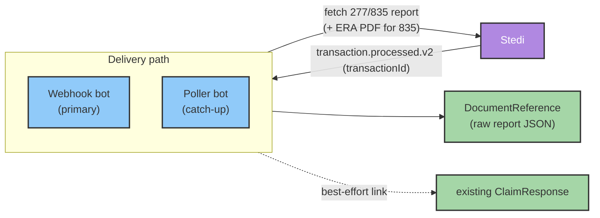

# Claim Responses (277 / 835)

This guide explains how Medplum ingests Stedi inbound claim responses — **277CA** claim acknowledgments and **835** Electronic Remittance Advice (ERA) — and how to set up the two delivery paths: **webhooks** (the primary, near-real-time path) and an optional **poller** (a catch-up safety net).

This workflow is handled by the **Stedi claim-response bots**. Please [contact the Medplum team](mailto:support@medplum.com) to get access to these bots.

## Overview

After you [submit a professional claim](/docs/integration/stedi/claim-submission/professional-claims), payers respond asynchronously:

| Response | X12 | Meaning |
|----------|-----|---------|
| Claim acknowledgment | 277CA | The clearinghouse/payer accepted or rejected the claim for processing |
| Remittance / payment | 835 ERA | Adjudication and payment details for the claim |

Stedi notifies you when a response is ready. The notification delivers only a **`transactionId`** — Medplum then fetches the full report from Stedi's [277 report](https://www.stedi.com/docs/healthcare/api-reference/get-healthcare-reports-277) or [835 report](https://www.stedi.com/docs/healthcare/api-reference/get-healthcare-reports-835) APIs (and, for 835, the [ERA PDF](https://www.stedi.com/docs/healthcare/api-reference/get-era-pdf)).

### Storage model

Reports are stored with **minimal translation**. Each report is saved **verbatim** as a [DocumentReference](/docs/api/fhir/resources/documentreference):

- **No** [ClaimResponse](/docs/api/fhir/resources/claimresponse) or [PaymentReconciliation](/docs/api/fhir/resources/paymentreconciliation) resources are created from the response, and no adjudication/payment fields are mapped. Downstream consumers parse the stored report JSON as needed.
- As a convenience, when a matching `ClaimResponse` already exists (from claim submission), the report `DocumentReference` is **best-effort linked** back to it via an extension (see [ClaimResponse linking](#claimresponse-linking)).



## Bots and operations

| Bot identifier | Operation | Role |
|----------------|-----------|------|
| `stedi-claim-response-webhook` | `$stedi-claim-response-webhook` | Receives Stedi `transaction.processed.v2` deliveries. In production Stedi calls it directly via its identifier-based `$execute` URL; the operation is provided for manual replay/testing |
| `stedi-claim-response-poller` | `$stedi-poll-responses` | Catch-up: polls Stedi for inbound 277/835 transactions missed by the webhook |
| `install-stedi` | `$stedi-install` | One-time setup: creates the webhook `ClientApplication`, prints the webhook URL, and optionally sets project secrets |

All three bots read the project secret **`STEDI_CLAIM_API_KEY`** (the same key used for claim submission).

## What gets stored

| Transaction | DocumentReference(s) created |
|-------------|-----------------------------|
| 277 | One `DocumentReference` (`application/json`) containing the raw 277 report |
| 835 | One `DocumentReference` (`application/json`) containing the raw 835 report, **plus** (best-effort) one `DocumentReference` (`application/pdf`) for the ERA PDF |

Each stored `DocumentReference` carries these identifiers:

| System | Value |
|--------|-------|
| `https://www.stedi.com/transactions/inbound` | The inbound Stedi transaction id (the ERA PDF uses `<transactionId>/pdf`) |
| `https://www.stedi.com/response-type` | `277` or `835` |
| `https://www.stedi.com/events` | The originating webhook event id (present only when delivered via webhook) |

## ClaimResponse linking

The submit-claim bot stamps the **patient control number** (X12 CLM01) onto the `Claim` as an identifier with system `https://www.stedi.com/patient-control-number`. The payer echoes that same value back on the 277/835, so the claim-response flow can correlate an inbound report to the originating `Claim` and its `ClaimResponse`.

When a match is found, a flat extension is added to the `ClaimResponse` referencing the stored report `DocumentReference`:

| Transaction | Extension URL on `ClaimResponse` |
|-------------|----------------------------------|
| 277 | `https://www.stedi.com/fhir/StructureDefinition/claim-response-277-report` |
| 835 | `https://www.stedi.com/fhir/StructureDefinition/claim-response-835-report` |

Linking is **best-effort**: if the control number, `Claim`, or `ClaimResponse` cannot be found, the report is still stored in full as a `DocumentReference` — no data is lost. A single claim per transaction is assumed (only the first control number found in a report is correlated), which matches how claims are submitted (one `Claim` per Stedi transaction).

## Idempotency

Processing is idempotent on the Stedi **inbound `transactionId`** (not the webhook `event.id`). Before fetching a report, the flow checks whether a `DocumentReference` already exists with identifier `https://www.stedi.com/transactions/inbound|<transactionId>`; if so, the transaction is skipped.

This makes it safe for the webhook and the poller to overlap — re-processing the same transaction is a no-op — and safely ignores webhook replays delivered with a new `event.id`.

## Setting up webhooks

Webhooks are the primary, near-real-time delivery path. Setup follows four steps: run the install bot, grab the client credentials it creates, create the webhook in Stedi, and add the transaction-processed event binding.

### Step 1 — Run the Stedi Install bot in your own project

As a **project admin**, invoke the `$stedi-install` operation at the base of your project. This runs the Stedi Install bot, which creates a `ClientApplication` that Stedi uses to authenticate its webhook calls and prints the exact webhook URL to configure. You can optionally set the Stedi project secrets at the same time (any omitted secret is left untouched, so this is safe to re-run):

```http
POST {base}/fhir/R4/$stedi-install
Content-Type: application/fhir+json

{
  "resourceType": "Parameters",
  "parameter": [
    { "name": "STEDI_CLAIM_API_KEY", "valueString": "<YOUR_STEDI_CLAIM_API_KEY>" },
    { "name": "STEDI_INSURANCE_API_KEY", "valueString": "<YOUR_STEDI_INSURANCE_API_KEY>" },
    { "name": "STEDI_CLAIM_TEST_MODE", "valueBoolean": false }
  ]
}
```

The operation is **idempotent** — re-running it does not create duplicate clients. It returns an `OperationOutcome` whose text summarizes:

- Whether the webhook `ClientApplication` was created or already existed
- Which secrets (if any) were set
- The **webhook URL** to configure in Stedi
- Next-step instructions

:::info[Managed integration]
The claim-response bots are deployed once in a shared, Medplum-owned project and linked into your project. They run with `runAsUser`, so when Stedi invokes the webhook as your project's `ClientApplication`, the bot executes in — and writes `DocumentReference` resources into — **your** project. No `ProjectMembership` is created for the shared bots.
:::

### Step 2 — Grab the client credentials from the new Client Application

Step 1 creates (or reuses) a `ClientApplication` named **"Stedi Webhook Handler Client"** in your project. Open it in the Medplum app (**Admin → Client Applications**) and copy its credentials — you'll enter them as the Stedi webhook's Basic Auth username and password:

| Basic Auth field | Value |
|------------------|-------|
| Username | The `ClientApplication` **id** (the client id returned by `$stedi-install`) |
| Password | The `ClientApplication` **secret** |

:::note[Retrieving the client secret]
For security, `$stedi-install` does **not** print the client secret (the operation outcome is captured in an `AuditEvent`). Copy the secret directly from the `ClientApplication` in the Medplum app.
:::

### Step 3 — Create the webhook in Stedi

In the [Stedi portal](https://www.stedi.com/docs/healthcare/configure-webhooks), go to **Webhooks → Create webhook** and configure the destination:

- **Method:** `POST`
- **HTTPS URL** — use the identifier-based `$execute` URL exactly as the install operation prints it. The `identifier` query value is the full `system|value` pair, URL-encoded, so the URL is stable across deployments and projects:

  ```
  https://api.medplum.com/fhir/R4/Bot/$execute?identifier=https%3A%2F%2Fwww.medplum.com%2Fbots%7Cstedi-claim-response-webhook
  ```

  This resolves the webhook bot by its stable identifier `https://www.medplum.com/bots|stedi-claim-response-webhook`. Prefer copying the URL from the install output over typing this example by hand.
- **Credential set** — create a credential set that sends the Step 2 `ClientApplication` id and secret as HTTP Basic Auth.


:::tip[Respond within 5 seconds]
Stedi requires the endpoint to respond within 5 seconds. The webhook bot acknowledges quickly and processes the report in the same invocation.
:::

### Step 4 — Add the Transaction processed event binding

On the webhook you just created, add an **event binding** and choose the **Transaction processed** event type — this is Stedi's `transaction.processed.v2` event, emitted when an individual EDI transaction (such as an inbound 277 or 835) is processed. You can leave the optional Direction / Transaction Set / Partnership filters blank; the bot already ignores outbound and non-277/835 transactions.


Save the binding. Stedi will now POST claim responses to the URL. The webhook bot parses each event, ignores outbound (our own 837) and non-277/835 transactions, fetches the report, and stores it as a `DocumentReference` in your project.

### Webhook payload

Stedi delivers a `transaction.processed.v2` event. Medplum handles both the bare envelope and the `event`-wrapped shape, and reads the transaction set identifier from its nested location (falling back to the legacy top-level field):

```json
{
  "detail-type": "transaction.processed.v2",
  "id": "8a9fc08a-24b2-4eeb-af7c-f96376ea471e",
  "detail": {
    "transactionId": "7647d644-9348-4596-a3b4-6830b8b48cc8",
    "direction": "INBOUND",
    "x12": {
      "metadata": { "transaction": { "transactionSetIdentifier": "277" } }
    }
  }
}
```

Only **inbound** 277/835 transactions are processed; outbound transactions (e.g. your submitted 837) are ignored.

### Manual replay / testing

To replay or test a webhook event without Stedi calling in, invoke the type-level operation with the raw Stedi event JSON as the request body:

```http
POST {base}/fhir/R4/ClaimResponse/$stedi-claim-response-webhook
Content-Type: application/json

{ "detail-type": "transaction.processed.v2", "detail": { "transactionId": "…", "x12": { "metadata": { "transaction": { "transactionSetIdentifier": "835" } } } } }
```

## Polling (catch-up)

The poller is an **optional** safety net that backfills any responses the webhook missed. It polls Stedi's [Poll Transactions API](https://www.stedi.com/docs/api-reference/edi-platform/core/get-pollingtransactions) for `INBOUND` 277/835 transactions since the last checkpoint and stores each report the same way the webhook does. It is idempotent on the inbound transaction id, so it never double-stores a report the webhook already ingested.

### Running the poll operation

Invoke `$stedi-poll-responses` at the type level. It takes **no input**:

```http
POST {base}/fhir/R4/ClaimResponse/$stedi-poll-responses
```

```ts
const result = await medplum.post(
  medplum.fhirUrl('ClaimResponse', '$stedi-poll-responses')
);
```

The operation returns a summary of the run:

```json
{
  "ok": true,
  "since": "2026-06-24T00:00:00.000Z",
  "checkpoint": "2026-07-01T17:05:00.000Z",
  "processedCount": 3,
  "skippedCount": 12
}
```

| Field | Meaning |
|-------|---------|
| `since` | Start of the poll window (the previous checkpoint) |
| `checkpoint` | New checkpoint timestamp, captured **before** fetching so transactions arriving mid-run are not skipped next time |
| `processedCount` | Inbound 277/835 transactions newly stored on this run |
| `skippedCount` | Transactions skipped (already processed, or not inbound 277/835) |

### Checkpoint

The poller stores its checkpoint on a [Basic](/docs/api/fhir/resources/basic) resource:

- **Identifier:** `https://www.stedi.com/poller|stedi-claim-response-poller`
- **Checkpoint value:** extension `https://www.stedi.com/fhir/StructureDefinition/poller-last-run` (`valueDateTime`)

On the first run — before any checkpoint exists — the poll window defaults to a **7-day** lookback.

### Scheduling

Scheduling the poller is left to you. Medplum [cron](/docs/bots/bot-cron-job) is bound to the `Bot` resource and runs in the bot's **home** project, so scheduling cron on a shared poller bot would not poll each customer project. To automate catch-up, deploy and schedule the poller in your **own** project, where its cron executes in that project's context. Otherwise, invoke `$stedi-poll-responses` on demand (for example, from your own scheduled job).

## Querying stored reports

Stored reports are `DocumentReference` resources, searchable by the identifiers above:

```http
GET {base}/fhir/R4/DocumentReference?identifier=https://www.stedi.com/response-type|277
GET {base}/fhir/R4/DocumentReference?identifier=https://www.stedi.com/response-type|835
GET {base}/fhir/R4/DocumentReference?identifier=https://www.stedi.com/transactions/inbound|<transactionId>
```

When a report was linked to a `ClaimResponse`, you can also reach it from the `ClaimResponse` extension (`…/claim-response-277-report` or `…/claim-response-835-report`).

## Test workflow

Use Stedi's [test claims workflow](https://www.stedi.com/docs/healthcare/test-claims-workflow): submit a claim to payer `STEDITEST` with `STEDI_CLAIM_TEST_MODE=true`. Stedi generates test 277CA and 835 responses that you can ingest via either the webhook or `$stedi-poll-responses`.

## Limitations

- Professional (837P) claims only
- Reports are stored verbatim as `DocumentReference` — no `ClaimResponse`/`PaymentReconciliation` mapping (only a best-effort link to an existing `ClaimResponse`)
- No `file.failed.v2` alerting
- No Real-Time Claim Status (276/277) API
- Provider UI status display is not included (query the stored `DocumentReference` resources from your app)
