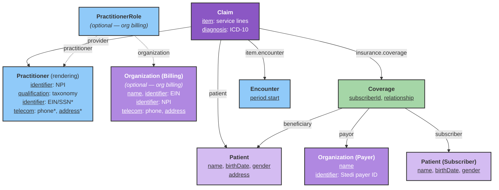

# Professional Claims Submission (837P)

This guide explains how to model FHIR resources and invoke the Stedi integration to submit professional (X12 837P) claims to payers.

## Overview

The Stedi integration maps a [Claim](/docs/api/fhir/resources/claim) and related resources into Stedi's [Professional Claims JSON API](https://www.stedi.com/docs/healthcare/api-reference/post-healthcare-claims), submits the claim to the payer, and returns submission metadata.

This workflow is handled by the **Stedi Professional Claims Bot**. Please [contact the Medplum team](mailto:support@medplum.com) to get access to this bot.

:::info[]
This integration supports **professional (837P) claims only**. Institutional (837I) and dental claims are not supported yet.
:::

## Resource model

The bot reads the `Claim` you submit and follows references to gather patient, provider, billing, coverage, payer, and encounter data.



\* On the rendering `Practitioner`, the EIN/SSN, phone, and address are required **only when billing as an individual** (no billing `Organization`). The dashed `PractitionerRole` → `Organization (Billing)` path is used only for organization billing.

The bot resolves the billing organization by searching for a `PractitionerRole` where `practitioner` matches the rendering provider and reading `organization` from the **first** result. If the practitioner has multiple roles, make sure the billing one is returned first (or is the only role). When no such role exists, the bot bills under the rendering practitioner directly.

### Billing as an organization vs. an individual

The 837P always requires a **billing provider**. You can bill either way:

- **As an organization** (most common for clinics): create an `Organization` with an NPI, Tax ID (EIN), address, and phone, and link it to the rendering `Practitioner` via a `PractitionerRole`. The claim is billed under the organization.
- **As an individual provider**: omit the `PractitionerRole`/`Organization`. The bot then bills under the `Practitioner` directly, which means the practitioner must carry the billing data itself — NPI, a tax identifier (**EIN or SSN**), an address, and a phone.

The required fields below note which apply to each case.

## Project secrets

Configure these secrets on the Medplum project that runs the bot:

| Secret | Type | Required | Description |
|--------|------|----------|-------------|
| `STEDI_CLAIM_API_KEY` | string | Yes | Stedi API key with permission to submit professional claims |
| `STEDI_CLAIM_TEST_MODE` | boolean | No | When `true`, sets Stedi `usageIndicator` to `T` (test). Default is `P` (production) |

:::note[]
Stedi's [test claims workflow](https://www.stedi.com/docs/healthcare/test-claims-workflow) uses a **production** API key with `usageIndicator: T` and payer ID `STEDITEST`. It does not use Stedi test API keys (prefix `test_`) the same way eligibility sandbox checks do.
:::

## FHIR resource requirements

### Claim

| Field | Description | Required |
|-------|-------------|----------|
| `patient` | Reference to the patient on the claim | Yes |
| `provider` or `careTeam[].provider` | Reference to the rendering `Practitioner` | Yes |
| `insurance[0].coverage` | Reference to `Coverage` | Yes |
| `item[0].encounter[0]` | Reference to `Encounter` (used for default service date) | Yes |
| `item[]` | Service lines | Yes (at least one) |
| `item[].productOrService.coding.code` | HCPCS/CPT procedure code | Yes |
| `item[].unitPrice` or `item[].net` | Line charge (used for line and total amounts) | Yes |
| `item[].quantity` | Units of service | No (defaults to `1`) |
| `item[].modifier[].coding.code` | Procedure modifiers | No |
| `item[].diagnosisSequence` | Pointers into `Claim.diagnosis` (1-based) | No (defaults to `['1']`) |
| `item[].locationCodeableConcept.coding.code` | Place of service per line | No |
| `item[].servicedDate` | Date of service | No (see [Service dates](#service-dates)) |
| `diagnosis[].diagnosisCodeableConcept.coding.code` | ICD-10 diagnosis codes | Yes when using diagnosis pointers |

### Patient (claim subject)

| Field | Description | Required |
|-------|-------------|----------|
| `name.given[0]`, `name.family` | Patient name | Yes |
| `birthDate` | Date of birth | Yes when patient is the subscriber, or when patient is a dependent |
| `gender` | Administrative gender | Yes when patient is a dependent |
| `address` | Mailing address | Yes — used for the `subscriber`/`dependent` address, and as the **billing provider address fallback** when billing as an individual with no organization address (Stedi rejects claims missing `billing.address`) |

### Practitioner (rendering provider)

| Field | Description | Required |
|-------|-------------|----------|
| `identifier` | System `http://hl7.org/fhir/sid/us-npi` — must be a **valid 10-digit NPI** (passes the NPI checksum). The payer rejects invalid NPIs such as `1234567890`. | Yes |
| `qualification.code.coding` | System `http://nucc.org/provider-taxonomy` (taxonomy code, read from `qualification[0]`) | Yes |
| `name.given[0]`, `name.family` | Provider name | Yes |
| `identifier` | Tax ID — system `http://hl7.org/fhir/sid/us-ein` (EIN) or `http://hl7.org/fhir/sid/us-ssn` (SSN) | Yes **when billing as an individual** (no billing org). EIN takes precedence; the 837P treats EIN and SSN as mutually exclusive |
| `telecom` | Phone (`system: phone`) | Yes **when billing as an individual** — used as the submitter phone (see [phone format rules](#common-rejections-and-troubleshooting)) |
| `address` | Provider address | Used as the billing address fallback when no org address is present |

### PractitionerRole

Only required when billing under an organization. Omit it to bill under the individual practitioner.

| Field | Description | Required |
|-------|-------------|----------|
| `practitioner` | Reference to the rendering `Practitioner` | Yes (used to find billing org) |
| `organization` | Reference to the billing `Organization` | Yes |

### Organization (billing provider)

Required when billing as an organization. The bot **throws if a billing `Organization` exists but has no EIN**.

| Field | Description | Required |
|-------|-------------|----------|
| `name` | Billing provider name | Yes |
| `identifier` | System `http://hl7.org/fhir/sid/us-ein` (Tax ID / EIN) | Yes |
| `identifier` | System `http://hl7.org/fhir/sid/us-npi` (valid 10-digit NPI) | No (falls back to practitioner NPI) |
| `telecom` | Phone (`system: phone`) — submitter phone; must satisfy NANP rules (see [troubleshooting](#common-rejections-and-troubleshooting)) | Yes |
| `address` | Billing address — Stedi **requires** `billing.address`; the bot uses the org address, then falls back to the patient address. 5-digit ZIPs are padded to 9 digits | Yes |

### Coverage

| Field | Description | Required |
|-------|-------------|----------|
| `subscriberId` | Member ID on the insurance card | Yes |
| `payor` | Reference to payer `Organization` | Yes |
| `subscriber` | Reference to subscriber `Patient` | No (if omitted, claim patient is treated as subscriber) |
| `relationship.coding.code` | Relationship when subscriber ≠ patient (`spouse`, `child`, `self`) | Yes for dependents |
| `type.coding.code` | Insurance type (`MEDICARE`/`MEDICA` → Medicare Part B, `MEDICAID` → Medicaid, otherwise commercial) | No |
| `class` | `type.coding.code` = `group` with `value` = group number | No |

### Organization (payer)

| Field | Description | Required |
|-------|-------------|----------|
| `name` | Payer name | Yes |
| `identifier` | Stedi payer ID (see below) | Yes |

Payer routing uses the first matching identifier on the payer `Organization`, in this order:

1. `https://www.stedi.com/healthcare/network`
2. `https://stedi.com/payerId`
3. `https://www.joincandidhealth.com/chc-payerid`

:::info[]
If you use an `Organization` from the [Medplum Payer Directory](/docs/billing/insurance-eligibility-checks), it typically already includes the Stedi network identifier.
:::

### Encounter

| Field | Description | Required |
|-------|-------------|----------|
| `period.start` | Default service date when not set on claim items | Recommended |

## Subscriber and dependent claims

When the patient on the claim is also the insurance subscriber, the bot sends subscriber demographics only.

When the patient is a dependent (for example, a child on a parent's plan), set `Coverage.subscriber` to the subscriber `Patient` and `Coverage.beneficiary` to the claim patient. The bot adds a Stedi `dependent` block with name, date of birth, gender, and relationship code mapped from `Coverage.relationship`:

| FHIR `relationship` code | Stedi relationship code |
|---------------------------|-------------------------|
| `spouse` | `01` |
| `child` | `19` |
| `self` | `18` |
| (other) | `G8` |

## Service dates

For each `Claim.item`, the bot chooses a date of service in this order:

1. `item.servicedDate`
2. `Encounter.period.start` (date portion)
3. `Claim.billablePeriod.start` (date portion)
4. `Claim.created` (date portion)
5. Today's date

Dates are capped to **today in US Eastern time** so UTC midnight storage does not produce a service date after the payer's transaction date.

Claim-level place of service defaults to `11` (Office) unless `item[0].locationCodeableConcept` specifies a code.

## Example transaction Bundle

The Bundle below creates every resource the bot needs to submit a professional claim **billed as an organization**: the patient, the billing `Organization`, the rendering `Practitioner`, the `PractitionerRole` that links them, the payer `Organization`, the `Coverage`, the `Encounter`, and the `Claim`. The values are chosen to pass the validations described above — a checksum-valid NPI, an EIN, a NANP-valid submitter phone, and the Stedi Test Payer (`STEDITEST`).

POST the Bundle, then invoke `$stedi-submit-claim` on the `Claim` id returned in the response (see [Executing the claim submission](#executing-the-claim-submission)).

:::tip[Billing as an individual]
To bill under the rendering provider instead, drop the billing `Organization` and `PractitionerRole`, and move the EIN/SSN, `telecom` (phone), and `address` onto the `Practitioner`.
:::

<details>
<summary>Example transaction Bundle (organization billing, Stedi test payer)</summary>

```json
{
  "resourceType": "Bundle",
  "type": "transaction",
  "entry": [
    {
      "fullUrl": "urn:uuid:11111111-1111-4111-8111-111111111111",
      "resource": {
        "resourceType": "Patient",
        "name": [{ "family": "Doe", "given": ["John"] }],
        "birthDate": "1990-01-15",
        "gender": "male",
        "address": [
          {
            "line": ["123 Main St"],
            "city": "Boston",
            "state": "MA",
            "postalCode": "02118"
          }
        ]
      },
      "request": { "method": "POST", "url": "Patient" }
    },
    {
      "fullUrl": "urn:uuid:22222222-2222-4222-8222-222222222222",
      "resource": {
        "resourceType": "Organization",
        "name": "Example Family Practice",
        "identifier": [
          { "system": "http://hl7.org/fhir/sid/us-npi", "value": "1999999984" },
          { "system": "http://hl7.org/fhir/sid/us-ein", "value": "12-3456789" }
        ],
        "telecom": [{ "system": "phone", "value": "6175550100" }],
        "address": [
          {
            "line": ["500 Clinic Way"],
            "city": "Boston",
            "state": "MA",
            "postalCode": "02118"
          }
        ]
      },
      "request": { "method": "POST", "url": "Organization" }
    },
    {
      "fullUrl": "urn:uuid:33333333-3333-4333-8333-333333333333",
      "resource": {
        "resourceType": "Practitioner",
        "name": [{ "family": "Smith", "given": ["Alice"], "prefix": ["Dr."] }],
        "identifier": [{ "system": "http://hl7.org/fhir/sid/us-npi", "value": "1234567893" }],
        "qualification": [
          {
            "code": {
              "coding": [
                {
                  "system": "http://nucc.org/provider-taxonomy",
                  "code": "207Q00000X",
                  "display": "Family Medicine"
                }
              ]
            }
          }
        ]
      },
      "request": { "method": "POST", "url": "Practitioner" }
    },
    {
      "fullUrl": "urn:uuid:44444444-4444-4444-8444-444444444444",
      "resource": {
        "resourceType": "PractitionerRole",
        "practitioner": {
          "reference": "urn:uuid:33333333-3333-4333-8333-333333333333",
          "display": "Dr. Alice Smith"
        },
        "organization": {
          "reference": "urn:uuid:22222222-2222-4222-8222-222222222222",
          "display": "Example Family Practice"
        }
      },
      "request": { "method": "POST", "url": "PractitionerRole" }
    },
    {
      "fullUrl": "urn:uuid:55555555-5555-4555-8555-555555555555",
      "resource": {
        "resourceType": "Organization",
        "name": "Stedi Test Payer",
        "identifier": [
          { "system": "https://www.stedi.com/healthcare/network", "value": "STEDITEST" }
        ],
        "type": [
          {
            "coding": [
              {
                "system": "http://terminology.hl7.org/CodeSystem/organization-type",
                "code": "ins",
                "display": "Insurance Company"
              }
            ]
          }
        ]
      },
      "request": { "method": "POST", "url": "Organization" }
    },
    {
      "fullUrl": "urn:uuid:66666666-6666-4666-8666-666666666666",
      "resource": {
        "resourceType": "Coverage",
        "status": "active",
        "subscriberId": "AMBETTER123",
        "subscriber": {
          "reference": "urn:uuid:11111111-1111-4111-8111-111111111111",
          "display": "John Doe"
        },
        "beneficiary": {
          "reference": "urn:uuid:11111111-1111-4111-8111-111111111111",
          "display": "John Doe"
        },
        "relationship": {
          "coding": [
            {
              "system": "http://terminology.hl7.org/CodeSystem/subscriber-relationship",
              "code": "self"
            }
          ]
        },
        "payor": [
          {
            "reference": "urn:uuid:55555555-5555-4555-8555-555555555555",
            "display": "Stedi Test Payer"
          }
        ]
      },
      "request": { "method": "POST", "url": "Coverage" }
    },
    {
      "fullUrl": "urn:uuid:77777777-7777-4777-8777-777777777777",
      "resource": {
        "resourceType": "Encounter",
        "status": "finished",
        "class": {
          "system": "http://terminology.hl7.org/CodeSystem/v3-ActCode",
          "code": "AMB",
          "display": "ambulatory"
        },
        "subject": {
          "reference": "urn:uuid:11111111-1111-4111-8111-111111111111",
          "display": "John Doe"
        },
        "period": { "start": "2026-04-01T15:00:00Z", "end": "2026-04-01T15:30:00Z" }
      },
      "request": { "method": "POST", "url": "Encounter" }
    },
    {
      "fullUrl": "urn:uuid:88888888-8888-4888-8888-888888888888",
      "resource": {
        "resourceType": "Claim",
        "status": "active",
        "type": {
          "coding": [
            {
              "system": "http://terminology.hl7.org/CodeSystem/claim-type",
              "code": "professional"
            }
          ]
        },
        "use": "claim",
        "patient": {
          "reference": "urn:uuid:11111111-1111-4111-8111-111111111111",
          "display": "John Doe"
        },
        "created": "2026-04-01",
        "provider": {
          "reference": "urn:uuid:33333333-3333-4333-8333-333333333333",
          "display": "Dr. Alice Smith"
        },
        "priority": { "coding": [{ "code": "normal" }] },
        "insurance": [
          {
            "sequence": 1,
            "focal": true,
            "coverage": { "reference": "urn:uuid:66666666-6666-4666-8666-666666666666" }
          }
        ],
        "diagnosis": [
          {
            "sequence": 1,
            "diagnosisCodeableConcept": {
              "coding": [
                {
                  "system": "http://hl7.org/fhir/sid/icd-10-cm",
                  "code": "J06.9",
                  "display": "Acute upper respiratory infection, unspecified"
                }
              ]
            }
          }
        ],
        "item": [
          {
            "sequence": 1,
            "productOrService": {
              "coding": [
                {
                  "system": "http://www.ama-assn.org/go/cpt",
                  "code": "99213",
                  "display": "Office/outpatient visit, established patient"
                }
              ]
            },
            "servicedDate": "2026-04-01",
            "unitPrice": { "value": 180, "currency": "USD" },
            "quantity": { "value": 1 },
            "diagnosisSequence": [1],
            "locationCodeableConcept": { "coding": [{ "code": "11" }] },
            "encounter": [{ "reference": "urn:uuid:77777777-7777-4777-8777-777777777777" }]
          }
        ],
        "total": { "value": 180, "currency": "USD" }
      },
      "request": { "method": "POST", "url": "Claim" }
    }
  ]
}
```

</details>

## Executing the claim submission

The **Stedi Professional Claims Bot** submits the claim and returns submission metadata. Invoke the `$stedi-submit-claim` [custom operation](/docs/api/fhir/operations/custom-operations) on `Claim` in either of these ways:

- **Instance level** — on a stored claim: `POST {base}/fhir/R4/Claim/{id}/$stedi-submit-claim`
- **Type level** — with a `Claim` in the request body: `POST {base}/fhir/R4/Claim/$stedi-submit-claim`

**Instance level** (after you have created and stored the `Claim`):

```ts
const response = await medplum.post(
  medplum.fhirUrl('Claim', claim.id, '$stedi-submit-claim')
);
```

Or via the FHIR REST API:

```http
POST {base}/fhir/R4/Claim/{id}/$stedi-submit-claim
```

### Successful response

On success, the operation returns parameters such as:

| Parameter | Description |
|-----------|-------------|
| `success` | `true` |
| `medplumClaimId` | Medplum `Claim.id` |
| `correlationId` | Stedi correlation ID for tracking |
| `status` | Stedi response status |
| `message` | Human-readable confirmation |

The bot also updates the `Claim` with an identifier:

| Field | Value |
|-------|-------|
| `identifier.system` | `https://www.stedi.com/claims` |
| `identifier.value` | Stedi `correlationId` |

Use this identifier to correlate the Medplum claim with Stedi claim status, acknowledgments (277CA), and remittance (835) workflows. See [Stedi's guide to receiving claim responses](https://www.stedi.com/docs/healthcare/receive-claim-responses).

### Errors

If submission fails, the bot sets `Claim.status` to `error` and appends two extensions to the `Claim`, then **re-throws** so the `$execute` operation also fails:

| Extension `url` | Value |
|-----------------|-------|
| `https://stedi.com/integration-status` | `valueString: error`, `valueDateTime`: timestamp |
| `https://www.stedi.com/fhir/StructureDefinition/claim-submission-error` | `valueString`: Stedi's full JSON response body (or the error message when the failure is local), `valueDateTime`: timestamp |

The prior submission-error extension is removed on each attempt, so a resubmission does not accumulate stale errors.

When Stedi returns a non-2xx response, the thrown error and the persisted `claim-submission-error` extension include Stedi's complete response body — including the `errors[]` array with X12 status codes and human-readable descriptions — so you can see exactly which field the payer or clearinghouse rejected.

## Common rejections and troubleshooting

Most failures are caused by missing or malformed FHIR data. The bot validates some of these up front (failing fast with a clear message); others come back from Stedi or the payer as a `400` with an `errors[]` array.

| Error / message | Cause | Fix |
|-----------------|-------|-----|
| `Missing NPI on both billing organization and practitioner` | No `us-npi` identifier on the billing org or rendering practitioner | Add a valid 10-digit NPI identifier |
| `Provider … missing required taxonomy code` | No `http://nucc.org/provider-taxonomy` coding on `Practitioner.qualification[0]` | Add a qualification with the provider's NUCC taxonomy code (e.g. `207Q00000X` for Family Medicine) |
| `Missing required field: billing.address` | No address resolvable for the billing provider | Add an `address` to the billing `Organization`, or to the `Patient` (used as fallback when billing as an individual) |
| `Missing required field: ssn or employerId required for billing provider` | Billing as an individual without a tax identifier | Add an EIN (`us-ein`) or SSN (`us-ssn`) identifier to the `Practitioner`, or bill under an `Organization` with an EIN |
| `Billing organization … is missing a Tax ID (EIN)` | A billing `Organization` exists but has no `us-ein` identifier | Add a `us-ein` identifier to the org |
| `Invalid NPI. The Billing Provider NPI of … is invalid` | NPI fails the NPI checksum (e.g. `1234567890`) | Use a real, valid 10-digit NPI |
| `Invalid Telephone number … must not begin with 0 or 1` | Submitter phone violates NANP rules | Provide a 10-digit phone where **both** the area code (1st digit) **and** the exchange (4th digit) are `2`–`9` (e.g. `6175550100`). The bot validates this when present |
| `Submitter is missing a valid 10-digit phone number` | No valid phone on the billing org or practitioner | Add a valid `phone` telecom (see rule above) |
| Payer rejects member / subscriber | `Coverage.subscriberId` does not match the payer's records, or the member ID belongs to a different payer than `tradingPartnerServiceId` | Verify the member ID and that the payer `Organization` Stedi payer ID matches the member's plan |

:::tip[Phone number format]
X12/NANP forbids both the **area code** and the **exchange** (the 4th digit) from starting with `0` or `1`. For example `6171234567` is invalid because the exchange `123` starts with `1`; `6175550100` is valid.
:::

## Test claims

To submit a **test** claim end-to-end (including test 277CA and 835 ERA from the Stedi Test Payer):

1. Set project secret `STEDI_CLAIM_TEST_MODE` to `true`, **or** ensure your deployment maps that secret so the bot sends `usageIndicator: T`.
2. Use payer ID `STEDITEST` on the payer `Organization` (Stedi Test Payer).
3. Use a **production** Stedi claims API key enrolled for your billing provider.

See Stedi's [test claims workflow](https://www.stedi.com/docs/healthcare/test-claims-workflow) for enrollment and example payloads.

## Limitations and roadmap

- Professional (837P) claims only — no institutional (837I) or dental submission yet
- No built-in claim status polling or 835 ingestion in Medplum (use Stedi webhooks or APIs)
- Claim attachments (275) are not submitted by this bot

For eligibility checks on the same Stedi account, see [Insurance and Benefits Eligibility Checks](/docs/integration/stedi/insurance-eligibility/eligibility-checks).
