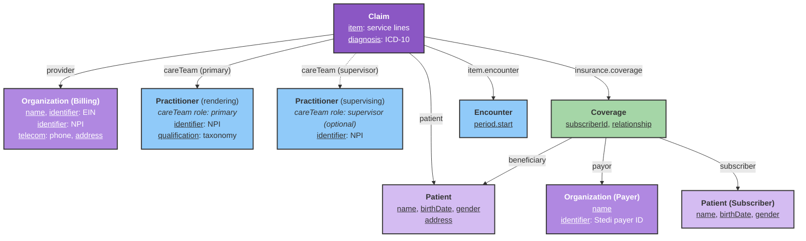
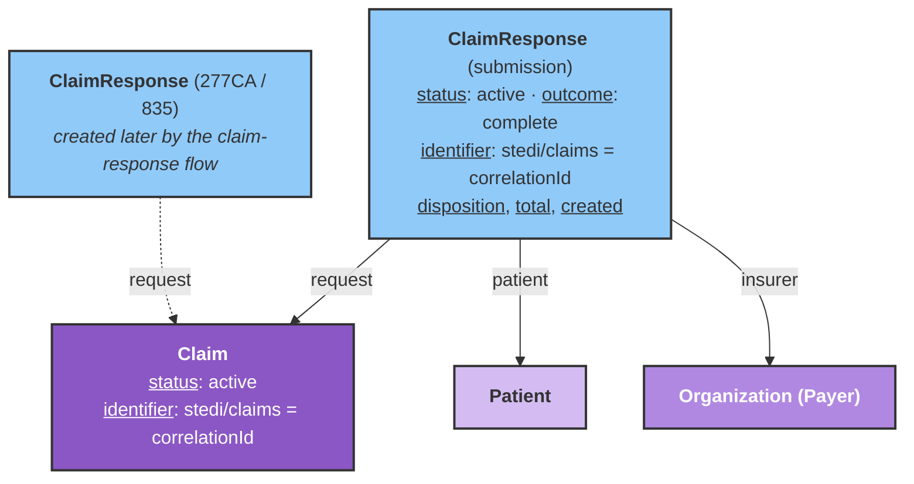

# Professional Claims Submission (837P)

This guide explains how to model FHIR resources and invoke the Stedi integration to submit professional (X12 837P) claims to payers.

## Overview

The Stedi integration maps a [Claim](/docs/api/fhir/resources/claim) and related resources into Stedi's [Professional Claims JSON API](https://www.stedi.com/docs/healthcare/api-reference/post-healthcare-claims), submits the claim to the payer, and returns submission metadata.

This workflow is handled by the **Stedi Professional Claims Bot**. Please [contact the Medplum team](mailto:support@medplum.com) to get access to this bot.

:::info[]
This integration supports **professional (837P) claims only**. Institutional (837I) and dental claims are not supported yet.
:::

## Project secrets

Configure these secrets on the Medplum project that runs the bot:

| Secret | Type | Required | Description |
|--------|------|----------|-------------|
| `STEDI_CLAIM_API_KEY` | string | Yes | Stedi API key with permission to submit professional claims |
| `STEDI_CLAIM_TEST_MODE` | boolean | No | When `true`, sets Stedi `usageIndicator` to `T` (test). Default is `P` (production) |

:::note[]
Stedi's [test claims workflow](https://www.stedi.com/docs/healthcare/test-claims-workflow) uses a **production** API key. It does not use Stedi test API keys (prefix `test_`) the same way eligibility sandbox checks do.
:::

## Resource model

The bot reads the `Claim` you submit and follows references to gather patient, billing provider, rendering/supervising practitioners, coverage, payer, and encounter data.

The claim links its providers directly:

- **`Claim.provider`** references the **billing provider** — an `Organization` for organization billing (the common case), or a `Practitioner` for individual billing.
- **`Claim.careTeam`** references the **practitioners who delivered care**, disambiguated by `role.coding.code` (system `http://terminology.hl7.org/CodeSystem/claimcareteamrole`):
  - **`primary`** → the **rendering** provider (the practitioner who performed the service). Required.
  - **`supervisor`** → the **supervising** provider (e.g. an MD overseeing a coach or nurse practitioner). Optional.

This separates the billing relationship (`Claim.provider`) from the clinical relationship (`Claim.careTeam`), so the billing `Organization` does not need to match any `PractitionerRole.organization` your application uses for other purposes.



The dashed `Claim` → `Practitioner (supervising)` path is optional. The bot resolves the rendering provider from the `Claim.careTeam` member with role code `primary` (falling back to the first care team member that references a `Practitioner`), and the supervising provider from the member with role code `supervisor`.

### Billing as an organization vs. an individual

The 837P always requires a **billing provider**, taken from `Claim.provider`. You can bill either way:

- **As an organization** (most common for clinics): set `Claim.provider` to an `Organization` with an NPI, Tax ID (EIN), address, and phone. The claim is billed under the organization, and the rendering practitioner comes from `Claim.careTeam`.
- **As an individual provider**: set `Claim.provider` to the `Practitioner` directly. The bot then bills under the practitioner, which means the practitioner must carry the billing data itself — NPI, a tax identifier (**EIN or SSN**), an address, and a phone. When no `careTeam` member is present, that same practitioner is also used as the rendering provider.

The required fields below note which apply to each case.

:::tip[Contained billing organization]
`Claim.provider` may also reference a [contained](https://www.hl7.org/fhir/references.html#contained) resource (e.g. `"reference": "#billing-org"`). This is useful when you want to snapshot the exact billing `Organization` onto the claim instead of pointing at a shared, stored `Organization`.
:::

The Bundle below creates every resource the bot needs to submit a professional claim **billed as an organization**: the patient, the billing `Organization`, the rendering `Practitioner`, the supervising `Practitioner`, the payer `Organization`, the `Coverage`, the `Encounter`, and the `Claim` (whose `provider` points at the billing `Organization` and whose `careTeam` references the two practitioners). The values are chosen to pass the validations described above — checksum-valid NPIs, an EIN, a NANP-valid submitter phone, and the Stedi Test Payer (`STEDITEST`).

POST the Bundle, then invoke `$stedi-submit-claim` on the `Claim` id returned in the response (see [Executing the claim submission](#executing-the-claim-submission)).

:::tip[Billing as an individual]
To bill under the rendering provider instead, point `Claim.provider` at the `Practitioner` and move the EIN/SSN, `telecom` (phone), and `address` onto that `Practitioner`.
:::

<details>
<summary>Example transaction Bundle (organization billing, Stedi test payer)</summary>

```json
{
  "resourceType": "Bundle",
  "type": "transaction",
  "entry": [
    {
      "fullUrl": "urn:uuid:11111111-1111-4111-8111-111111111111",
      "resource": {
        "resourceType": "Patient",
        "name": [{ "family": "Doe", "given": ["John"] }],
        "birthDate": "1990-01-15",
        "gender": "male",
        "address": [
          {
            "line": ["123 Main St"],
            "city": "Boston",
            "state": "MA",
            "postalCode": "02118"
          }
        ]
      },
      "request": { "method": "POST", "url": "Patient" }
    },
    {
      "fullUrl": "urn:uuid:22222222-2222-4222-8222-222222222222",
      "resource": {
        "resourceType": "Organization",
        "name": "Example Family Practice",
        "identifier": [
          { "system": "http://hl7.org/fhir/sid/us-npi", "value": "1999999984" },
          { "system": "http://hl7.org/fhir/sid/us-ein", "value": "12-3456789" }
        ],
        "telecom": [{ "system": "phone", "value": "6175550100" }],
        "address": [
          {
            "line": ["500 Clinic Way"],
            "city": "Boston",
            "state": "MA",
            "postalCode": "02118"
          }
        ]
      },
      "request": { "method": "POST", "url": "Organization" }
    },
    {
      "fullUrl": "urn:uuid:33333333-3333-4333-8333-333333333333",
      "resource": {
        "resourceType": "Practitioner",
        "name": [{ "family": "Smith", "given": ["Alice"], "prefix": ["Dr."] }],
        "identifier": [{ "system": "http://hl7.org/fhir/sid/us-npi", "value": "1234567893" }],
        "qualification": [
          {
            "code": {
              "coding": [
                {
                  "system": "http://nucc.org/provider-taxonomy",
                  "code": "207Q00000X",
                  "display": "Family Medicine"
                }
              ]
            }
          }
        ]
      },
      "request": { "method": "POST", "url": "Practitioner" }
    },
    {
      "fullUrl": "urn:uuid:44444444-4444-4444-8444-444444444444",
      "resource": {
        "resourceType": "Practitioner",
        "name": [{ "family": "Jones", "given": ["Robert"], "prefix": ["Dr."] }],
        "identifier": [{ "system": "http://hl7.org/fhir/sid/us-npi", "value": "1999999984" }],
        "qualification": [
          {
            "code": {
              "coding": [
                {
                  "system": "http://nucc.org/provider-taxonomy",
                  "code": "207R00000X",
                  "display": "Internal Medicine"
                }
              ]
            }
          }
        ]
      },
      "request": { "method": "POST", "url": "Practitioner" }
    },
    {
      "fullUrl": "urn:uuid:55555555-5555-4555-8555-555555555555",
      "resource": {
        "resourceType": "Organization",
        "name": "Stedi Test Payer",
        "identifier": [
          { "system": "https://www.stedi.com/healthcare/network", "value": "STEDITEST" }
        ],
        "type": [
          {
            "coding": [
              {
                "system": "http://terminology.hl7.org/CodeSystem/organization-type",
                "code": "ins",
                "display": "Insurance Company"
              }
            ]
          }
        ]
      },
      "request": { "method": "POST", "url": "Organization" }
    },
    {
      "fullUrl": "urn:uuid:66666666-6666-4666-8666-666666666666",
      "resource": {
        "resourceType": "Coverage",
        "status": "active",
        "subscriberId": "AMBETTER123",
        "subscriber": {
          "reference": "urn:uuid:11111111-1111-4111-8111-111111111111",
          "display": "John Doe"
        },
        "beneficiary": {
          "reference": "urn:uuid:11111111-1111-4111-8111-111111111111",
          "display": "John Doe"
        },
        "relationship": {
          "coding": [
            {
              "system": "http://terminology.hl7.org/CodeSystem/subscriber-relationship",
              "code": "self"
            }
          ]
        },
        "payor": [
          {
            "reference": "urn:uuid:55555555-5555-4555-8555-555555555555",
            "display": "Stedi Test Payer"
          }
        ]
      },
      "request": { "method": "POST", "url": "Coverage" }
    },
    {
      "fullUrl": "urn:uuid:77777777-7777-4777-8777-777777777777",
      "resource": {
        "resourceType": "Encounter",
        "status": "finished",
        "class": {
          "system": "http://terminology.hl7.org/CodeSystem/v3-ActCode",
          "code": "AMB",
          "display": "ambulatory"
        },
        "subject": {
          "reference": "urn:uuid:11111111-1111-4111-8111-111111111111",
          "display": "John Doe"
        },
        "period": { "start": "2026-04-01T15:00:00Z", "end": "2026-04-01T15:30:00Z" }
      },
      "request": { "method": "POST", "url": "Encounter" }
    },
    {
      "fullUrl": "urn:uuid:88888888-8888-4888-8888-888888888888",
      "resource": {
        "resourceType": "Claim",
        "status": "active",
        "type": {
          "coding": [
            {
              "system": "http://terminology.hl7.org/CodeSystem/claim-type",
              "code": "professional"
            }
          ]
        },
        "use": "claim",
        "patient": {
          "reference": "urn:uuid:11111111-1111-4111-8111-111111111111",
          "display": "John Doe"
        },
        "created": "2026-04-01",
        "provider": {
          "reference": "urn:uuid:22222222-2222-4222-8222-222222222222",
          "display": "Example Family Practice"
        },
        "careTeam": [
          {
            "sequence": 1,
            "provider": {
              "reference": "urn:uuid:33333333-3333-4333-8333-333333333333",
              "display": "Dr. Alice Smith"
            },
            "role": {
              "coding": [
                {
                  "system": "http://terminology.hl7.org/CodeSystem/claimcareteamrole",
                  "code": "primary"
                }
              ]
            }
          },
          {
            "sequence": 2,
            "provider": {
              "reference": "urn:uuid:44444444-4444-4444-8444-444444444444",
              "display": "Dr. Robert Jones"
            },
            "role": {
              "coding": [
                {
                  "system": "http://terminology.hl7.org/CodeSystem/claimcareteamrole",
                  "code": "supervisor"
                }
              ]
            }
          }
        ],
        "priority": { "coding": [{ "code": "normal" }] },
        "insurance": [
          {
            "sequence": 1,
            "focal": true,
            "coverage": { "reference": "urn:uuid:66666666-6666-4666-8666-666666666666" }
          }
        ],
        "diagnosis": [
          {
            "sequence": 1,
            "diagnosisCodeableConcept": {
              "coding": [
                {
                  "system": "http://hl7.org/fhir/sid/icd-10-cm",
                  "code": "J06.9",
                  "display": "Acute upper respiratory infection, unspecified"
                }
              ]
            }
          }
        ],
        "item": [
          {
            "sequence": 1,
            "productOrService": {
              "coding": [
                {
                  "system": "http://www.ama-assn.org/go/cpt",
                  "code": "99213",
                  "display": "Office/outpatient visit, established patient"
                }
              ]
            },
            "servicedDate": "2026-04-01",
            "unitPrice": { "value": 180, "currency": "USD" },
            "quantity": { "value": 1 },
            "diagnosisSequence": [1],
            "locationCodeableConcept": { "coding": [{ "code": "11" }] },
            "encounter": [{ "reference": "urn:uuid:77777777-7777-4777-8777-777777777777" }]
          }
        ],
        "total": { "value": 180, "currency": "USD" }
      },
      "request": { "method": "POST", "url": "Claim" }
    }
  ]
}
```

</details>

## FHIR resource requirements

### Claim

| Field | Description | Required |
|-------|-------------|----------|
| `patient` | Reference to the patient on the claim | Yes |
| `provider` | Reference to the **billing provider** — an `Organization` (org billing) or `Practitioner` (individual billing). Contained references (`#id`) are supported | Yes |
| `careTeam[]` with `role.coding.code` = `primary` | Reference to the **rendering** `Practitioner`. Falls back to the first `careTeam` member, then to `provider` when it is a `Practitioner` | Yes |
| `careTeam[]` with `role.coding.code` = `supervisor` | Reference to the **supervising** `Practitioner` | No |
| `insurance[0].coverage` | Reference to `Coverage` | Yes |
| `item[0].encounter[0]` | Reference to `Encounter` (used for default service date) | Yes |
| `item[]` | Service lines | Yes (at least one) |
| `item[].productOrService.coding.code` | HCPCS/CPT procedure code | Yes |
| `item[].unitPrice` or `item[].net` | Line charge (used for line and total amounts) | Yes |
| `item[].quantity` | Units of service | No (defaults to `1`) |
| `item[].modifier[].coding.code` | Procedure modifiers | No |
| `item[].diagnosisSequence` | Pointers into `Claim.diagnosis` (1-based) | No (defaults to `['1']`) |
| `item[].locationCodeableConcept.coding.code` | Place of service per line | No |
| `item[].servicedDate` | Date of service | No (see [Service dates](#service-dates)) |
| `diagnosis[].diagnosisCodeableConcept.coding.code` | ICD-10 diagnosis codes | Yes when using diagnosis pointers |

### Patient (claim subject)

| Field | Description | Required |
|-------|-------------|----------|
| `name.given[0]`, `name.family` | Patient name | Yes |
| `birthDate` | Date of birth | Yes when patient is the subscriber, or when patient is a dependent |
| `gender` | Administrative gender | Yes when patient is a dependent |
| `address` | Mailing address | Yes — used for the `subscriber`/`dependent` address, and as the **billing provider address fallback** when billing as an individual with no organization address (Stedi rejects claims missing `billing.address`) |

### Practitioner (rendering provider)

Referenced from the `Claim.careTeam` member with role code `primary`.

| Field | Description | Required |
|-------|-------------|----------|
| `identifier` | System `http://hl7.org/fhir/sid/us-npi` — must be a **valid 10-digit NPI** (passes the NPI checksum). The payer rejects invalid NPIs such as `1234567890`. | Yes |
| `qualification.code.coding` | System `http://nucc.org/provider-taxonomy` (taxonomy code, read from `qualification[0]`) | Yes |
| `name.given[0]`, `name.family` | Provider name | Yes |
| `identifier` | Tax ID — system `http://hl7.org/fhir/sid/us-ein` (EIN) or `http://hl7.org/fhir/sid/us-ssn` (SSN) | Yes **when billing as an individual** (`Claim.provider` is this `Practitioner`). EIN takes precedence; the 837P treats EIN and SSN as mutually exclusive |
| `telecom` | Phone (`system: phone`) | Yes **when billing as an individual** — used as the submitter phone (see [phone format rules](#common-rejections-and-troubleshooting)) |
| `address` | Provider address | Used as the billing address fallback when no org address is present |

### Practitioner (supervising provider)

Optional. Referenced from the `Claim.careTeam` member with role code `supervisor` — for example, an MD overseeing a coach or nurse practitioner.

| Field | Description | Required |
|-------|-------------|----------|
| `identifier` | System `http://hl7.org/fhir/sid/us-npi` (valid 10-digit NPI) | Yes (when a supervising provider is present) |
| `name.given[0]`, `name.family` | Provider name | Yes (when a supervising provider is present) |

### Organization (billing provider)

Used when `Claim.provider` references an `Organization`. The bot **throws if the billing `Organization` has no EIN**.

| Field | Description | Required |
|-------|-------------|----------|
| `name` | Billing provider name | Yes |
| `identifier` | System `http://hl7.org/fhir/sid/us-ein` (Tax ID / EIN) | Yes |
| `identifier` | System `http://hl7.org/fhir/sid/us-npi` (valid 10-digit NPI) | No (falls back to the rendering practitioner NPI) |
| `telecom` | Phone (`system: phone`) — submitter phone; must satisfy NANP rules (see [troubleshooting](#common-rejections-and-troubleshooting)) | Yes |
| `address` | Billing address — Stedi **requires** `billing.address`; the bot uses the org address, then falls back to the patient address. 5-digit ZIPs are padded to 9 digits | Yes |

### Coverage

| Field | Description | Required |
|-------|-------------|----------|
| `subscriberId` | Member ID on the insurance card | Yes |
| `payor` | Reference to payer `Organization` | Yes |
| `subscriber` | Reference to subscriber `Patient` | No (if omitted, claim patient is treated as subscriber) |
| `relationship.coding.code` | Relationship when subscriber ≠ patient (`spouse`, `child`, `self`) | Yes for dependents |
| `type.coding.code` | Insurance type (`MEDICARE`/`MEDICA` → Medicare Part B, `MEDICAID` → Medicaid, otherwise commercial) | No |
| `class` | `type.coding.code` = `group` with `value` = group number | No |

### Organization (payer)

| Field | Description | Required |
|-------|-------------|----------|
| `name` | Payer name | Yes |
| `identifier` | Stedi payer ID (see below) | Yes |

Payer routing uses the first matching identifier on the payer `Organization`, in this order:

1. `https://www.stedi.com/healthcare/network`
2. `https://stedi.com/payerId`
3. `https://www.joincandidhealth.com/chc-payerid`

:::info[]
If you use an `Organization` from the [Medplum Payer Directory](/docs/billing/insurance-eligibility-checks), it typically already includes the Stedi network identifier.
:::

### Encounter

| Field | Description | Required |
|-------|-------------|----------|
| `period.start` | Default service date when not set on claim items | Recommended |

## Subscriber and dependent claims

When the patient on the claim is also the insurance subscriber, the bot sends subscriber demographics only.

When the patient is a dependent (for example, a child on a parent's plan), set `Coverage.subscriber` to the subscriber `Patient` and `Coverage.beneficiary` to the claim patient. The bot adds a Stedi `dependent` block with name, date of birth, gender, and relationship code mapped from `Coverage.relationship`:

| FHIR `relationship` code | Stedi relationship code |
|---------------------------|-------------------------|
| `spouse` | `01` |
| `child` | `19` |
| `self` | `18` |
| (other) | `G8` |

## Service dates

For each `Claim.item`, the bot chooses a date of service in this order:

1. `item.servicedDate`
2. `Encounter.period.start` (date portion)
3. `Claim.billablePeriod.start` (date portion)
4. `Claim.created` (date portion)
5. Today's date

Dates are capped to **today in US Eastern time** so UTC midnight storage does not produce a service date after the payer's transaction date.

Claim-level place of service defaults to `11` (Office) unless `item[0].locationCodeableConcept` specifies a code.

## Executing the claim submission

The **Stedi Professional Claims Bot** submits the claim and creates a [ClaimResponse](/docs/api/fhir/resources/claimresponse) recording the submission. Invoke the `$stedi-submit-claim` [custom operation](/docs/api/fhir/operations/custom-operations) on `Claim` in either of these ways:

- **Instance level** — on a stored claim: `POST {base}/fhir/R4/Claim/{id}/$stedi-submit-claim`
- **Type level** — with a `Claim` in the request body: `POST {base}/fhir/R4/Claim/$stedi-submit-claim`

**Instance level** (after you have created and stored the `Claim`):

```ts
const response = await medplum.post(
  medplum.fhirUrl('Claim', claim.id, '$stedi-submit-claim')
);
```

Or via the FHIR REST API:

```http
POST {base}/fhir/R4/Claim/{id}/$stedi-submit-claim
```

### Successful response

On success, the operation **returns the created `ClaimResponse`** resource. The bot persists it (`POST ClaimResponse`) and returns the saved resource, so the `$execute` response body is the `ClaimResponse` itself.



The submission `ClaimResponse` (solid) is created immediately by the bot. Acknowledgment (277CA) and remittance (835) responses (dashed) are created **later** by the [claim-response flow](/docs/integration/stedi/claim-submission/claim-responses) and also reference the same `Claim` via `request`.

| `ClaimResponse` field | Value |
|-----------------------|-------|
| `status` | `active` |
| `outcome` | `complete` |
| `request` | Reference to the submitted `Claim` |
| `patient` | The claim's patient |
| `insurer` | The payer `Organization` (falls back to `Coverage.payor`, then the Stedi payer ID as `display`) |
| `created` | Submission timestamp |
| `disposition` | Human-readable summary, e.g. `Claim submitted to Stedi (correlationId …), status: …` |
| `identifier` | `[{ system: "https://www.stedi.com/claims", value: <Stedi correlationId> }]` (when Stedi returns a correlation ID) |
| `total` | The submitted charge total (from `Claim.total`, otherwise the sum of line charges) |

The bot also stamps the same correlation identifier on the **`Claim`** and sets `Claim.status` to `active`:

| Field | Value |
|-------|-------|
| `identifier.system` | `https://www.stedi.com/claims` |
| `identifier.value` | Stedi `correlationId` |

Use this identifier to correlate the Medplum claim with Stedi claim status, acknowledgments (277CA), and remittance (835) workflows. See [Claim Responses (277 / 835)](/docs/integration/stedi/claim-submission/claim-responses) and [Stedi's guide to receiving claim responses](https://www.stedi.com/docs/healthcare/receive-claim-responses).

:::note[Idempotent re-submission]
Before submitting, the bot searches for an existing **active `ClaimResponse`** for the claim (`ClaimResponse?request=Claim/{id}&status=active`). If one already exists, the bot returns it **without re-submitting to Stedi**. To resubmit a claim, remove or deactivate the prior `ClaimResponse` first.
:::

### Errors

If submission fails, the bot sets `Claim.status` to `error` and records an integration-status extension on the `Claim`, then **re-throws** so the `$execute` operation also fails:

| Extension `url` | Value |
|-----------------|-------|
| `https://stedi.com/integration-status` | `valueString: error`, `valueDateTime`: timestamp |

The prior integration-status extension is replaced on each attempt, so a resubmission does not accumulate stale entries.

When Stedi returns a non-2xx response, the thrown error message includes Stedi's response detail — including the `errors[]` entries with X12 status codes and human-readable descriptions — so you can see exactly which field the payer or clearinghouse rejected. Because no `ClaimResponse` is created on failure, the idempotency check above does not block a corrected resubmission.

## Common rejections and troubleshooting

Most failures are caused by missing or malformed FHIR data. The bot validates some of these up front (failing fast with a clear message); others come back from Stedi or the payer as a `400` with an `errors[]` array.

| Error / message | Cause | Fix |
|-----------------|-------|-----|
| `Claim missing provider reference …` | `Claim.provider` is not set | Set `Claim.provider` to the billing `Organization` (or a `Practitioner` for individual billing) |
| `Claim.provider must reference an Organization … or Practitioner …` | `Claim.provider` points at a different resource type | Point `Claim.provider` at the billing `Organization` or `Practitioner` |
| `Claim missing rendering provider …` | No `Claim.careTeam` member references a `Practitioner` (and `Claim.provider` is not a `Practitioner`) | Add a `careTeam` member with role code `primary` referencing the rendering `Practitioner` |
| `Missing NPI on both billing organization and rendering practitioner` | No `us-npi` identifier on the billing org or rendering practitioner | Add a valid 10-digit NPI identifier |
| `Provider … missing required taxonomy code` | No `http://nucc.org/provider-taxonomy` coding on `Practitioner.qualification[0]` | Add a qualification with the provider's NUCC taxonomy code (e.g. `207Q00000X` for Family Medicine) |
| `Missing required field: billing.address` | No address resolvable for the billing provider | Add an `address` to the billing `Organization`, or to the `Patient` (used as fallback when billing as an individual) |
| `Missing required field: ssn or employerId required for billing provider` | Billing as an individual without a tax identifier | Add an EIN (`us-ein`) or SSN (`us-ssn`) identifier to the `Practitioner` referenced by `Claim.provider`, or bill under an `Organization` with an EIN |
| `Billing organization … is missing a Tax ID (EIN)` | A billing `Organization` exists but has no `us-ein` identifier | Add a `us-ein` identifier to the org |
| `Invalid NPI. The Billing Provider NPI of … is invalid` | NPI fails the NPI checksum (e.g. `1234567890`) | Use a real, valid 10-digit NPI |
| `Invalid Telephone number … must not begin with 0 or 1` | Submitter phone violates NANP rules | Provide a 10-digit phone where **both** the area code (1st digit) **and** the exchange (4th digit) are `2`–`9` (e.g. `6175550100`). The bot validates this when present |
| `Submitter is missing a valid 10-digit phone number` | No valid phone on the billing org or practitioner | Add a valid `phone` telecom (see rule above) |
| Payer rejects member / subscriber | `Coverage.subscriberId` does not match the payer's records, or the member ID belongs to a different payer than `tradingPartnerServiceId` | Verify the member ID and that the payer `Organization` Stedi payer ID matches the member's plan |

:::tip[Phone number format]
X12/NANP forbids both the **area code** and the **exchange** (the 4th digit) from starting with `0` or `1`. For example `6171234567` is invalid because the exchange `123` starts with `1`; `6175550100` is valid.
:::

## Test claims

To submit a **test** claim end-to-end (including test 277CA and 835 ERA from the Stedi Test Payer):

1. Set project secret `STEDI_CLAIM_TEST_MODE` to `true`, **or** ensure your deployment maps that secret so the bot sends `usageIndicator: T`.
2. Use payer ID `STEDITEST` on the payer `Organization` (Stedi Test Payer).
3. Use a **production** Stedi claims API key enrolled for your billing provider.

See Stedi's [test claims workflow](https://www.stedi.com/docs/healthcare/test-claims-workflow) for enrollment and example payloads.

## Limitations and roadmap

- Professional (837P) claims only — no institutional (837I) or dental submission yet
- No built-in claim status polling or 835 ingestion in Medplum (use Stedi webhooks or APIs)
- Claim attachments (275) are not submitted by this bot

For eligibility checks on the same Stedi account, see [Insurance and Benefits Eligibility Checks](/docs/integration/stedi/insurance-eligibility/eligibility-checks).
