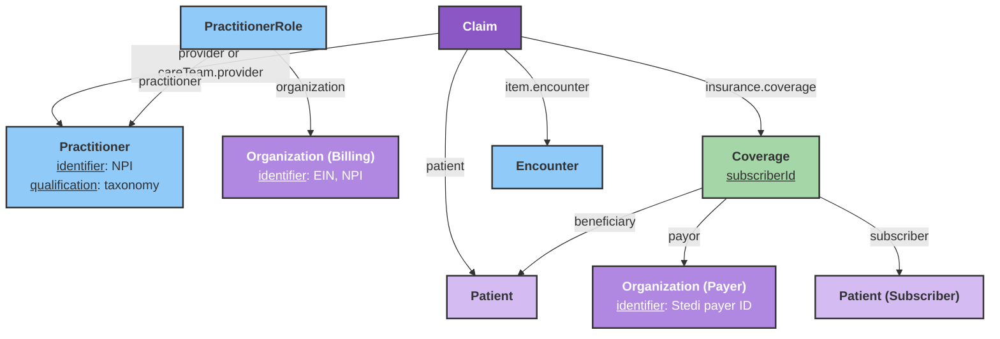

# Professional Claims Submission (837P)

This guide explains how to model FHIR resources and invoke the Stedi integration to submit professional (X12 837P) claims to payers.

## Overview

The Stedi integration maps a [Claim](/docs/api/fhir/resources/claim) and related resources into Stedi's [Professional Claims JSON API](https://www.stedi.com/docs/healthcare/api-reference/post-healthcare-claims), submits the claim to the payer, and returns submission metadata. On success, the bot writes Stedi's `correlationId` onto the `Claim` as an identifier you can use for tracking and downstream workflows.

This workflow is handled by the **Stedi Professional Claims Bot**. Please [contact the Medplum team](mailto:support@medplum.com) to get access to this bot.

:::info[]
This integration supports **professional (837P) claims only**. Institutional (837I) and dental claims are not supported yet.
:::

## Resource model

The bot reads the `Claim` you submit and follows references to gather patient, provider, billing, coverage, payer, and encounter data.



The bot resolves the billing organization by searching for a `PractitionerRole` where `practitioner` matches the rendering provider and reading `organization` from the first result.

## Project secrets

Configure these secrets on the Medplum project that runs the bot:

| Secret | Type | Required | Description |
|--------|------|----------|-------------|
| `STEDI_CLAIM_API_KEY` | string | Yes | Stedi API key with permission to submit professional claims |
| `STEDI_CLAIM_TEST_MODE` | boolean | No | When `true`, sets Stedi `usageIndicator` to `T` (test). Default is `P` (production) |

:::note[]
Stedi's [test claims workflow](https://www.stedi.com/docs/healthcare/test-claims-workflow) uses a **production** API key with `usageIndicator: T` and payer ID `STEDITEST`. It does not use Stedi test API keys (prefix `test_`) the same way eligibility sandbox checks do.
:::

## FHIR resource requirements

### Claim

| Field | Description | Required |
|-------|-------------|----------|
| `patient` | Reference to the patient on the claim | Yes |
| `provider` or `careTeam[].provider` | Reference to the rendering `Practitioner` | Yes |
| `insurance[0].coverage` | Reference to `Coverage` | Yes |
| `item[0].encounter[0]` | Reference to `Encounter` (used for default service date) | Yes |
| `item[]` | Service lines | Yes (at least one) |
| `item[].productOrService.coding.code` | HCPCS/CPT procedure code | Yes |
| `item[].unitPrice` or `item[].net` | Line charge (used for line and total amounts) | Yes |
| `item[].quantity` | Units of service | No (defaults to `1`) |
| `item[].modifier[].coding.code` | Procedure modifiers | No |
| `item[].diagnosisSequence` | Pointers into `Claim.diagnosis` (1-based) | No (defaults to `['1']`) |
| `item[].locationCodeableConcept.coding.code` | Place of service per line | No |
| `item[].servicedDate` | Date of service | No (see [Service dates](#service-dates)) |
| `diagnosis[].diagnosisCodeableConcept.coding.code` | ICD-10 diagnosis codes | Yes when using diagnosis pointers |

### Patient (claim subject)

| Field | Description | Required |
|-------|-------------|----------|
| `name.given[0]`, `name.family` | Patient name | Yes |
| `birthDate` | Date of birth | Yes when patient is the subscriber, or when patient is a dependent |
| `gender` | Administrative gender | Yes when patient is a dependent |
| `address` | Mailing address | Recommended |

### Practitioner (rendering provider)

| Field | Description | Required |
|-------|-------------|----------|
| `identifier` | System `http://hl7.org/fhir/sid/us-npi` | Yes |
| `qualification.code.coding` | System `http://nucc.org/provider-taxonomy` (taxonomy code) | Yes |
| `name.given[0]`, `name.family` | Provider name | Yes |

### PractitionerRole

| Field | Description | Required |
|-------|-------------|----------|
| `practitioner` | Reference to the rendering `Practitioner` | Yes (used to find billing org) |
| `organization` | Reference to the billing `Organization` | Yes |

### Organization (billing provider)

| Field | Description | Required |
|-------|-------------|----------|
| `name` | Billing provider name | Yes |
| `identifier` | System `http://hl7.org/fhir/sid/us-ein` (Tax ID) | Yes |
| `identifier` | System `http://hl7.org/fhir/sid/us-npi` | No (falls back to practitioner NPI) |
| `telecom` | Phone (`system: phone`) | Recommended |
| `address` | Billing address (9-digit ZIP preferred) | Recommended |

### Coverage

| Field | Description | Required |
|-------|-------------|----------|
| `subscriberId` | Member ID on the insurance card | Yes |
| `payor` | Reference to payer `Organization` | Yes |
| `subscriber` | Reference to subscriber `Patient` | No (if omitted, claim patient is treated as subscriber) |
| `relationship.coding.code` | Relationship when subscriber ≠ patient (`spouse`, `child`, `self`) | Yes for dependents |
| `type.coding.code` | Insurance type (`MEDICARE`/`MEDICA` → Medicare Part B, `MEDICAID` → Medicaid, otherwise commercial) | No |
| `class` | `type.coding.code` = `group` with `value` = group number | No |

### Organization (payer)

| Field | Description | Required |
|-------|-------------|----------|
| `name` | Payer name | Yes |
| `identifier` | Stedi payer ID (see below) | Yes |

Payer routing uses the first matching identifier on the payer `Organization`, in this order:

1. `https://www.stedi.com/healthcare/network`
2. `https://stedi.com/payerId`
3. `https://www.joincandidhealth.com/chc-payerid`

:::info[]
If you use an `Organization` from the [Medplum Payer Directory](/docs/billing/insurance-eligibility-checks), it typically already includes the Stedi network identifier.
:::

### Encounter

| Field | Description | Required |
|-------|-------------|----------|
| `period.start` | Default service date when not set on claim items | Recommended |

## Subscriber and dependent claims

When the patient on the claim is also the insurance subscriber, the bot sends subscriber demographics only.

When the patient is a dependent (for example, a child on a parent's plan), set `Coverage.subscriber` to the subscriber `Patient` and `Coverage.beneficiary` to the claim patient. The bot adds a Stedi `dependent` block with name, date of birth, gender, and relationship code mapped from `Coverage.relationship`:

| FHIR `relationship` code | Stedi relationship code |
|---------------------------|-------------------------|
| `spouse` | `01` |
| `child` | `19` |
| `self` | `18` |
| (other) | `G8` |

## Service dates

For each `Claim.item`, the bot chooses a date of service in this order:

1. `item.servicedDate`
2. `Encounter.period.start` (date portion)
3. `Claim.billablePeriod.start` (date portion)
4. `Claim.created` (date portion)
5. Today's date

Dates are capped to **today in US Eastern time** so UTC midnight storage does not produce a service date after the payer's transaction date.

Claim-level place of service defaults to `11` (Office) unless `item[0].locationCodeableConcept` specifies a code.

## Executing the claim submission

The **Stedi Professional Claims Bot** submits the claim and returns submission metadata. Invoke the `$stedi-submit-claim` [custom operation](/docs/api/fhir/operations/custom-operations) on `Claim` in either of these ways:

- **Instance level** — on a stored claim: `POST {base}/fhir/R4/Claim/{id}/$stedi-submit-claim`
- **Type level** — with a `Claim` in the request body: `POST {base}/fhir/R4/Claim/$stedi-submit-claim`

**Instance level** (after you have created and stored the `Claim`):

```ts
const response = await medplum.post(
  medplum.fhirUrl('Claim', claim.id, '$stedi-submit-claim')
);
```

Or via the FHIR REST API:

```http
POST {base}/fhir/R4/Claim/{id}/$stedi-submit-claim
```

### Successful response

On success, the operation returns parameters such as:

| Parameter | Description |
|-----------|-------------|
| `success` | `true` |
| `medplumClaimId` | Medplum `Claim.id` |
| `correlationId` | Stedi correlation ID for tracking |
| `status` | Stedi response status |
| `message` | Human-readable confirmation |

The bot also updates the `Claim` with an identifier:

| Field | Value |
|-------|-------|
| `identifier.system` | `https://www.stedi.com/claims` |
| `identifier.value` | Stedi `correlationId` |

Use this identifier to correlate the Medplum claim with Stedi claim status, acknowledgments (277CA), and remittance (835) workflows. See [Stedi's guide to receiving claim responses](https://www.stedi.com/docs/healthcare/receive-claim-responses).

### Errors

If submission fails, the bot sets `Claim.status` to `error` and appends an extension:

| Extension | Value |
|-----------|-------|
| `url` | `https://stedi.com/integration-status` |
| `valueString` | `error` |
| `valueDateTime` | Timestamp of the failure |

The operation then fails with the underlying error (for example, missing payer ID, missing taxonomy code, or Stedi validation errors).

## Test claims

To submit a **test** claim end-to-end (including test 277CA and 835 ERA from the Stedi Test Payer):

1. Set project secret `STEDI_CLAIM_TEST_MODE` to `true`, **or** ensure your deployment maps that secret so the bot sends `usageIndicator: T`.
2. Use payer ID `STEDITEST` on the payer `Organization` (Stedi Test Payer).
3. Use a **production** Stedi claims API key enrolled for your billing provider.

See Stedi's [test claims workflow](https://www.stedi.com/docs/healthcare/test-claims-workflow) for enrollment and example payloads.

## FHIR to Stedi mapping reference

| FHIR | Stedi field |
|------|-------------|
| Payer `Organization.identifier` | `tradingPartnerServiceId` |
| Payer `Organization.name` | `tradingPartnerName` |
| `STEDI_CLAIM_TEST_MODE` | `usageIndicator` (`T` or `P`) |
| Billing org / practitioner | `billing`, `submitter` |
| Practitioner | `rendering` |
| `Coverage.subscriberId` | `subscriber.memberId` |
| Subscriber / dependent patients | `subscriber`, `dependent` |
| `Claim.diagnosis` | `claimInformation.healthCareCodeInformation` |
| `Claim.item` | `claimInformation.serviceLines` |
| Sum of line charges | `claimInformation.claimChargeAmount` |

ICD-10 codes are normalized for X12: periods are removed, and 3-character category codes receive a trailing `0` subcategory digit.

## Limitations and roadmap

- Professional (837P) claims only — no institutional (837I) or dental submission yet
- No built-in claim status polling or 835 ingestion in Medplum (use Stedi webhooks or APIs)
- Claim attachments (275) are not submitted by this bot

For eligibility checks on the same Stedi account, see [Insurance and Benefits Eligibility Checks](/docs/integration/stedi/insurance-eligibility/eligibility-checks).
