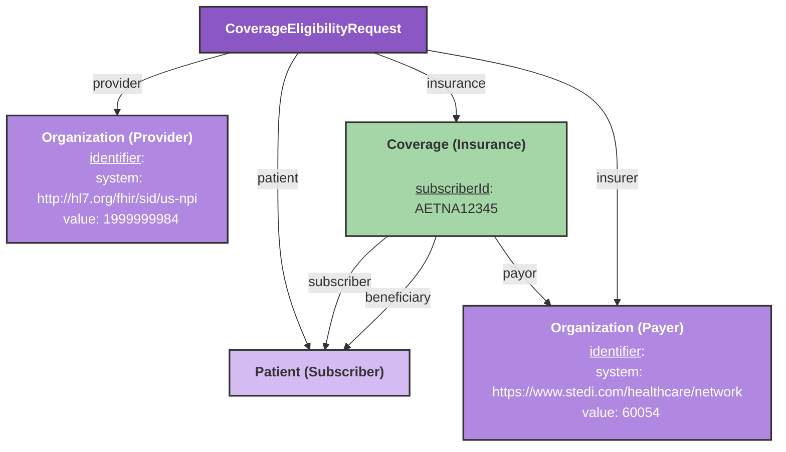
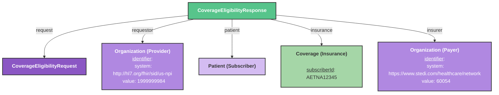

# Insurance and Benefits Eligibility Checks

This guide explains how to model your FHIR resources for the Stedi integration to send and receive eligibility and benefits checks.

## Overview

The Stedi integration allows you to perform insurance eligibility checks by sending a a [CoverageEligibilityRequest](/docs/api/fhir/resources/coverageeligibilityrequest) resource and receiving a [CoverageEligibilityResponse](/docs/api/fhir/resources/coverageeligibilityresponse) resource with the benefits information. This workflow is handled by our **Insurance Eligibility Bot**. Please [contact the Medplum team](mailto:support@medplum.com) to get access to this bot.

For more general information about eligibility checks, please see our [Insurance Eligibility Checks](/docs/billing/insurance-eligibility-checks) guide.

## Creating the Eligibility Check

The following diagram shows the resources that are involved to make an insurance eligibility check with our Stedi integration.



### CoverageEligibilityRequest

| Field | Description | Required |
|-------|-------------|----------|
| `insurer` | Reference to the payer Organization | Yes |
| `provider` | Reference to the provider Organization | Yes |
| `subscriber` | Reference to the subscriber Patient | Yes |
| `insurance` | Array of Coverages. If there are more than one, the array item labeled as the focal will be used for the eligibility check | Yes |
| `servicedPeriod.start` | Service period start date | No (defaults to current date if not provided) |
| `item` | Array of details about the eligibility being checked. This includes what procedure, product, or service is being provided as well as why it is being provided. | No |

:::note
In the CoverageEligibilityRequest.item field, STEDI insurance eligibility check only supports **Plan Coverage and General Benefits**. If it is not provided, it will default to Plan Coverage and General Benefits. 

Example:
```ts
item: [
    {
      category: {
        coding: [
          {
            system: 'https://x12.org/codes/service-type-codes',
            code: '30',
            display: 'Plan Coverage and General Benefits',
          },
        ],
      },
    },
  ],
  ```
:::

### Organization (Payer)

| Field | Description | Required |
|-------|-------------|----------|
| `identifier` | System must be `https://www.stedi.com/healthcare/network` | Yes |
| `name` | Organization name | Yes |

:::info
If you are using an Organization from the Medplum Payer Directory, it will have the correct Payer identifier, so you can just use that.
:::

### Organization (Provider)

| Field | Description | Required |
|-------|-------------|----------|
| `identifier` | System must be `http://hl7.org/fhir/sid/us-npi` | Yes |
| `name` | Organization name | Yes |

### Patient (Subscriber)

| Field | Description | Required |
|-------|-------------|----------|
| `name.family` | Last name | Yes |
| `name.given` | First name | Yes |
| `birthDate` | Date of birth | Yes |
| `identifier` | System `http://hl7.org/fhir/sid/us-ssn` | No (but recommended) |

### Coverage

| Field | Description | Required |
|-------|-------------|----------|
| `subscriberId` | Insurance subscriber ID | Yes |
| `status` | Should be "active" | Yes |
| `subscriber` | Reference to a Patient or RelatedPerson | Yes |
| `beneficiary` | Reference to a Patient or RelatedPerson | Yes |
| `payor` | Reference to the payer Organization | Yes |

## Executing the Eligibility Check

The **Insurance Eligibility Bot** will execute the eligibility check by sending the CoverageEligibilityRequest resource to the Stedi API.

```ts
const response = await medplum.executeBot(
    {
      system: 'https://www.medplum.com/',
      value: 'eligibility',
    },
    coverageEligibilityRequest
);
```

## Receiving the Eligibility Response

After the eligibility check is sent, the **Insurance Eligibility Bot** will create and return a [CoverageEligibilityResponse](/docs/api/fhir/resources/coverageeligibilityresponse) resource. This new [CoverageEligibilityResponse](/docs/api/fhir/resources/coverageeligibilityresponse) will reference all of the resources from the request.



It will also contain the benefits information for the coverage in it's `insurance.item` field. 

[CoverageEligibilityResponse](/docs/api/fhir/resources/coverageeligibilityresponse).insurance.item field will contain the benefits information about the patient's coverage. Read more about [Receiving a CoverageEligibilityResponse](/docs/billing/insurance-eligibility-checks#receiving-a-response).  

<details>
<summary>Example CoverageEligibilityResponse from a STEDI insurance and benefits eligibility check</summary>
```ts
{
  "resourceType": "CoverageEligibilityResponse",
  "status": "active",
  "outcome": "complete", // Eligibility check was successful
  "patient": {
    "reference": "Patient/12345678-1234-5678-9abc-123456789abc",
    "display": "Jordan Doe"
  },
  "insurer": {
    "reference": "Organization/87654321-4321-8765-cdef-987654321def", 
    "display": "Aetna" // Insurance company
  },
  "insurance": [
    {
      "coverage": {
        "reference": "Coverage/abcdef12-5678-9012-3456-abcdef123456"
      },
      "inforce": true, // Coverage is active
      "benefitPeriod": {
        "start": "2024-01-01T00:00:00.000Z", // Coverage period
        "end": "2024-12-31T00:00:00.000Z"
      },
      "item": [
        // COPAY - Fixed dollar amount per visit (in-network)
        {
          "category": {
            "coding": [
              {
                "system": "http://terminology.hl7.org/CodeSystem/ex-benefitcategory",
                "code": "30",
                "display": "Health Benefit Plan Coverage"
              }
            ]
          },
          "network": {
            "coding": [
              {
                "system": "https://www.stedi.com/in-network-indicator",
                "code": "Y",
                "display": "Yes"
              },
              {
                "system": "http://terminology.hl7.org/CodeSystem/benefit-network",
                "code": "in",
                "display": "In-Network"
              }
            ]
          },
          "unit": {
            "coding": [
              {
                "system": "https://www.stedi.com/coverage-level-code",
                "code": "IND",
                "display": "Individual"
              },
              {
                "system": "http://terminology.hl7.org/CodeSystem/benefit-unit",
                "code": "individual",
                "display": "Individual"
              }
            ]
          },
          "benefit": [
            {
              "type": {
                "coding": [
                  {
                    "system": "https://www.stedi.com/benefit-type-code",
                    "code": "B",
                    "display": "Co-Payment"
                  },
                  {
                    "system": "http://terminology.hl7.org/CodeSystem/benefit-type",
                    "code": "copay",
                    "display": "Copayment per service	"
                  }
                ]
              },
              "allowedMoney": {
                "value": 10, // $10 copay
                "currency": "USD"
              }
            }
          ]
        },

        // COINSURANCE - Percentage patient pays after deductible is met (in-network)
        {
          "category": {
            "coding": [
              {
                "system": "http://terminology.hl7.org/CodeSystem/ex-benefitcategory",
                "code": "30",
                "display": "Health Benefit Plan Coverage"
              }
            ]
          },
          "network": {
            "coding": [
              {
                "system": "https://www.stedi.com/in-network-indicator",
                "code": "Y",
                "display": "Yes"
              },
              {
                "system": "http://terminology.hl7.org/CodeSystem/benefit-network",
                "code": "in",
                "display": "In-Network"
              }
            ]
          },
          "unit": {
            "coding": [
              {
                "system": "https://www.stedi.com/coverage-level-code",
                "code": "IND",
                "display": "Individual"
              },
              {
                "system": "http://terminology.hl7.org/CodeSystem/benefit-unit",
                "code": "individual",
                "display": "Individual"
              }
            ]
          },
          "benefit": [
            {
              "type": {
                "coding": [
                  {
                    "system": "https://www.stedi.com/benefit-type-code",
                    "code": "A",
                    "display": "Co-Insurance"
                  }
                ]
              },
              "allowedUnsignedInt": 10 // 10% coinsurance
            }
          ]
        },        

        // DEDUCTIBLE - Amount before insurance contributes (in-network)
        {
          "category": {
            "coding": [
              {
                "system": "http://terminology.hl7.org/CodeSystem/ex-benefitcategory",
                "code": "30",
                "display": "Health Benefit Plan Coverage"
              }
            ]
          },
          "network": {
            "coding": [
              {
                "system": "https://www.stedi.com/in-network-indicator",
                "code": "Y",
                "display": "Yes"
              },
              {
                "system": "http://terminology.hl7.org/CodeSystem/benefit-network",
                "code": "in",
                "display": "In-Network"
              }
            ]
          },
          "unit": {
            "coding": [
              {
                "system": "https://www.stedi.com/coverage-level-code",
                "code": "IND",
                "display": "Individual"
              },
              {
                "system": "http://terminology.hl7.org/CodeSystem/benefit-unit",
                "code": "individual",
                "display": "Individual"
              }
            ]
          },
          "term": {
            "coding": [
              {
                "system": "https://www.stedi.com/time-qualifier-code",
                "code": "25", //This indicates that this is the contract's entire deductible
                "display": "Contract"
              }
            ]
          },
          "benefit": [
            {
              "type": {
                "coding": [
                  {
                    "system": "https://www.stedi.com/benefit-type-code",
                    "code": "C",
                    "display": "Deductible"
                  },
                  {
                    "system": "http://terminology.hl7.org/CodeSystem/benefit-type",
                    "code": "deductible",
                    "display": "Deductible"
                  }
                ]
              },
              "allowedMoney": {
                "value": 500, // $500 deductible
                "currency": "USD"
              }
            }
          ]
        },

        // DEDUCTIBLE - Remaining deductible (in-network)
        {
          "category": {
            "coding": [
              {
                "system": "http://terminology.hl7.org/CodeSystem/ex-benefitcategory",
                "code": "30",
                "display": "Health Benefit Plan Coverage"
              }
            ]
          },
          "network": {
            "coding": [
              {
                "system": "https://www.stedi.com/in-network-indicator",
                "code": "Y",
                "display": "Yes"
              },
              {
                "system": "http://terminology.hl7.org/CodeSystem/benefit-network",
                "code": "in",
                "display": "In-Network"
              }
            ]
          },
          "unit": {
            "coding": [
              {
                "system": "https://www.stedi.com/coverage-level-code",
                "code": "IND",
                "display": "Individual"
              },
              {
                "system": "http://terminology.hl7.org/CodeSystem/benefit-unit",
                "code": "individual",
                "display": "Individual"
              }
            ]
          },
          "term": {
            "coding": [
              {
                "system": "https://www.stedi.com/time-qualifier-code",
                "code": "29", //This indicates that this is the remaining deductible
                "display": "Remaining"
              }
            ]
          },
          "benefit": [
            {
              "type": {
                "coding": [
                  {
                    "system": "https://www.stedi.com/benefit-type-code",
                    "code": "C",
                    "display": "Deductible"
                  },
                  {
                    "system": "http://terminology.hl7.org/CodeSystem/benefit-type",
                    "code": "deductible",
                    "display": "Deductible"
                  }
                ]
              },
              "allowedMoney": {
                "value": 250, // $250 remaining deductible (in-network)
                "currency": "USD"
              }
            }
          ]
        },

        // OUT-OF-POCKET (STOP LOSS) - the amount of money that the patient has to pay 
        // out of pocket before the insurance covers 100% (in-network)
        {
          "category": {
            "coding": [
              {
                "system": "http://terminology.hl7.org/CodeSystem/ex-benefitcategory",
                "code": "30",
                "display": "Health Benefit Plan Coverage"
              }
            ]
          },
          "network": {
            "coding": [
              {
                "system": "https://www.stedi.com/in-network-indicator",
                "code": "Y",
                "display": "Yes"
              },
              {
                "system": "http://terminology.hl7.org/CodeSystem/benefit-network",
                "code": "in",
                "display": "In-Network"
              }
            ]
          },
          "unit": {
            "coding": [
              {
                "system": "https://www.stedi.com/coverage-level-code",
                "code": "IND",
                "display": "Individual"
              },
              {
                "system": "http://terminology.hl7.org/CodeSystem/benefit-unit",
                "code": "individual",
                "display": "Individual"
              }
            ]
          },
          "term": {
            "coding": [
              {
                "system": "https://www.stedi.com/time-qualifier-code",
                "code": "29",
                "display": "Remaining"
              }
            ]
          },
          "benefit": [
            {
              "type": {
                "coding": [
                  {
                    "system": "https://www.stedi.com/benefit-type-code",
                    "code": "G",
                    "display": "Out of Pocket (Stop Loss)"
                  },
                  {
                    "system": "http://terminology.hl7.org/CodeSystem/benefit-type",
                    "code": "benefit",
                    "display": "Benefit"
                  }
                ]
              },
              "allowedMoney": {
                "value": 7000,
                "currency": "USD"
              }
            }
          ]
        },
      ]
    },
    //You will usually get out of network benefits as well
  ]
}
```
</details>

Here are the STEDI specific codes that will be included in each of these fields:

<details>
<summary><strong>Network Indicator Codes</strong> - Indicates whether a service is in-network or out-of-network (System: <code>https://www.stedi.com/in-network-indicator</code>)</summary>

| Code | Display |
|------|---------|
| `Y` | Yes |
| `N` | No |
| `U` | Unknown |
| `W` | Not Applicable |

</details>

<details>
<summary><strong>Coverage Level Codes</strong> - Defines who is covered under the benefit (individual, family, employee, etc.) (System: <code>https://www.stedi.com/coverage-level-code</code>)</summary>

| Code | Display |
|------|---------|
| `CHD` | Children Only |
| `DEP` | Dependents Only |
| `ECH` | Employee and Children |
| `EMP` | Employee Only |
| `ESP` | Employee and Spouse |
| `FAM` | Family |
| `IND` | Individual |
| `SPC` | Spouse and Children |
| `SPO` | Spouse Only |

</details>

<details>
<summary><strong>Time Qualifier Codes</strong> - Specifies the time period for the benefit (calendar year, lifetime, remaining, etc.) (System: <code>https://www.stedi.com/time-qualifier-code</code>)</summary>

| Code | Display |
|------|---------|
| `6` | 24 Hours |
| `7` | Years |
| `13` | Service Year |
| `21` | Calendar Year |
| `22` | Year to Date |
| `23` | Contract |
| `24` | Episode |
| `25` | Visit |
| `26` | Outlier |
| `27` | Remaining |
| `28` | Exceeded |
| `29` | Not Exceeded |
| `30` | Lifetime |
| `31` | Lifetime Remaining |
| `32` | Month |
| `33` | Hour |
| `34` | Week |
| `35` | Day |
| `36` | Admission |

</details>

<details>
<summary><strong>Benefit Type Codes</strong> - Defines the type of benefit (deductible, copay, coinsurance, coverage status, etc.) (System: <code>https://www.stedi.com/benefit-type-code</code>)</summary>

| Code | Display |
|------|---------|
| `1` | Active Coverage |
| `2` | Active - Full Risk Capitation |
| `3` | Active - Services Capitated |
| `4` | Active - Services Capitated to Primary Care Physician |
| `5` | Active - Pending Investigation |
| `6` | Inactive |
| `7` | Inactive - Pending Eligibility Update |
| `8` | Inactive - Pending Investigation |
| `A` | Co-Insurance |
| `B` | Co-Payment |
| `C` | Deductible |
| `CB` | Coverage Basis |
| `D` | Benefit Description |
| `E` | Exclusions |
| `F` | Limitations |
| `G` | Out of Pocket (Stop Loss) |
| `H` | Unlimited |
| `I` | Non-Covered |
| `J` | Cost Containment |
| `K` | Reserve |
| `L` | Primary Care Provider |
| `M` | Pre-existing Condition |
| `MC` | Managed Care Coordinator |
| `O` | Services Restricted to Following Provider |
| `P` | Not Deemed a Medical Necessity |
| `Q` | Benefit Disclaimer |
| `R` | Second Surgical Opinion Required |
| `S` | Other or Additional Payor |
| `T` | Prior Year(s) History |
| `U` | Card(s) Reported Lost/Stolen |
| `V` | Contact Following Entity for Eligibility or Benefit Information |
| `W` | Cannot Process |
| `X` | Other Source of Data |
| `Y` | Health Care Facility |
| `N` | Spend Down |

</details>

## Different Subscriber and Dependent

If the subscriber and dependent are different, for example if you are checking benefits for a spouse or child who is covered under their parent's insurance, your Coverage resource will need to reference both the subscriber and dependent Patient resources. You will need to use this model for coverage eligibility checks that are not for the subscriber themselves. 


## How to find the raw eligibility check data

The eligibility check data is also stored in a [DocumentReference](/docs/api/fhir/resources/documentreference) resource with an identifier that has this system: `http://stedi.com/eligibility-response`.
