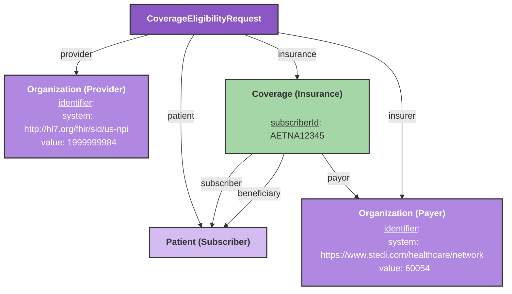
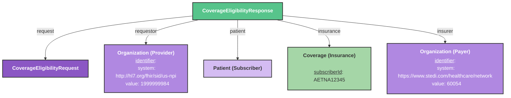
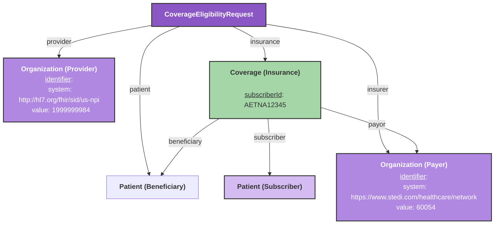

# Insurance Eligibility Checks

This guide explains how to model your FHIR resources for the Stedi integration to send and receive eligibility checks.

## Overview

The Stedi integration allows you to perform insurance eligibility checks by sending a a [CoverageEligibilityRequest](/docs/api/fhir/resources/coverageeligibilityrequest) resource and receiving a [CoverageEligibilityResponse](/docs/api/fhir/resources/coverageeligibilityresponse) resource with the benefits information. This workflow is handled by our **Insurance Eligibility Bot**. Please contact the Medplum team to get access to this bot.

## Creating the Eligibility Check



### CoverageEligibilityRequest
- `insurer`: Reference to the payer Organization (required)
- `provider`: Reference to the provider Organization (required)
- `subscriber`: Reference to the subscriber Patient (required)
- `insurance`: Array of Coverages. If there are more than one, the array item labeled as the focal will be used for the eligibility check (required)
- `servicedPeriod.start`: Optional, defaults to current date if not provided

### Organization (Payer)
- `identifier`: System must be `https://www.stedi.com/healthcare/network` (required)
- `name`: Organization name (required)

:::info
If you are using the Medplum Payer Directory, you can just use an Organization from that. It will have the correct Payer identifier and name.
:::

### Organization (Provider)
- `identifier`: System must be `http://hl7.org/fhir/sid/us-npi` (required)
- `name`: Organization name (required)

### Patient (Subscriber)
- `name.family`: Last name (required)
- `name.given`: First name (required)
- `birthDate`: Date of birth (required)
- `identifier`: System `http://hl7.org/fhir/sid/us-ssn` (optional but recommended)

### Coverage
- `subscriberId`: Insurance subscriber ID (required)
- `status`: Should be "active" (required)
- `subscriber`: Reference to a Patient or RelatedPerson (required)
- `beneficiary`: Reference to a Patient or RelatedPerson (required)
- `payor`: Reference to the payer Organization (required)

## Executing the Eligibility Check

The **Insurance Eligibility Bot** will execute the eligibility check by sending the CoverageEligibilityRequest resource to the Stedi API.

```ts
const response = await medplum.executeBot(
    {
      system: 'https://www.medplum.com/',
      value: 'eligibility',
    },
    coverageEligibilityRequest
);
```

## Receiving the Eligibility Response

After the eligibility check is sent, the **Insurance Eligibility Bot** will create and return a [CoverageEligibilityResponse](/docs/api/fhir/resources/coverageeligibilityresponse) resource. This new CoverageEligibilityResponse will reference all of the resources from the request.



It will also contain the benefits information for the coverage in it's `insurance` field. 

CoverageEligibilityResponse.insurance will contain the benefits information for the coverage.

```ts
{
  "resourceType": "CoverageEligibilityResponse",
  "insurance": [
    {
      "coverage": "Coverage/123",
      "benefitBalance": [
        {
          "type": {
            "coding": [
              {
                "system": "http://terminology.hl7.org/CodeSystem/benefit-type",
                "code": "benefit"
              }
            ]
          },
          "benefit": [
            {
              "type": {
                "coding": [
                  {
                    "system": "http://terminology.hl7.org/CodeSystem/benefit-type",
                    "code": "benefit"
                  }
                ]
              },
              "allowedMoney": {
                "value": 100,
                "currency": "USD"
              }
            }
          ]
        }
      ]
    }
  ]
  //..
}
```

## Different Subscriber and Beneficiary

If the subscriber and beneficiary are different, your Coverage resource will need to reference both the subscriber and beneficiary Patient resources. You will need to use this model for Coverage Eligibility checks that are not for the subscriber themselves. For example, if you are checking benefits for a spouse or child who is covered under their parent's insurance.



