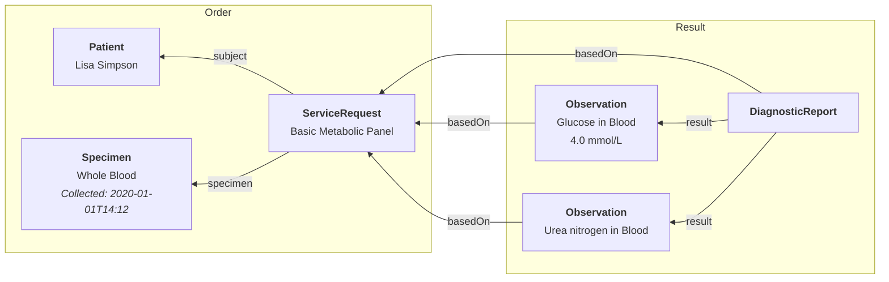

# Labs & Imaging

## Key Resources

| **Resource**                                                    | **Description**                                                                                                               |
| --------------------------------------------------------------- | ----------------------------------------------------------------------------------------------------------------------------- |
| [`ServiceRequest`](/docs/api/fhir/resources/servicerequest)     | A record of an order for services such as diagnostic investigations, treatments, or operations to be performed.               |
| [`DiagnosticReport`](/docs/api/fhir/resources/diagnosticreport) | The findings and interpretations of diagnostic tests performed on a patient.                                                  |
| [`Specimen`](/docs/api/fhir/resources/specimen)                 | A record of a sample to be used for analysis.                                                                                 |
| [`Observation`](/docs/api/fhir/resources/observation)           | A structured representation of measurements and simple assertions made about a [`Patient`](/docs/api/fhir/resources/patient). |

## Key Code Systems

| **Code System**                                                | **Description**                                                                                  |
| -------------------------------------------------------------- | ------------------------------------------------------------------------------------------------ |
| [UCUM](https://ucum.nlm.nih.gov/)                              | Used to define measurement units on a [`Speciment`](/docs/api/fhir/resources/specimen) resource. |
| [ICD-10](https://www.cdc.gov/nchs/icd/icd10cm_browsertool.htm) | Used to annotate [`Observation`](/docs/api/fhir/resources/observation) resources for tracking.   |
| [SNOMED](https://www.snomed.org/)                              | Used to define [`Specimen`](/docs/api/fhir/resources/specimen) types and retrieval methods.      |
| [LOINC](https://www.medplum.com/docs/careplans/loinc)          | Used to annotate [`Observation`](/docs/api/fhir/resources/observation) resources for tracking.   |
