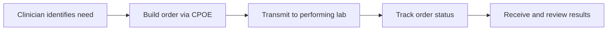

# Order Labs and Imaging

This guide covers how to order laboratory tests and imaging studies using Medplum, from building order forms through tracking results. For the FHIR data model overview, see [Labs & Imaging](/docs/labs-imaging). For medication ordering, see the [Medications](/docs/medications) section.

## End-to-End Ordering Flow

A typical diagnostic ordering workflow moves through five stages, each represented by FHIR resources and status transitions.



1. A clinician identifies the need for a diagnostic test or imaging study during a patient encounter.
2. The order is captured through a Computerized Physician Order Entry (CPOE) form, creating a [`ServiceRequest`](/docs/api/fhir/resources/servicerequest) resource.
3. The order is transmitted to the performing laboratory or imaging facility, either via an integration (e.g. [Health Gorilla](/docs/integration/health-gorilla)) or an internal process.
4. The `ServiceRequest.status` is updated as the order progresses through its lifecycle.
5. Results arrive as [`DiagnosticReport`](/docs/api/fhir/resources/diagnosticreport) and [`Observation`](/docs/api/fhir/resources/observation) resources linked back to the original order. See [Results and Review](/docs/labs-imaging/results-and-review) for details.

## Order Form (CPOE)

Certified EHRs are required to support CPOE for Medications, Labs, and Imaging. These correspond to the ONC (a)(1), (a)(2), and (a)(3) criteria described on [HealthIT.gov](https://www.healthit.gov/test-method/computerized-provider-order-entry-cpoe-medications).

Building a custom CPOE form that represents an organization's [Diagnostic Catalog](/docs/careplans/diagnostic-catalog) and enabling the appropriate provider integrations are the first steps. The form needs to capture:

- Which tests to order (e.g. HbA1c) and which performing lab (e.g. ACME Clinical Lab)
- Ask on Entry (AOE) questions specific to the test (e.g. whether the patient is fasted for a Renal Panel)
- Specimen details including collection time and specimen type
- Billing and insurance information indicating which account or payor should cover the test

This [questionnaire](https://storybook.medplum.com/?path=/story/medplum-questionnaireform--lab-ordering) demonstrates a sample CPOE order form and can be added to your Medplum app or provider-facing application.

## ServiceRequest Lifecycle

The [`ServiceRequest`](/docs/api/fhir/resources/servicerequest) resource tracks the full lifecycle of a diagnostic order. FHIR R4 defines the following status values:

| Status | Meaning |
| --- | --- |
| `draft` | Order is being composed but not yet finalized |
| `active` | Order has been placed and is awaiting fulfillment |
| `on-hold` | Order is temporarily paused or suspended |
| `completed` | Results have been received and the order is fulfilled |
| `revoked` | Order was cancelled before completion |
| `entered-in-error` | Order was created by mistake and should be disregarded |

### Creating an Order

When a clinician finalizes an order, create a `ServiceRequest` linked to the patient and, when applicable, the encounter:

```json
{
  "resourceType": "ServiceRequest",
  "status": "active",
  "intent": "order",
  "category": [{
    "coding": [{
      "system": "http://snomed.info/sct",
      "code": "108252007",
      "display": "Laboratory procedure"
    }]
  }],
  "code": {
    "coding": [{
      "system": "http://loinc.org",
      "code": "24323-8",
      "display": "Comprehensive metabolic 2000 panel - Serum or Plasma"
    }]
  },
  "subject": { "reference": "Patient/example" },
  "encounter": { "reference": "Encounter/visit-123" },
  "requester": { "reference": "Practitioner/dr-smith" },
  "performer": [{ "reference": "Organization/acme-lab" }],
  "priority": "routine"
}
```

The `intent` field is always `order` for clinician-placed orders. Use `priority` to distinguish routine orders from urgent/stat requests (`routine`, `urgent`, `asap`, `stat`).

### Cancelling and Amending Orders

To cancel an order that has not yet been fulfilled, update the `ServiceRequest.status` to `revoked`. If the order was created by mistake, use `entered-in-error` instead.

To amend an order (e.g. adding tests or changing the performing lab), update the existing `ServiceRequest` rather than creating a duplicate. If the integration partner requires a new transmission, coordinate cancellation of the original and creation of a replacement, linking them via `ServiceRequest.replaces`.

### Linking Orders to Encounters

When an order is placed during a visit, set `ServiceRequest.encounter` to reference the active [`Encounter`](/docs/api/fhir/resources/encounter). This allows the encounter chart to display all orders associated with the visit via a search like `ServiceRequest?encounter=Encounter/{id}`.

## Laboratory vs. Imaging Orders

While both laboratory and imaging orders use `ServiceRequest`, there are differences in the ordering workflow:

| Aspect | Laboratory | Imaging |
| --- | --- | --- |
| Specimen | Physical sample is collected (blood, urine, etc.) with collection time and handling requirements | No specimen; patient is scheduled for a study |
| AOE questions | Common (e.g. fasting status, last menstrual period) | Less common; clinical indication and contrast preferences are typical |
| Scheduling | Specimen collection may happen at point of care or at a draw station | Study is typically scheduled as a separate appointment at a facility |
| Results | Structured `Observation` values with reference ranges | `DiagnosticReport` often includes an attached imaging report (PDF or narrative) with fewer structured observations |
| Category coding | `laboratory` (SNOMED `108252007`) | `imaging` (SNOMED `363679005`) |

For imaging orders, use `ServiceRequest.locationReference` or `ServiceRequest.locationCode` to indicate the facility where the study should be performed.

## Logistics

CPOE should account for the logistics workflow a provider organization wants to enable:

| Scenario | Implications |
| --- | --- |
| Specimen collected on site | CPOE must collect specimen time and details; support printing requisitions to attach to specimens |
| Specimen collected elsewhere | No specimen collection details on the form; patients informed of draw station location |
| At-home lab | Patient data must include an accurate mailing address |

## Integrations

Medplum is provider-agnostic and supports connecting to lab and imaging orders of all types when an integration is in place. Common integrations can be found in the [Integrations](/docs/integration) section.

For lab ordering specifically, the [Health Gorilla](/docs/integration/health-gorilla) integration provides end-to-end support including [sending orders](/docs/integration/health-gorilla/sending-orders) and [receiving results](/docs/integration/health-gorilla/receiving-results), with React components and bot-based automation. Quest, Labcorp, and regional labs are commonly connected through Health Gorilla.

Organizations that connect directly to a performing lab (e.g. via HL7v2 or a proprietary API) follow the same FHIR resource patterns described here. The [HL7 Interface](/docs/integration/hl7-interfacing) and [On-Prem Agent](/docs/agent) docs cover connectivity options.

:::caution[]
Lab and imaging ordering requires setup. Contact us at [info@medplum.com](mailto:info+diagnostics@medplum.com?subject=enabling%20diagnostic%20providers) to enable a provider.
:::

## ONC Certification

CPOE for labs and imaging corresponds to ONC criteria (a)(2) and (a)(3). Certification is in progress; follow the [GitHub issue](https://github.com/medplum/medplum/issues/3003) for updates.

## See Also

- [Labs & Imaging](/docs/labs-imaging) — FHIR data model overview
- [Results and Review](/docs/labs-imaging/results-and-review) — receiving and interpreting diagnostic results
- [Diagnostic Catalog](/docs/careplans/diagnostic-catalog) — defining test menus, panels, and specimen requirements
- [Reference Ranges](/docs/careplans/reference-ranges) — configuring reference, critical, and absolute value ranges
- [LOINC Codes](/docs/careplans/loinc) — standardized coding for laboratory, clinical, and imaging observations
- [Health Gorilla Lab Orders](/docs/integration/health-gorilla) — integration for sending orders and receiving results
- [ONC Certification](/docs/compliance/onc) — compliance criteria for CPOE
- [Sandbox CPOE video](https://www.youtube.com/watch?v=m0AWpEOh1es)
- [(a)(2) CPOE Laboratory](https://youtu.be/bb_ISvpcw6o) on Youtube
