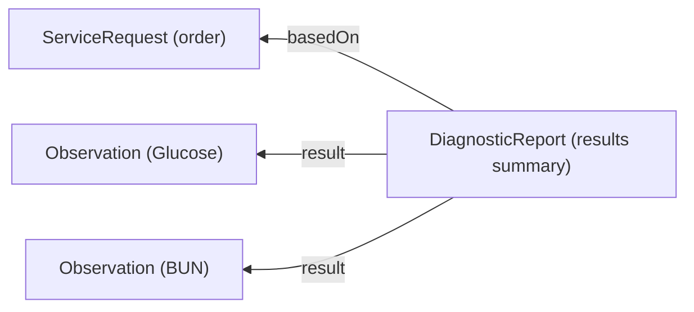

# Results and Review

When a performing laboratory or imaging facility completes a diagnostic study, the results are represented in FHIR as a [`DiagnosticReport`](/docs/api/fhir/resources/diagnosticreport) linked to individual [`Observation`](/docs/api/fhir/resources/observation) resources. This guide covers how results connect back to orders, how to structure them for display, and how to handle abnormal findings.

## How Results Connect to Orders

Every `DiagnosticReport` should reference the original order via `basedOn`. This link is what allows the UI to display results in the context of the order that requested them.



A single `ServiceRequest` (e.g. a panel order) produces one `DiagnosticReport` containing multiple `Observation` results. Each `Observation` records a single measurement with its value, units, and reference range.

## DiagnosticReport Structure

A completed lab result looks like the following:

```json
{
  "resourceType": "DiagnosticReport",
  "status": "final",
  "category": [
    {
      "coding": [{
        "system": "http://terminology.hl7.org/CodeSystem/v2-0074",
        "code": "LAB",
        "display": "Laboratory"
      }]
    }
  ],
  "code": {
    "coding": [{
      "system": "http://loinc.org",
      "code": "24323-8",
      "display": "Comprehensive metabolic 2000 panel - Serum or Plasma"
    }]
  },
  "subject": { "reference": "Patient/example" },
  "basedOn": [{ "reference": "ServiceRequest/order-123" }],
  "issued": "2024-07-15T14:30:00Z",
  "result": [
    { "reference": "Observation/glucose-result" },
    { "reference": "Observation/bun-result" }
  ]
}
```

### Category Coding

The `category` field determines where a report appears in the UI. The Medplum provider app uses the `v2-0074` code system to classify reports:

| Code | Display | Use |
| --- | --- | --- |
| `LAB` | Laboratory | General lab results; required for the patient summary sidebar |
| `HM` | Hematology | Specialty subtype (always pair with `LAB`) |
| `CH` | Chemistry | Specialty subtype (always pair with `LAB`) |
| `MB` | Microbiology | Specialty subtype (always pair with `LAB`) |

:::caution[]
Reports that only include a specialty code without `LAB` will not appear in the patient summary sidebar. Always include at least one `LAB` category entry alongside any specialty categories.
:::

### Report Status

The `DiagnosticReport.status` field tracks the lifecycle of the result:

| Status | Meaning |
| --- | --- |
| `registered` | Report has been created but results are not yet available |
| `partial` | Some results are available but the report is incomplete |
| `preliminary` | Results are available but not yet verified or finalized |
| `final` | Report is complete and verified |
| `amended` | Report was modified after being finalized |
| `corrected` | Report was corrected due to an error in a previously finalized result |
| `cancelled` | Report was cancelled (e.g. specimen was rejected) |

## Observation Results

Each line item in a lab report is an [`Observation`](/docs/api/fhir/resources/observation):

```json
{
  "resourceType": "Observation",
  "status": "final",
  "category": [{
    "coding": [{
      "system": "http://terminology.hl7.org/CodeSystem/observation-category",
      "code": "laboratory",
      "display": "Laboratory"
    }]
  }],
  "code": {
    "coding": [{
      "system": "http://loinc.org",
      "code": "2345-7",
      "display": "Glucose [Mass/volume] in Serum or Plasma"
    }]
  },
  "subject": { "reference": "Patient/example" },
  "valueQuantity": {
    "value": 95,
    "unit": "mg/dL",
    "system": "http://unitsofmeasure.org",
    "code": "mg/dL"
  },
  "referenceRange": [{
    "low": { "value": 70, "unit": "mg/dL" },
    "high": { "value": 100, "unit": "mg/dL" }
  }],
  "interpretation": [{
    "coding": [{
      "system": "http://terminology.hl7.org/CodeSystem/v3-ObservationInterpretation",
      "code": "N",
      "display": "Normal"
    }]
  }]
}
```

### Reference Ranges and Interpretation

Each `Observation` can carry a `referenceRange` that defines the expected normal range for the measured value. The `interpretation` field provides a coded flag (e.g. `N` for normal, `H` for high, `L` for low, `HH` / `LL` for critically abnormal).

Reference ranges may come from the performing lab as part of the result, or they can be configured by clinical administrators using [`ObservationDefinition`](/docs/api/fhir/resources/observationdefinition) resources. See [Observation Reference Ranges](/docs/careplans/reference-ranges) for details on defining your own ranges.

### Critical and Abnormal Results

When a result falls outside the expected range, the `interpretation` code signals the severity:

| Code | Meaning |
| --- | --- |
| `N` | Normal |
| `H` | High |
| `L` | Low |
| `HH` | Critically high |
| `LL` | Critically low |
| `A` | Abnormal |

For integration-based workflows, the receiving system may also create a [`DetectedIssue`](/docs/api/fhir/resources/detectedissue) resource to flag clinical workflow concerns such as unsolicited results or unmatched patients. See the [Health Gorilla Receiving Results](/docs/integration/health-gorilla/receiving-results) guide for examples of how detected issues are handled.

## Imaging Results

Imaging results follow the same `DiagnosticReport` pattern but typically differ in structure:

- The `category` uses an imaging-specific code (e.g. `RAD` for radiology).
- Reports often include a narrative interpretation in `DiagnosticReport.conclusion` rather than discrete `Observation` values.
- The original study may be attached via `DiagnosticReport.presentedForm` (e.g. a PDF radiology report) or `DiagnosticReport.imagingStudy` for DICOM references.

```json
{
  "resourceType": "DiagnosticReport",
  "status": "final",
  "category": [{
    "coding": [{
      "system": "http://terminology.hl7.org/CodeSystem/v2-0074",
      "code": "RAD",
      "display": "Radiology"
    }]
  }],
  "code": {
    "coding": [{
      "system": "http://loinc.org",
      "code": "36643-5",
      "display": "XR Chest 2 Views"
    }]
  },
  "subject": { "reference": "Patient/example" },
  "basedOn": [{ "reference": "ServiceRequest/imaging-order-456" }],
  "conclusion": "No acute cardiopulmonary abnormality."
}
```

## Integrations

Results can arrive through multiple paths depending on your integration:

- [Health Gorilla](/docs/integration/health-gorilla/receiving-results) synchronizes structured lab results from Quest, Labcorp, and regional labs as FHIR resources via a Medplum Bot.
- Direct HL7v2 feeds can be mapped to FHIR using the [HL7 Interface](/docs/integration/hl7-interfacing) and [Bots](/docs/bots).
- Organizations with internal labs can create `DiagnosticReport` and `Observation` resources directly via the FHIR API.

Regardless of the ingestion path, the same FHIR resource patterns apply: `DiagnosticReport` references the `ServiceRequest` via `basedOn`, and individual measurements are stored as `Observation` resources linked through `result`.

## See Also

- [Labs & Imaging](/docs/labs-imaging) — FHIR data model overview
- [Order Labs and Imaging](/docs/labs-imaging/ordering-labs-imaging) — placing diagnostic orders
- [Observation Reference Ranges](/docs/careplans/reference-ranges) — configuring normal and abnormal value ranges
- [LOINC Codes](/docs/careplans/loinc) — coding observations and tests
- [Health Gorilla Receiving Results](/docs/integration/health-gorilla/receiving-results) — integration-specific result handling
- [`DiagnosticReport`](/docs/api/fhir/resources/diagnosticreport) FHIR resource API
- [`Observation`](/docs/api/fhir/resources/observation) FHIR resource API
