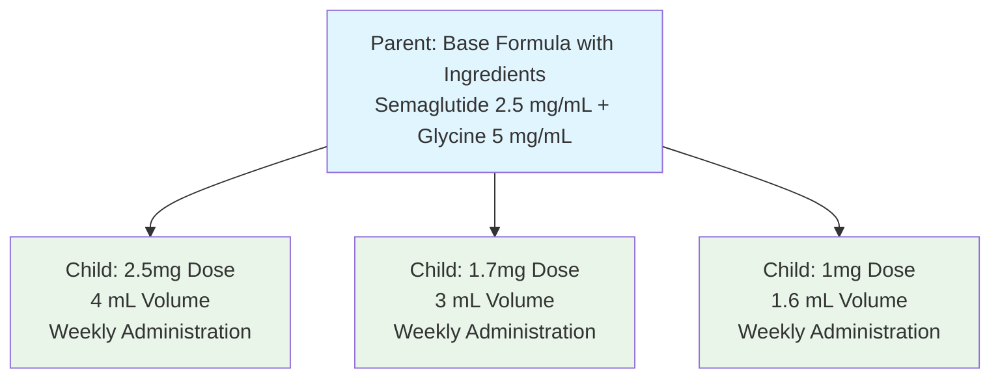

---
keywords:
  - drugs
  - formulary
  - medication
  - pharmacy
tags:
  - administration
  - medication
  - pharmacy
---

# Modeling a Formulary

A "formulary" refers to a catalog of drugs offered by your organization. When implementing a custom EMR, Digital Health clinical administrators often curate a formulary of relevant drugs, along with relevant metadata, to assist prescribing physicians, pharmacists, and patients.

This guide covers the basics of how to use the [`MedicationKnowledge`](/docs/api/fhir/resources/medicationknowledge) resource, which represents a type of medication that can be ordered. It will cover:

- How to annotate medications with the proper codes.
- How to represent physical characteristics about the medication and its package.
- How to categorize medications in the formulary.
- How to represent compounded medications, including dose variations. 
- How to represent relationships between medications.

This guide is informed by the [DaVinci Payer Data Exchange (PDex) US Drug Formulary](https://build.fhir.org/ig/HL7/davinci-pdex-formulary/index.html) implementation guide, which was authored by industry leaders, including Humana, Cigna, and Optum.

:::tip Sample Data
You can download the examples in this guide [here](./formulary-examples.json), and upload them to your project using the [Medplum Batch Upload Tool](/docs/tutorials/importing-sample-data#batch-upload-tool)
:::

:::caution A note on the Medication resource
You might be asking yourself, what is the difference between the `Medication` and `MedicationKnowledge` resources? Both resources hold information like medication manufacturer and ingredients, but `MedicationKnowledge` holds potentially critical information beyond that, like regulatory information related to controlled substances, packaging descriptions used by pharmacists, and administrative guidelines for both clinicians and patients. In general, we encourage the use of `MedicationKnowledge` rather than `Medication`. 
:::

## Medication Code

When defining `MedicationKnowledge.code`, it's highly recommended to use RxNorm as the primary coding system. RxNorm is an international standard that normalizes drug names from many different data sources.

RxNorm has codes for medications with different levels of specificity, called "term types". Refer to our [RxNorm guide](./medication-codes) for a detailed understanding of the term-type hierarchy.

The [Da Vinci formulary guide](https://build.fhir.org/ig/HL7/davinci-pdex-formulary/index.html) recommends using the following term type when creating a formulary to achieve the appropriate level of specificity

| Term Types                                                                                                                 | Requirement | Example                                                                    | RxCUI   |
| -------------------------------------------------------------------------------------------------------------------------- | ----------- | -------------------------------------------------------------------------- | ------- |
| Semantic Clinical Drug (`SCD`) <br />Semantic Branded Drug (`SBD`) <br />Generic Pack (`GPCK`) <br />Branded Pack (`BPCK`) | Required    | acetaminophen 325 MG / oxycodone hydrochloride 5 MG Oral Tablet [Percocet] | 1049640 |
| Semantic Clinical Drug Form (`SCDG`) <br />Semantic Branded Drug Form Group (`SBDG`)                                       | Optional    | Percocet Pill                                                              | 1185784 |

You can use the [RxNav](https://mor.nlm.nih.gov/RxNav/) browser to search for RxNorm codes for your formulary.

Below is an example [`MedicationKnowledge`](/docs/api/fhir/resources/medicationknowledge) with both `SBD` and `SBDG` codes:

```ts
{
  resourceType: "MedicationKnowledge",
  code: {
    coding: [
      {
        system: "http://www.nlm.nih.gov/research/umls/rxnorm",
        code: "1049640",
        display: "acetaminophen 325 MG / oxycodone hydrochloride 5 MG Oral Tablet [Percocet]"
      },
      {
        system: "http://www.nlm.nih.gov/research/umls/rxnorm",
        code: "1185784",
        display: "Percocet Pill"
      }
    ]
  }
}
```

## Branded vs. Generic Medications

RxNorm term types `SBD`, `BPCK`, and `SBDG` all refer to specific brand names for a given drug. Including branded drugs in your formulary indicates that physicians may only prescribe a specific brand.

In contrast, using generic term types (`SCD`, `GPCK`, `SCDG`) indicates that physicians may prescribe _any_ brand of the medication.

:::tip Prescribable vs. Dispensable Medications

While most Medplum applications will include _either_ generic _or_ branded versions of a medication, some advanced implementations may include both. This is especially common with providers that own their own pharmacy.

In these implementations, generic codes would be used by physicians to _prescribe_ the medication, whereas pharmacies branded medications would be used to _dispense_ the medication. See [Medication Relationships](#medication-relationships) for details on how to represent the link between branded and generic [`MedicationKnowledge`](/docs/api/fhir/resources/medicationknowledge) resources.

:::

## Medication Characteristics

The [`MedicationKnowledge`](/docs/api/fhir/resources/medicationknowledge) resources can also be used to store details about the physical characteristics of a medication, as well as its packaging and form.

The table below summarizes the most important medication metadata elements.

| Element               | Description                                                              | Relevant Valueset                                                                                                   |
| --------------------- | ------------------------------------------------------------------------ | ------------------------------------------------------------------------------------------------------------------- |
| `drugCharacteristics` | Physical characteristics of the medication (color, shape, imprint, etc.) | [Medication knowledge characteristic code](http://hl7.org/fhir/R4/valueset-medicationknowledge-characteristic.html) |
| `doseForm`            | Physical form of the drug (pill, powder, liquid, etc.)                   | [SNOMED Form Codes](http://hl7.org/fhir/R4/valueset-medication-form-codes.html)                                     |
| `packaging`           | Description of the medication package (bottle, blister pack, etc.)       | [MedicationKnowledge Package Type Codes](http://hl7.org/fhir/R4/valueset-medicationknowledge-package-type.html)     |
| `intendedRoute`       | Method of ingestion (oral, intravenous, etc.)                            | [SNOMED Route Codes](http://hl7.org/fhir/R4/valueset-route-codes.html)                                              |

<details>
  <summary>Example of Drug Characteristics</summary>

```ts
{
  resourceType: 'MedicationKnowledge',
  code: {
    text: 'acetaminophen 325 MG [Tylenol]',
    coding: [
      {
        system: 'http://www.nlm.nih.gov/research/umls/rxnorm',
        code: '569998',
      },
      {
        system: 'http://hl7.org/fhir/sid/ndc',
        code: '5058049501',
      },
    ],
  },
  drugCharacteristic: [
    {
      type: {
        text: 'Color',
        coding: [
          {
            system: 'http://terminology.hl7.org/CodeSystem/medicationknowledge-characteristic',
            code: 'color',
          },
        ],
      },
      valueString: 'white',
    },
    {
      type: {
        text: 'Imprint Code',
        coding: [
          {
            system: 'http://terminology.hl7.org/CodeSystem/medicationknowledge-characteristic',
            code: 'imprintcd',
          },
        ],
      },
      valueString: 'Tylenol',
    },
  ],
  amount: {
    value: 100,
    unit: 'tablets',
    system: 'http://terminology.hl7.org/ValueSet/v3-UnitsOfMeasureCaseSensitive',
    code: '{tbl}'
  },
  packaging: {
    type: {
      text: 'Bottle',
      coding: [
        {
          system: 'http://terminology.hl7.org/CodeSystem/medicationknowledge-package-type',
          code: 'bot',
          display: 'Bottle',
        },
      ],
    },
    quantity: {
      value: 100,
      unit: 'tablets',
      system: 'http://terminology.hl7.org/ValueSet/v3-UnitsOfMeasureCaseSensitive',
      code: '{tbl}'
    },
  },
  doseForm: {
    coding: [
      {
        display: 'Tablet'
        code: '385055001'
        system: 'http://snomed.info/sct',
      }
    ]
  },
  intendedRoute: [
    {
      text: 'oral'
      coding: [
        {
      		display: 'Oral use',
      		code: '26643006',
          system: 'http://snomed.info/sct'
        }
      ]
    },
  ],
  //...
}
```

</details>

:::caution A note about units

All units for medication quantities are [UCUM units of measure](https://terminology.hl7.org/4.0.0/ValueSet-v3-UnitsOfMeasureCaseSensitive.html). This includes standard SI units, as well as non-standard healthcare units. A common unit for medications is `{tbl}`, which stands for "tablets", which is useful for quantifying the amount of medication in a package.

:::

## Classifications and Regulations

The `MedicationKnowledge.productType` field can be used to categorize the drug within the formulary, potentially along multiple dimensions. This field can also be used to describe:

- Whether a drug is generic or branded
- Whether the drug requires a prescription (see: [Legal status of Supply](https://build.fhir.org/valueset-legal-status-of-supply.html))

:::caution Representing Controlled Substance Schedules

Certain medications, including narcotics, are classified into schedules based on the U.S. Controlled Substances Act (CSA). `MedicationKnowledge.regulatory.schedule` is used for specifying the regulatory schedule for any medications subject to these restrictions.

Refer to the [HL7 Controlled Substances Schedule](https://terminology.hl7.org/ValueSet-v2-0477.html) for an example valueset.

:::

## Compounded Medications

For medications that must be mixed before being dispensed, the `MedicationKnowledge.ingredient` field is used for listing ingredients of compounded medications, with RxNorm as the preferred code system for each ingredient.

The `MedicationKnowledge.amount` field indicates the total amount of the compound to be dispensed, and the `strength` of each ingredient is stored as a ratio of the total volume (e.g. 1g per 100g).

`ingredient.isActive` indicates which of the listed ingredients are active.

### Dose Variations

For compounded medications with multiple dose variations, it's common to model a parent-child relationship where:

- **Parent medication**: Contains the core compound formula with ingredients and base concentrations
- **Child medications**: Represent specific dose variations of the parent compound with different volumes and administration instructions

This hierarchical structure allows for efficient management of compound families while maintaining specific dosing information for each variation.



<details>
  <summary>Example: Parent Compound Medication</summary>

```ts
{
  resourceType: "MedicationKnowledge",
  status: "active",
  ingredient: [
    {
      itemReference: {
        reference: "Substance/1234",
        display: "Semaglutide"
      },
      strength: {
        numerator: {
          value: 2.5,
          unit: "mg"
        },
        denominator: {
          value: 1
        }
      }
    },
    {
      itemReference: {
        reference: "Substance/5678",
        display: "Glycine"
      },
      strength: {
        numerator: {
          value: 5,
          unit: "mg"
        },
        denominator: {
          value: 1
        }
      }
    }
  ],
  code: {
    text: "Semaglutide 2.5 mg/mL + Glycine 5 mg/mL",
    coding: [
      {
        system: "medication-coding-system",
        code: "3099",
        display: "Semaglutide 2.5 mg/mL + Glycine 5 mg/mL"
      }
    ]
  },
  productType: [
    {
      coding: [
        {
          system: "medication-type-coding-system",
          code: "compound",
          display: "Compound"
        }
      ]
    }
  ],
  doseForm: {
    coding: [
      {
        system: "http://hl7.org/fhir/administrable-dose-form",
        code: "100000073863",
        display: "Solution for injection"
      }
    ]
  },
  // Parent medication references its child variations
  relatedMedicationKnowledge: [
    {
      type: {
        coding: [
          {
            system: "compounded-medication-family",
            code: "child",
            display: "child"
          }
        ]
      },
      reference: [
        {
          reference: "MedicationKnowledge/<child1-id>",
          display: "1.7mg Semaglutide 2.5 mg/mL + Glycine 5 mg/mL 3 mL"
        },
        {
          reference: "MedicationKnowledge/<child2-id>",
          display: "1mg Semaglutide 2.5 mg/mL + Glycine 5 mg/mL 1.5 mL"
        }
        // Additional child variations...
      ]
    }
  ]
}
```

</details>

<details>
  <summary>Example: Child Dose Variation</summary>

```ts
{
  resourceType: "MedicationKnowledge",
  status: "active",
  amount: {
    value: 1,
    extension: [
      {
        id: "medication-days-supply",
        url: "https://www.hl7.org/fhir/datatypes.html#integer",
        valueInteger: 28
      }
    ],
    unit: "Each"
  },
  code: {
    text: "1.7mg Semaglutide 2.5 mg/mL + Glycine 5 mg/mL 3 mL",
    coding: [
      {
        system: "medication-coding-system",
        code: "3080",
        display: "1.7mg Semaglutide 2.5 mg/mL + Glycine 5 mg/mL 3 mL"
      }
    ]
  },
  // Specific administration guidelines for this dose variation
  administrationGuidelines: [
    {
      dosage: [
        {
          dosage: [
            {
              patientInstruction: "Inject Semaglutide 1.7mg (0.70mL or units) subcutaneously once weekly"
            }
          ],
          type: {
            coding: [
              {
                code: "maintenance",
                display: "maintenance"
              }
            ]
          }
        }
      ]
    }
  ],
  productType: [
    {
      coding: [
        {
          system: "medication-type-coding-system",
          code: "compound",
          display: "Compound"
        }
      ]
    }
  ],
  // Child medication references its parent
  relatedMedicationKnowledge: [
    {
      type: {
        coding: [
          {
            system: "compounded-medication-family",
            code: "parent",
            display: "parent"
          }
        ]
      },
      reference: [
        {
          reference: "MedicationKnowledge/<parent-id>",
          display: "Semaglutide 2.5 mg/mL + Glycine 5 mg/mL"
        }
      ]
    }
  ]
}
```

</details>

### Key Considerations for Parent-Child Compounds

**Parent Medication Features:**
- Contains the complete ingredient list with base concentrations
- Uses `relatedMedicationKnowledge` with type "child" to reference dose variations
- Typically lacks specific administration guidelines (handled by children)
- Serves as the master template for the compound family

**Child Medication Features:**
- References parent using `relatedMedicationKnowledge` with type "parent"
- Contains specific volume amounts and administration instructions
- Includes dose-specific coding and display names
- May include additional metadata like days supply and patient instructions

**Benefits of This Approach:**
- Centralizes ingredient management in the parent
- Allows for easy addition of new dose variations
- Maintains clear relationships between related compounds
- Supports efficient formulary navigation and management

<details>
  <summary>Example: Traditional Single Compounded Medication</summary>

```ts
{
  resourceType: 'MedicationKnowledge',
  // Dispense 200g total
  amount: {
    value: 200,
    unit: 'g',
    system: 'http://unitsofmeasure.org',
  },
  // Each ingredient strength is listed as a ratio out of 100g
  ingredient: [
    {
      isActive: true,
      itemCodeableConcept: {
        text: 'Baclofen powder',
        coding: [
          {
            system: 'http://www.nlm.nih.gov/research/umls/rxnorm',
            code: '1292',
          },
        ],
      },
      strength: {
        numerator: {
          value: 5,
          unit: 'g',
          system: 'http://unitsofmeasure.org',
        },
        denominator: {
          value: 100,
          unit: 'g',
          system: 'http://unitsofmeasure.org',
        },
      },
    },
    {
      isActive: true,
      itemCodeableConcept: {
        text: 'Ketoprofen powder',
        coding: [
          {
            system: 'http://www.nlm.nih.gov/research/umls/rxnorm',
            code: '6142',
          },
        ],
      },
      strength: {
        numerator: {
          value: 10,
          unit: 'g',
          system: 'http://unitsofmeasure.org',
        },
        denominator: {
          value: 100,
          unit: 'g',
        },
      },
    },
    {
      isActive: true,
      itemCodeableConcept: {
        text: 'Capcaicin 0.75 mg/mL topical lotion',
        coding: [
          {
            system: 'http://www.nlm.nih.gov/research/umls/rxnorm',
            code: '1992',
          },
        ],
      },
      strength: {
        numerator: {
          value: 0.075,
          unit: 'g',
        },
        denominator: {
          value: 100,
          unit: 'g',
        },
      },
    },
    {
      isActive: true,
      itemCodeableConcept: {
        text: 'Tetracaine 10 mg/mL topical cream',
        coding: [
          {
            system: 'http://www.nlm.nih.gov/research/umls/rxnorm',
            code: '10391',
          },
        ],
      },
      strength: {
        numerator: {
          value: 2,
          unit: 'g',
        },
        denominator: {
          value: 100,
          unit: 'g',
        },
      },
    },
    {
      isActive: false,
      itemCodeableConcept: {
        text: 'PLO flowable Pluronic Lecithin Organogel',
        coding: [
          {
            system: 'http://www.nlm.nih.gov/research/umls/rxnorm',
            code: '012345',
          },
        ],
      },
      strength: {
        numerator: {
          value: 82.9,
          unit: 'g',
        },
        denominator: {
          value: 100,
          unit: 'g',
        },
      },
    },
  ],
  packaging: {
    type: {
      text: 'Tube',
      coding: [
        {
          system: 'http://terminology.hl7.org/CodeSystem/medicationknowledge-package-type',
          code: 'tube',
          display: 'Tube',
        },
      ],
    },
  },
//...
}
```

</details>

## Medication Relationships

Advanced implementations might want to model structured relationships between medications. For example, administrators might want to link [`MedicationKnowledge`](/docs/api/fhir/resources/medicationknowledge) resources representing generic and branded medications, to aid in fulfillment (see [Branded vs. Generic Medications](#branded-vs-generic-medications))

Relationships between drugs in the formulary are modeled using the `MedicationKnowledge.relatedMedicationKnowledge` field. The type of each relationship is specified by `MedicationKnowledge.relatedMedicationKnowledge.type`.

Common relationship types include:

- **Parent-Child**: Used for compound families where a parent contains the base formula and children represent dose variations
- **Generic-Branded**: Links generic and branded versions of the same medication
- **Therapeutic Equivalents**: Medications that can be substituted for one another

Custom relationship type systems can be defined for organization-specific needs, such as the "compounded-medication-family" system shown in the compound examples above.

Refer to the [RxNORM relationship codes](https://www.nlm.nih.gov/research/umls/rxnorm/docs/appendix1.html) for an example code system of relationships between drugs.

## Images and Other Documents

Supplemental images and documentation should be referenced from `MedicationKnowledge.monograph`. This can include images, label information, supplemental patient instructions, etc.

For these external files, implementers should create a [`DocumentReference`](/docs/api/fhir/resources/documentreference) resource, and reference it from `MedicationKnowledge.monograph`. For more information on handling external files, consult our guide on [Handling External Files](/docs/charting/external-documents).

## See Also

- Guide on [Medication Code Systems](./medication-codes)
- [DaVinci Payer Data Exchange (PDex) US Drug Formulary](https://build.fhir.org/ig/HL7/davinci-pdex-formulary/index.html) implementation guide
- [Humana Drug Formulary API](https://developers.humana.com/apis/drug-formulary-api/doc)
