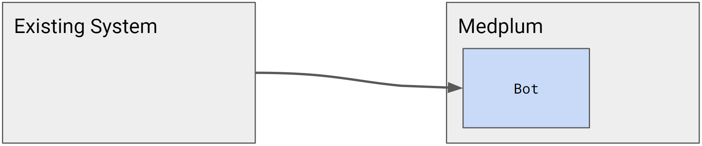
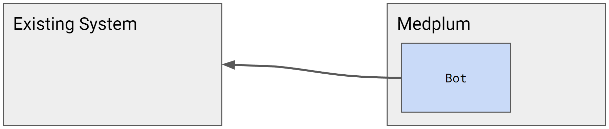

# Migration Logic

Virtually all system migrations require some degree of migration logic: the "transformers" that convert one representation of a patient to a new one. Smaller and more simple systems might have 10-20 data types to convert. Larger and more complex systems can easily have 50-100 data types.

The code that performs this migration logic must live somewhere. The decision of where to perform the transformations is important, and requires careful consideration.

## Considerations

When considering which option is best for you, we must consider some system characteristics:

- How easy or difficult is it to modify the existing system?
  - Are engineers actively updating the existing system?
  - How frequently does the existing system deploy new releases?
  - Is the existing system stable, or are changes avoided?
- How easy or difficult is it to programmatically access the existing system?
  - Is there an API?
  - How much of the object model is available by API?
  - Is the API accessible on the open internet?

## Existing system sends FHIR

A common pattern is to build transformers directly into the existing system. This is often the easiest solution, as long as the existing system is actively maintained and updated.

For example, many web frameworks use a `.toJSON()` / `.fromJSON()` pattern for serializing and deserializing to JSON. When migrating to FHIR, you can follow this pattern with `.toFHIR()` / `.fromFHIR()` methods.

Pros:

- Fewer requirements for the existing system API
- Access to all of the utility code to manipulate the existing data model

Cons:

- Requires continued investment and maintenance of the existing system
- May or may not have access to FHIR libraries to generate FHIR resources

## Existing system sends non-FHIR

Pros:

- Investment in the new system and new developer environment
- In Medplum, this is a natural fit for Medplum Bots
- Access to the utility code to generate the new data model
- In Medplum Bots, developers get full access to the Medplum SDK and helper utilities

Cons:

- Usually requires some degree of API access into the existing system

## Medplum Bot pulls data

Pros:

- Investment in the new system and new developer environment
- In Medplum, this is a natural fit for Medplum Bots
- Access to the utility code to generate the new data model
- In Medplum Bots, developers get full access to the Medplum SDK and helper utilities

Cons:

- Usually requires some degree of API access into the existing system

## Separate integration software

There is an ecosystem of 3rd party tools for system integration. This can be a useful option

Example tools: NextGen Mirth Connect, Apache Camel

Example system integrators: Mulesoft, Redox

### Topics:

- Double write
- Gradual Consistency
- Time delay
- Source of truth
- "Scaffolding" code / design to throw away
