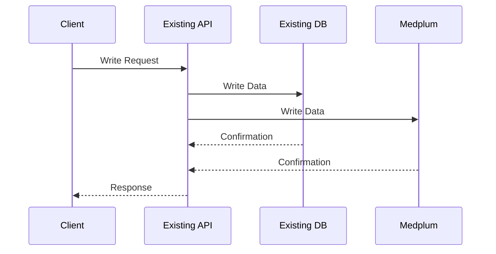
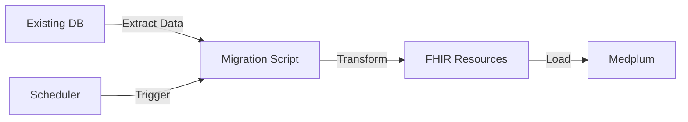
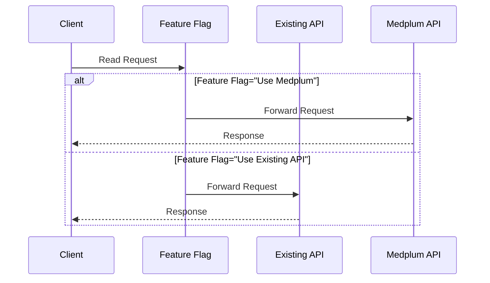
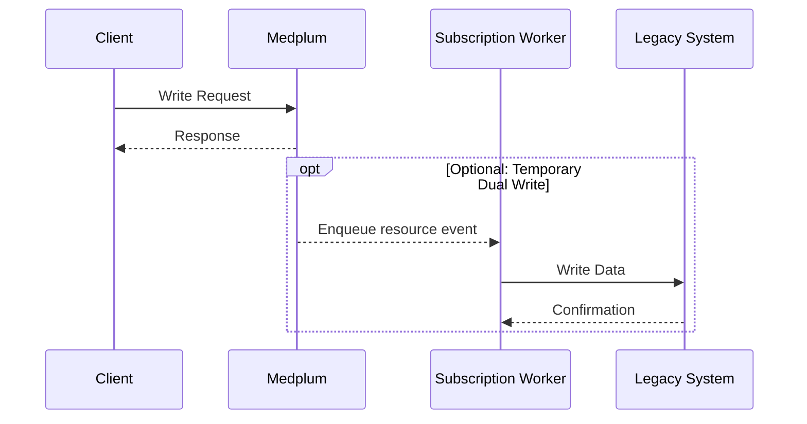

# Phased Adoption and Cutover

This guide covers write authority, integration behavior, phased adoption, cutover controls, rollback, and legacy-system retirement.

Apply only the phases required by the approved cutover pattern. You can phase by domain, site, tenant, or cohort rather than forcing the entire dataset through one sequence.

A common phased sequence is:

1. [Write-only / Dual write](#write-only)
2. [Backfill data](#backfill)
3. [Read from Medplum](#read-from-medplum)
4. [Front-End write to Medplum](#front-end-write)
5. [Deprecate old store](#deprecate)

## Define Write Authority Before Coexistence

Start with the [authority matrix](/docs/migration/migration-planning#authority-and-coexistence-matrix) from migration planning. Update it for every phase to identify:

- The only system allowed to accept authoritative writes
- Whether the other system receives a projection, replay, or temporary dual write
- How conflicts and failed writes are detected and resolved
- Which team owns reconciliation
- The criteria for advancing to the next phase

Avoid bidirectional synchronization unless there is no simpler way to meet the operational requirement. Two systems accepting independent writes to the same domain create conflicts that cannot be resolved safely with last-write-wins logic alone.

## Plan Subscription and Integration Behavior

Backfills can trigger Subscriptions, Bots, webhooks, and external integrations on resource creates, updates, and deletes. Rerunning a migration can repeat those side effects. Inventory these workflows and choose one approach for each before loading production data:

- Leave it active because the side effect is required for migrated records
- Narrow its criteria to exclude migration writes when migrated resources carry a deliberate searchable marker
- Temporarily disable it and run a deliberate replay or reconciliation process later

Do not assume a disabled Subscription will automatically process events that occurred while it was inactive. If downstream state must be reconstructed, make the replay an explicit cutover step and verify its results.

## Write-only / Dual Write {/* #write-only */}

When write/update operations come into your existing services, have your existing services write to both Medplum and your existing store.

### Rationale

- Starts populating Medplum before applications read from it.
- Supports comparison and reconciliation before user-facing cutover.
- Adds delivery, latency, and consistency risks that must be measured when dual writes are enabled.

### Best Practices

- Implement error handling and logging to catch any discrepancies between writes to the old system and Medplum.
- Use a durable outbox or equivalent record so failed secondary writes can be retried and reconciled.
- Define which system wins when both copies changed, rather than relying on timestamps alone.
- Reconcile dual-write failures continuously; do not defer the entire backlog to cutover.
- Start with less critical data types to minimize risk.

## Backfill Data {/* #backfill */}

Migrate older data from the existing data store to Medplum.

### Rationale

- Ensures historical data is available in Medplum.
- Allows for data validation and reconciliation before switching reads to Medplum.

### Best Practices

- Set up regular sync infrastructure. This could be as simple as running a script on your local machine or in a serverless function. Many Medplum users also use tools like Apache Airflow to orchestrate their ETL
- Implement idempotent operations to allow for safe re-runs of the backfill process.
- Start with a small subset of data to validate your migration scripts before running on the entire dataset.
- Implement data validation checks to ensure the integrity of migrated data.
- Record checkpoints and import results so the backfill can resume without starting over.
- Keep new writes flowing through the agreed source of truth while the historical backfill runs.

## Read from Medplum in the Client {/* #read-from-medplum */}

Update your UX to read from Medplum's API rather than your existing API.

### Rationale

- This is the first user-facing change and can be used for data verification and user acceptance testing.
- Allows you to start benefiting from Medplum's capabilities while still maintaining write operations through your existing system.

### Best Practices

- Implement feature flags to easily switch between old and new data sources.
- Start with read-only views or reports before moving to more critical user interactions.
- Monitor performance and user feedback closely during this phase.

## Front-End Write to Medplum {/* #front-end-write */}

Update your UX to write directly to Medplum rather than through your existing services.

### Rationale

- Completes the transition to Medplum for both read and write operations.
- Allows you to take full advantage of Medplum's features and performance benefits.

### Best Practices

- Implement this change gradually, starting with less critical write operations.
- Ensure your error handling and user feedback mechanisms are robust.
- Use temporary dual writes only with durable retry, lag monitoring, conflict handling, and reconciliation.
- Preserve writes made after cutover so rollback does not discard new data.
- Provide additional user support during this transition.

## Deprecate Old System {/* #deprecate */}

Phase out the old data store once you're confident in the Medplum implementation.

### Rationale

- Reduces maintenance overhead and potential for data inconsistencies.
- Completes the migration process.

### Best Practices

- Ensure all in-scope historical data has been successfully migrated and validated.
- Maintain read-only access to the old store for a period to allow for data verification if needed.
- Confirm that replay queues, exception reports, and rollback windows are closed.
- Revoke migration credentials and securely dispose of temporary staging files and logs according to the retention policy.
- Update all documentation and operational procedures to reflect the new system.
- Provide training to all relevant staff on the new procedures and systems.

## Cutover Control Sequence

Use a runbook for each cohort or data domain:

1. **Freeze:** Stop authoritative writes in the legacy path, or record the exact change boundary for an incremental final pass.
2. **Drain:** Wait for in-flight writes, migration jobs, and required downstream processing to reach a known checkpoint.
3. **Backfill:** Import the final delta using idempotent operations.
4. **Verify:** Reconcile counts, failures, references, and critical workflows against the agreed acceptance criteria.
5. **Flip:** Move reads and writes to Medplum and verify production monitoring.
6. **Observe:** Keep the legacy system read-only during the defined rollback and acceptance window.
7. **Retire:** Decommission only after sign-off, exception closure, retention review, and credential cleanup.

Define rollback triggers before cutover. A rollback decision should identify the last safe checkpoint, how writes made after the flip will be preserved, who can authorize rollback, and how users will be informed. A rollback plan that discards post-cutover clinical writes is not safe.

## Completion Criteria

The migration is complete when:

- The approved mapping and pipeline versions produced the accepted data.
- [Validation, reconciliation, and readiness checks](/docs/migration/testing-and-acceptance) passed.
- Medplum or the designated external system is the clear write authority for every domain.
- Required integrations and user workflows are stable in production.
- Remaining exceptions have accepted outcomes and operational owners.
- The approved legacy-access and retention disposition is implemented, owned, and documented.
- Migration credentials are revoked and temporary-data disposal is complete.
