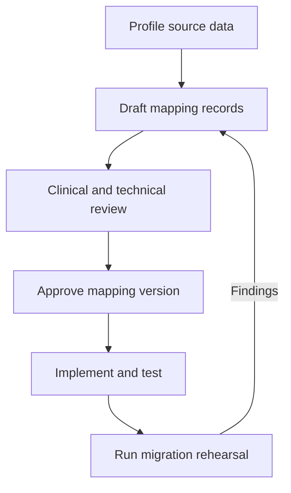

# Governing Data Mappings

A data mapping defines how source data becomes FHIR R4 resources in Medplum. Treat mappings as reviewed, versioned specifications, not implementation details hidden inside migration code.

This page covers:

- Profiling the source data
- Versioning and reviewing mapping decisions
- Governing identifiers and terminology
- Handling missing, unsupported, and one-to-many data
- Recording provenance and approvals
- Building a practical mapping register

:::tip[Planning the mapping work?]

Use the [Data Migration Decision Guide](/docs/decision-guides/data-migration#33-mapping--terminology-governance) to identify the participants and decisions before completing the register on this page.

:::

Complete this work before building the [production pipeline](/docs/migration/migration-pipelines).

## Profile the Source Data

A source schema describes what a field can contain. Source profiling describes what it actually contains.

Profile every source field used by the migration:

- Observed data types and formats
- Null, blank, and sentinel-value frequency
- Distinct values and value frequency
- Minimum, maximum, precision, and cardinality
- Duplicate and uniqueness rates
- Referential integrity
- Character encoding and whitespace behavior
- Date, time, precision, and time zone behavior
- Values that vary by tenant, facility, export, or source version

Record the extract date, query or export version, row count, and profiling method. Use representative production-like data. Resolve fields with multiple meanings explicitly rather than adding undocumented conditions to transformation code.

## Version the Mapping Specification

Store the specification in version control alongside the migration code. Give each approved release a stable version and record that version in every migration run.

A mapping release should identify:

- FHIR version, target profiles, and terminology versions
- Source system, extract version, and applicable variants
- Identifier systems and normalization rules
- Field-level transformations
- Known exclusions and unresolved decisions
- Validation and acceptance criteria
- Owners, reviewers, approval stage, and change history

Do not modify an approved release in place. A dry-run approval is not a production approval.

## Map Meaning, Not Only Data Types

A mapping is not complete when it pairs a source column with a FHIR path. Document why the source and target fields represent the same concept.

For each rule, record:

- Source entity, field, business definition, and observed values
- Target FHIR resource, element path, definition, and cardinality
- Transformation and applicability conditions
- Missing, invalid, ambiguous, and unsupported-value behavior
- Terminology and profile dependencies
- Automated and human validation expectations

Do not place data in a convenient field with different semantics, convert free text into a code without an approved mapping, invent fields, or overload identifiers and extensions with unrelated data. Consult [FHIR Basics](/docs/fhir-basics), the [FHIR R4 resource documentation](/docs/api/fhir/resources), and [Profiles](/docs/fhir-datastore/profiles).

## Choose How Profiles Apply

Medplum can apply profiles in two ways:

- Set `meta.profile` on a resource when the applicable profile is determined by the source record, workflow, or mapping rule.
- Configure [`Project.defaultProfile`](/docs/access/projects#default-profiles) when every resource of a type should use the same profile unless the resource specifies one explicitly.

When a resource has no `meta.profile`, Medplum adds matching project default profiles before validation. When `meta.profile` is already present, project defaults are not added. Record which approach each resource type uses and test both explicit and default-profile paths.

## Govern Identifier Systems

Preserve stable source keys as FHIR `Identifier` values. This supports traceability, reconciliation, conditional references, and idempotent writes.

For every identifier, define:

- Canonical system URI
- Scope of uniqueness
- Normalization rules
- Whether values can change or be reused
- Collision handling
- Whether the identifier is safe for conditional create or update

Test for duplicate values, case and whitespace differences, leading-zero loss, numeric precision loss, reused identifiers, composite keys, and tenant-specific uniqueness. Do not use one identifier system for values with different uniqueness scopes.

Medplum resource IDs are not source identifiers. Use [conditional updates](/docs/fhir-datastore/working-with-fhir#upsert) only after proving that the selected identifier resolves to no more than one target resource.

:::tip[Prove uniqueness first]

Conditional upserts are safe only when the identifier query resolves to zero or one target. Quarantine collisions instead of selecting a target arbitrarily.

:::

## Record Terminology Decisions

For each coded field, document:

- Source coding system, code, and display
- Target coding system, code, and value set
- Mapping relationship and evidence
- Handling for unmapped, ambiguous, deprecated, or invalid values
- Terminology owner, reviewer, and approval status

:::caution[Do not invent clinical codes]

Use authoritative terminology sources and human review. Do not guess clinical codes or derive them from labels alone.

:::

When source data uses local codes, preserve the local coding where appropriate. Add a standard coding only when an approved mapping exists. A FHIR [`ConceptMap`](/docs/api/fhir/resources/conceptmap) can represent approved relationships, but the mapping register should still identify the version and behavior for values without an equivalent mapping.

See [Local Codes](/docs/terminology/local-codes) and [Converting Data to FHIR](/docs/migration/convert-to-fhir#dealing-with-codeableconcepts).

## Handle Missing and Unsupported Data

Give every in-scope field one explicit disposition:

- Direct, transformed, conditional, or one-to-many mapping
- Retained only for traceability
- Intentionally excluded
- Unsupported pending design
- Out of migration scope

For excluded or unsupported populated fields, record the reason, population rate, clinical or operational impact, approved disposition, and owner. Do not silently discard them.

Missing data should remain missing unless FHIR or an applicable profile provides an accurate representation. Do not invent defaults that imply facts absent from the source. Reject or quarantine invalid and ambiguous records rather than coercing them into valid-looking but semantically incorrect resources.

## Define One-to-Many Mappings

One source record can produce zero, one, or multiple FHIR resources. For each one-to-many mapping, define:

- The generation rule and complete target resource set
- Deterministic identifiers for each generated resource
- Relationships, dependency order, and atomicity requirements
- Partial-failure and retry behavior
- Reconciliation counts at source and target levels

When newly created resources reference one another, use a FHIR transaction with `urn:uuid` full URLs and confirm the `transaction-bundles` Project feature is enabled. Use batches only for independent entries. See [FHIR Batch Requests](/docs/fhir-datastore/fhir-batch-requests).

## Preserve Provenance and Traceability

Each migration run should record:

- Migration run, mapping, and pipeline versions
- Source system, extract identifier, timestamp, and applicable variant
- Counts read, transformed, submitted, successful, rejected, skipped, and quarantined
- Validation results and operator identity

Use stable source identifiers on migrated resources. Where appropriate, use `meta.source` for a governed source URI.

If resource-level provenance is required, create FHIR [`Provenance`](/docs/api/fhir/resources/provenance) resources with the required `target`, `recorded`, and `agent` elements. Add `occurred[x]` when the source activity time is known and `entity` when the source artifact must be represented. Decide whether provenance is required per resource, transaction, source artifact, or only in an external run ledger. Per-resource Provenance can materially increase migration volume.

Never place credentials, unrestricted source locations, or protected source payloads in provenance metadata. Do not assume patient access propagates through `Provenance.target`; design and test the relevant `AccessPolicy` and account assignment.

## Assign Review and Approval

Assign named roles for:

- Mapping ownership
- Source-system expertise
- FHIR R4 review
- Clinical or operational review
- Terminology review
- Validation ownership
- Approval for each migration stage

The same person can hold several roles in a small migration, but decisions and unresolved risks must remain explicit.

During each dry run, freeze the mapping, source extract, and pipeline version. Classify findings as mapping defects, implementation defects, source-data defects, or accepted exceptions. Approve a new mapping version before rerunning affected and regression cases.

## Validate Structure and Meaning Separately

Define both structural and semantic checks for each mapping rule. Structural validation checks FHIR shape and configured profiles; semantic validation checks whether the result preserves the source meaning.

:::note[$validate checks structure, not meaning]

A resource can pass `$validate` and still reference the wrong patient or contain an incorrect code, status, date, quantity, or unit. See [Validating and Reconciling Migrated Data](/docs/migration/validation-and-reconciliation#use-validate-for-structure) for configuration prerequisites and acceptance testing.

:::

## Mapping Register Example

Use one versioned register per source variant. Keep it in version control or in a reviewable data store linked to the migration code. The examples below show the minimum information to capture; they do not prescribe the storage format.

:::tip[Keep the index easy to review]

Keep a compact row for each mapping decision, with links to detailed rules and evidence when needed. Never edit an approved version in place.

:::

### Release Header

| Version | Source and extract | FHIR R4 profiles | Pipeline version | Approval             |
| :------ | :----------------- | :--------------- | :--------------- | :------------------- |
| 1.0.0   | Legacy EHR v2      | Project Patient  | 3f82c1a          | Approved for dry run |

### Mapping Index

The index makes ownership and review status visible without placing every rule in one wide table.

| ID      | Source                | Target              | Rule summary                                     | Owner               | Status   |
| :------ | :-------------------- | :------------------ | :----------------------------------------------- | :------------------ | :------- |
| MAP-001 | `patients.birth_date` | `Patient.birthDate` | Parse the source date; quarantine invalid values | Data migration lead | Approved |

### Example Mapping Record

| Decision                          | Value                                                                                                 |
| :-------------------------------- | :---------------------------------------------------------------------------------------------------- |
| Mapping ID                        | MAP-001                                                                                               |
| Source field                      | `patients.birth_date`                                                                                 |
| Source meaning                    | Patient date of birth                                                                                 |
| Source profile                    | Date string; blanks observed; invalid values reported separately                                      |
| Applicability                     | All patient records                                                                                   |
| Target                            | `Patient.birthDate`                                                                                   |
| Transformation                    | Parse the documented source format and preserve available precision                                   |
| Missing or invalid data           | Omit a missing value; quarantine an invalid value                                                     |
| Identifier or reference rule      | Not applicable                                                                                        |
| Terminology or profile dependency | Project Patient profile                                                                               |
| Validation                        | Unit tests for valid, partial, blank, and invalid dates; `$validate`; deterministic source comparison |
| Owner and reviewers               | Data migration lead; source SME; FHIR reviewer                                                        |
| Evidence                          | Source profile report and dry-run reconciliation                                                      |
| Status                            | Approved for dry run                                                                                  |
| Change impact                     | Reprocess Patient records if parsing behavior changes                                                 |

### Controlled Values

Use consistent terms so the register can be filtered and audited:

- **Status:** Draft, In review, Approved for dry run, Approved for production, Superseded
- **Applicability:** Always, Conditional, Source variant, One-to-many
- **Disposition:** Direct, Transformed, Conditional, Traceability only, Excluded, Unsupported, Out of scope
- **Invalid-data action:** Omit when semantically accurate, Reject, Quarantine, Human review

Maintain separate governed lists for identifier namespaces and terminology artifacts when several mapping records reuse them. Link those artifacts from the relevant mapping record instead of adding more columns to the index.

## Exit Criteria

A mapping is ready for production when:

- Source fields and variants have been profiled.
- Every in-scope field has an explicit disposition.
- Source and target semantics have been reviewed.
- Identifier namespaces and uniqueness have been verified.
- Terminology mappings have evidence and approval.
- Missing, invalid, unsupported, and ambiguous values have defined behavior.
- One-to-many mappings have deterministic identifiers and reconciliation rules.
- Provenance and run-level traceability are defined.
- Structural and semantic checks have passed agreed thresholds.
- Dry-run changes are versioned and regression tested.
- Required owners and reviewers have approved production use.

After approval, implement the specification by [converting the source data to FHIR](/docs/migration/convert-to-fhir).
