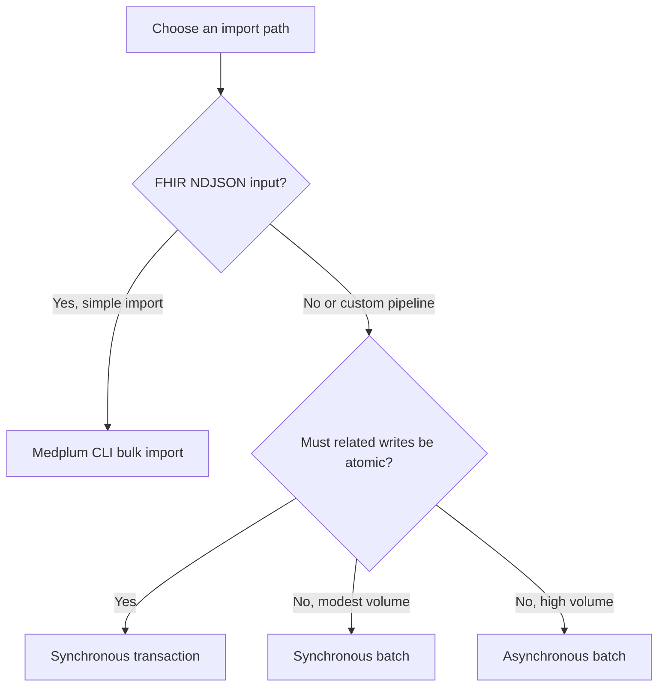

import ExampleCode from '!!raw-loader!@site/../examples/src/migration/migration-pipelines.ts';
import MedplumCodeBlock from '@site/src/components/MedplumCodeBlock';

import Tabs from '@theme/Tabs';
import TabItem from '@theme/TabItem';

# Building Migration Pipelines

This guide covers reliable, restartable pipelines for writing migrated data to Medplum. It focuses on idempotency, batch and transaction choices, asynchronous processing, recovery, throughput, and files.

[patient]: /docs/api/fhir/resources/patient
[condition]: /docs/api/fhir/resources/condition
[encounter]: /docs/api/fhir/resources/encounter
[clinicalimpression]: /docs/api/fhir/resources/clinicalimpression

## Using Conditional Updates for Idempotency

Conditional updates prevent duplicate resources when a migration retries the same source record under a stable identifier. Define and test identifier uniqueness in [Governing Data Mappings](/docs/migration/mapping-governance#govern-identifier-systems) first.

To perform a conditional update, use a `PUT` operation with a search query in the URL:

<Tabs groupId="language">
  <TabItem value="ts" label="TypeScript">
    <MedplumCodeBlock language="ts" selectBlocks="medplum-sdk-upsert">
      {ExampleCode}
    </MedplumCodeBlock>
  </TabItem>
  <TabItem value="curl" label="cURL">
    <MedplumCodeBlock language="bash" selectBlocks="curl-upsert">
      {ExampleCode}
    </MedplumCodeBlock>
  </TabItem>
  <TabItem value="cli" label="CLI">
    <MedplumCodeBlock language="bash" selectBlocks="medplum-cli-upsert">
      {ExampleCode}
    </MedplumCodeBlock>
  </TabItem>
</Tabs>

The semantics of this operation are:

- If 0 resources are found matching the search query, a new resource is created.
- If 1 resource is found, it is updated with the provided data.
- If more than 1 resource is found, an error is returned.

This approach is safe to repeat while the migration source remains authoritative for the fields being replaced. After Medplum users or integrations can modify the target, a stale rerun can overwrite newer data. Use a source-of-truth rule, compare versions, or route the update for conflict handling before replacing an existing resource.

You can read more about Conditional Updates [here](/docs/fhir-datastore/working-with-fhir#upsert).

## Using Batch Requests for Efficiency

[FHIR batch requests](/docs/fhir-datastore/fhir-batch-requests) combine independent operations into one API call. Each entry can succeed or fail separately.

### Example: Writing Multiple Patient Resources

Here's an example of using a batch to create multiple [`Patient`][patient] resources:

<MedplumCodeBlock language="ts" selectBlocks="create-patients-batch">
    {ExampleCode}
</MedplumCodeBlock>

This batch creates or updates [`Patient`][patient] resources using conditional updates. Add one entry per independent source record.

## Using Transactions for Data Integrity

[FHIR Transactions](/docs/fhir-datastore/fhir-batch-requests#internal-references) ensure that a set of resources is written together or fails together.

:::caution[Enable transaction support]

Transactions require the `transaction-bundles` feature flag. Without it, a transaction Bundle is processed as a batch and loses atomicity without an error or warning. Transactions also have [entry limits](/docs/fhir-datastore/fhir-batch-requests#transaction-limits).

:::

### Example: Encounter with Clinical Impression

Here's an example of using a transaction to create an [`Encounter`][encounter] and associated [`ClinicalImpression`][clinicalimpression] assessment together. We use a transaction because the failure of one operation should invalidate the entire transaction.

<MedplumCodeBlock language="ts" selectBlocks="encounter-and-impression-transaction">
    {ExampleCode}
</MedplumCodeBlock>

In this transaction, both the Encounter and ClinicalImpression are created together. If either fails, the entire transaction is rolled back.

## Choosing Synchronous or Asynchronous Processing

Choose the write path based on input format, atomicity, and volume:



- Use [`medplum bulk import`](/docs/cli#import) only for a simple NDJSON load that does not require source ID preservation, cross-resource ID rewriting, or safe reruns.
- Use synchronous transactions when related writes must succeed or fail together.
- Use synchronous batches for modest volumes of independent writes that need an immediate response.
- Use [asynchronous batch processing](/docs/fhir-datastore/processing-async-bundles) for high-volume independent writes that may exceed synchronous request-size, timeout, or FHIR interaction quota constraints.

:::caution[CLI import limitations]

The CLI chunks NDJSON into synchronous transaction Bundles containing POST creates. Medplum assigns new resource IDs, and the CLI does not add conditional-write idempotency or rewrite references based on source IDs. It retries 429 responses, but other failed entries require review. Use a custom conditional-write pipeline when identifiers, references, or reruns must be controlled.

Transaction atomicity still requires the `transaction-bundles` Project feature.

:::

Asynchronous batches require the `async-batch` feature flag on the Medplum project. For Medplum-hosted projects, contact [Medplum support](mailto:support@medplum.com) to enable it.

:::note[Async batches are not atomic]

Asynchronous processing accepts a FHIR `batch` Bundle with the `Prefer: respond-async` header. Entries still succeed or fail independently.

:::

Save the returned status URL, poll with backoff until the `AsyncJob` reaches a terminal state, and inspect the resulting response.

:::caution[Transactions cannot run asynchronously]

Medplum rejects a transaction Bundle submitted with `Prefer: respond-async` when transaction support is enabled. Split the workload into synchronous transactions, or use an asynchronous batch and handle partial failures explicitly.

:::

:::note[Bulk FHIR API and CLI import are different]

Medplum's [Bulk FHIR API](/docs/api/fhir/operations/bulk-fhir) exports data in NDJSON. The `medplum bulk import` command is a client-side loader, not a server-side Bulk FHIR import operation.

:::

## Making the Pipeline Restartable

A production migration should be resumable from a checkpoint without recreating successful resources or rerunning the complete dataset.

1. Assign every in-scope source record a stable source identifier.
2. Record each extraction partition or input file in a migration manifest.
3. Record the submitted bundle or job ID and the status of every in-scope source record.
4. Separate successful, rejected, skipped, and quarantined records.
5. Retry only failed records after correcting the data or mapping.

Conditional updates make retries idempotent while the source remains authoritative, but they do not replace result tracking. Inspect every `entry.response`; see [Inspect Every Write Result](/docs/migration/validation-and-reconciliation#inspect-every-write-result).

## Controlling Throughput

Benchmark the real resource mix before choosing concurrency. Patient count alone is not a useful throughput estimate because one patient may expand into many resources and trigger downstream automation.

- Use bounded concurrency and exponential backoff for `429 Too Many Requests` responses.
- Monitor the `RateLimit` response header and the [Rate Limits dashboard](/docs/rate-limits).
- Run large backfills outside peak clinical traffic when possible.
- Use a dedicated `ClientApplication` for the migration so its credentials, access policy, and quota can be managed independently.
- Ensure the migration identity's `AccessPolicy` permits every interaction the pipeline performs. This commonly includes create and update on migrated resource types, searches used by conditional operations, reads used for verification, and `AsyncJob` and result `Binary` access for asynchronous batches.
- Account for Subscription and Bot side effects using [Plan Subscription and Integration Behavior](/docs/migration/adoption-strategy#plan-subscription-and-integration-behavior).

Do not assume that raising a quota will solve worker, queue, database, or downstream-integration bottlenecks. Measure each stage at production scale when volume or the cutover window creates material risk.

## Migrating Binary Files

Treat files as a separate pipeline workstream. Prefer `createMedia` or `createDocumentReference`, which create a metadata resource and use it as the Binary security context. If you use the lower-level `createBinary` or `createAttachment` helpers, provide an appropriate patient-linked `securityContext` explicitly. See [Binary Data](/docs/fhir-datastore/binary-data).

Reference stored content with the resulting `Binary/{id}` URL rather than placing large base64 data in `Attachment.data`.

If the source provides URLs that Medplum can access, the [auto-download setting](/docs/self-hosting/server-config#autodownloadenabled) can copy the content into Medplum storage. For patient documents, populate `DocumentReference.subject` so the metadata participates in the patient's compartment. The downloaded `Binary` uses the DocumentReference as its security context.

Reconcile file counts and bytes, verify downloads complete, open representative files, and test retrieval using both intended and unauthorized roles.

## An End-to-End Example

Let's demonstrate a complete data pipeline that incorporates all the concepts we've discussed. We'll migrate patients, conditions, encounters, and clinical impressions in separate steps.

### Source Data

#### Patients Table

```
| patient_id | first_name | last_name | birth_date | gender |
| ---------- | ---------- | --------- | ---------- | ------ |
| P001       | John       | Doe       | 1980-07-15 | M      |
```

#### Conditions Table

```
| condition_id | condition_name | icd10_code |
| ------------ | -------------- | ---------- |
| HT001        | Hypertension   | I10        |
```

#### Patient_Conditions Table:

```
| patient_condition_id | patient_id | condition_id | onset_date |
| -------------------- | ---------- | ------------ | ---------- |
| PC001                | P001       | HT001        | 2022-03-15 |
```

#### Encounters Table:

```
| encounter_id | patient_id | date       | type      |
| ------------ | ---------- | ---------- | --------- |
| E001         | P001       | 2023-06-15 | checkup   |
```

#### Clinical Impressions Table:

```
| clinical_impression_id | encounter_id | patient_id | summary                                                                        |
| ---------------------- | ------------ | ---------- | ------------------------------------------------------------------------------ |
| CI001                  | E001         | P001       | Patient presented with mild flu-like symptoms. Recommended rest and fluids.    |
```

### Step 0: Approve the Mapping

Before loading data, profile the source and approve each transformation. The [mapping register example](/docs/migration/mapping-governance#example-mapping-record) shows how `patients.birth_date` maps to `Patient.birthDate` for the source data above.

### Step 1: Create Patients

Use a batch request to upload [`Patients`][patient] independently, using the primary key from the source system as the identifier.

<MedplumCodeBlock language="ts" selectBlocks="create-patients-batch">
    {ExampleCode}
</MedplumCodeBlock>

### Step 2: Create Conditions

Use a batch request to upload [`Conditions`][condition] independently, using conditional references to link to the existing patients.

<MedplumCodeBlock language="ts" selectBlocks="create-conditions-batch">
    {ExampleCode}
</MedplumCodeBlock>

### Step 3: Create Encounters and ClinicalImpressions

Use one synchronous transaction for each [`Encounter`][encounter] and dependent [`ClinicalImpression`][clinicalimpression]. The transaction preserves atomicity for the pair. Submit separate transactions with bounded concurrency when processing many encounters.

<MedplumCodeBlock language="ts" selectBlocks="encounter-and-impression-transaction">
    {ExampleCode}
</MedplumCodeBlock>

This example demonstrates:

1. Using separate batch requests for different resource types ([`Patients`][patient] and [`Conditions`][condition]).
2. Employing conditional updates for idempotency.
3. Using conditional references to link [`Conditions`][condition] to [`Patients`][patient].
4. Using a synchronous transaction to ensure each [`Encounter`][encounter] and [`ClinicalImpression`][clinicalimpression] pair is created together.
5. Using `urn:uuid` references within transactions to link newly created resources.
6. Maintaining relationships between resources across different requests using conditional references.

This approach allows for efficient bulk operations while ensuring data integrity for related resources. It also demonstrates how to handle different types of relationships and references in a complex data migration scenario.

Next, [validate and reconcile the migrated data](/docs/migration/validation-and-reconciliation). The manifest and reconciliation examples continue with source patient `P001` from this pipeline.
