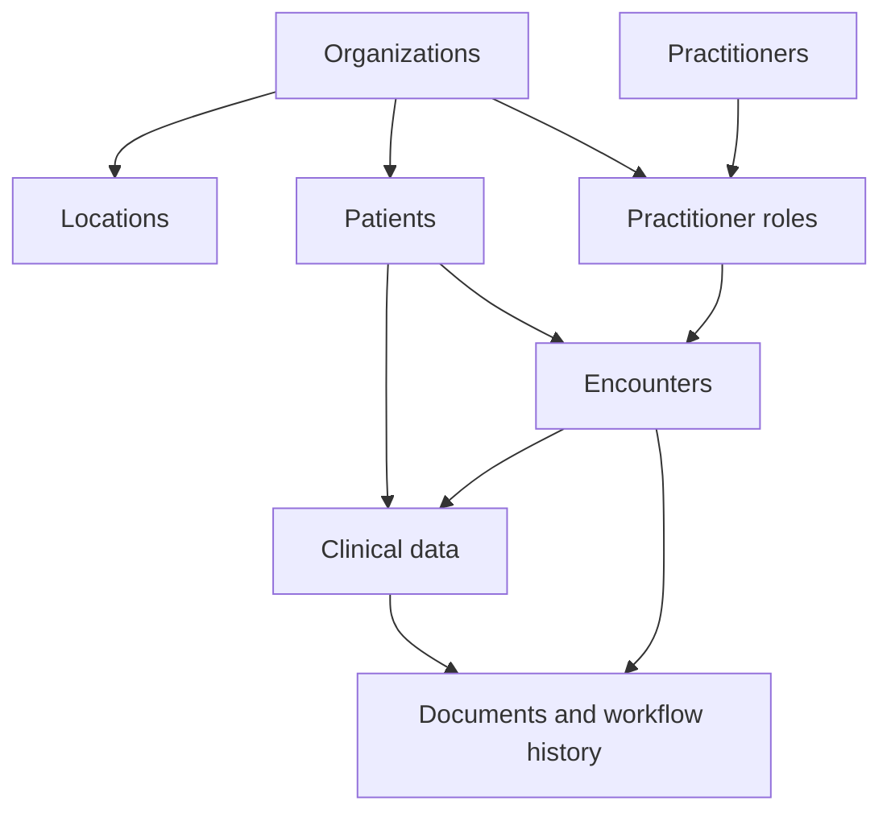

# Sequencing Your Migration

[resources]: /docs/fhir-basics#storing-data-resources
[references]: /docs/fhir-basics#linking-data-references

When migrating data to Medplum, maintain the relationships between data types. FHIR splits data across multiple [Resources][resources] that contain [References][references] to each other.

## Recommended Migration Order

Start with shared records, then load the resources that refer to them. This sequence also prioritizes current clinical information before lower-priority history.

| Order | Data element                        | Common FHIR resources                                                                                                                                                                     | Why it comes here                                                                      |
| :---- | :---------------------------------- | :---------------------------------------------------------------------------------------------------------------------------------------------------------------------------------------- | :------------------------------------------------------------------------------------- |
| 1     | Organizations and locations         | [`Organization`](/docs/api/fhir/resources/organization), [`Location`](/docs/api/fhir/resources/location)                                                                                  | Referenced by roles, patients, encounters, and other records                           |
| 2     | Providers and roles                 | [`Practitioner`](/docs/api/fhir/resources/practitioner), [`PractitionerRole`](/docs/api/fhir/resources/practitionerrole)                                                                  | Load practitioners and organizations before roles that connect them                    |
| 3     | Patient identity and administration | [`Patient`](/docs/api/fhir/resources/patient), [`RelatedPerson`](/docs/api/fhir/resources/relatedperson), [`Coverage`](/docs/api/fhir/resources/coverage)                                 | Load Patient before RelatedPerson and Coverage records that reference it               |
| 4     | Operational context                 | [`Encounter`](/docs/api/fhir/resources/encounter), [`Appointment`](/docs/api/fhir/resources/appointment)                                                                                  | Load these before clinical records that preserve encounter or appointment context      |
| 5     | Current clinical state              | [`Condition`](/docs/api/fhir/resources/condition), [`AllergyIntolerance`](/docs/api/fhir/resources/allergyintolerance), [`MedicationRequest`](/docs/api/fhir/resources/medicationrequest) | Gives users an immediately useful patient summary                                      |
| 6     | Longitudinal clinical history       | [`Observation`](/docs/api/fhir/resources/observation), [`DiagnosticReport`](/docs/api/fhir/resources/diagnosticreport), [`Procedure`](/docs/api/fhir/resources/procedure)                 | Load Observation before DiagnosticReport records that reference it in `result`         |
| 7     | Documents and workflow history      | [`DocumentReference`](/docs/api/fhir/resources/documentreference), [`Communication`](/docs/api/fhir/resources/communication), [`Task`](/docs/api/fhir/resources/task)                     | These often refer to patients, encounters, authors, or clinical records loaded earlier |

Install required profiles and terminology before validating these stages.

## Check the Order Against Your References

The table is a starting point. Inspect the references produced by your approved mappings before finalizing the sequence. For example, a `Condition` without an encounter reference can load before encounter history, while a `Condition.encounter` reference requires that Encounter to exist first or be created in the same transaction.

This diagram illustrates common dependencies. Arrows point from prerequisite data to records that commonly depend on it:

When a target reference does not exist yet, change the order, create the related resources together in a [FHIR transaction](/docs/fhir-datastore/fhir-batch-requests#internal-references) with transaction support enabled, or use a conditional reference to a resource that already exists. Do not drop the reference merely to make the load succeed.

Next, define and approve the rules for [governing data mappings](/docs/migration/mapping-governance).
