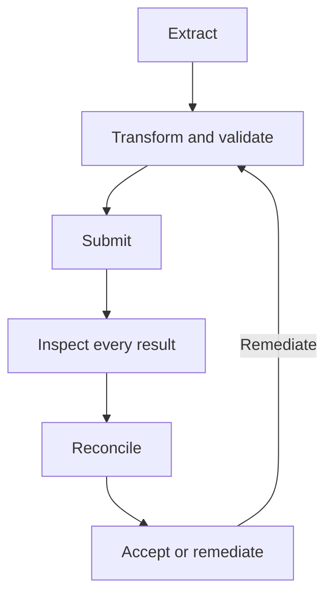

# Validating and Reconciling Migrated Data

A migration is complete only when every in-scope source unit has an explained outcome, the resulting FHIR R4 data preserves the intended meaning, and users and integrations can perform their required workflows.

This page covers acceptance criteria, manifests, write results, structural and semantic checks, count and reference reconciliation, and exception tracking.

:::tip[Before you start]

Complete [Governing Data Mappings](/docs/migration/mapping-governance) and design the [migration pipeline](/docs/migration/migration-pipelines) before using this validation process.

:::

## Define Acceptance Before Loading

Before the first production load, document:

- Source systems, extracts, files, time ranges, and business rules in scope
- Expected resource types, profiles, source identifiers, and reference relationships
- Intentionally excluded and unsupported data
- Required field, terminology, and status mappings
- Permitted exceptions and remediation deadlines
- Required user roles, searches, reports, documents, integrations, and workflows
- Performance objectives for migration execution and production use
- Technical, security, operational, and clinical sign-off owners

Acceptance criteria must be measurable. Identify the source population, exclusions, expected target resources, allowed exceptions, reconciliation query, threshold, and owner.

## Keep a Migration Manifest

The manifest connects each source unit of work to its intended FHIR resources, load attempts, Medplum responses, and final disposition.

A source unit can produce zero, one, or multiple resources. Give it a stable source key. When the target resource supports `identifier`, assign a stable source-system [`Identifier`](/docs/fhir-basics#naming-data-identifiers). For resource types without `identifier`, such as `Binary`, retain a stable source-to-target crosswalk in the manifest. If the migration controls the resource ID, it must be a valid UUID.

Record checkpoints before and after extraction, transformation, submission, response processing, and reconciliation. A restart should resume without silently omitting or duplicating work.



### What to record in a manifest

The manifest must distinguish:

- Source units, including those that intentionally produce no resource
- Zero or more intended target resources for each source unit
- Every submission attempt, response, and timestamp
- Final dispositions and any linked exception or remediation

Record the migration, run, mapping, and pipeline versions; source system, extract, entity, and key; target resource type and traceability key; Bundle or async job and entry; response status, location, and `OperationOutcome`; and final owner and next action.

### Example: Patient P001

This example continues the `P001` source patient used in [Building Migration Pipelines](/docs/migration/migration-pipelines#source-data).

| Manifest field          | Example value                                                             |
| :---------------------- | :------------------------------------------------------------------------ |
| Run and mapping version | `dry-run-3`; `1.0.0`                                                      |
| Source                  | `patients`; key `P001`                                                    |
| Intended target         | `Patient` with identifier `http://your-source-system.com/patientId\|P001` |
| Submission              | Bundle entry `0`; attempt `1`                                             |
| Result                  | `201 Created`; `Patient/<uuid>`                                           |
| Disposition             | Successful                                                                |

Preserve previous attempts rather than overwriting them. A retry is an attempt, not a final disposition. Every retried item must eventually become successful, rejected, skipped under an approved rule, or quarantined.

## Inspect Every Write Result

:::caution[HTTP success is not migration success]

A successful request or completed asynchronous job does not prove that every operation succeeded. Inspect and record every response entry.

:::

For a synchronous `batch`, inspect every `entry.response` in the returned `batch-response`, including its status, location, and `OperationOutcome`. One batch can contain both successful and failed entries.

For a synchronous `transaction` with the `transaction-bundles` Project feature enabled, persist the `transaction-response` when it succeeds. If an operation fails, the server rolls back the transaction and returns an `OperationOutcome`; mark every intended operation in that transaction with an explained outcome. Without the feature, Medplum processes a transaction Bundle as a batch without atomic rollback.

For an [asynchronous batch](/docs/fhir-datastore/processing-async-bundles):

1. Persist the status URL returned with `202 Accepted`.
2. Poll with backoff until the `AsyncJob` reaches a terminal state.
3. Inspect `AsyncJob.output`.
4. For a completed job, retrieve `output.results` and parse the `batch-response`.
5. For an error or cancellation, inspect the outcome and any partial results that are present.
6. Record every available response and account for entries that were not processed.

`202 Accepted` means only that the work was queued. A completed job can still contain failed batch entries. See [FHIR Batch Requests](/docs/fhir-datastore/fhir-batch-requests#response-structure).

## Use `$validate` for Structure

Medplum's [`$validate` operation](/docs/api/fhir/operations/validate-a-resource) can check a resource against FHIR R4 and applicable profiles without writing it.

:::note[Verify profile and terminology configuration]

Use it to detect structural issues such as invalid properties, incorrect data types, missing required fields, cardinality violations, and configured profile constraints. The standalone `$validate` operation validates the submitted resource as provided; it does not add the Project's default profiles. Before using the result as evidence:

- Verify that the intended profiles are installed and resolvable.
- Add the expected profile URLs to the test resource's `meta.profile`.
- Separately test representative writes without `meta.profile` when relying on [`Project.defaultProfile`](/docs/access/projects#default-profiles). Default profiles are added during create and update processing.
- Confirm that the project's terminology-validation settings match the acceptance plan.

:::

A resource can pass `$validate` and still contain:

- The wrong patient, encounter, practitioner, or organization reference
- A semantically incorrect code
- A quantity with the wrong unit or scale
- A shifted date or time
- A status that changes clinical meaning
- Lost negation, uncertainty, or historical context
- Missing or inaccessible document content

Combine conformance checks with reconciliation, functional testing, and human review.

## Reconcile Every Disposition

For each migration scope, the accounting must balance:

```text
eligible source units =
  successful units
  + rejected units
  + skipped units
  + quarantined units
```

:::tip[Retries are attempts, not new source records]

Retries do not increase the source denominator. Investigate any unit absent from the manifest, left pending, or assigned more than one terminal disposition.

:::

### Example reconciliation summary

Create one record per resource type, organization, time period, source variant, or other meaningful cohort.

Define the unit for every count. Source units, intended FHIR resources, successful write operations, and stored resources are different measures when one source record can produce zero or many targets.

| Field                         | Example                                                       |
| :---------------------------- | :------------------------------------------------------------ |
| Scope and mapping version     | Patients; `1.0.0`                                             |
| Source extracted and eligible | 2 extracted; 2 eligible                                       |
| Source dispositions           | 2 successful; 0 rejected; 0 skipped; 0 quarantined; 0 pending |
| Retry attempts                | 0                                                             |
| Target expected and found     | 2 expected; 2 found                                           |
| Target exceptions             | 0 missing; 0 unexpected; 0 duplicate identifiers              |
| Result                        | Pass                                                          |
| Evidence                      | `dry-run-3/patients.json`                                     |

Retain the exact source query, FHIR search, execution time, and mapping version as evidence.

Equal totals are not enough. Compare stable identifiers, detect missing and unexpected targets, and account for source records that intentionally split into several resources or produce no output.

## Reconcile References and Identity

Build an expected-reference inventory from the transformed data, then verify that:

- Every expected reference resolves.
- The target has the expected source identifier, deterministic ID, or manifest crosswalk.
- No reference resolves to a different patient or clinical context.
- Conditional references resolved to exactly one target.
- Internal transaction references became persistent references.
- Subject, encounter, performer, requester, author, custodian, and organization links preserve their meaning.
- Patient-facing resources contain their own required patient-compartment references.

:::caution[An identifier match is not proof of identity]

Preserving an identifier does not prove that two source patients are the same person. Check duplicate rates, matching outcomes, identifier collisions, and potential incorrect merges separately. Decide before migration whether duplicates are merely reported, blocked, or processed through a governed [patient deduplication](/docs/fhir-datastore/patient-deduplication) workflow.

:::

## Reconcile Clinical Meaning

### Codes and terminology

- Verify `Coding.system` and `Coding.code` against the approved mapping.
- Preserve local codes where no approved standard mapping exists.
- Route ambiguous or unmapped values to quarantine or human review.
- Use terminology expertise for clinically significant mappings.
- Do not invent codes to make validation pass.

### Quantities and units

- Test precision, signs, conversion factors, rounding, comparators, and compound values.
- Keep absent, zero, and unknown values distinct.
- Test boundary values and clinically implausible outliers.

### Dates and chronology

- Preserve source precision when only a year or month is known.
- Verify time zones and daylight-saving boundaries.
- Check start/end order and clinically relevant event chronology.
- Do not make historical records appear current.

### Status, negation, and uncertainty

- Verify that source states map to the intended FHIR workflow status.
- Distinguish stopped, cancelled, entered-in-error, unknown, and absent states.
- Preserve explicit negation and uncertainty.
- Do not choose a convenient status or default only to satisfy a required field.

## Manage Validation Exceptions

Every unresolved discrepancy needs:

- A unique ID and affected source and target identifiers
- Category, severity, affected count, and impact
- Named owner, action, and due date
- Decision to fix, rerun, hold for review, accept, or defer
- Retest evidence
- Approver for any accepted exception

Records held for review remain part of reconciliation totals. After remediation, rerun the smallest safe scope and repeat the affected checks.

Next, [test and accept the migrated data](/docs/migration/testing-and-acceptance) using representative users, workflows, documents, and production-scale rehearsals.
