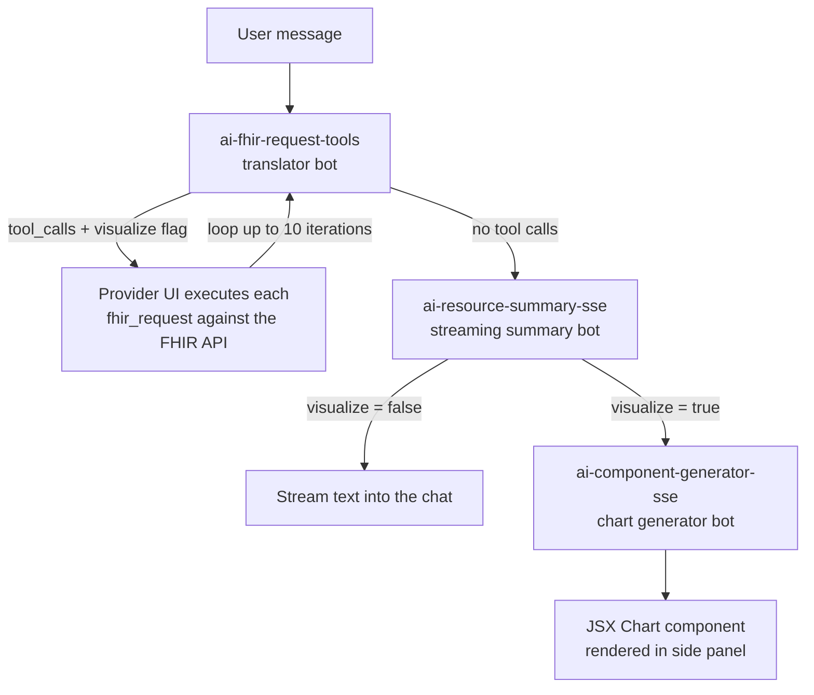

import ExampleCode from '!!raw-loader!@site/../examples/src/provider/spaces-examples.ts';
import MedplumCodeBlock from '@site/src/components/MedplumCodeBlock';

# Spaces

Spaces is the in-app AI assistant in [Medplum Provider](https://provider.medplum.com). A user types a question in natural language; under the hood a chain of Medplum [bots](/docs/bots) translates the question into FHIR API calls, executes them against the project, summarizes the results in the chat, and optionally renders a generated chart inside the same view.

Spaces is shipped as an example implementation. The Provider app source lives in [`examples/medplum-provider`](https://github.com/medplum/medplum/tree/main/examples/medplum-provider) and the bot source in [`examples/medplum-demo-bots/src/spaces-bots`](https://github.com/medplum/medplum/tree/main/examples/medplum-demo-bots/src/spaces-bots). Use this page to set Spaces up in your own project, understand what it does behind the chat input, and tune the parts that are designed to be tuned.

The assistant's behavior – what it says, what it refuses, which FHIR strategies it uses, how it summarizes, what charts it favors – is determined by three [`Communication`](/docs/api/fhir/resources/communication) resources that you author for your deployment. Spaces ships without canonical prompts on purpose: the right behavior depends on what your clinic plans to use the feature for. See [Author System Prompt Communications](#author-system-prompt-communications) below.

The feature is reachable at `/Spaces/Communication` in the Provider app. It is gated on the project having both the `ai` and `bots` features enabled.

<div className="responsive-iframe-wrapper">
  <iframe width="560" height="315" src="https://www.youtube.com/embed/f2Hv79Irew8"
    title="YouTube video player" frameborder="0"
    allow="accelerometer; autoplay; clipboard-write; encrypted-media; gyroscope; picture-in-picture; web-share"
    referrerpolicy="strict-origin-when-cross-origin" allowfullscreen></iframe>
</div>
<br/>

## What You Can Do With Spaces

The translator bot can issue any FHIR request the requester's AccessPolicy permits, so the practical capability surface is broad. Typical prompts fall into a few categories:

- Search and lookup – "Find the patient John Smith." "Which patients are scheduled with Dr. Chen this week?"
- Clinical summary – "Summarize Maria Garcia's last three encounters." "What medications is this patient on?"
- Visualize trends – "Show a growth chart for this patient." "Plot hemoglobin A1c over the last two years."
- Operational reporting – "Chart provider utilization across the clinic for the past month." "How many lab orders did we place last week?"
- Schedule and tasks – "Schedule a follow-up with Dr. Patel next Tuesday at 10am." "Create a task to fax the imaging report to the referring provider."
- Orders and updates – "Order a CBC for this patient." "Place a referral to cardiology." "Update the patient's phone number to 555-0142."

The first four bullets are read-only and end at the summary bot. The visualization and reporting prompts additionally invoke the visualizer bot to render an interactive chart in the side panel. The last two bullets trigger live FHIR writes through the same loop.

:::caution
Writes happen as soon as the loop reaches them. Treat clinically significant prompts (orders, referrals, status changes) the same way you would any draft – review the resulting resource before relying on it, and consider scoping the `ai` feature to AccessPolicies that do not include write access to high-risk resource types.
:::

## How Spaces Works

Spaces is not a single AI call. Each user prompt drives a short pipeline of bots and a tool-use loop:



Three things to keep in mind:

- The Provider UI, not the bots, executes the FHIR requests that the translator suggests. Every request runs under the signed-in user's access policies, so the assistant can never read or write resources the user could not access directly.
- The bots are the only thing that talks to OpenAI. The browser never sees the OpenAI API key. All AI traffic flows through the server-side [`$ai` operation](/docs/ai/ai-operation), which reads the key from project secrets.
- Conversation history is persisted as [`Communication`](/docs/api/fhir/resources/communication) resources, so transcripts are searchable, auditable, and survive a page reload.

## Prerequisites

### Enable Project Features

Spaces requires the `ai` and `bots` features on your Medplum project. Both are disabled by default. Contact info@medplum.com to enable them on your account; project administrators cannot toggle these features directly.

The Provider app's Spaces page short-circuits if either feature is missing, and the `$ai` operation rejects the request server-side if `ai` is not enabled.

The optional `ai-realtime` feature enables voice input in the chat UI. See [Voice Input](#voice-input) below.

### Configure The OpenAI API Key

Add your OpenAI key as a project secret named `OPENAI_API_KEY`. The `$ai` operation reads it from the project on every call and forwards it to OpenAI's chat completions endpoint. It is never sent to the client.

You must be a project administrator to add secrets. In the [Medplum App](https://app.medplum.com):

1. Open Project Admin (left sidebar, or [app.medplum.com/admin/project](https://app.medplum.com/admin/project)).
2. Click the Secrets tab.
3. Click Add and enter `OPENAI_API_KEY` as the name, `string` as the type, and your OpenAI key as the value.

See [Bot Secrets](/docs/bots/bot-secrets) for the same workflow described in more detail.

:::caution
If the key is missing, the `$ai` operation returns `OpenAI API key not configured in project secrets` and every Spaces turn fails. Set this before deploying the bots.
:::

### Deploy The Spaces Bots

Spaces depends on three bots that ship under [`examples/medplum-demo-bots/src/spaces-bots`](https://github.com/medplum/medplum/tree/main/examples/medplum-demo-bots/src/spaces-bots) and are already registered in that project's `medplum.config.json`. The Provider UI resolves each one by `Identifier` (system `https://www.medplum.com/bots`), so the identifier values below are load-bearing.

| Identifier Value             | Source File                                                                                                                                       | Role                                                                  |
| ---------------------------- | ------------------------------------------------------------------------------------------------------------------------------------------------- | --------------------------------------------------------------------- |
| `ai-fhir-request-tools`      | [`fhir-translator-bot.ts`](https://github.com/medplum/medplum/blob/main/examples/medplum-demo-bots/src/spaces-bots/fhir-translator-bot.ts)         | Translator. Emits `fhir_request` tool calls and a `visualize` flag.   |
| `ai-resource-summary-sse`    | [`fhir-summary-bot.ts`](https://github.com/medplum/medplum/blob/main/examples/medplum-demo-bots/src/spaces-bots/fhir-summary-bot.ts)               | Streaming summary bot (Server-Sent Events).                           |
| `ai-component-generator-sse` | [`fhir-visualizer-bot.ts`](https://github.com/medplum/medplum/blob/main/examples/medplum-demo-bots/src/spaces-bots/fhir-visualizer-bot.ts)         | Streaming Recharts / Mantine `Chart()` JSX generation.                |

To deploy:

1. Clone [the demo-bots project](https://github.com/medplum/medplum/tree/main/examples/medplum-demo-bots) (or copy the `spaces-bots` directory and the matching entries from `medplum.config.json` into your own bot project).
2. Build and deploy each bot following [Bot Basics](/docs/bots/bot-basics) and [Bots In Production](/docs/bots/bots-in-production).
3. After deployment, open each [`Bot`](/docs/api/fhir/medplum/bot) resource in the Medplum App and add an `identifier` entry whose `system` is `https://www.medplum.com/bots` and whose `value` matches the table above. The Provider UI uses this identifier to find the bot, so a missing or mistyped value silently breaks the feature.

### Author System Prompt Communications

Each of the three Spaces bots loads its system prompt from a [`Communication`](/docs/api/fhir/resources/communication) resource at request time, not from code. These prompts are operator-authored content. They decide what Spaces does in your clinic: its tone, what it refuses, which FHIR-call strategies the translator prefers, how aggressively the summary bot narrates, which chart types the visualizer reaches for. Treat writing them as part of building the feature, not as a setup step that copies a canned recipe.

Three Communications are required, one per bot. The identifier system is `http://medplum.com/ai-spaces`; the value matches the bot identifier value used by the Provider UI.

| Bot                          | Prompt Communication `identifier.value` | Payload Shape                                                                                                                                                                                                                  |
| ---------------------------- | --------------------------------------- | ------------------------------------------------------------------------------------------------------------------------------------------------------------------------------------------------------------------------------ |
| `ai-fhir-request-tools`      | `ai-fhir-request-tools`                 | Both payloads are required. `payload[0]` is the system prompt. `payload[1]` is a profile-context template; any `{{ref}}` is replaced at request time with the requester's reference string (for example, `Practitioner/abc-123`) and appended to the prompt. |
| `ai-resource-summary-sse`    | `ai-resource-summary-sse`               | `payload[0]` is the system prompt. No profile-context template.                                                                                                                                                                |
| `ai-component-generator-sse` | `ai-component-generator-sse`            | `payload[0]` is the system prompt. No profile-context template.                                                                                                                                                                |

If any Communication is missing, the corresponding bot throws (`"... system prompt is not available"`) and that part of the loop fails: a missing translator prompt stops the user's message; a missing summary prompt leaves the chat without narration; a missing visualizer prompt leaves the chart panel empty.

The example below seeds all three Communications. The bodies are thin but functional – the loop will run end-to-end so you can verify wiring – they are not production prompts. Replace each `payload[0].contentString` with text authored for your deployment before exposing Spaces to users.

<MedplumCodeBlock language="ts" selectBlocks="seedSystemPromptsTs">{ExampleCode}</MedplumCodeBlock>

## Conversation Data Model

Each conversation in Spaces is a small tree of [`Communication`](/docs/api/fhir/resources/communication) resources. Splitting the thread header from each turn keeps the agent loop recoverable mid-iteration and lets the history sidebar list conversations with a single search.

### Topic Communication

One per conversation. Created on the user's first message.

| Field            | Value                                                                            |
| ---------------- | -------------------------------------------------------------------------------- |
| `identifier`     | system `http://medplum.com/ai-message`, value `ai-message-topic`                 |
| `sender`         | Reference to the user who started the conversation                               |
| `status`         | `in-progress`                                                                    |
| `topic.text`     | First 100 characters of the user's first message, used as the sidebar title      |
| `note[0].text`   | JSON-encoded `{ "model": "..." }` capturing the model chosen for the conversation |

<MedplumCodeBlock language="ts" selectBlocks="loadRecentTopicsTs">{ExampleCode}</MedplumCodeBlock>

The Provider UI filters by `sender` so users only see their own conversations in the sidebar. Adjust this filter in your own UI if you need a shared inbox.

### Message Communications

One per turn (user, assistant, tool). Each is linked to its topic by `partOf`.

| Field                       | Value                                                                                                                                                                                              |
| --------------------------- | -------------------------------------------------------------------------------------------------------------------------------------------------------------------------------------------------- |
| `identifier`                | system `http://medplum.com/ai-message`, value `ai-message`                                                                                                                                          |
| `partOf[0].reference`       | `Communication/<topic-id>`                                                                                                                                                                          |
| `status`                    | `completed`                                                                                                                                                                                         |
| `payload[0].contentString`  | JSON of `{ role, content, tool_calls, tool_call_id, resources, componentCode, sequenceNumber }`                                                                                                     |

`sequenceNumber` is the source of truth for ordering; `_lastUpdated` is only used for pagination. The Provider UI persists every tool call and tool response on its own message so a mid-loop failure leaves a readable transcript.

<MedplumCodeBlock language="ts" selectBlocks="loadConversationMessagesTs">{ExampleCode}</MedplumCodeBlock>

## The Bots

All three bots are thin wrappers over [`$ai`](/docs/ai/ai-operation). They accept a `Parameters` resource with a `messages` JSON array and a `model` string, and they return a `Parameters` resource the Provider UI can consume directly.

### FHIR Translator Bot

`ai-fhir-request-tools`. Converts the conversation history into one or more `fhir_request` tool calls. Each call carries an HTTP method (`GET` / `POST` / `PUT` / `DELETE`), a FHIR path, and an optional body. The bot also reports a `visualize` boolean, derived from the tool-call arguments, that tells the UI whether the final answer should be rendered as a chart.

Inputs:

| Parameter  | Type          | Required | Description                                                                  |
| ---------- | ------------- | -------- | ---------------------------------------------------------------------------- |
| `messages` | `valueString` | Yes      | JSON-encoded conversation history (OpenAI chat format).                      |
| `model`    | `valueString` | No       | OpenAI model to use. Defaults to `gpt-4` if omitted. The shipping Provider UI always passes a model from the chat-input dropdown, so this default only applies when you invoke the bot directly. |

Outputs: `content` (string, may be null when the model only returns tool calls), `tool_calls` (JSON array of `{ id, function: { name, arguments } }`), and `visualize` (boolean).

The translator is the only bot that loops. The Provider UI re-invokes it after every batch of tool calls until the model decides it has enough context to answer.

<MedplumCodeBlock language="ts" selectBlocks="invokeTranslatorBotTs">{ExampleCode}</MedplumCodeBlock>

### FHIR Summary Bot

`ai-resource-summary-sse`. Takes the conversation history after the loop has finished and produces a streaming, plain-language narration of the resources the translator pulled.

Inputs: same `messages` and `model` parameters as the translator.

Outputs: `content` (the narration), streamed as SSE chunks.

### FHIR Visualizer Bot

`ai-component-generator-sse`. Only invoked when the translator set `visualize=true` at least once during the loop. Receives the resolved FHIR resources and produces a self-contained `function Chart()` React component, streamed to the UI inside a fenced code block. The generated component uses pre-scoped [Recharts](https://recharts.org) primitives (line, bar, area, pie, scatter, composed) and [Mantine](https://mantine.dev) layout primitives – no `import` statements required.

Inputs: `messages`, `model`, and `fhirData` (`valueString`, JSON array of resolved FHIR resources collected during the loop).

Outputs: a streamed JSX code block that the Provider UI parses with a small streaming code extractor and renders in the right-hand panel of the chat view.

## The Agent Loop

Spaces is a true ReAct-style agent, not a single OpenAI round trip. Per user prompt, the translator may chain several FHIR calls before producing a final answer.

The loop in [`spaceMessaging.ts`](https://github.com/medplum/medplum/blob/main/examples/medplum-provider/src/utils/spaceMessaging.ts) runs like this:

1. Invoke the translator with the current conversation.
2. If it returns no tool calls, exit the loop with its `content` as the final answer.
3. If it returns tool calls, execute each `fhir_request` against the FHIR API (`GET` / `POST` / `PUT` / `DELETE`), append the responses to the conversation, and go back to step 1.

While the loop runs the UI surfaces the active call as `Step N: <METHOD> <path>` so users can see what the model is doing in real time.

### Iteration Cap

The loop is capped at `MAX_AGENT_ITERATIONS = 10`. When the cap is hit, the loop short-circuits to the summary bot and the response is appended with a note telling the user the request reached the processing limit. Increasing the cap lets the agent answer more complex chained questions; decreasing it bounds per-prompt cost.

### Adjusting The Cap

Because Spaces ships as an example implementation, the cap is a constant in the Provider source, not a runtime setting. To change it, fork [`examples/medplum-provider`](https://github.com/medplum/medplum/tree/main/examples/medplum-provider) and edit `MAX_AGENT_ITERATIONS` in `src/utils/spaceMessaging.ts`.

:::tip
If you find users routinely hitting the cap, tighten the translator system prompt first. Many long loops come from the model fetching adjacent data it does not need.
:::

### Streaming Behavior

The summary and visualizer bots stream their output as Server-Sent Events from OpenAI through `$ai` to the browser, so users see the narration appear word-by-word and the chart code render as it is generated. Tool calls run only on the non-streaming path – this is a constraint of OpenAI's streaming protocol, surfaced in the [`$ai` operation docs](/docs/ai/ai-operation).

### Model Selection

The Provider UI exposes a model selector in the chat input. The chosen model flows through to every bot via the `model` parameter and on to `$ai`. The bots themselves are model-agnostic – they pass whatever string they are given.

The dropdown contents are driven by a project setting named `aiModels`, so admins can change the available models without editing code. Set it from the project admin **Settings** page (or via the `Project.setting` array) to a JSON-encoded array of `{ "value", "label" }` objects, where `value` is the model id sent to `$ai` and `label` is the display name:

```json
[
  { "value": "gpt-5.5", "label": "GPT-5.5" },
  { "value": "my-litellm-model", "label": "Custom (LiteLLM)" }
]
```

When `aiModels` is unset or empty, the UI falls back to a built-in default list (see [`spaceModels.ts`](https://github.com/medplum/medplum/blob/main/examples/medplum-provider/src/utils/spaceModels.ts)). Combined with the `OPENAI_BASE_URL` project secret on [`$ai`](/docs/ai/ai-operation), this lets you point Spaces at a LiteLLM proxy and expose that proxy's model names to users.

:::caution[Model names must match your LiteLLM config]
When routing through a LiteLLM proxy, each `value` must exactly match a `model_name` alias defined in the proxy's `config.yaml` – that field is LiteLLM's routing key. Neither the UI nor `$ai` validates the value; an unrecognized name surfaces as a failed AI call at request time, not a save error. The `label` is cosmetic. Keep the `aiModels` list in sync with the proxy config when you add or rename models.
:::

### Voice Input

When the `ai-realtime` feature is enabled on the project, a microphone button appears in the chat input. Users can click it to dictate their message instead of typing. The speech is transcribed using `gpt-4o-transcribe` and submitted as a normal text message — the bots and agent loop are unaffected by whether the input arrived via keyboard or voice.

Without `ai-realtime`, the microphone button is still visible in the Provider UI but is disabled with a tooltip explaining that the feature is not active. To enable it, add `ai-realtime` to the project's feature list. Contact info@medplum.com to have the feature enabled on your account.

:::note
Voice input is transcription-only (speech to text). Spaces does not support text-to-speech output.
:::

## Customizing System Prompts

Spaces' behavior – when it calls FHIR, how it phrases summaries, which chart types it reaches for – is determined almost entirely by the three system-prompt Communications, not by the bot code (the bots are thin wrappers around `$ai`). To change behavior, edit `payload[0].contentString` on the relevant Communication. The next user message picks up the new prompt without a bot redeploy.

<MedplumCodeBlock language="ts" selectBlocks="updateSystemPromptTs">{ExampleCode}</MedplumCodeBlock>

Guidance per bot:

- Translator (`ai-fhir-request-tools`). Keep the instruction telling the model to use the `fhir_request` tool for every FHIR operation – removing it lets the model invent results. Append clinic-specific guidance rather than rewriting the whole prompt. Use `payload[1]` for anything that depends on the requester; `{{ref}}` is the only per-user context the bot has by default.
- Summary (`ai-resource-summary-sse`). Tune narration depth, terminology, and whether the bot mentions resource IDs or sticks to clinical content. This prompt also sets the tone users hear most.
- Visualizer (`ai-component-generator-sse`). Bias toward specific chart types or labelling conventions for your specialty, and remind the model that only the pre-scoped Recharts and Mantine components are available – it must not write `import` statements.

:::caution
A prompt that contradicts the tool schema (for example, telling the translator not to call any tools) will break the loop in subtle ways – the translator returns plain text, the summary bot gets no tool responses to narrate, and the chat shows a generic "I was unable to generate a response" message. Test prompt changes against representative user questions before rolling them out.
:::

## Security And Cost

- The OpenAI API key lives only in `Project.secret`. The browser cannot read it, and bots receive it only inside their handler scope.
- AccessPolicy applies to every FHIR request the loop executes. The assistant cannot read or write resources the requester is not entitled to. Audit-sensitive deployments should also restrict which `Practitioner` accounts have the `ai` feature exposed in their session.
- Every loop iteration is one OpenAI call. A user asking a multi-hop question can drive five to ten model calls per prompt. Monitor your OpenAI usage dashboard and consider rate-limiting the bot endpoints in production.
- All Spaces activity is recorded as standard FHIR [`AuditEvent`](/docs/api/fhir/resources/auditevent) resources, the same way every other Medplum write is.

## See Also

- [Medplum `$ai` Operation](/docs/ai/ai-operation) – the underlying FHIR operation that wraps OpenAI
- [Medplum AI (MCP)](/docs/ai/mcp) – an alternative AI surface for tools that speak MCP
- [Bot Basics](/docs/bots/bot-basics) – bot fundamentals and deployment
- [Bot Secrets](/docs/bots/bot-secrets) – accessing project secrets from a bot
- [Project Features](/docs/access/projects) – enabling the `ai` and `bots` flags
- [Communication](/docs/api/fhir/resources/communication) FHIR resource API – conversation storage
