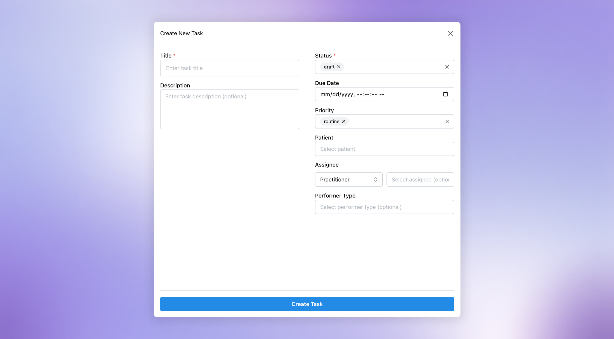
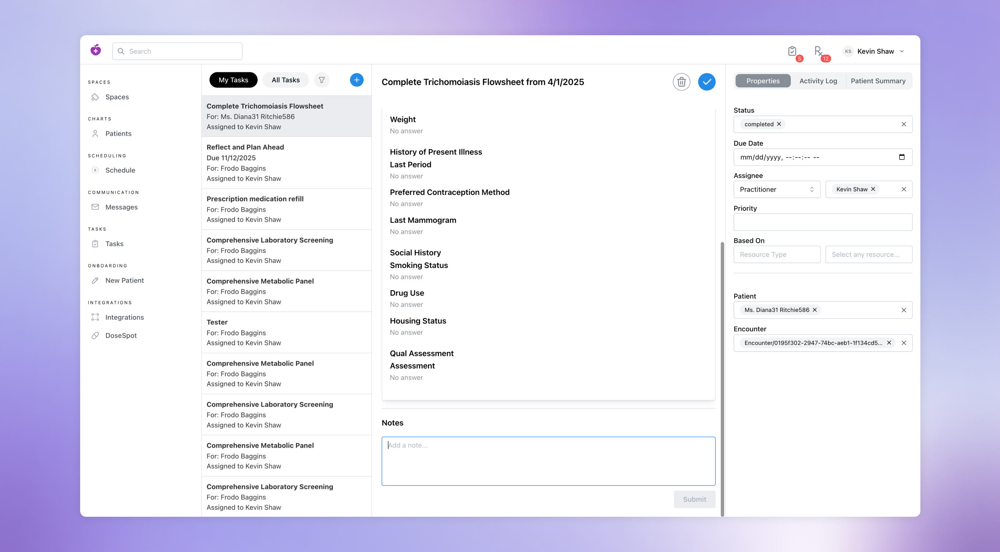
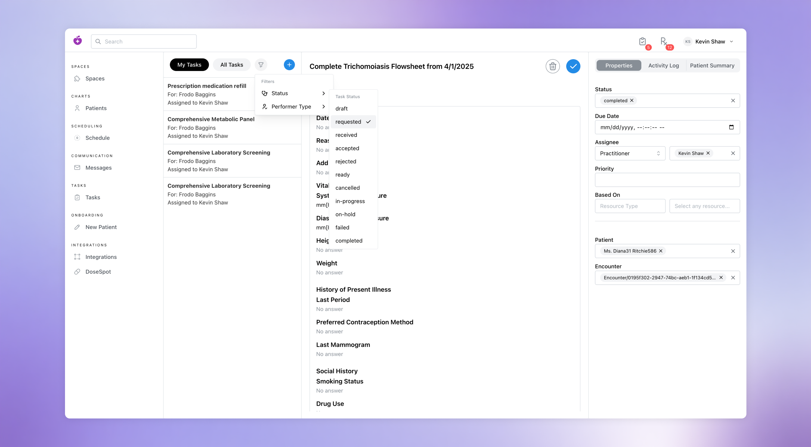

# Tasks

The Tasks section serves as a centralized management system for coordinating patient care activities across your entire clinical and administrative team. Tasks enable providers, nurses, and support staff to create, assign, track, and complete action items related to patient care, follow-ups, administrative duties, and/or operational workflows.

 

--- 

## **Creating a Task**
1. **Navigate to Tasks**  
   
   - In the Medplum Provider app, navigate to the Tasks page by clicking the "Task" section in the left navigation menu
2. **Click the Create Button**  
   - At the top of the Task list section, click the blue "+" button to open the "Create New Task" modal
3. **Add Task Details**  
   
   - Required details:
      - Title: add a short, descriptive name for the Task
         - e.g. “Prescription medication refill” or “Complete PHQ-9”
      - Status: select a value that represents where the task currently stands in its workflow
         - e.g. “Ready” for Tasks ready to be actioned, “In Progress” for Tasks actively being worked on, etc

   - Optional details:
      - Description: enter information that explains what the Task involves
         - e.g. requirements or relevant context
      - Due Date: set a date by which the Task should be completed
      - Priority: assign a level of importance or urgency to the Task to indicate how soon it should be addressed relative to other Tasks
         - The standard FHIR priority levels are Routine, Urgent, ASAP, and STAT, ranging from normal priority (Routine) to requiring immediate action (STAT)
      - Patient: select an individual for whom this Task is being performed
      - Assignee: select a practitioner or organization responsible for completing this Task
      - Performer Type: specify the role or type of staff who should complete this Task
         - e.g. "Primary care physician," "Registered nurse," "Physician assistant," etc.
4. **Confirm and Create**  
   - Review the Task details and then click "Create Task" to create the Task
   - This Task should now be visible in the Task list
   - If a Patient was added to the Task, this Task will appear within the Patient’s Tasks on their Profile Page
   - If a specific Practitioner was assigned to the Task, this Task will appear within the Practitioner’s Task list under the “My Task” tab

 

***Note: Tasks may also be created directly from the Tasks section of a Patient Profile page by clicking “New…” from the action buttons at the top of the page.***

 

--- 

## **Updating a Task**
1. **Navigate to a Task**  
   - In the Medplum Provider app, navigate to the Tasks page by clicking the "Task" section in the left navigation menu
   - Select a Task from the Tasks list
2. **Review and Edit Task Details**  
   - In the right sidebar, select the "Properties" tab to review and change Due Date, Priority, Patient (Subject), Assignee (Practitioner or Organization), Based On (other project resource) and/or Performer Type

 

***Note: edits are made immediately and auto-saved (but can always be undone).***

 

--- 

## **Deleting a Task**
Occasionally, tasks are created accidentally or become irrelevant, in which case they can be removed from Medplum Provider completely.

1. **Navigate to a Task**  
   - In the Medplum Provider app, navigate to the Tasks page by clicking the "Task" section in the left navigation menu
   - Select a Task from the Tasks list
2. **Click the Delete Button**  
   - In the top right of the Task content area, click the delete button (shown as trash can icon)
3. **When Prompted, Click "Delete"**  
   - In the confirmation modal, click "Delete" to permanently remove the Task from your Tasks section

 

--- 

## **Adding a Task Note**
Notes can be added within the main Task content area to communicate updates or other information about a Task for others.

1. **Navigate to a Task**  
   - In the Medplum Provider app, navigate to the Tasks page by clicking the "Task" section in the left navigation menu
   - Select a Task from the Tasks list
2. **Draft and Submit a Note**
   
   - In the main Task content area, find the "Notes" section, add the note content as necessary, and then click the "Submit" button to add your Note

 

--- 

## **Filtering Tasks**
1. **Navigate to Tasks**
   - In the Medplum Provider app, navigate to the Tasks page by clicking the "Task" section in the left navigation menu
2. **Open the Filter Options Menu**
   
   - Click the filter button (shown as a funnel icon) at the top of the Tasks list to open the menu of filter options
3. **Select a Filter Type**
   - Hover over a filter category (currently limited to Status and Performer Type)
   - Select a specific Status or Performer Type to filter the selected Tasks list

 
