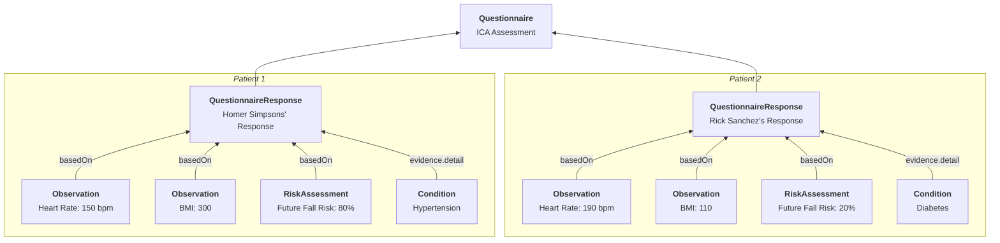

# Questionnaires & Assessments

Creating, updating and embedding FHIR Questionnaires for both patients and practitioners is a common use-case for Medplum.

- [Medplum app](https://app.medplum.com/Questionnaire) supports creating and updating Questionnaires
- [Questionnaire](https://storybook.medplum.com/?path=/docs/medplum-questionnaireform--basic) react component can be embedded in patient facing or practitioner facing applications
- [QuestionnaireBuilder](https://storybook.medplum.com/?path=/docs/medplum-questionnairebuilder--basic) react component can be embedded in applications as well
- [QuestionnaireResponse](https://app.medplum.com/QuestionnaireResponse) resources can also be viewed in the [Medplum app](../app/index.md)
- [Bot for QuestionnaireResponse](/docs/bots/bot-for-questionnaire-response/bot-for-questionnaire-response.md) is one of the most common automations
- [Questionnaire Features and Fixes](https://github.com/medplum/medplum/pulls?q=is%3Apr+label%3Aquestionnaires) on Github

## Key Resources

| **Resource**                                                              | **Description**                                                                                                     |
| ------------------------------------------------------------------------- | ------------------------------------------------------------------------------------------------------------------- |
| [`Questionnaire`](/docs/api/fhir/resources/questionnaire)                 | Definition of questions/answers. 1 per form.                                                                        |
| [`QuestionnaireResponse`](/docs/api/fhir/resources/questionnaireresponse) | A patient's responses to each question. 1 per patient, per instance.                                                |
| [`Observation`](/docs/api/fhir/resources/observation)                     | A structured representation of a point-in-time result measured by an assessment.                                    |
| [`RiskAssessment`](/docs/api/fhir/resources/riskassessment)               | A specialized form of an [`Observation`](/docs/api/fhir/resources/observation) tailored to propensity measurements. |
| [`Condition`](/docs/api/fhir/resources/condition)                         | Records a long-term diagnosis for a [`Patient`](/docs/api/fhir/resources/patient).                                  |

## Key Code Systems

| **Code System**                                                | **Description**                                                                           |
| -------------------------------------------------------------- | ----------------------------------------------------------------------------------------- |
| [LOINC](https://www.medplum.com/docs/careplans/loinc)          | Used to tag questions and answers. Also has predefined standard assessments.              |
| [ICD-10](https://www.cdc.gov/nchs/icd/icd10cm_browsertool.htm) | Used to annotate [`Condition`](/docs/api/fhir/resources/condition) resources for billing. |

## Other Resources

- [Questionnaire Video](https://youtu.be/mOBC0VYtCLE) on Youtube
- [Questionnaire Core Extensions](http://hl7.org/fhir/R4/questionnaire-profiles.html#extensions) - Because of the wide variety of data collection applications, the [`Questionnaire`](/docs/api/fhir/resources/questionnaire) resource has the most "core extensions" of any FHIR resource.
- [Structured Data Capture (SDC) Implementation Guide](http://hl7.org/fhir/uv/sdc/) - A collection of profiles, extensions, and best practices for advanced questionnaire use cases.
  - [Modular Forms](http://hl7.org/fhir/uv/sdc/modular.html) - Reuse sections and questions between questionnaires
  - [Advanced Rendering](http://hl7.org/fhir/uv/sdc/rendering.html) - Additional extensions to inform how a questionnaire is displayed.
- [List of SDC implementations](https://confluence.hl7.org/display/FHIRI/SDC+Implementations) - Wiki page with a number of Form Builders and Form Fillers that implement some part of the SDC guide
