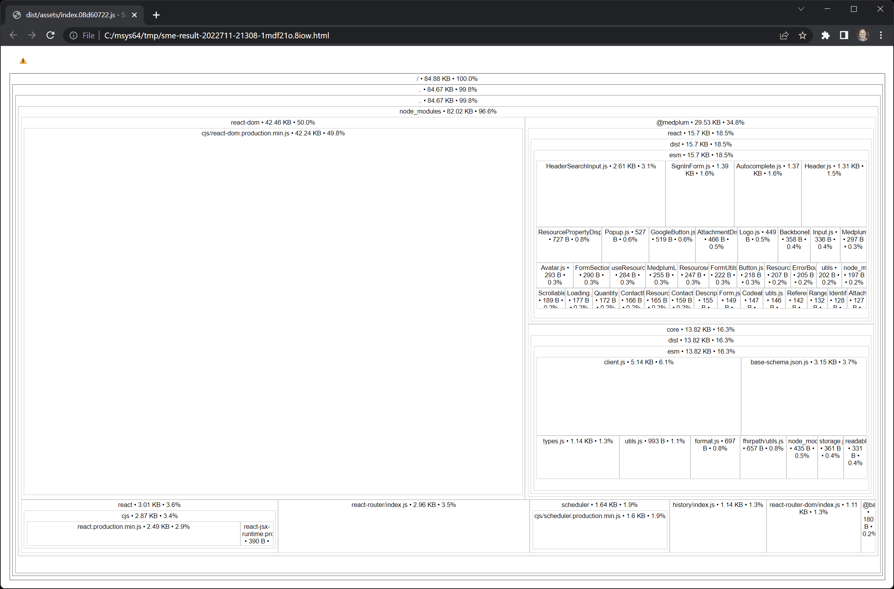

# Tree Shaking

Tree shaking, also known as dead code elimination, is a technique to keep JavaScript bundle sizes as small as possible.

Removing such code has several benefits: it shrinks program size, an important consideration in some contexts, and it allows the running program to avoid executing irrelevant operations, which reduces its running time.

## How to use Tree Shaking

Step 1 - Use one of the popular JavaScript build tools such as Webpack, Rollup, or Vite. We have verified that tree shaking works with these tools.

Step 2 - Use ES Modules (ESM) for your front-end build. While the ESM transition is still in progress, using ESM during development on front end projects is largely stable.

- TypeScript: Use [`"module": "esnext"`](https://www.typescriptlang.org/tsconfig#module)
- Webpack: [ECMAScript Modules](https://webpack.js.org/guides/ecma-script-modules/)
- Rollup uses ESM automatically
- Vite uses ESM automatically

## How to verify it is working

We recommend using the [`source-map-explorer`](https://www.npmjs.com/package/source-map-explorer) tool to analyze which dependencies end up in your production build. `source-map-explorer` reviews build output, so it represents the code that will actually be shipped to the browser.

## Example

The [Medplum Hello World](https://github.com/medplum/medplum-hello-world) project uses tree shaking. The project is pre-configured with `source-map-explorer`, so you can quickly analyze the bundle size.

## Behind the scenes

Medplum libraries such as `@medplum/core` and `@medplum/react` follow best practices, so tree shaking should work automatically for most build tools.

- Libraries ship with `preserveModules` for ESM builds
- Libraries ship with `"sideEffects": false`

## Additional reading

- [Dead-code elimination](https://en.wikipedia.org/wiki/Dead-code_elimination)
- [Webpack Tree Shaking](https://webpack.js.org/guides/tree-shaking/)
- [Rollup Tree Shaking](https://rollupjs.org/guide/en/#tree-shaking)
